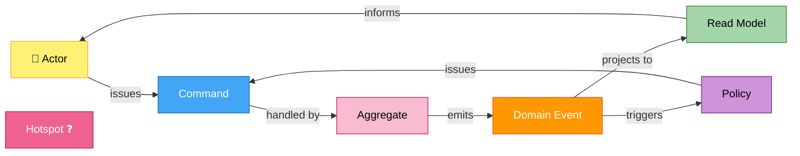
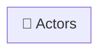
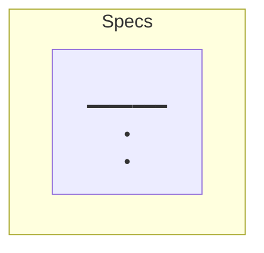
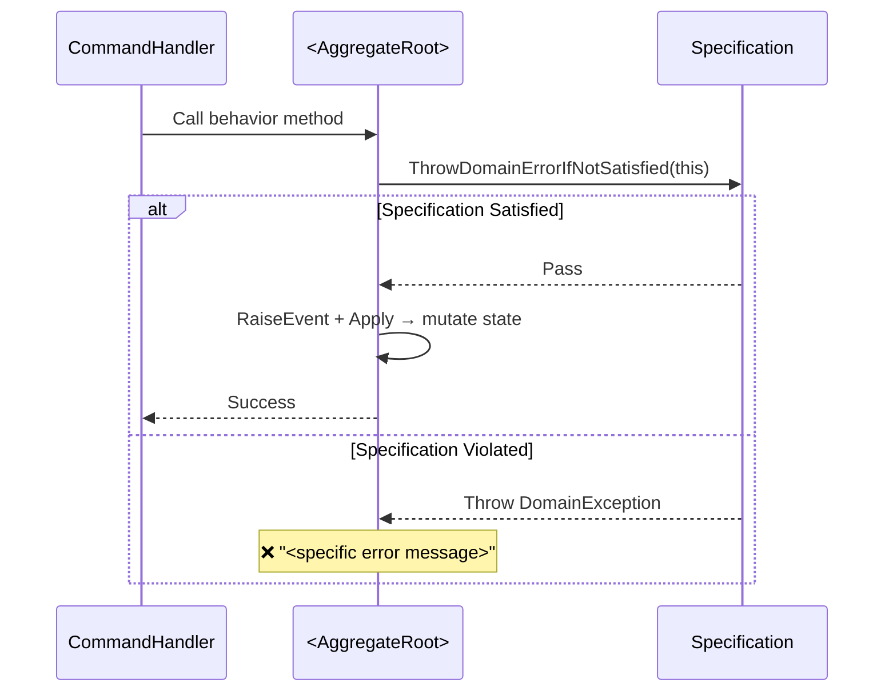
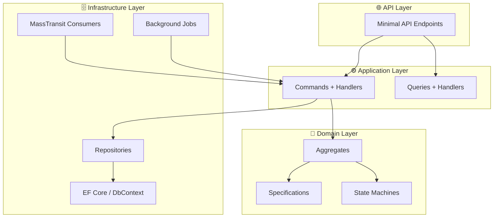
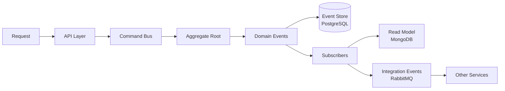
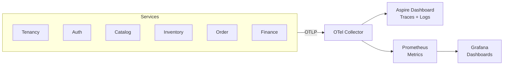

# Generate Documents

Generates or updates README.md files following the EShop documentation standard:
DDD strategic + tactical design, Event Storming narratives, mermaid diagrams,
and integration contracts.

## Invocation

```
/generate-documents [target]
```

`target` options:
- `top-level` — solution-level README.md at the repo root
- `<service-name>` — e.g. `catalog` / `inventory` / `order` / `finance` / `authorization` / `tenancy`

---

## Workflow

```
- [ ] Step 1: Resolve target
- [ ] Step 2: Read existing README (note what is correct vs. stale)
- [ ] Step 3: Read source files for the target
- [ ] Step 4: Synthesize domain knowledge
- [ ] Step 5: Apply template and write README (update existing or create new)
- [ ] Step 6: Verify output
```

---

## Step 1: Resolve Target

If target is omitted, ask:

> Which target? (`top-level` | `catalog` | `inventory` | `order` | `finance` | `authorization` | `tenancy`)

---

## Step 2: Read Existing README

Read the existing README at the target path:
- Service: `<Service>/src/EShop.<Service>.API/README.md`
- Top-level: `README.md`

If the file exists, treat it as the baseline. In Step 5, **merge updates into the existing structure** — preserve sections that are already accurate, update sections that are stale, and add missing sections. Do not rewrite from scratch unless the existing README has no sections matching the template.

If the file does not exist, create it from scratch using the template.

---

## Step 3: Read Source Files

### For `top-level`

Read all of the following:
- Every per-service README (`<Service>/src/EShop.<Service>.API/README.md`)
- `CLAUDE.md` — architecture and conventions sections
- `EShop.AppHost/Program.cs` — which services and infrastructure are registered

### For a service

Use Glob to discover files per layer, then Read the relevant files.

**Domain layer** — `<Service>/src/EShop.<Service>.Domain/**`
- Aggregates / Aggregate Roots: name, properties, behavior methods, state fields
- Domain events: class names and properties they carry
- Value objects: names and structural equality fields
- Specifications: names + the invariant rules each one enforces
- State machines: state enum values, trigger enum values, all declared transitions
- Sagas / Process Managers (if present): states, triggers, event-sourced domain events

**Application layer** — `<Service>/src/EShop.<Service>.Application/**`
- Commands + handlers: what each use case does
- Queries + handlers: what each query returns
- Domain event handlers (if in Application layer)

**Infrastructure layer** — `<Service>/src/EShop.<Service>.Infrastructure/**`
- Consumers: which integration event / command each one handles
- Background jobs: class name, schedule (from DI registration), what it does
- DbContext entity sets → infer table names
- Migrations folder presence (to confirm migration exists)

**API layer** — `<Service>/src/EShop.<Service>.API/**`
- Endpoint registrations: HTTP method, path, response code, notes

**Contracts** — `Shared/src/EShop.Shared.Contracts/Services/<Service>/**` and `.../Order/Saga/**`
- All integration event and command contracts the service publishes or consumes

---

## Step 4: Synthesize Domain Knowledge

Before writing, build this mental model from the source files:

| Question | Answer source |
|----------|---------------|
| What is the bounded context name? | Folder name / aggregate namespace |
| Is it Core / Supporting / Generic Domain? | Business centrality: revenue-generating = Core, enables Core = Supporting, commodity = Generic |
| What are the aggregate roots? | Classes inheriting `AggregateRoot` or `AggregateSaga` |
| What domain events does each aggregate emit? | `RaiseEvent(new XxxEvent(...))` calls |
| What are the state transitions? | State machine `Configure()` / `.Permit()` calls |
| What specifications guard each behavior? | `ThrowDomainErrorIfNotSatisfied` or `IsSatisfiedBy` calls in aggregate methods |
| What integration events flow in and out? | Consumer class names + contract types |
| What gaps / roadmap items exist? | TODO comments, referenced-but-unimplemented handlers, saga states with no outgoing command |

---

## Step 5: Apply Template and Write README

Select the correct template below. When updating an existing README:
- **Match section by heading** — find the heading in the existing file and replace its content.
- **Add** any template section that is entirely missing.
- **Preserve** section content that is still accurate (do not rewrite just to reformat).
- **Delete** any section in the existing file that has no equivalent in the template and no clear purpose.

---

### Template A — Service README

Use for any bounded context service target.

````markdown
# <Service Name>

> <One sentence: what business capability this service owns and why it exists.>

---

## What This Service Does

```mermaid
graph LR
    %% Show the service in relation to its direct integration partners.
    %% Use actor nodes for external callers and other services.
    %% Show commands in, events out, events in, commands out.
```

---

## Strategic Design

### Context Classification

| Aspect | Value |
|--------|-------|
| **Bounded Context** | <Name> |
| **Domain Type** | Core Domain / Supporting Domain / Generic Subdomain |
| **Aggregate Roots** | <comma-separated list> |
| **Multi-tenancy** | <IScoped / IRingFenced / IExcludedFromScoping> |
| **Persistence** | <Event Sourcing (PostgreSQL) / EF Core (PostgreSQL)> |
| **Read Model** | <CQRS projection (MongoDB) / None> |
| **Architecture Style** | <Vertical Slice / Clean Architecture / …> |

### Bounded Context Map

```mermaid
graph TB
    %% Show this context and its upstream/downstream relationships.
    %% Label edges with the integration event or pattern (ACL, Partnership, etc.).
```

### Ubiquitous Language

| Term | Definition |
|------|------------|
| **<Term>** | <Plain-language definition used by domain experts and code alike.> |

---

## Event Storming

<!-- NOTE: Include "Participants & Roles" subsection ONLY for Core Domain services. -->

<!-- FOR CORE DOMAIN — include this block:
### Participants & Roles

| Role | Contribution | Artifact Ownership |
|------|--------------|--------------------|
| **Product Owner** | Validates that events and policies match real-world behavior | Ubiquitous Language, Policies |
| **Business Analyst** | Clarifies edge cases, maps user journeys, identifies hotspots | Actor mapping, Hotspots |
| **Solution Architect** | Ensures bounded context boundaries align, validates integration points | Aggregate boundaries, Context Map |
| **Developer** | Translates sticky notes into tactical DDD building blocks | Commands, Events, Specifications |
-->

### Legend



### Actors



| Actor | Interacts With | Example Scenario |
|-------|----------------|------------------|
| **<Actor>** | <Aggregate / Read Model> | *As a …, I want to …, so that …* |

### <Aggregate Name> — Event Flow

```mermaid
graph LR
    %% Actor → Command → Aggregate → DomainEvent → ReadModel / Policy
    %% Policy → Command (feedback loop)
    %% Hotspot nodes for unresolved design questions
    classDef actor    fill:#fff176,stroke:#f9a825,color:#000
    classDef command  fill:#42a5f5,stroke:#1565c0,color:#fff
    classDef aggregate fill:#f8bbd0,stroke:#c2185b,color:#000
    classDef event    fill:#ff9800,stroke:#e65100,color:#fff
    classDef policy   fill:#ce93d8,stroke:#7b1fa2,color:#000
    classDef readmodel fill:#a5d6a7,stroke:#2e7d32,color:#000
    classDef hotspot  fill:#f06292,stroke:#c2185b,color:#fff
```

<!-- Repeat "### <Aggregate Name> — Event Flow" for each aggregate root. -->

### Policies — When / Then Rules

| When this event | Then issue this command | Rail / Transport |
|-----------------|-------------------------|------------------|
| `<EventName>` | `<CommandName>` → <Target> | <MassTransit / In-process / Hangfire> |

---

## Domain Model

### Aggregate Structure

```mermaid
classDiagram
    %% Show aggregate root, child entities, value objects.
    %% Mark each class with <<Aggregate Root>>, <<Entity>>, <<Value Object>>, <<Enumeration>>.
    %% Show composition relationships.
```

### Building Blocks

| Building Block | Type | Identity | Rationale |
|----------------|------|----------|-----------|
| `<ClassName>` | **Aggregate Root** / **Entity** / **Value Object** / **Enumeration** | <Guid Id / By attributes / Enum value> | <Why it has this classification> |

---

## State Machines

### <Aggregate Name> State Machine


<!-- Repeat for each aggregate that has a state machine. -->

<!-- If two state machines interact (e.g. Product ↔ Variant), add a combined interaction diagram:
### Combined State Interaction
```mermaid
graph TB
    %% Show how one aggregate's state constrains the other.
```
-->

---

## Specifications & Invariants

### Specification Map



### Invariant Enforcement Flow



---

## Architecture

### Layer Overview



<!-- For services with CQRS write/read split, replace with a two-sided diagram showing
     Command side (PostgreSQL event store) and Read Model side (MongoDB projection). -->

### Happy Path

```mermaid
sequenceDiagram
    autonumber
    %% Show the primary success flow end-to-end.
    %% Include all participants: caller, consumer, handler, aggregate, DB, outbox/event bus.
```

<!-- Add one sequenceDiagram per compensation / failure path under ### Compensation — <Scenario> -->

---

## Integration Events

| Direction | Contract | Meaning |
|-----------|----------|---------|
| **In** | `<MessageType>` | <What it means for this service> |
| **Out** | `<MessageType>` | <What downstream consumers use it for> |

Contracts live in `Shared/src/EShop.Shared.Contracts/Services/<Service>/`.

---

## Data Model

| Table | One row per | Key constraint |
|-------|------------|----------------|
| `<TableName>` | <entity × scope> | <UNIQUE / PK description> |

<!-- Add an Indexes subsection if non-trivial indexes exist:
### Indexes
| Index | Fields | Purpose |
|-------|--------|---------|
-->

---

<!-- Include "## Background Jobs" only if the service runs Hangfire or hosted-service jobs. -->
## Background Jobs

| Job | Schedule | What it does |
|-----|----------|-------------|
| `<JobClass>` | <every N s / on startup / delayed +N min> | <description> |

---

<!-- Include "## API" only if the service exposes HTTP endpoints. -->
## API

| Method | Path | Response | Note |
|--------|------|----------|------|
| `<METHOD>` | `<path>` | `<HTTP status> <body shape>` | <async / sync / idempotent / …> |

---

## Configuration

| Key | Source | Purpose |
|-----|--------|---------|
| `ConnectionStrings:<name>` | Aspire / appsettings | PostgreSQL connection |
| `MasstransitConfiguration` / `rabbitmq` | appsettings | RabbitMQ connection |

<!-- Add service-specific env vars or feature flags here. -->

---

## Tests

`<Service>/tests/EShop.<Service>.Tests` (<framework stack>) — <N> tests:

- `<TestClass>` — <what scenarios it covers>

```bash
dotnet test <Service>/tests/EShop.<Service>.Tests
```

---

<!-- Include "## Roadmap" only if there are known gaps or deferred work. -->
## Roadmap

### Gap Analysis

| # | Gap | Status |
|---|-----|--------|
| G1 | **<Short gap title.>** <Detail.> | Open |

### Target Design

```mermaid
%% Show the intended future state (state machine, sequence, or flow).
```

### Suggested Implementation Order

1. <Step> — closes G<N>.
2. <Step> — closes G<N>.

---

## References

| Resource | Description |
|----------|-------------|
| [Domain-Driven Design](https://www.domainlanguage.com/ddd/) | Eric Evans — Original DDD book |
| [Implementing DDD](https://www.oreilly.com/library/view/implementing-domain-driven-design/9780133039900/) | Vaughn Vernon — Tactical patterns |
| [Event Storming](https://www.eventstorming.com/) | Alberto Brandolini — Discovery technique |
````

---

### Template B — Top-Level README

Use when target is `top-level`.

````markdown
# 🛒 EShop SaaS Platform

[](https://dotnet.microsoft.com/)
[](/)
[](/)
[](/)
[](/)
[](https://opentelemetry.io/)

> **A production-ready multi-tenant e-commerce platform** demonstrating enterprise-grade microservices
> architecture, domain-driven design, and cloud-native observability practices.

---

## Executive Summary

| Aspect | Description |
|--------|-------------|
| **What** | Multi-tenant SaaS e-commerce platform |
| **Architecture** | Microservices with CQRS + Event Sourcing |
| **Key Patterns** | Clean Architecture, DDD, Event-Driven, Event Storming |
| **Infrastructure** | .NET Aspire, Docker, PostgreSQL, MongoDB, Redis, RabbitMQ |
| **Observability** | OpenTelemetry → Prometheus → Grafana |

---

## Architecture Overview

### High-Level System Design

```
<ASCII or mermaid diagram showing: Clients → API Gateway → all services → infrastructure>
```

### Data Flow (CQRS + Event Sourcing)



---

## Bounded Contexts

```mermaid
graph TB
    %% One subgraph per bounded context.
    %% Edges are integration events with labels.
    %% style each subgraph with a distinct fill color.
```

| Bounded Context | Domain Type | Aggregate Roots | Persistence | README |
|:----------------|:------------|:----------------|:------------|:-------|
| **Tenancy** | Supporting | Tenant, Feature | Event Sourcing (PostgreSQL) | — |
| **Authorization** | Supporting | Organization, User | Event Sourcing (PostgreSQL) | — |
| **Catalog** | Core | Product (SPU/SKU), Category | Event Sourcing (PostgreSQL) → Read Model (MongoDB) | [README](Catalog/src/EShop.Catalog.Application/README.md) |
| **Inventory** | Core | Inventory, Reservation | EF Core (PostgreSQL) | [README](Inventory/src/EShop.Inventory.API/README.md) |
| **Order** | Core | Order, OrderSaga | EF Core (PostgreSQL) | [README](Order/src/EShop.Order.API/README.md) |
| **Finance** | Core | Account | EF Core (PostgreSQL) | [README](Finance/src/EShop.Finance.API/README.md) |

---

## Technology Stack

### Core Technologies

| Category | Technology | Version | Purpose |
|:---------|:-----------|:--------|:--------|
| **Platform** | .NET | 8.0 | Runtime framework |
| **Orchestration** | .NET Aspire | 9.x | Service orchestration & local dev |
| **API** | ASP.NET Core | 8.0 | Web API framework |
| **Specification** | JSON:API | — | RESTful API standard |

### Architecture & Patterns

| Category | Technology | Purpose |
|:---------|:-----------|:--------|
| **CQRS/ES** | EventFlow | Command/Query separation, Event Sourcing |
| **Messaging** | MassTransit + RabbitMQ | Async communication, Integration events |
| **Background Jobs** | Hangfire | Scheduled & background processing |

### Data & Cache

| Category | Technology | Purpose |
|:---------|:-----------|:--------|
| **Event Store** | PostgreSQL | ACID-compliant event persistence |
| **Read Models** | MongoDB | Optimized query storage |
| **Cache** | Redis | Distributed caching |

### Observability

| Category | Technology | Purpose |
|:---------|:-----------|:--------|
| **Instrumentation** | OpenTelemetry | Vendor-neutral telemetry |
| **Metrics** | Prometheus | Time-series metrics storage |
| **Visualization** | Grafana | Dashboards & alerting |
| **Traces/Logs** | Aspire Dashboard | Distributed tracing & logs |

### Testing

| Category | Technology | Purpose |
|:---------|:-----------|:--------|
| **Unit Testing** | xUnit | Test framework |
| **Mocking** | Moq | Test doubles |
| **Assertions** | FluentAssertions | Fluent assertion library |
| **BDD** | Reqnroll.xUnit | Behavior-driven development |
| **Fixtures** | AutoFixture.Xunit2 | Test data generation |

---

## Design Patterns & Principles

### Architecture Patterns

| Pattern | Implementation | Benefit |
|:--------|:---------------|:--------|
| **Clean Architecture** | Domain → Application → Infrastructure → API | Testability, maintainability |
| **CQRS** | Separate Command/Query models | Optimized read/write paths |
| **Event Sourcing** | Immutable event stream | Full audit trail, temporal queries |
| **Microservices** | Bounded context per service | Independent deployment |
| **Saga / Process Manager** | Event-sourced `AggregateSaga` | Distributed transaction coordination |
| **Outbox Pattern** | Transactional outbox via PostgreSQL | At-least-once event delivery |
| **Inbox Pattern** | `IdempotentConsumer<T>` via `inbox_messages` table | Exactly-once consumer processing |

### Domain-Driven Design

| Concept | Description |
|:--------|:------------|
| **Aggregates** | Consistency boundaries (Tenant, Product, Order, Account…) |
| **Domain Events** | Immutable facts representing state changes |
| **Specifications** | Encapsulated, reusable business invariants |
| **Value Objects** | Immutable domain primitives |
| **State Machines** | Lifecycle management via Stateless library |
| **Event Storming** | Collaborative domain discovery technique |

### Cross-Cutting Concerns

| Concern | Implementation |
|:--------|:---------------|
| **Multi-tenancy** | Request-scoped tenant isolation via EF Core global query filters |
| **Authentication** | JWT tokens, per-tenant RSA key rotation |
| **Logging** | Structured logs with correlation IDs |
| **Tracing** | Distributed tracing — `CorrelationId` propagated via MassTransit envelope |
| **Exception Handling** | Global middleware, domain exceptions |
| **Validation** | FluentValidation at API boundary; Specifications at domain boundary |
| **Caching** | Redis distributed cache |

---

## Project Structure

```
EShop/
│
├── EShop.AppHost/                       # .NET Aspire orchestration
├── EShop.ServiceDefaults/               # Shared OpenTelemetry & health checks
│
├── Tenancy/                             # ── Tenant Management Context ──
│   ├── src/
│   │   ├── EShop.Tenancy.API/
│   │   ├── EShop.Tenancy.Application/
│   │   ├── EShop.Tenancy.Domain/
│   │   └── EShop.Tenancy.Infrastructure/
│   └── tests/EShop.Tenancy.Tests/
│
├── Authorization/                       # ── User & Permission Context ──
│   └── src/ ... tests/
│
├── Catalog/                             # ── Product Catalog Context (Core) ──
│   ├── src/
│   │   ├── EShop.Catalog.Application/        # Domain + CQRS (Event Sourced, vertical slice)
│   │   └── EShop.Catalog.ReadModels.MongoDb/ # Read model projections (MongoDB)
│   └── tests/EShop.Catalog.Tests/
│
├── Inventory/                           # ── Stock Management Context (Core) ──
│   └── src/ ... tests/
│
├── Order/                               # ── Order & Process Manager Context (Core) ──
│   └── src/ ... tests/
│
├── Finance/                             # ── Payment Schedule Context (Core) ──
│   └── src/ ... tests/
│
├── ReverseProxy/                        # ── API Gateway (YARP) ──
│   └── src/EShop.ApiGateway/
│
├── Shared/                              # ── Cross-Cutting Libraries ──
│   └── src/
│       ├── EShop.Shared.Authentication/     # JWT, per-tenant RSA key rotation
│       ├── EShop.Shared.Cache/              # Redis distributed caching
│       ├── EShop.Shared.Contracts/          # Shared integration event contracts
│       ├── EShop.Shared.CQRS/              # Command/query abstractions
│       ├── EShop.Shared.Diagnostics/        # OpenTelemetry instrumentation
│       ├── EShop.Shared.DomainTools/        # Base aggregates, specifications, event-sourcing seedwork
│       ├── EShop.Shared.EventBus/           # MassTransit integration (IdempotentConsumer, IEventBus)
│       ├── EShop.Shared.JsonApi/            # JSON:API controllers & resource access
│       ├── EShop.Shared.ReadModel/          # Read model abstractions
│       ├── EShop.Shared.ReadModel.EfCore/   # EF Core read model store
│       └── EShop.Shared.Scoping/            # Multi-tenant scoping & permissions
│
└── Testing/
    └── src/
        ├── EShop.Testing.IntegrationTest/    # Shared TestServer / integration test infra
        └── EShop.Testing.JsonApiApplication/ # JSON:API query helpers for tests
```

---

## Observability

### Telemetry Pipeline



| Signal | Backend | What is captured |
|:-------|:--------|:-----------------|
| **Metrics** | Prometheus → Grafana | Request latency, error rates, throughput |
| **Traces** | Aspire Dashboard | Distributed request flow, span timing |
| **Logs** | Aspire Dashboard | Structured logs with correlation IDs |

---

## Getting Started

For prerequisites, secret files, migrations, and Docker Compose setup, see:

👉 **[deploy/README.md](deploy/README.md)**

```
1. Clone the repo
2. docker compose -f deploy/docker/docker-compose.infra.dev.yml up -d
3. Run EF migrations per service (dotnet ef database update)
4. dotnet run --project EShop.AppHost
```

---

## Technical Decisions

| Decision | Rationale |
|:---------|:----------|
| **Event Sourcing** | Complete audit trail, temporal queries, event replay |
| **CQRS** | Independent optimization of read/write models |
| **PostgreSQL (Events)** | ACID compliance critical for event store integrity |
| **MongoDB (Read Models)** | Flexible schema for query-optimized projections |
| **SPU/SKU Modeling** | Industry-standard product variation — separates abstract product from purchasable variant |
| **Outbox + Inbox** | At-least-once delivery with idempotent consumers — no lost or duplicate side-effects |
| **Saga as AggregateSaga** | Process Manager is event-sourced — state is auditable and replayable |
| **Deduct-on-Order** | Stock deducted at reservation, not payment — prevents overselling under concurrency |
| **CAS + Redis Gate** | Two-layer stock deduction: Redis gate rejects early, PostgreSQL CAS is source of truth |
| **.NET Aspire** | Simplified orchestration, built-in observability, developer productivity |
| **OpenTelemetry** | Vendor-neutral observability standard |
| **RabbitMQ + MassTransit** | Reliable messaging with saga and filter pipeline support |
| **JSON:API** | Standardized REST with filtering, sorting, pagination |
| **Reqnroll BDD** | Executable specifications bridging domain experts and developers |

---

## Service READMEs

| Service | README |
|---------|--------|
| Catalog | [Catalog/src/EShop.Catalog.Application/README.md](Catalog/src/EShop.Catalog.Application/README.md) |
| Inventory | [Inventory/src/EShop.Inventory.API/README.md](Inventory/src/EShop.Inventory.API/README.md) |
| Order | [Order/src/EShop.Order.API/README.md](Order/src/EShop.Order.API/README.md) |
| Finance | [Finance/src/EShop.Finance.API/README.md](Finance/src/EShop.Finance.API/README.md) |

---

<div align="center">

**Built with ❤️ using .NET 8**

[](https://github.com/mnnam1302)

</div>
````

---

## Step 6: Verify Output

Re-read the written file and confirm:

- [ ] No TODO markers, placeholder text, or HTML comments remain in the output
- [ ] Every `mermaid` code block has a matching closing ` ``` `
- [ ] All tables have consistent column widths
- [ ] Cross-service links use relative paths and point to files that exist
- [ ] Sections marked "only if …" are correctly included or excluded
- [ ] The Participants & Roles subsection is present only for Core Domain services
- [ ] The Roadmap section is present only when at least one gap was found in the source
- [ ] Section order matches the template exactly
