# eShop Cloud-Native Platform — Architecture

> A multi-tenant SaaS e-commerce platform engineered as a .NET 8 microservices monorepo — built to demonstrate **distributed-systems judgement under real constraints**, not framework tourism.

[](https://dotnet.microsoft.com/)
[](/)
[](/)
[](/)
[](/)
[](/)

---

## Table of Contents

1. [Executive Architecture Overview & Core Design Mindset](#1--executive-architecture-overview--core-design-mindset)
2. [Component Design & Microservices Decomposition](#2--component-design--microservices-decomposition)
3. [Advanced Architectural Trade-offs & Production Realities](#3--advanced-architectural-trade-offs--production-realities)
4. [Enterprise Engineering Standards (The Reviewer's Checklist)](#4--enterprise-engineering-standards-the-reviewers-checklist)

---

## 1. 🎯 Executive Architecture Overview & Core Design Mindset

### System Purpose

A **multi-tenant Cloud-Native SaaS e-commerce platform**, engineered around four non-negotiable properties:

| Property | How the architecture delivers it |
|----------|----------------------------------|
| **High concurrency** | Two-layer stock control (Redis Lua gate → PostgreSQL compare-and-swap) so thousands of buyers can race for the last unit without overselling. |
| **Low coupling** | Services integrate only through versioned message contracts over RabbitMQ. No service holds a compile-time reference to another's internals. |
| **High cohesion** | Each microservice maps 1-to-1 to a Bounded Context with a single reason to change. |
| **Extreme resilience** | The Place-Order flow is an orchestrated saga with explicit compensation for every failure branch, plus a timeout escape hatch. |

### Strategic Decomposition via Event Storming

The service boundaries were **not** guessed from database tables. They were discovered with **Event Storming** — walking the business timeline as a sequence of domain events written in the past tense, then locating the **Pivotal Events**: the moments where responsibility, consistency needs, and rate of change visibly shift. A pivotal event is a natural seam — a Bounded Context boundary.


Each pivotal event became the anchor of a context, and each context became a service with its own datastore and lifecycle:

| Pivotal Event | Bounded Context → Service | Domain Type | Why it is its own context |
|---------------|---------------------------|-------------|---------------------------|
| *Tenant Provisioned* | **Tenancy** | Supporting | Onboarding, feature flags, and rate-limit policy change on a different clock than commerce. |
| *(Identity established)* | **Authorization** | Supporting | Hierarchical org RBAC is a cross-cutting capability, not a commerce concern. |
| *Product Published* | **Catalog** | Core | Rich authoring model (SPU/SKU/variants); read-heavy, search-heavy — deserves its own read store. |
| *Stock Reserved / Deducted* | **Inventory** | Core | The concurrency hotspot. Its consistency guarantees (no oversell) are unlike anything else. |
| *Order Placed → Accepted* | **Order** | Core | Owns the long-running distributed transaction and its compensation. |
| *Payment Scheduled* | **Finance** | Core | Money and third-party accounting integration — a compliance and integration boundary. |

**Design principle applied:** *a bounded context is a consistency and language boundary, not a data boundary.* Two contexts may both talk about a "product," but Catalog's `Product` (an authoring aggregate) and Inventory's `Inventory` (a stock counter keyed by variant) are deliberately **different models** — reconciled only through integration events, never a shared table.

### High-level topology

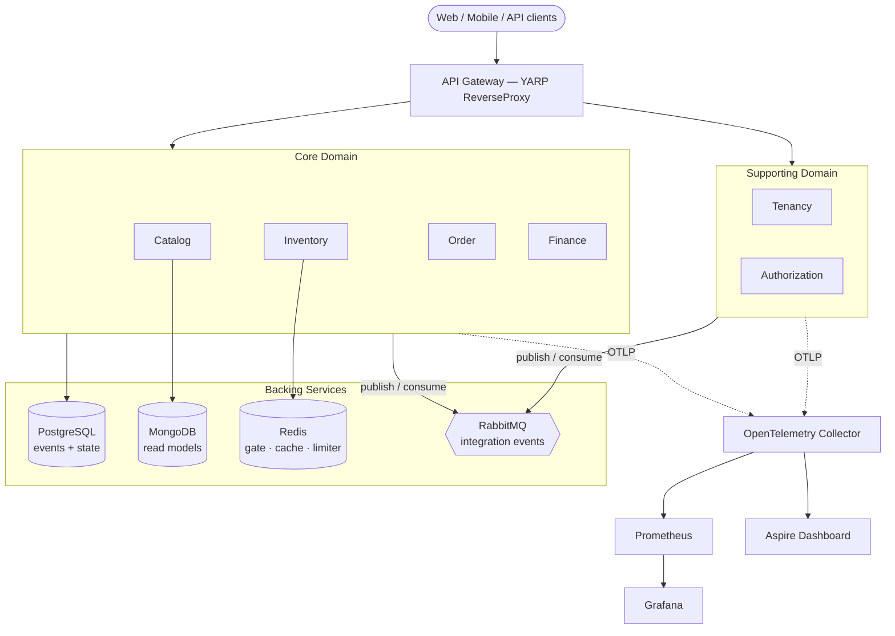

Local orchestration is via **.NET Aspire** (`EShop.AppHost`), which wires every service and backing container together with health checks and a telemetry dashboard out of the box.

---

## 2. 🧩 Component Design & Microservices Decomposition

Each service is presented as *a problem it exists to solve* and *the pattern chosen to solve it* — with the trade-off made explicit.

### Tenancy & Authorization — the Platform plane

**Tenancy** owns tenant provisioning, per-tenant **feature flags**, and — critically for the multi-tenancy story below — the per-tenant **rate-limit policy** (`SetTenantRateLimitPolicyCommand`). Storing throttling policy in the tenant aggregate is what lets the platform defend itself against a single noisy tenant *by configuration*, without redeploying.

**Authorization** owns identity and **deep hierarchical organization RBAC** — roles and permissions resolved against an organization tree, not a flat user-role table. It is event-sourced, so an authority change is an auditable fact, and it emits `OrganizationCreated`, which Catalog consumes to bootstrap a tenant's authoring space (agency).

> **Why Supporting, not Core?** They *enable* revenue but do not *generate* it. Modelling them as Supporting keeps them deliberately simpler than the Core services and prevents commerce logic from leaking into identity.

### Catalog — CQRS + Event Sourcing + Vertical Slice

Catalog is the richest write model in the system: an SPU/SKU aggregate managing **variants, variation dimensions, and dimension values** (e.g. *T-Shirt* → *{Colour: Red, Size: M}* → a purchasable SKU), guarded by a lifecycle state machine (`Draft → Published → Unpublished → Deleted`) and a family of `Specification` classes that enforce invariants at the domain boundary.

- **Write side** — Domain-Driven `Product` aggregate, event-sourced with **PostgreSQL as the event store**. It is built **vertical-slice**: domain + CQRS handlers live together per feature folder, because an authoring model changes feature-by-feature, not layer-by-layer.
- **Read side** — a separate service (`EShop.Catalog.ReadModels.MongoDb`) asynchronously **projects the event stream into MongoDB** documents shaped for query and search.

#### The architectural pain point (and why CQRS is the answer)

An event store is an *append-only ledger of facts*. It is superb at "give me the full history of product X" and useless at "find every product whose name contains *linen*". Answering the latter from the ledger means **replaying entire streams** on every search — catastrophic at catalog scale.

The decision was to **split write from read (CQRS)**: keep the authoritative history in the event store, and maintain a **denormalised MongoDB projection** purpose-built for search and listing. Writes optimise for *correctness and audit*; reads optimise for *latency and query shape*. Neither compromises for the other.

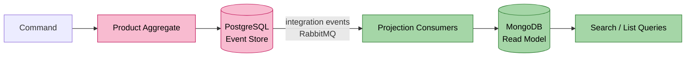

#### Addressing the eventual-consistency lag (the ~200 ms gap)

CQRS buys throughput but introduces a window where the write (PostgreSQL) is ahead of the read (MongoDB). The mitigation is **deliberately non-uniform**, because not all reads deserve the same guarantee:

| Read path | Consistency chosen | Mechanism | Rationale |
|-----------|--------------------|-----------|-----------|
| **Public catalog search** | Eventual | Serve straight from the MongoDB projection | A shopper seeing a product ~200 ms after publish is invisible; forcing strong consistency here would throttle the whole system. Throughput wins. |
| **Admin "did my edit save?"** | Read-your-own-writes | Conditional path that reads back the authoritative write side for the acting admin | An author who just published and sees stale data loses trust. This path pays a small cost for correctness *only for the one user who needs it*. |
| **Client feedback** | Optimistic UI | Client renders the intended state immediately, reconciles when the projection catches up | Perceived latency drops to zero without weakening the backend guarantee. |

> **The senior move is not "make it strongly consistent."** It is *classifying reads by their real tolerance* and spending strong consistency only where a human would notice its absence.

### Inventory — High-concurrency, no oversell, idempotent

Inventory is the concurrency crucible. Under a flash sale, thousands of requests race for the last unit. Two failure modes must be impossible: **overselling** (selling stock that isn't there) and **double-processing** (a redelivered message deducting twice).

The design is **deduct-on-order** (stock leaves `StockAvailable` the instant the order is placed, not at payment) enforced by **two layers**:

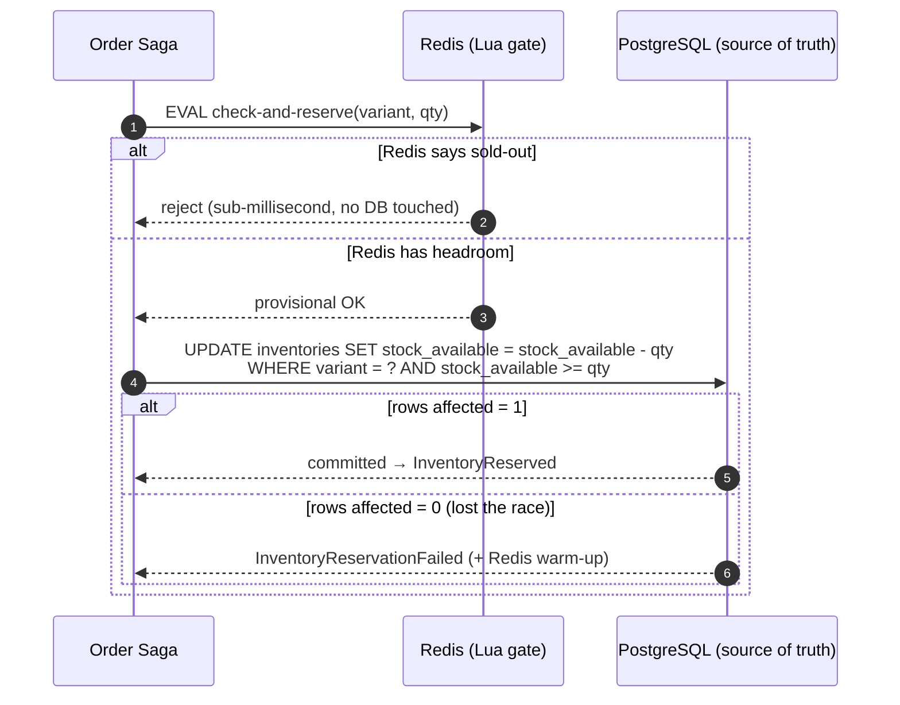

1. **Redis Lua script** — an atomic, in-memory *check-and-reserve*. Because a Lua script executes as a single unit on the Redis thread, the check and the decrement cannot interleave. This rejects the overwhelming majority of doomed requests in **sub-millisecond time, before the database is ever touched** — it is a load shield, not the source of truth.
2. **PostgreSQL Compare-And-Swap (optimistic concurrency)** — the **authoritative** decision is a conditional `UPDATE … WHERE stock_available >= qty`. If the guarded update affects **zero rows**, this request lost the race and is rejected. The database, not the cache, is the final arbiter of "no oversell."

> **Why two layers instead of one?** Redis alone is fast but not durable enough to be the ledger of record; PostgreSQL alone is authoritative but too slow to absorb the full stampede. Redis absorbs the load; Postgres guarantees the truth. Redis may drift; it is treated as a *hint* and re-seeded from Postgres (**warm-up**) — it can never *cause* an oversell, only reject early.

**Idempotency** closes the loop: reservation lifecycle is `Pending → Confirmed / Released / Expired`, and confirm/release are guarded by the current `Pending` status so a redelivered `ConfirmReservationCommand` is a no-op. Outbound integration events are written to an **outbox table** (`OutboxMessage` via `OutboxWriter`) in the *same transaction* as the stock change — so the DB write and the event can never diverge.

### Order — Distributed Saga Orchestration (MassTransit + Hangfire)

Placing an order spans three services — reserve stock (Inventory), schedule payment (Finance), then confirm or unwind — none of which share a transaction. This is a **distributed transaction**, and the design choice was **Orchestration over Choreography**.

> **Why Orchestrator, not Choreography?** In choreography, each service reacts to events and emits its own — and the *actual* business process exists nowhere, smeared across N services as an emergent "event web" that no single file describes. For a flow with real compensation branches, that is unmaintainable. An **Orchestrator** (`OrderSaga`, an event-sourced Process Manager) makes the process a *first-class, single-file, auditable artifact*: it listens to replies and issues the next command. Inventory and Finance stay ignorant of the saga — they simply answer the messages they are handed.

A distinctive implementation detail: the saga issues commands over **two rails** — **integration commands** (`ICommandBus` → RabbitMQ → another service) and **local commands** (`ICommandDispatcher` → in-process handler on the Order aggregate) — buffered separately and flushed together on every reply. This keeps the cross-service boundary and the in-process boundary explicit rather than blurred.

The following five diagrams are the **codebase reality**, reproduced verbatim from the [Order service README](Order/src/EShop.Order.API/README.md).

#### 2.1 — Layer Overview

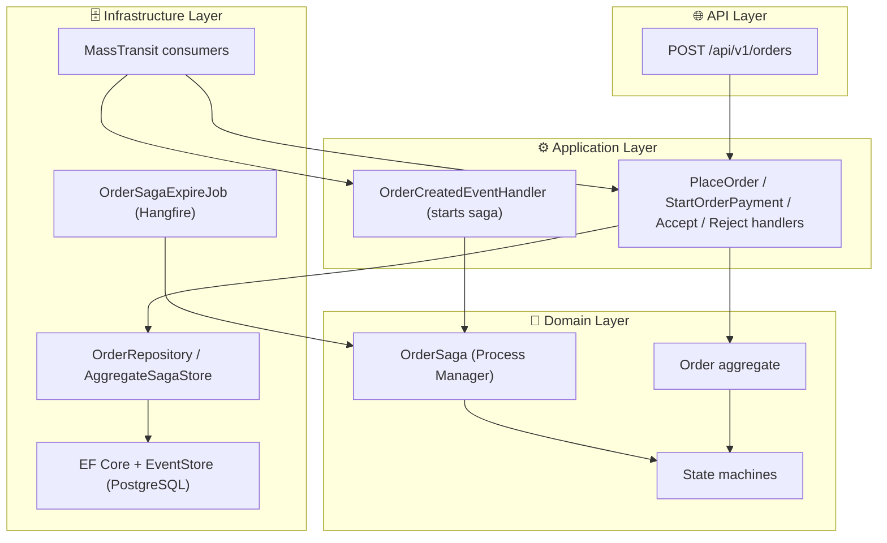

#### 2.2 — Happy Path

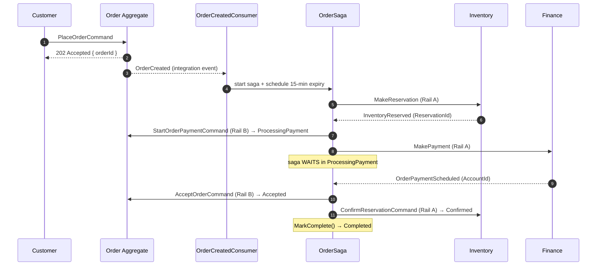

#### 2.3 — Compensation: Payment Schedule Failed

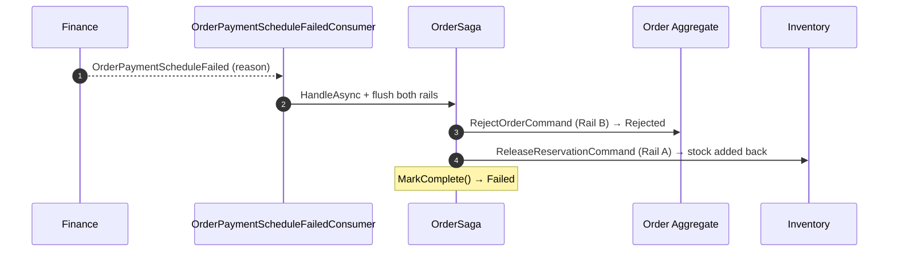

#### 2.4 — Compensation: Inventory Failed

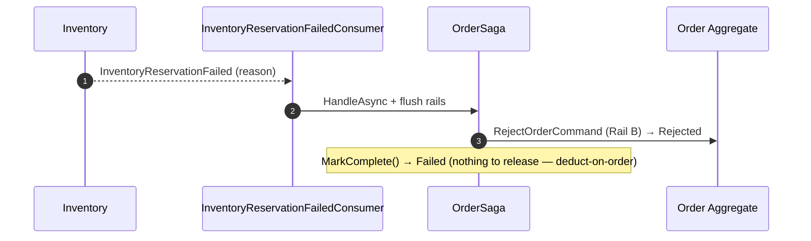

> Note the deduct-on-order subtlety: a *failed* reservation deducted nothing, so there is nothing to compensate. Release fires only after a *successful* reservation (i.e. the payment-failure branch, 2.3).

#### 2.5 — Compensation: Saga Expiry

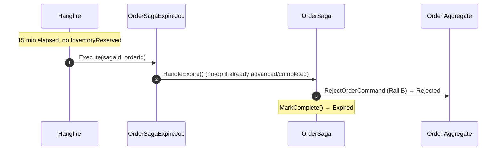

> **Liveness matters as much as safety.** Without the Hangfire timeout, a reply that never arrives would strand the order forever. The expiry job is the escape hatch that guarantees the saga always terminates.

### Finance & Billing — Generic HTTP Provider integration

Finance owns account management and **payment schedules** (one strategy per frequency — OneOff / Monthly / Quarterly / Annually — an Open/Closed extension point). Its harder problem is integrating with **per-tenant external accounting providers** that all speak different HTTP dialects.

The solution is the **Generic HTTP Provider** pattern: instead of a bespoke client per provider, a tenant stores a **declarative configuration** (endpoint, auth scheme, request template) that a generic `HttpIntegrationClient` renders and executes. Provider secrets live in the **Finance database**, not shared cache — each tenant's accounting credentials stay in the tenant's own scoped, RLS-protected rows. Adding a provider becomes *configuration*, not *code*.

> Idempotency is again first-class here: booking a payment to an external ledger must be **retry-safe**, because "did the remote actually record it?" is unknowable after a timeout. The booking pipeline is designed so a redelivered job cannot double-book.

---

## 3. ⚖️ Advanced Architectural Trade-offs & Production Realities

### A. Multi-Tenancy — Shared Database, isolated by PostgreSQL Row-Level Security (RLS)

The model is **shared database, separate app-tier context per request**, with isolation enforced **inside the database engine** via RLS — not (only) in application code. This is implemented in `EShop.Shared.DbResourceAccessControl`.

#### How it actually works (traceable to code)

1. Middleware resolves the `TenantId` from the incoming JWT (`IUserDetailsProvider`).
2. On **every connection open**, a `DbConnectionInterceptor` (`PostgresMultiTenantConnectionInterceptor`) executes a session-scoped statement:

   ```sql
   SET app.tenant_id = '<tenant-from-jwt>';
   ```

3. At startup, each `IScoped` table has an RLS policy installed:

   ```sql
   ALTER TABLE "Inventories" ENABLE ROW LEVEL SECURITY;
   ALTER TABLE "Inventories" FORCE  ROW LEVEL SECURITY;
   CREATE POLICY tenant_isolation ON "Inventories"
       USING ("TenantId" = current_setting('app.tenant_id')::VARCHAR(50));
   ```

4. From then on, PostgreSQL itself filters every `SELECT/UPDATE/DELETE` to the current session's tenant. Two isolation strategies exist: `tenant_isolation` (for `IScoped` entities) and a stricter **ring-fencing** policy (for `IRingFenced` entities). A guard even *fails startup* if a `DbSet` neither declares `IScoped` nor `IExcludedFromScoping` — you cannot accidentally ship an unclassified table.

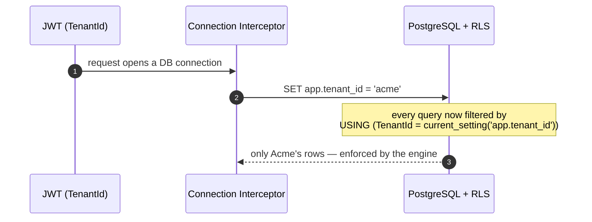

#### The trade-offs (defend both sides)

**Pros**
- **Isolation is a database guarantee, not a developer promise.** Even if an engineer forgets `.Where(x => x.TenantId == ...)`, RLS still refuses to leak another tenant's rows. Defence-in-depth against the single most damaging bug class in SaaS.
- **`FORCE ROW LEVEL SECURITY`** applies the policy even to the table owner — closing the usual RLS bypass.
- **Low initial cost** — one shared schema, one migration path, no per-tenant provisioning.

**Cons / Production risks**
- **Per-request session state adds connection-pool friction** — every pooled connection must be stamped with `SET app.tenant_id` on open, and a returned connection must not carry a stale tenant.
- **Noisy Neighbour syndrome** — one tenant's flash sale can spike shared CPU/IOPS and degrade every other tenant on the box.
- **Index and query tuning get harder** as one physical table grows to hold all tenants' data.

**Production mitigations (in this repo, and on the roadmap)**
- **Distributed rate limiter, keyed by tenant** — *shipped*. Tenancy owns a per-tenant rate-limit policy; the request pipeline enforces it via Redis-backed Lua scripts (`token_bucket.lua`, `sliding_window.lua`) with a **fail-open** posture so a Redis outage degrades to *available*, not *down*. This is the concrete throttle for a rogue tenant.
- **An early-designed extraction path** — because tenant data is cleanly tagged and isolated, a hyper-growth tenant can be **migrated to a dedicated database without application code changes**. Designing the seam *before* you need it is the difference between a config change and a rewrite.

> **The honest summary:** RLS is not free performance — it is *bought safety*. It trades some connection-pool and tuning complexity for a guarantee that a single missing `WHERE` clause cannot become a data breach. For multi-tenant SaaS, that is almost always the right trade.

### B. Distributed Messaging Reliability

#### The dual-write problem, solved with the Outbox pattern

The classic distributed bug: a handler commits its state change to PostgreSQL, then tries to publish an integration event to RabbitMQ — and crashes in between. State moved; the event was lost; downstream services are now permanently wrong.

The fix is the **Transactional Outbox**: the integration event is written to an `OutboxMessage` table **in the same database transaction** as the state change (`OutboxWriter` / `IOutboxWriter`, backed by the `AddReservationItemAndOutboxMessage` migration in Inventory). Either both commit or neither does. A relay then reads the outbox and publishes to RabbitMQ, retrying until acknowledged — giving **at-least-once** delivery with no lost events.

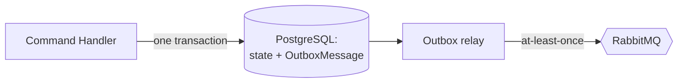

> **Roadmap — polling → CDC.** The relay today is a polling/scheduled publisher. The intended evolution is **Change Data Capture via Debezium**: tail the PostgreSQL WAL and stream outbox rows to the broker with far lower latency and no polling load. This is a *roadmap item*, called out honestly — the outbox table is deliberately shaped so this swap is a relay change, not a domain change.

#### Idempotent Consumers — surviving at-least-once

At-least-once delivery means **duplicates are guaranteed**, eventually. Every consumer that causes a side-effect must therefore be idempotent. The repo's `IdempotentConsumer<T>` (used across Tenancy and Catalog projections) records each processed message's identifier in an **`inbox_messages` deduplication table** and checks it *before* dispatching. A redelivered message whose id is already present is acknowledged and dropped — the side-effect happens **exactly once** even though delivery is at-least-once.

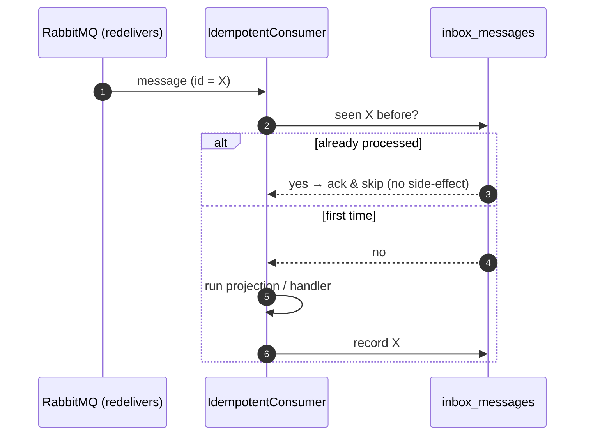

> **Inbox (dedup) + Outbox (no-loss) together** give the end-to-end **effectively-once** guarantee that is the practical ceiling for distributed messaging. Inventory reinforces this at the domain layer too — the `Pending`-status guard on confirm/release makes those operations naturally idempotent independent of the transport.

---

## 4. ✅ Enterprise Engineering Standards (The Reviewer's Checklist)

### Production-grade testing taxonomy

| Layer | Stack | What it proves | Where |
|-------|-------|----------------|-------|
| **Unit** | xUnit + FluentAssertions + Moq + AutoFixture | Pure domain behaviour — aggregate invariants, specifications, and **state-machine transitions** — with zero infrastructure. E.g. `OrderSagaTests` asserts a reply arriving in the wrong state throws `DomainException`. | `*/tests/*.Tests` |
| **Integration** | **Testcontainers** | *Real* ephemeral **PostgreSQL, MongoDB, Redis, RabbitMQ** spun up in Docker per test run — validating true infrastructure behaviour (RLS policies, EF mappings, Lua scripts, real broker semantics), not mocks. | `PostgreSqlTestDatabase`, `MongoDbTestDatabase`, `RedisContainerFixture` |
| **Behaviour (BDD)** | Reqnroll.xUnit (Cucumber/Gherkin) | Critical commerce flows expressed as executable business specifications — e.g. stock-reservation failure — readable by non-engineers and run in CI. | `*/tests/*/*.feature` |

> **Why Testcontainers over an in-memory fake?** The bugs that matter in this system — an RLS policy that doesn't filter, a Lua script that races, a broker redelivery — are *precisely* the ones a mock cannot reproduce. Testing against the real engine in a disposable container is the only way to catch them before production.

### CI/CD pipeline — *designed pipeline (roadmap)*

> **Stated honestly:** this repository currently ships a **pull-request template** and codified **review workflows** (review skills + OpenSpec spec-driven change proposals), but **no GitHub Actions workflow files exist yet** (`.github/workflows` is empty). The following is the *designed* pipeline the codebase is built to run — the test suite is already Testcontainers-ready for it.

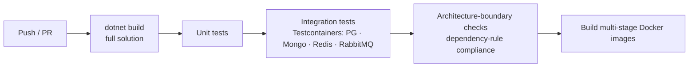

Each stage is a gate: compile the whole solution, run unit then Testcontainers integration suites, verify Clean-Architecture dependency direction (`API → Infrastructure → Application → Domain`), and build the container images on green.

### Containerization

- **Eight production-oriented multi-stage Dockerfiles** — one per deployable (Authorization, Catalog write side, Catalog read side, Finance, Inventory, Order, Tenancy, API Gateway). Multi-stage keeps the build SDK out of the runtime image and orders layers so dependency restore is cached independently of source changes — smaller images, faster rebuilds.
- **Unified `docker-compose`** under `deploy/` brings up the full multi-service topology plus backing services for local dev; **.NET Aspire** (`EShop.AppHost`) is the alternative developer-inner-loop orchestrator with a built-in telemetry dashboard.
- **Observability is built in, not bolted on** — every service exports OpenTelemetry (OTLP) traces, metrics, and logs to a collector fanning out to **Prometheus → Grafana** (metrics/dashboards) and the **Aspire Dashboard** (traces/logs), with `CorrelationId` propagated across the MassTransit envelope so a single order can be traced across every service it touches.

---

## Appendix — Service Deep-Dives

Each service carries its own README with full Event Storming, aggregate diagrams, state machines, and integration contracts:

| Service | Deep-dive |
|---------|-----------|
| Order (saga) | [Order/src/EShop.Order.API/README.md](Order/src/EShop.Order.API/README.md) |
| Inventory (concurrency) | [Inventory/src/EShop.Inventory.API/README.md](Inventory/src/EShop.Inventory.API/README.md) |
| Catalog (CQRS/ES) | [Catalog/src/EShop.Catalog.Application/README.md](Catalog/src/EShop.Catalog.Application/README.md) |
| Finance (Generic HTTP) | [Finance/src/EShop.Finance.API/README.md](Finance/src/EShop.Finance.API/README.md) |
| Authorization (RBAC) | [Authorization/src/EShop.Authorization.API/README.md](Authorization/src/EShop.Authorization.API/README.md) |
| Distributed rate limiter | [Shared/src/EShop.Shared.RateLimiting/README.md](Shared/src/EShop.Shared.RateLimiting/README.md) |
| JWT / RSA key rotation | [Shared/src/EShop.Shared.Authentication/README.md](Shared/src/EShop.Shared.Authentication/README.md) |

---

## References & Inspiration

| Resource | Why it matters here |
|----------|---------------------|
| [Event Storming](https://www.eventstorming.com/) — Alberto Brandolini | The discovery technique behind the bounded-context decomposition. |
| [Domain-Driven Design](https://www.domainlanguage.com/ddd/) — Eric Evans | Strategic + tactical patterns. |
| [Implementing DDD](https://www.oreilly.com/library/view/implementing-domain-driven-design/9780133039900/) — Vaughn Vernon | Aggregates, sagas, and integration patterns. |
| [CQRS Journey — Sagas & Process Managers](https://learn.microsoft.com/en-us/previous-versions/msp-n-p/jj591569(v=pandp.10)) | The pattern guidance the Order saga follows. |
| [EventualShop — AntonioFalcaoJr](https://github.com/AntonioFalcaoJr/EventualShop) | Reference architecture that heavily informed the event-driven and CQRS approach used here. |

---

<div align="center">

**eShop Cloud-Native Platform** · built to be defended, not just demonstrated.

</div>
