# 📦 Product Aggregate — Catalog Microservice

[](/)
[](/)
[](/)

> **Product Aggregate** is the core aggregate root in the Catalog bounded context, implementing the **SPU (Standard Product Unit) / SKU (Stock Keeping Unit)** pattern for e-commerce product management with variation dimensions and variants.

---

## 📋 Table of Contents

- [Strategic Design](#-strategic-design)
- [Event Storming](#-event-storming)
- [Tactical Design](#-tactical-design)
- [State Machines](#-state-machines)
- [CQRS Architecture](#-cqrs-architecture)
- [Specifications & Invariants](#-specifications--invariants)
- [MongoDB Read Model](#-mongodb-read-model)
- [Vertical Slice Structure](#-vertical-slice-structure)

---

## 🗺 Strategic Design

### Bounded Context Map

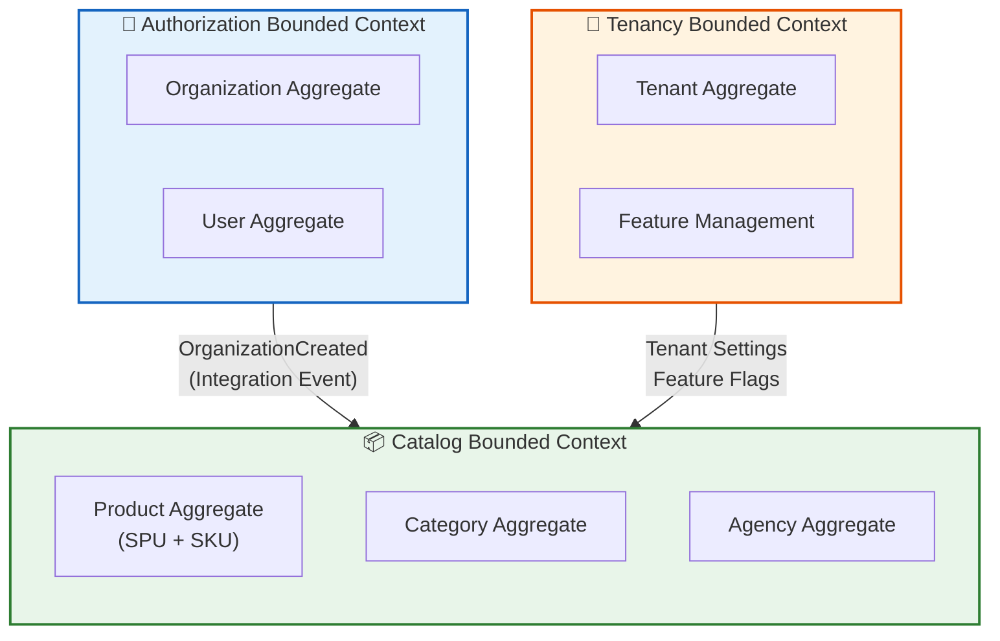
```mermaid
graph TB
    subgraph Catalog["📦 Catalog Bounded Context"]
        direction TB
        PA["Product Aggregate<br/>(SPU + SKU)"]
        CA["Category Aggregate"]
        AA["Agency Aggregate"]
    end

    subgraph Authorization["🔐 Authorization Bounded Context"]
        OA["Organization Aggregate"]
        UA["User Aggregate"]
    end

    subgraph Tenancy["🏢 Tenancy Bounded Context"]
        TA["Tenant Aggregate"]
        FA["Feature Management"]
    end

    Authorization -->|"OrganizationCreated<br/>(Integration Event)"| Catalog
    Tenancy -->|"Tenant Settings<br/>Feature Flags"| Catalog

    style Catalog fill:#e8f5e9,stroke:#2e7d32,stroke-width:2px
    style Authorization fill:#e3f2fd,stroke:#1565c0,stroke-width:2px
    style Tenancy fill:#fff3e0,stroke:#e65100,stroke-width:2px
```

### Context Classification

| Aspect | Description |
|:-------|:------------|
| **Bounded Context** | Catalog |
| **Aggregate Root** | `ProductAggregate` |
| **Domain Type** | Core Domain (competitive advantage) |
| **Multi-tenancy** | `IScoped` + `IRingFenced` (tenant-isolated data) |
| **Persistence** | Event Sourcing (PostgreSQL) |
| **Read Model** | CQRS projection (MongoDB via RabbitMQ) |
| **Architecture** | Vertical Slice |

### Ubiquitous Language

| Term | Definition |
|:-----|:-----------|
| **Product (SPU)** | A Standard Product Unit — the abstract product entity (e.g., "Classic Cotton T-Shirt") |
| **Variant (SKU)** | A Stock Keeping Unit — a specific purchasable combination (e.g., "Red / Size M") |
| **Variation Dimension** | An axis of variation (e.g., Color, Size, Material) |
| **Dimension Value** | A specific option within a dimension (e.g., "Red", "Blue" within Color) |
| **Default Variant** | The primary display variant; shown first on product listing |
| **Slug** | URL-friendly identifier for the product |

---

## 🔶 Event Storming

> **Phase 1 — Collaborative Discovery.** Event Storming is NOT a developer-only exercise. It requires coordination across roles to build a shared understanding of the business domain. Every sticky note on the board should be recognizable by PO, BA, SA, and Dev alike.

> Notation follows the [Event Storming](https://www.eventstorming.com/) sticky-note convention by Alberto Brandolini.

### Participants & Roles

| Role | Contribution | Artifact Ownership |
|:-----|:-------------|:-------------------|
| **Product Owner** | Defines *what* the business needs, validates events & policies match real-world behavior | Ubiquitous Language, Policies |
| **Business Analyst** | Clarifies edge cases, maps user journeys, identifies hotspots | Actor mapping, Hotspots |
| **Solution Architect** | Ensures bounded context boundaries align, validates integration points | Aggregate boundaries, Context Map |
| **Developer** | Translates sticky notes into tactical DDD building blocks | Commands, Events, Specifications |

### Legend

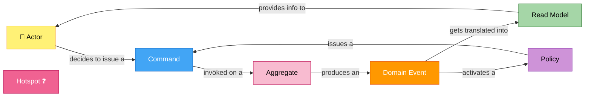
```mermaid
graph LR
    A["👤 Actor"]:::actor -- decides to issue a --> C["Command"]:::command
    C -- invoked on a --> S["Aggregate"]:::aggregate
    S -- produces an --> E["Domain Event"]:::event
    E -- gets translated into --> R["Read Model"]:::readmodel
    R -- provides info to --> A
    E -- activates a --> P["Policy"]:::policy
    P -- issues a --> C
    H["Hotspot ❓"]:::hotspot

    classDef actor fill:#fff176,stroke:#f9a825,color:#000
    classDef command fill:#42a5f5,stroke:#1565c0,color:#fff
    classDef aggregate fill:#f8bbd0,stroke:#c2185b,color:#000
    classDef event fill:#ff9800,stroke:#e65100,color:#fff
    classDef policy fill:#ce93d8,stroke:#7b1fa2,color:#000
    classDef readmodel fill:#a5d6a7,stroke:#2e7d32,color:#000
    classDef hotspot fill:#f06292,stroke:#c2185b,color:#fff
```

### Actors

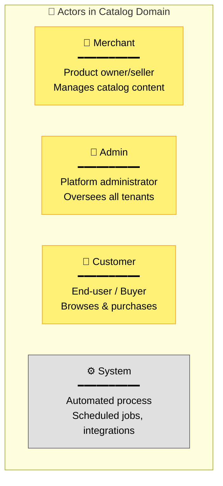
```mermaid
graph TB
    subgraph Actors["👤 Actors in Catalog Domain"]
        direction LR
        A1["👤 Merchant<br/>━━━━━━━━━━<br/>Product owner/seller<br/>Manages catalog content"]:::actor
        A2["👤 Admin<br/>━━━━━━━━━━<br/>Platform administrator<br/>Oversees all tenants"]:::actor
        A3["👤 Customer<br/>━━━━━━━━━━<br/>End-user / Buyer<br/>Browses & purchases"]:::actor
        A4["⚙️ System<br/>━━━━━━━━━━<br/>Automated process<br/>Scheduled jobs, integrations"]:::system
    end

    classDef actor fill:#fff176,stroke:#f9a825,color:#000
    classDef system fill:#e0e0e0,stroke:#616161,color:#000
```

| Actor | Interacts With | Example BDD Scenario |
|:------|:---------------|:---------------------|
| **Merchant** | Product, Variant, VariationDimension | *As a Merchant, I want to create a product with variants, so that customers can purchase specific SKUs* |
| **Admin** | Product (delete, oversight) | *As an Admin, I want to delete a product, so that inappropriate listings are removed* |
| **Customer** | Read Model (browse, search) | *As a Customer, I want to browse published products, so that I can find items to buy* |
| **System** | Integration events, projections | *As the System, I want to project product events to MongoDB, so that read queries are fast* |

### Product Lifecycle — Event Storm

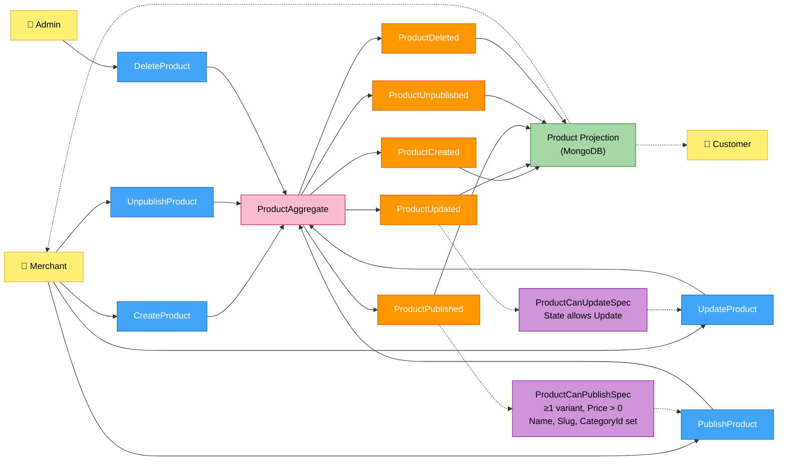
```mermaid
graph LR
    M["👤 Merchant"]:::actor
    AD["👤 Admin"]:::actor

    C1["CreateProduct"]:::command
    C2["UpdateProduct"]:::command
    C3["PublishProduct"]:::command
    C4["UnpublishProduct"]:::command
    C5["DeleteProduct"]:::command

    AGG["ProductAggregate"]:::aggregate

    E1["ProductCreated"]:::event
    E2["ProductUpdated"]:::event
    E3["ProductPublished"]:::event
    E4["ProductUnpublished"]:::event
    E5["ProductDeleted"]:::event

    P1["ProductCanPublishSpec<br/>≥1 variant, Price > 0<br/>Name, Slug, CategoryId set"]:::policy
    P2["ProductCanUpdateSpec<br/>State allows Update"]:::policy

    RM["Product Projection<br/>(MongoDB)"]:::readmodel
    CU["👤 Customer"]:::actor

    M --> C1 & C2 & C3 & C4
    AD --> C5
    C1 & C2 & C3 & C4 & C5 --> AGG
    AGG --> E1 & E2 & E3 & E4 & E5
    E1 & E2 & E3 & E4 & E5 --> RM
    RM -.-> M
    RM -.-> CU

    E3 -.-> P1 -.-> C3
    E2 -.-> P2 -.-> C2

    classDef actor fill:#fff176,stroke:#f9a825,color:#000
    classDef command fill:#42a5f5,stroke:#1565c0,color:#fff
    classDef aggregate fill:#f8bbd0,stroke:#c2185b,color:#000
    classDef event fill:#ff9800,stroke:#e65100,color:#fff
    classDef policy fill:#ce93d8,stroke:#7b1fa2,color:#000
    classDef readmodel fill:#a5d6a7,stroke:#2e7d32,color:#000
```

### Variation Dimension — Event Storm

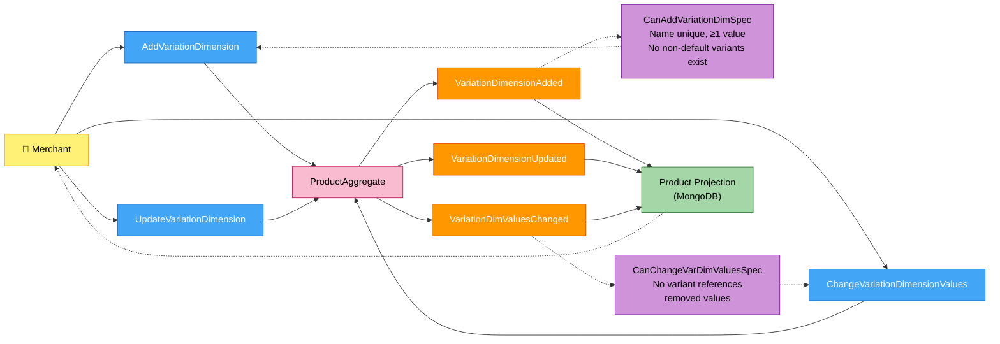
```mermaid
graph LR
    M["👤 Merchant"]:::actor

    C1["AddVariationDimension"]:::command
    C2["UpdateVariationDimension"]:::command
    C3["ChangeVariationDimensionValues"]:::command

    AGG["ProductAggregate"]:::aggregate

    E1["VariationDimensionAdded"]:::event
    E2["VariationDimensionUpdated"]:::event
    E3["VariationDimValuesChanged"]:::event

    P1["CanAddVariationDimSpec<br/>Name unique, ≥1 value<br/>No non-default variants exist"]:::policy
    P2["CanChangeVarDimValuesSpec<br/>No variant references<br/>removed values"]:::policy

    RM["Product Projection<br/>(MongoDB)"]:::readmodel

    M --> C1 & C2 & C3
    C1 & C2 & C3 --> AGG
    AGG --> E1 & E2 & E3
    E1 & E2 & E3 --> RM
    RM -.-> M

    E1 -.-> P1 -.-> C1
    E3 -.-> P2 -.-> C3

    classDef actor fill:#fff176,stroke:#f9a825,color:#000
    classDef command fill:#42a5f5,stroke:#1565c0,color:#fff
    classDef aggregate fill:#f8bbd0,stroke:#c2185b,color:#000
    classDef event fill:#ff9800,stroke:#e65100,color:#fff
    classDef policy fill:#ce93d8,stroke:#7b1fa2,color:#000
    classDef readmodel fill:#a5d6a7,stroke:#2e7d32,color:#000
```

### Variant — Event Storm

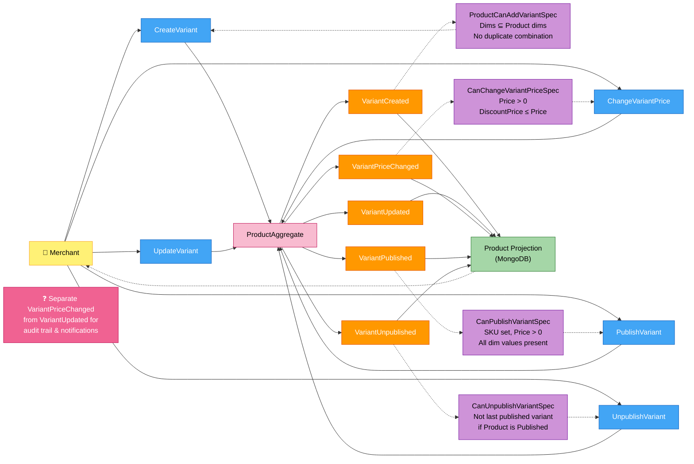
```mermaid
graph LR
    M["👤 Merchant"]:::actor

    C1["CreateVariant"]:::command
    C2["UpdateVariant"]:::command
    C3["ChangeVariantPrice"]:::command
    C4["PublishVariant"]:::command
    C5["UnpublishVariant"]:::command

    AGG["ProductAggregate"]:::aggregate

    E1["VariantCreated"]:::event
    E2["VariantUpdated"]:::event
    E3["VariantPriceChanged"]:::event
    E4["VariantPublished"]:::event
    E5["VariantUnpublished"]:::event

    P1["ProductCanAddVariantSpec<br/>Dims ⊆ Product dims<br/>No duplicate combination"]:::policy
    P2["CanChangeVariantPriceSpec<br/>Price > 0<br/>DiscountPrice ≤ Price"]:::policy
    P3["CanPublishVariantSpec<br/>SKU set, Price > 0<br/>All dim values present"]:::policy
    P4["CanUnpublishVariantSpec<br/>Not last published variant<br/>if Product is Published"]:::policy

    H1["❓ Separate VariantPriceChanged<br/>from VariantUpdated for<br/>audit trail & notifications"]:::hotspot

    RM["Product Projection<br/>(MongoDB)"]:::readmodel

    M --> C1 & C2 & C3 & C4 & C5
    C1 & C2 & C3 & C4 & C5 --> AGG
    AGG --> E1 & E2 & E3 & E4 & E5
    E1 & E2 & E3 & E4 & E5 --> RM
    RM -.-> M

    E1 -.-> P1 -.-> C1
    E3 -.-> P2 -.-> C3
    E4 -.-> P3 -.-> C4
    E5 -.-> P4 -.-> C5

    classDef actor fill:#fff176,stroke:#f9a825,color:#000
    classDef command fill:#42a5f5,stroke:#1565c0,color:#fff
    classDef aggregate fill:#f8bbd0,stroke:#c2185b,color:#000
    classDef event fill:#ff9800,stroke:#e65100,color:#fff
    classDef policy fill:#ce93d8,stroke:#7b1fa2,color:#000
    classDef readmodel fill:#a5d6a7,stroke:#2e7d32,color:#000
    classDef hotspot fill:#f06292,stroke:#c2185b,color:#fff
```

### Product State Machine

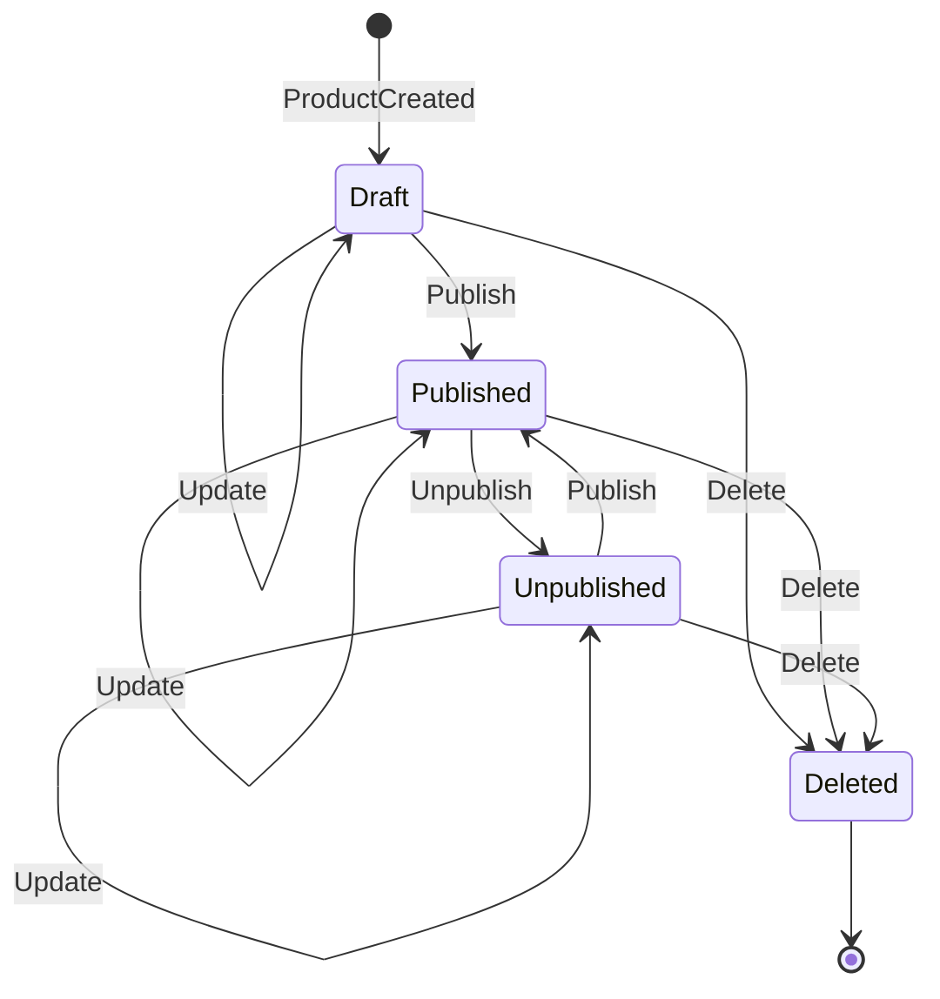
```mermaid
stateDiagram-v2
    [*] --> Draft : ProductCreated

    Draft --> Draft : Update
    Draft --> Published : Publish
    Draft --> Deleted : Delete

    Published --> Published : Update
    Published --> Unpublished : Unpublish
    Published --> Deleted : Delete

    Unpublished --> Unpublished : Update
    Unpublished --> Published : Publish
    Unpublished --> Deleted : Delete

    Deleted --> [*]
```

### Variant State Lifecycle

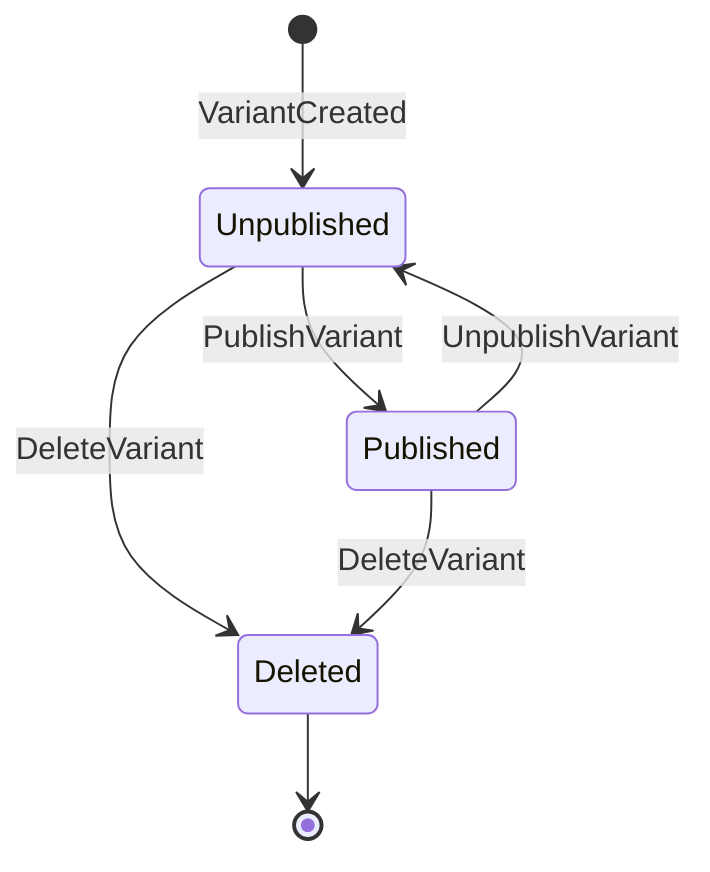
```mermaid
stateDiagram-v2
    [*] --> Unpublished : VariantCreated

    Unpublished --> Published : PublishVariant
    Published --> Unpublished : UnpublishVariant

    Unpublished --> Deleted : DeleteVariant
    Published --> Deleted : DeleteVariant

    Deleted --> [*]
```

> **Note**: Child entity operations (Variant, VariationDimension) are allowed in all non-Deleted Product states. Variant state transitions are validated via Specifications, not a state machine library.

---

## 🧱 Tactical Design

### Aggregate Structure — Building Blocks

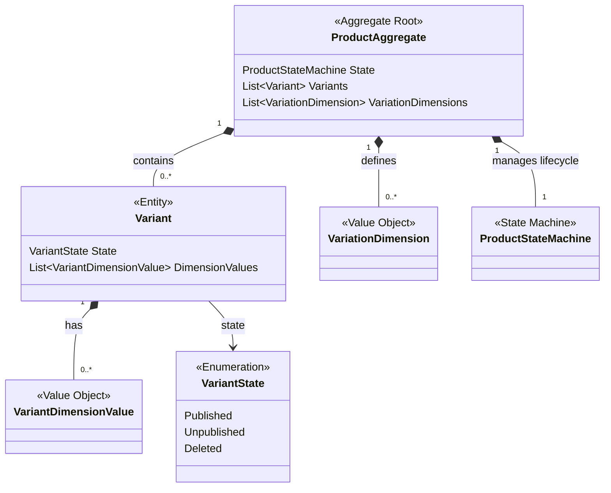
```mermaid
classDiagram
    class ProductAggregate {
        <<Aggregate Root>>
        ProductStateMachine State
        List~Variant~ Variants
        List~VariationDimension~ VariationDimensions
    }

    class Variant {
        <<Entity>>
        VariantState State
        List~VariantDimensionValue~ DimensionValues
    }

    class VariationDimension {
        <<Value Object>>
    }

    class VariantDimensionValue {
        <<Value Object>>
    }

    class ProductStateMachine {
        <<State Machine>>
    }

    class VariantState {
        <<Enumeration>>
        Published
        Unpublished
        Deleted
    }

    ProductAggregate "1" *-- "0..*" Variant : contains
    ProductAggregate "1" *-- "0..*" VariationDimension : defines
    ProductAggregate "1" *-- "1" ProductStateMachine : manages lifecycle
    Variant "1" *-- "0..*" VariantDimensionValue : has
    Variant --> VariantState : state
```

> See source code for full property and method details. This diagram shows **structural relationships only** to avoid going stale.

### SPU / SKU Relationship Model

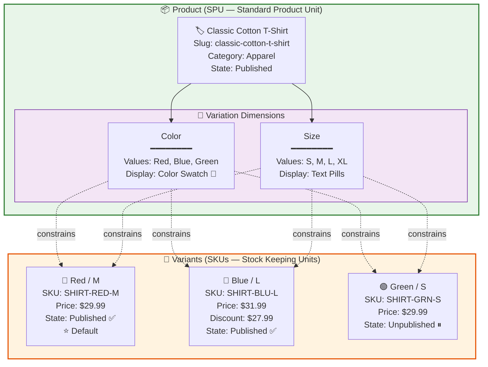
```mermaid
graph TB
    subgraph SPU["📦 Product (SPU — Standard Product Unit)"]
        P["🏷 Classic Cotton T-Shirt<br/>Slug: classic-cotton-t-shirt<br/>Category: Apparel<br/>State: Published"]

        subgraph Dimensions["📐 Variation Dimensions"]
            D1["Color<br/>━━━━━━━━<br/>Values: Red, Blue, Green<br/>Display: Color Swatch 🎨"]
            D2["Size<br/>━━━━━━━━<br/>Values: S, M, L, XL<br/>Display: Text Pills"]
        end
    end

    subgraph SKUs["🏪 Variants (SKUs — Stock Keeping Units)"]
        V1["🔴 Red / M<br/>SKU: SHIRT-RED-M<br/>Price: $29.99<br/>State: Published ✅<br/>⭐ Default"]
        V2["🔵 Blue / L<br/>SKU: SHIRT-BLU-L<br/>Price: $31.99<br/>Discount: $27.99<br/>State: Published ✅"]
        V3["🟢 Green / S<br/>SKU: SHIRT-GRN-S<br/>Price: $29.99<br/>State: Unpublished ⏸"]
    end

    P --> D1
    P --> D2
    D1 -.->|constrains| V1
    D1 -.->|constrains| V2
    D1 -.->|constrains| V3
    D2 -.->|constrains| V1
    D2 -.->|constrains| V2
    D2 -.->|constrains| V3

    style SPU fill:#e8f5e9,stroke:#2e7d32,stroke-width:2px
    style SKUs fill:#fff3e0,stroke:#e65100,stroke-width:2px
    style Dimensions fill:#f3e5f5,stroke:#6a1b9a,stroke-width:1px
```

### Building Blocks Classification

| Building Block | Type | Identity | Rationale |
|:---------------|:-----|:---------|:----------|
| `ProductAggregate` | **Aggregate Root** | `Guid Id` | Consistency boundary; owns Variants & Dimensions |
| `Variant` | **Entity** | `Guid Id` | Has own lifecycle (`VariantState`), independently mutable |
| `VariationDimension` | **Value Object** | By `Name` (structural) | Identified by name within Product, replaced atomically |
| `VariantDimensionValue` | **Value Object** | By `Name + Value` | Pure data, no lifecycle, compared by structure |
| `ProductStateMachine` | **Domain Service** (inline) | N/A | Encapsulates Product state transition rules |
| `VariantState` | **Enumeration** | Enum value | Simple state; transitions validated by Specifications |

---

## 🔄 State Machines

### Product State Machine

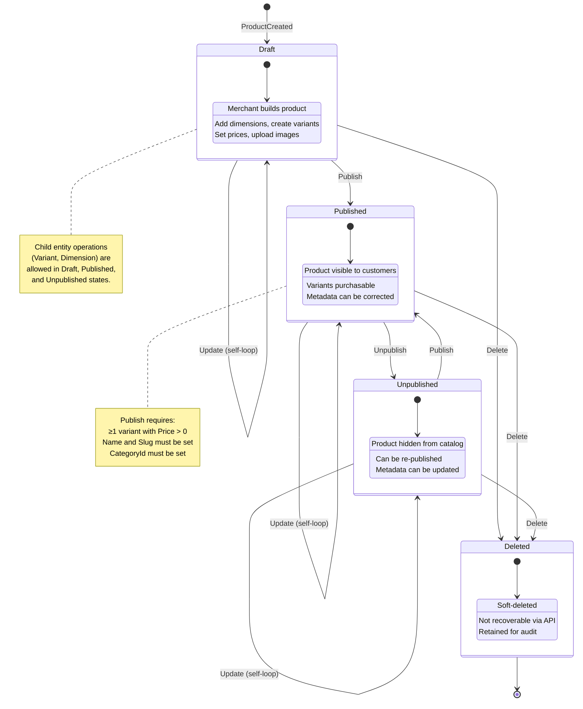
```mermaid
stateDiagram-v2
    [*] --> Draft : ProductCreated

    Draft --> Draft : Update (self-loop)
    Draft --> Published : Publish
    Draft --> Deleted : Delete

    Published --> Published : Update (self-loop)
    Published --> Unpublished : Unpublish
    Published --> Deleted : Delete

    Unpublished --> Unpublished : Update (self-loop)
    Unpublished --> Published : Publish
    Unpublished --> Deleted : Delete

    Deleted --> [*]

    state Draft {
        [*] --> editing
        editing : Merchant builds product
        editing : Add dimensions, create variants
        editing : Set prices, upload images
    }

    state Published {
        [*] --> live
        live : Product visible to customers
        live : Variants purchasable
        live : Metadata can be corrected
    }

    state Unpublished {
        [*] --> hidden
        hidden : Product hidden from catalog
        hidden : Can be re-published
        hidden : Metadata can be updated
    }

    state Deleted {
        [*] --> terminal
        terminal : Soft-deleted
        terminal : Not recoverable via API
        terminal : Retained for audit
    }

    note right of Draft
        Child entity operations
        (Variant, Dimension) are
        allowed in Draft, Published,
        and Unpublished states.
    end note

    note right of Published
        Publish requires:
        ≥1 variant with Price > 0
        Name and Slug must be set
        CategoryId must be set
    end note
```

### Variant State Lifecycle

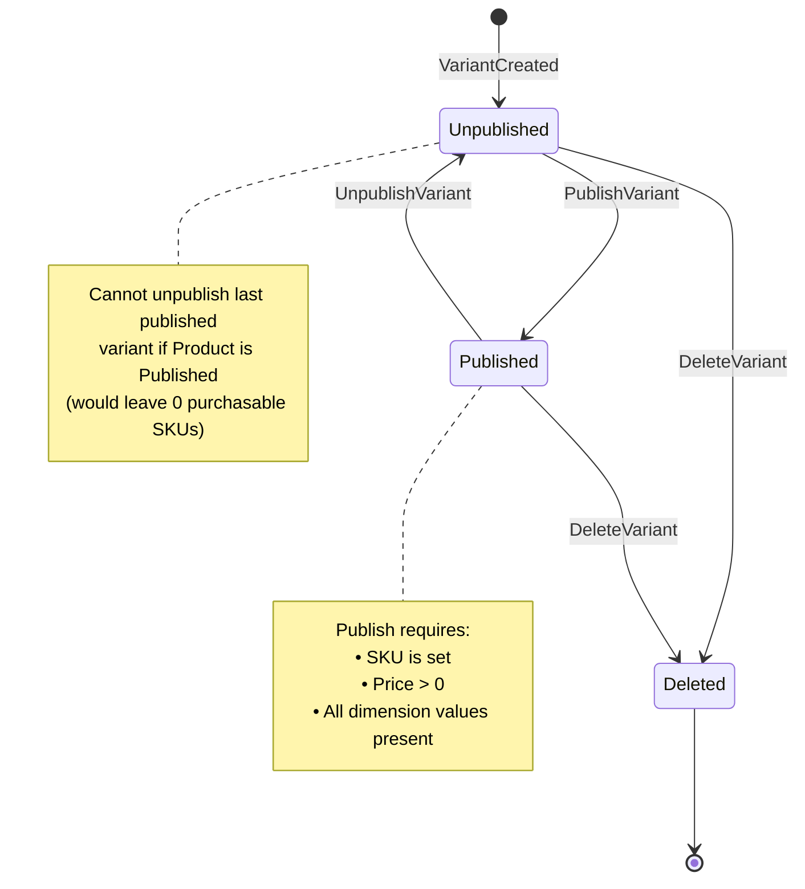
```mermaid
stateDiagram-v2
    [*] --> Unpublished : VariantCreated

    Unpublished --> Published : PublishVariant
    Unpublished --> Deleted : DeleteVariant

    Published --> Unpublished : UnpublishVariant
    Published --> Deleted : DeleteVariant

    Deleted --> [*]

    note right of Published
        Publish requires:
        • SKU is set
        • Price > 0
        • All dimension values present
    end note

    note right of Unpublished
        Cannot unpublish last published
        variant if Product is Published
        (would leave 0 purchasable SKUs)
    end note
```

### Combined State Interaction

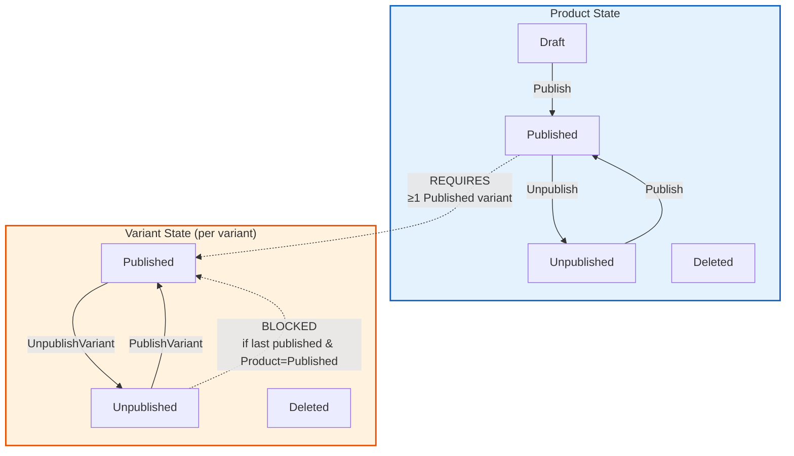
```mermaid
graph TB
    subgraph ProductState["Product State"]
        PS1["Draft"]
        PS2["Published"]
        PS3["Unpublished"]
        PS4["Deleted"]
    end

    subgraph VariantState["Variant State (per variant)"]
        VS1["Unpublished"]
        VS2["Published"]
        VS3["Deleted"]
    end

    PS1 -->|"Publish"| PS2
    PS2 -->|"Unpublish"| PS3
    PS3 -->|"Publish"| PS2

    VS1 -->|"PublishVariant"| VS2
    VS2 -->|"UnpublishVariant"| VS1

    PS2 -.->|"REQUIRES<br/>≥1 Published variant"| VS2
    VS1 -.->|"BLOCKED<br/>if last published & Product=Published"| VS2

    style ProductState fill:#e3f2fd,stroke:#1565c0,stroke-width:2px
    style VariantState fill:#fff3e0,stroke:#e65100,stroke-width:2px
```

---

## ⚡ CQRS Architecture

### Write Model — Command → Event Flow

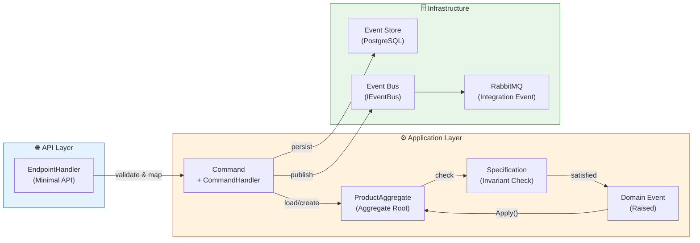
```mermaid
flowchart LR
    subgraph API["🌐 API Layer"]
        EP["EndpointHandler<br/>(Minimal API)"]
    end

    subgraph Application["⚙️ Application Layer"]
        CMD["Command<br/>+ CommandHandler"]
        AGG["ProductAggregate<br/>(Aggregate Root)"]
        SPEC["Specification<br/>(Invariant Check)"]
        EVT["Domain Event<br/>(Raised)"]
    end

    subgraph Infrastructure["🗄 Infrastructure"]
        ES["Event Store<br/>(PostgreSQL)"]
        EB["Event Bus<br/>(IEventBus)"]
        MQ["RabbitMQ<br/>(Integration Event)"]
    end

    EP -->|"validate & map"| CMD
    CMD -->|"load/create"| AGG
    AGG -->|"check"| SPEC
    SPEC -->|"satisfied"| EVT
    EVT -->|"Apply()"| AGG
    CMD -->|"persist"| ES
    CMD -->|"publish"| EB
    EB --> MQ

    style API fill:#e3f2fd,stroke:#1565c0
    style Application fill:#fff3e0,stroke:#e65100
    style Infrastructure fill:#e8f5e9,stroke:#2e7d32
```

### Read Model — Integration Event → Projection Flow

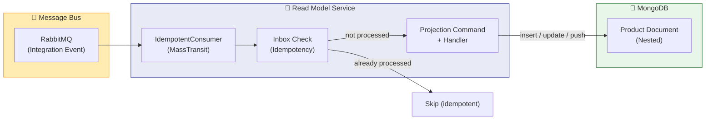
```mermaid
flowchart LR
    subgraph MessageBus["📨 Message Bus"]
        MQ["RabbitMQ<br/>(Integration Event)"]
    end

    subgraph ReadModelService["📖 Read Model Service"]
        CON["IdempotentConsumer<br/>(MassTransit)"]
        INBOX["Inbox Check<br/>(Idempotency)"]
        PCMD["Projection Command<br/>+ Handler"]
    end

    subgraph MongoDb["🍃 MongoDB"]
        DOC["Product Document<br/>(Nested)"]
    end

    MQ --> CON
    CON --> INBOX
    INBOX -->|"not processed"| PCMD
    INBOX -->|"already processed"| SKIP["Skip (idempotent)"]
    PCMD -->|"insert / update / push"| DOC

    style MessageBus fill:#ffecb3,stroke:#ff8f00
    style ReadModelService fill:#e8eaf6,stroke:#283593
    style MongoDb fill:#e8f5e9,stroke:#2e7d32
```

---

## 🛡 Specifications & Invariants

### Specification Map

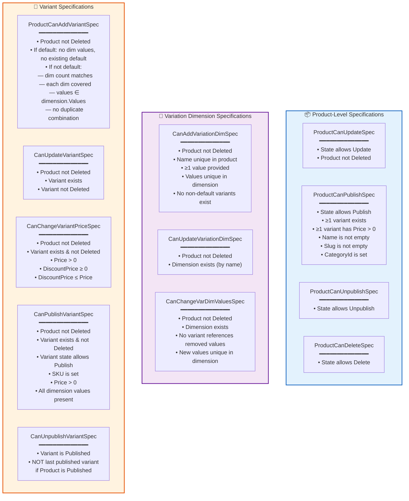
```mermaid
graph TB
    subgraph ProductSpecs["📦 Product-Level Specifications"]
        PS1["ProductCanUpdateSpec<br/>━━━━━━━━━━━━━━<br/>• State allows Update<br/>• Product not Deleted"]
        PS2["ProductCanPublishSpec<br/>━━━━━━━━━━━━━━<br/>• State allows Publish<br/>• ≥1 variant exists<br/>• ≥1 variant has Price > 0<br/>• Name is not empty<br/>• Slug is not empty<br/>• CategoryId is set"]
        PS3["ProductCanUnpublishSpec<br/>━━━━━━━━━━━━━━<br/>• State allows Unpublish"]
        PS4["ProductCanDeleteSpec<br/>━━━━━━━━━━━━━━<br/>• State allows Delete"]
    end

    subgraph DimSpecs["📐 Variation Dimension Specifications"]
        DS1["CanAddVariationDimSpec<br/>━━━━━━━━━━━━━━<br/>• Product not Deleted<br/>• Name unique in product<br/>• ≥1 value provided<br/>• Values unique in dimension<br/>• No non-default variants exist"]
        DS2["CanUpdateVariationDimSpec<br/>━━━━━━━━━━━━━━<br/>• Product not Deleted<br/>• Dimension exists (by name)"]
        DS3["CanChangeVarDimValuesSpec<br/>━━━━━━━━━━━━━━<br/>• Product not Deleted<br/>• Dimension exists<br/>• No variant references removed values<br/>• New values unique in dimension"]
    end

    subgraph VariantSpecs["🏪 Variant Specifications"]
        VS1["ProductCanAddVariantSpec<br/>━━━━━━━━━━━━━━<br/>• Product not Deleted<br/>• If default: no dim values, no existing default<br/>• If not default:<br/>  — dim count matches<br/>  — each dim covered<br/>  — values ∈ dimension.Values<br/>  — no duplicate combination"]
        VS2["CanUpdateVariantSpec<br/>━━━━━━━━━━━━━━<br/>• Product not Deleted<br/>• Variant exists<br/>• Variant not Deleted"]
        VS3["CanChangeVariantPriceSpec<br/>━━━━━━━━━━━━━━<br/>• Product not Deleted<br/>• Variant exists & not Deleted<br/>• Price > 0<br/>• DiscountPrice ≥ 0<br/>• DiscountPrice ≤ Price"]
        VS4["CanPublishVariantSpec<br/>━━━━━━━━━━━━━━<br/>• Product not Deleted<br/>• Variant exists & not Deleted<br/>• Variant state allows Publish<br/>• SKU is set<br/>• Price > 0<br/>• All dimension values present"]
        VS5["CanUnpublishVariantSpec<br/>━━━━━━━━━━━━━━<br/>• Variant is Published<br/>• NOT last published variant<br/>  if Product is Published"]
    end

    style ProductSpecs fill:#e3f2fd,stroke:#1565c0,stroke-width:2px
    style DimSpecs fill:#f3e5f5,stroke:#6a1b9a,stroke-width:2px
    style VariantSpecs fill:#fff3e0,stroke:#e65100,stroke-width:2px
```

### Invariant Enforcement Flow

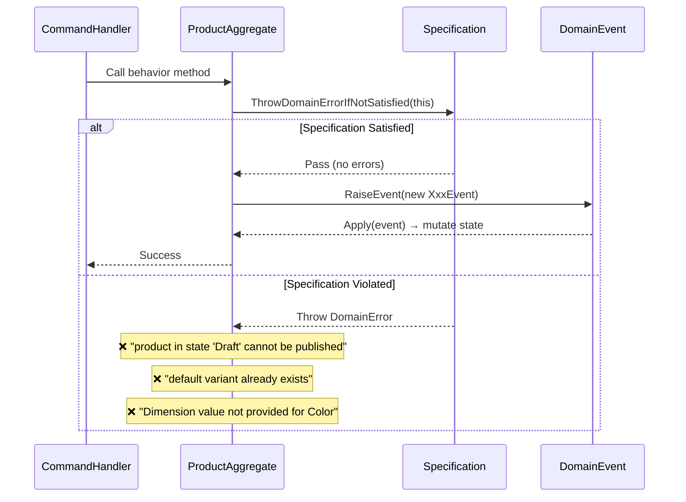
```mermaid
sequenceDiagram
    participant Handler as CommandHandler
    participant Aggregate as ProductAggregate
    participant Spec as Specification
    participant Event as DomainEvent

    Handler->>Aggregate: Call behavior method
    Aggregate->>Spec: ThrowDomainErrorIfNotSatisfied(this)
    
    alt Specification Satisfied
        Spec-->>Aggregate: Pass (no errors)
        Aggregate->>Event: RaiseEvent(new XxxEvent)
        Event-->>Aggregate: Apply(event) → mutate state
        Aggregate-->>Handler: Success
    else Specification Violated
        Spec-->>Aggregate: Throw DomainError
        Note over Aggregate: ❌ "product in state 'Draft' cannot be published"
        Note over Aggregate: ❌ "default variant already exists"
        Note over Aggregate: ❌ "Dimension value not provided for Color"
    end
```

---

## 🍃 MongoDB Read Model

### Document Structure

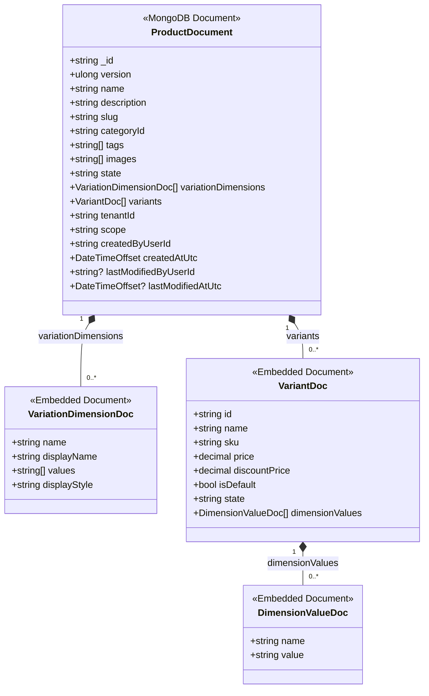
```mermaid
classDiagram
    class ProductDocument {
        <<MongoDB Document>>
        +string _id
        +ulong version
        +string name
        +string description
        +string slug
        +string categoryId
        +string[] tags
        +string[] images
        +string state
        +VariationDimensionDoc[] variationDimensions
        +VariantDoc[] variants
        +string tenantId
        +string scope
        +string createdByUserId
        +DateTimeOffset createdAtUtc
        +string? lastModifiedByUserId
        +DateTimeOffset? lastModifiedAtUtc
    }

    class VariationDimensionDoc {
        <<Embedded Document>>
        +string name
        +string displayName
        +string[] values
        +string displayStyle
    }

    class VariantDoc {
        <<Embedded Document>>
        +string id
        +string name
        +string sku
        +decimal price
        +decimal discountPrice
        +bool isDefault
        +string state
        +DimensionValueDoc[] dimensionValues
    }

    class DimensionValueDoc {
        <<Embedded Document>>
        +string name
        +string value
    }

    ProductDocument "1" *-- "0..*" VariationDimensionDoc : variationDimensions
    ProductDocument "1" *-- "0..*" VariantDoc : variants
    VariantDoc "1" *-- "0..*" DimensionValueDoc : dimensionValues
```

### Example JSON Document

```json
{
  "_id": "3f4a8b2c-e5d6-4a7b-8c9d-0e1f2a3b4c5d",
  "version": 12,
  "name": "Classic Cotton T-Shirt",
  "description": "Premium quality cotton t-shirt for everyday wear.",
  "slug": "classic-cotton-t-shirt",
  "categoryId": "7e8f9a1b-2c3d-4e5f-6a7b-8c9d0e1f2a3b",
  "tags": ["cotton", "casual", "summer"],
  "images": ["img/shirt-front.jpg", "img/shirt-back.jpg"],
  "state": "Published",
  "variationDimensions": [
    {
      "name": "Color",
      "displayName": "Color",
      "values": ["Red", "Blue", "Green"],
      "displayStyle": "Color"
    },
    {
      "name": "Size",
      "displayName": "Size",
      "values": ["S", "M", "L", "XL"],
      "displayStyle": "Text"
    }
  ],
  "variants": [
    {
      "id": "a1b2c3d4-e5f6-7890-abcd-ef1234567890",
      "name": "Red / M",
      "sku": "SHIRT-RED-M",
      "price": 29.99,
      "discountPrice": 0,
      "isDefault": true,
      "state": "Published",
      "dimensionValues": [
        { "name": "Color", "value": "Red" },
        { "name": "Size", "value": "M" }
      ]
    },
    {
      "id": "b2c3d4e5-f6a7-8901-bcde-f12345678901",
      "name": "Blue / L",
      "sku": "SHIRT-BLU-L",
      "price": 31.99,
      "discountPrice": 27.99,
      "isDefault": false,
      "state": "Published",
      "dimensionValues": [
        { "name": "Color", "value": "Blue" },
        { "name": "Size", "value": "L" }
      ]
    }
  ],
  "tenantId": "tenant-abc",
  "scope": "tenant-abc",
  "createdByUserId": "user-123",
  "createdAtUtc": "2026-04-04T10:00:00Z",
  "lastModifiedByUserId": "user-123",
  "lastModifiedAtUtc": "2026-04-04T12:30:00Z"
}
```

### MongoDB Indexes

| Index | Fields | Purpose |
|:------|:-------|:--------|
| **Tenant + State** | `{ tenantId: 1, state: 1 }` | Product listing queries |
| **Tenant + Category** | `{ tenantId: 1, categoryId: 1 }` | Category filter |
| **Tenant + Slug** | `{ tenantId: 1, slug: 1 }` | URL-based product routing |
| **Variant SKU** | `{ tenantId: 1, "variants.sku": 1 }` | SKU lookup |
| **Variant Price** | `{ tenantId: 1, "variants.price": 1 }` | Price range queries |

## 📚 References

| Resource | Description |
|:---------|:------------|
| [Domain-Driven Design](https://www.domainlanguage.com/ddd/) | Eric Evans — Original DDD book |
| [Implementing DDD](https://www.oreilly.com/library/view/implementing-domain-driven-design/9780133039900/) | Vaughn Vernon — Tactical patterns |
| [Event Storming](https://www.eventstorming.com/) | Alberto Brandolini — Discovery technique |
| [CQRS Documents](https://cqrs.files.wordpress.com/2010/11/cqrs_documents.pdf) | Greg Young — CQRS + Event Sourcing |
| [Stateless](https://github.com/dotnet-state-machine/stateless) | .NET state machine library |
