# Finance

> Owns the **payment lifecycle of an order**. On a `MakePayment` command from the Order saga it opens a finance **account**, turns the order total into a **payment schedule** (pay up front or spread over monthly / quarterly / annual payments), and **replies to the saga** so the order can advance.

> Order side of this contract: [Order Service README](../../../Order/src/EShop.Order.API/README.md)
>
> **Scope today:** create account → calculate & schedule payments → reply to the Order saga.
> **Deferred (next ticket):** *booking* — pushing each payment to the tenant's external accounting provider and recording collected payments.

---

## What This Service Does

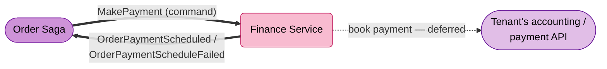

---

## Strategic Design

### Context Classification

| Aspect | Value |
|--------|-------|
| **Bounded Context** | Finance |
| **Domain Type** | Core Domain |
| **Aggregate Roots** | `Account` (with `Payment` child) |
| **Multi-tenancy** | `IScoped` — `Account` and `Payment` carry `TenantId`/`Scope` (EF Core global query filters) |
| **Persistence** | EF Core (PostgreSQL) — state-based (not event-sourced) |
| **Read Model** | None |
| **Architecture Style** | Clean Architecture + Strategy pattern for schedule calculation |

### Bounded Context Map

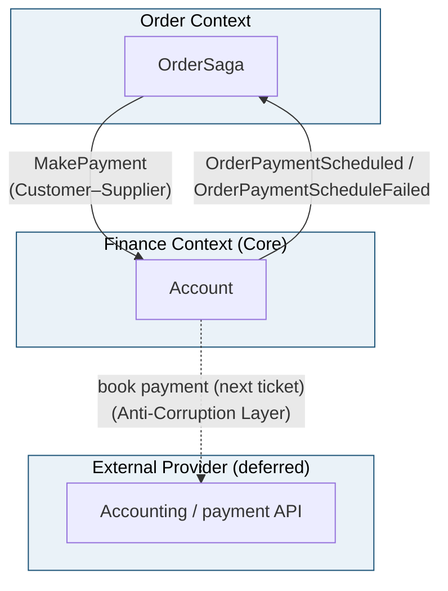

### Ubiquitous Language

| Term | Definition |
|------|------------|
| **Account** | The finance record owning an order's payment lifecycle: total, currency, frequency, status, and its scheduled payments. One per `(TenantId, OrderId)`. |
| **Payment** | One scheduled instalment within an account — amount + due date + status. |
| **Payment schedule** | The set of payments produced from the total and `PaymentFrequency`. |
| **PaymentFrequency** | How the total is split: `OneOff`, `Monthly`, `Quarterly`, `Annually`. |
| **Schedule integrity** | The invariant that the payments sum **exactly** to the account total. |
| **Outstanding amount** | What remains unpaid; reduced as payments are recorded (booking ticket). |
| **Booking** | Pushing a payment to the tenant's external accounting provider — deferred to a later ticket. |

---

## Event Storming

### Participants & Roles

| Role | Contribution | Artifact Ownership |
|------|--------------|--------------------|
| **Product Owner** | Defines the payment frequencies and what "scheduled" means for the order | Ubiquitous Language, Policies |
| **Business Analyst** | Clarifies rounding rules, invalid-total handling, redelivery | Hotspots, edge cases |
| **Solution Architect** | Validates the saga reply contract and the strategy boundary | Aggregate boundaries, Context Map |
| **Developer** | Implements the strategy calculator, the account aggregate, and the consumer | Commands, Events, Specifications |

### Legend

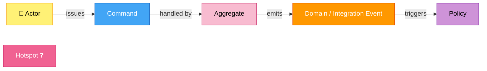

### Actors

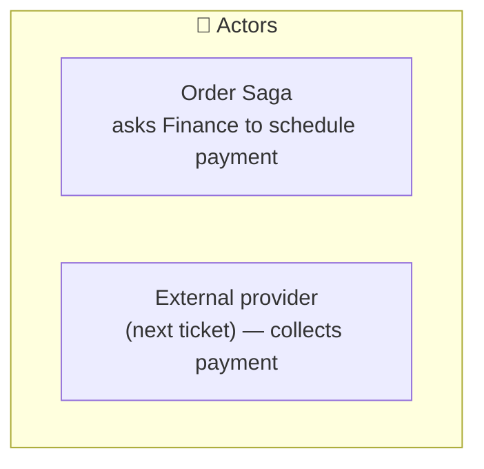

| Actor | Interacts With | Example Scenario |
|-------|----------------|------------------|
| **Order Saga** | `Account` aggregate | *As the saga, I issue `MakePayment` and react to the scheduled/failed reply.* |
| **External provider** | `Account` (deferred) | *As the provider, I confirm collected payments (booking ticket).* |

### Account — Event Flow

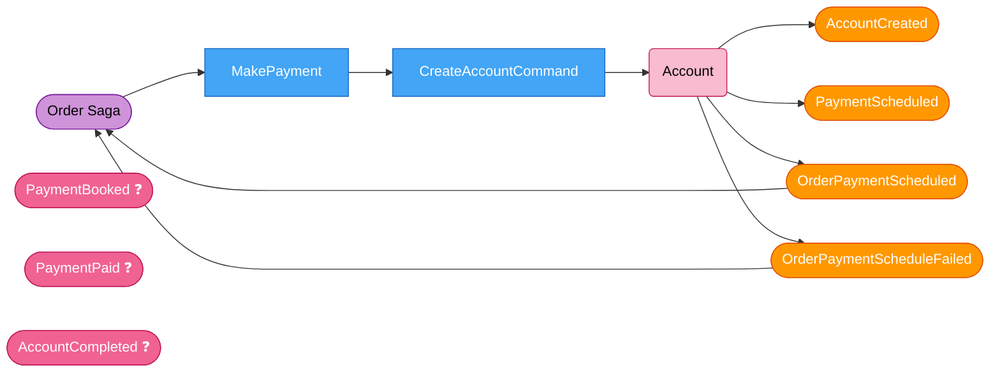

> `PaymentBooked` / `PaymentPaid` / `AccountCompleted` are domain events the aggregate can raise but **no orchestration drives them yet** — they belong to the booking ticket.

### Policies — When / Then Rules

| When this command/event | Then | Rail / Transport |
|-------------------------|------|------------------|
| `MakePayment` | `CreateAccountCommand` → create account + calculate schedule | MassTransit consumer → MediatR |
| Schedule built | publish `OrderPaymentScheduled` | `IEventBus` → RabbitMQ |
| Invalid total / frequency | publish `OrderPaymentScheduleFailed` | `IEventBus` → RabbitMQ |

---

## Core Concept — Payment Schedule (Strategy pattern)

The order total is split into **payments** by `PaymentFrequency` using a **Strategy pattern**: one
[`IPaymentScheduleStrategy`](../EShop.Finance.Domain/Services/PaymentSchedule/IPaymentScheduleStrategy.cs)
per frequency, selected by
[`PaymentScheduleStrategyFactory`](../EShop.Finance.Domain/Services/PaymentSchedule/PaymentScheduleStrategyFactory.cs)
and orchestrated by the
[`PaymentScheduleCalculator`](../EShop.Finance.Domain/Services/PaymentSchedule/PaymentScheduleCalculator.cs)
domain service. Adding a frequency = adding a strategy (Open/Closed); the shared even-split + rounding rule lives once in the base strategy. Pure and fully unit-tested.

| Frequency  | Payments | Interval        |
|------------|----------|-----------------|
| `OneOff`   | 1        | —               |
| `Monthly`  | 12       | +1 month        |
| `Quarterly`| 4        | +3 months       |
| `Annually` | 1        | (one-year term) |

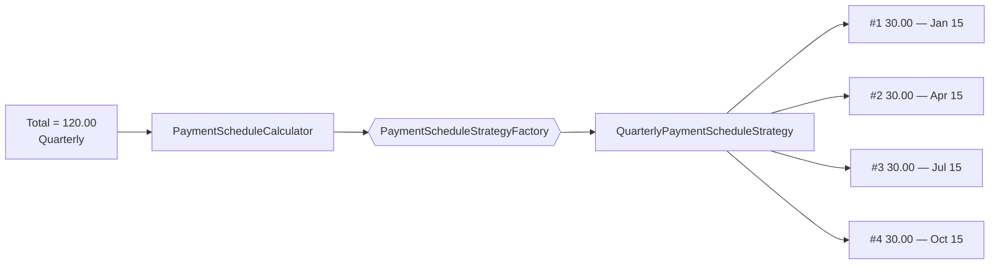

Rules (enforced by tests **and** re-checked by the aggregate):

- Amounts are split **evenly at the currency minor unit**; the rounding remainder lands on the **final** payment, so payments always sum to the total (e.g. `100.00` monthly → 11 × `8.33` + `8.37`).
- The first payment is due on the start date; each subsequent one advances by the frequency interval.
- A zero/negative total or an unsupported frequency is rejected with a `DomainException`.
- `Account.CalculateScheduledPayments` calls `AssertScheduleIntegrity()` — the aggregate verifies the sum itself rather than trusting the calculator.

---

## Domain Model

### Aggregate Structure

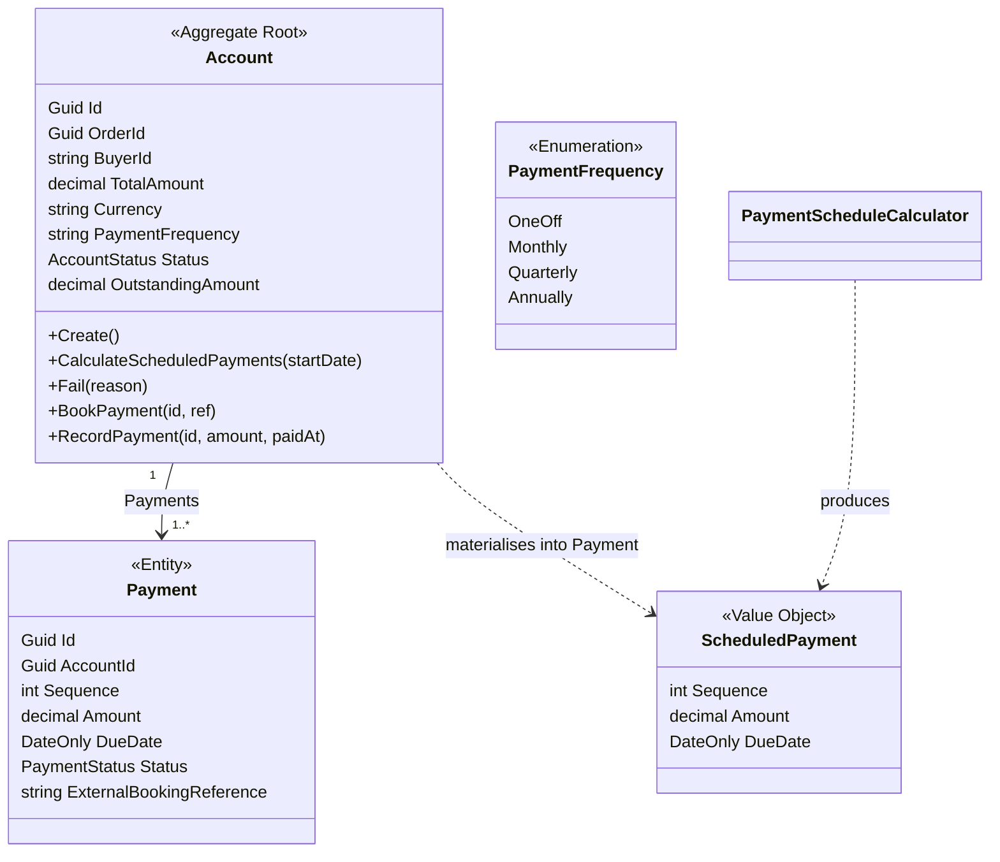

### Building Blocks

| Building Block | Type | Identity | Rationale |
|----------------|------|----------|-----------|
| `Account` | **Aggregate Root** | `Guid Id` (one per `TenantId, OrderId`) | Consistency boundary for an order's payments. |
| `Payment` | **Entity** | `Guid Id` (child of `Account`) | A scheduled instalment; meaningful only inside its account. |
| `ScheduledPayment` | **Value Object** | By attributes | The calculator's pure output `(Sequence, Amount, DueDate)` before it becomes a `Payment`. |
| `PaymentFrequency` / `AccountStatus` / `PaymentStatus` | **Enumeration** | Enum value | Frequency vocabulary and lifecycle states. |
| `IPaymentScheduleStrategy` (+ per-frequency strategies, factory) | **Domain Service** | Stateless | Encapsulates per-frequency split rules; DI-free, Open/Closed. |
| `AccountCreated`, `PaymentScheduled`, `PaymentBooked`, `PaymentPaid`, `AccountCompleted`, `AccountFailed` | **Domain Event** | By attributes | Facts the aggregate raises (the last three are booking-ticket). |

---

## State Machines

Both lifecycles are status-driven (guarded methods on the aggregate/entity), not Stateless machines.

### Account Status

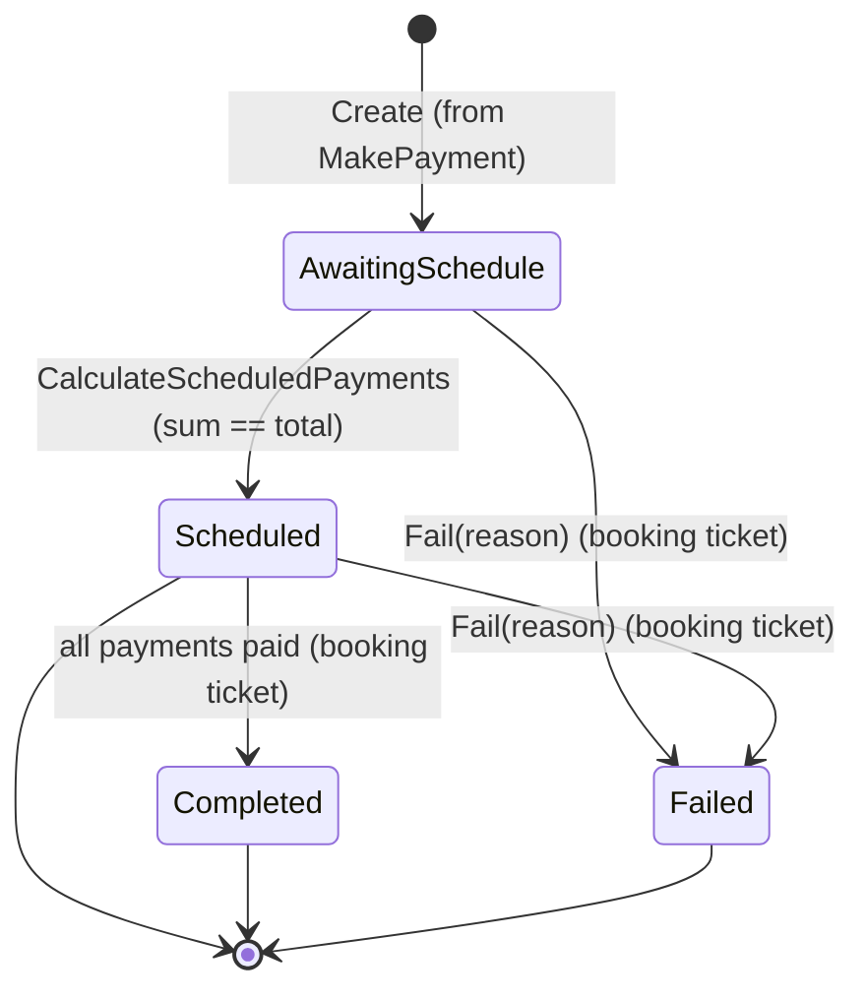

> Today the persisted path is `AwaitingSchedule → Scheduled`. An invalid total/frequency throws **before** the account is saved, so the handler replies `OrderPaymentScheduleFailed` without persisting an account. `Completed` / `Failed` are domain-ready for the booking ticket.

### Payment Status

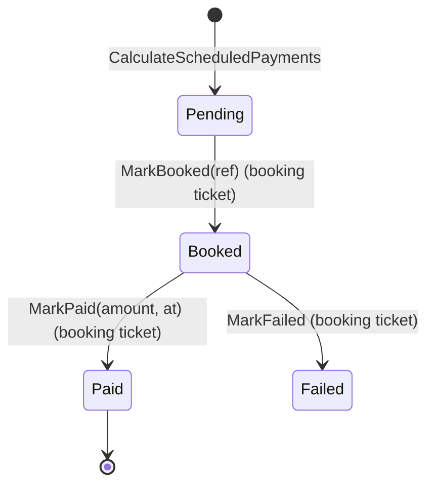

---

## Specifications & Invariants

Finance enforces its invariants inside the aggregate and the pure calculator — there are no separate `Specification` classes.

| Invariant | Mechanism | Guard |
|-----------|-----------|-------|
| Payments sum exactly to the total | `Account.AssertScheduleIntegrity()` | Aggregate |
| Schedule generated once | `Status == AwaitingSchedule` guard in `CalculateScheduledPayments` | Aggregate |
| Total must be positive | `PaymentScheduleCalculator` throws `DomainException` | Domain service |
| Frequency must be supported | `PaymentScheduleStrategyFactory.Resolve` throws `DomainException` | Domain service |
| One account per order | `FindByOrderIdAsync` idempotency check + `UNIQUE(tenant_id, order_id)` | Application + Database |
| Valid payment transitions | `Payment.MarkBooked/MarkPaid` guards (booking ticket) | Entity |

### Invariant Enforcement Flow

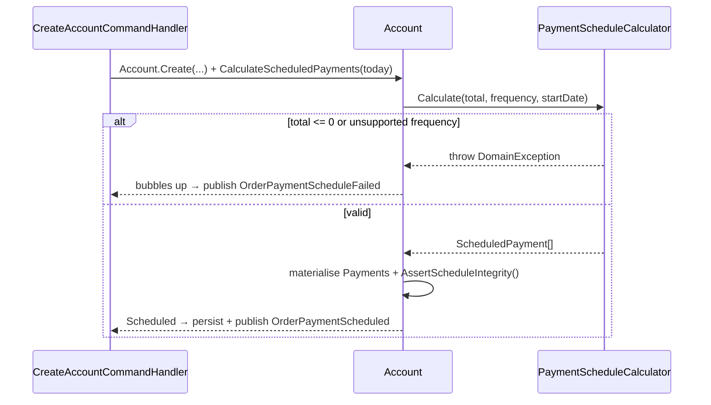

---

## Architecture

### Layer Overview

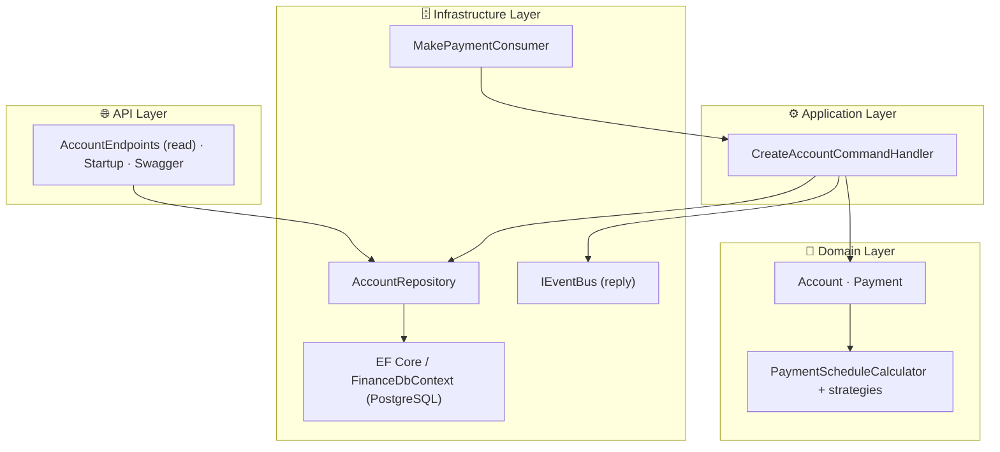

### Happy Path — Schedule Payment

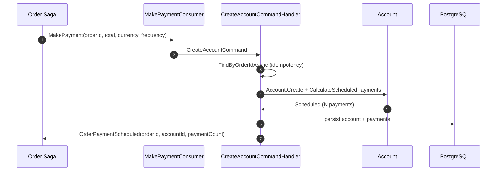

### Compensation — Invalid Schedule

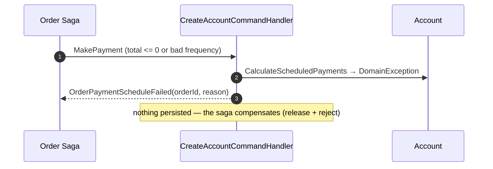

> **Idempotent:** a redelivered `MakePayment` finds the existing account and **re-publishes** `OrderPaymentScheduled` (no duplicate account), so a lost reply still reaches the saga.

---

## Integration Events

| Direction | Contract | Meaning |
|-----------|----------|---------|
| **In** | `Order.Saga.MakePayment` | Open a finance account and schedule payment for the order total. |
| **Out** | `Order.Saga.OrderPaymentScheduled` | Account created + schedule calculated; the saga may advance (`AccountId`, `PaymentCount`). |
| **Out** | `Order.Saga.OrderPaymentScheduleFailed` | Could not schedule (invalid total/frequency); the saga compensates (`Reason`). |

Contracts live in `Shared/src/EShop.Shared.Contracts/Services/Order/Saga/`.

---

## Data Model

| Table | One row per | Key constraint |
|-------|------------|----------------|
| `Accounts` | order × tenant | PK `Id`; `UNIQUE(tenant_id, order_id)` |
| `Payments` | scheduled payment | PK `Id`; FK `AccountId`; `UNIQUE(account_id, sequence)` |
| `InboxMessages` | processed message | Scaffolded — idempotency currently via `FindByOrderIdAsync` + the unique constraint |

Migrations are applied on startup via `DbInitializer`.

---

## API

| Method | Path | Response | Note |
|--------|------|----------|------|
| `POST` | `/api/v1/accounts/{orderId}` | `200 OK` account + payments / `404` | Read endpoint to inspect an account (defined in `AccountEndpoints`). |

> The endpoint is **defined but not yet mapped** into the request pipeline — `Startup.Configure` does not call `MapAccountEndpoints()` yet (see Roadmap G3). Finance is driven primarily by the `MakePayment` consumer, not HTTP.

---

## Configuration

| Key | Source | Purpose |
|-----|--------|---------|
| `ConnectionStrings:financeDatabase` / `DefaultConnection` | Aspire / appsettings | PostgreSQL connection |
| `MasstransitConfiguration` / `rabbitmq` | appsettings | RabbitMQ connection |
| `MessageBusOptions` | appsettings | Consumer retry policy |

Send-topology stamps `OrderId` as the MassTransit `CorrelationId` for `OrderPaymentScheduled` / `OrderPaymentScheduleFailed`.

---

## Tests

`Finance/tests/EShop.Finance.Tests` (xUnit + FluentAssertions + Moq) — 29 tests:

- `PaymentScheduleCalculatorTests` — frequency counts, even split, remainder absorption, due-date advance, invalid inputs.
- `PaymentScheduleStrategyTests` — factory resolves the right strategy per frequency, unknown frequency throws, a strategy builds its schedule independently.
- `AccountTests` — schedule generation, state transitions, completion, payment idempotency (domain, ready for the booking ticket).
- `CreateAccountCommandHandlerTests` — replies `OrderPaymentScheduled` on success, `OrderPaymentScheduleFailed` on invalid total, idempotent re-reply for an existing account.

```bash
dotnet test Finance/tests/EShop.Finance.Tests
```

---

## Roadmap

### Gap Analysis

| # | Gap | Status |
|---|-----|--------|
| G1 | **Booking deferred.** Pushing payments to a tenant's external accounting provider (`GenericHttp` provider), recording collected payments (`PaymentReceived` → `RecordPayment` → `Completed`). The domain `BookPayment`/`RecordPayment` exist and are unit-tested, but no application/infrastructure orchestration drives them. | Open |
| G2 | **`Account.Fail` is never orchestrated.** `AccountStatus.Failed` is reachable only via the domain method; no consumer/handler calls it today. | Open |
| G3 | **Account read endpoint not wired.** `AccountEndpoints.MapAccountEndpoints()` is defined but not called in `Startup.Configure`. | Open |
| G4 | **`InboxMessages` scaffolded but unused.** Idempotency relies on `FindByOrderIdAsync` + `UNIQUE(tenant_id, order_id)`. | Open |
| G5 | Strategy-based schedule calculation + aggregate-owned integrity assertion + saga reply flow. | **Resolved** |

### Suggested Implementation Order

1. Booking ticket — add the `GenericHttp` accounting provider + `BookPayment` orchestration, then `PaymentReceived` → `RecordPayment` → `OrderPaymentCompleted` — closes G1/G2.
2. Map `AccountEndpoints` in `Startup.Configure` (and add list/by-account routes) — closes G3.
3. Adopt the shared inbox for the consumer if at-least-once redelivery becomes a concern — closes G4.

---

## References

| Resource | Description |
|----------|-------------|
| [Order Service README](../../../Order/src/EShop.Order.API/README.md) | The Process Manager that issues `MakePayment` and consumes the reply events |
| [Inventory Service README](../../../Inventory/src/EShop.Inventory.API/README.md) | The other downstream of the saga (reserve / confirm / release) |
| [Domain-Driven Design](https://www.domainlanguage.com/ddd/) | Eric Evans — Original DDD book |
| [Event Storming](https://www.eventstorming.com/) | Alberto Brandolini — Discovery technique |
