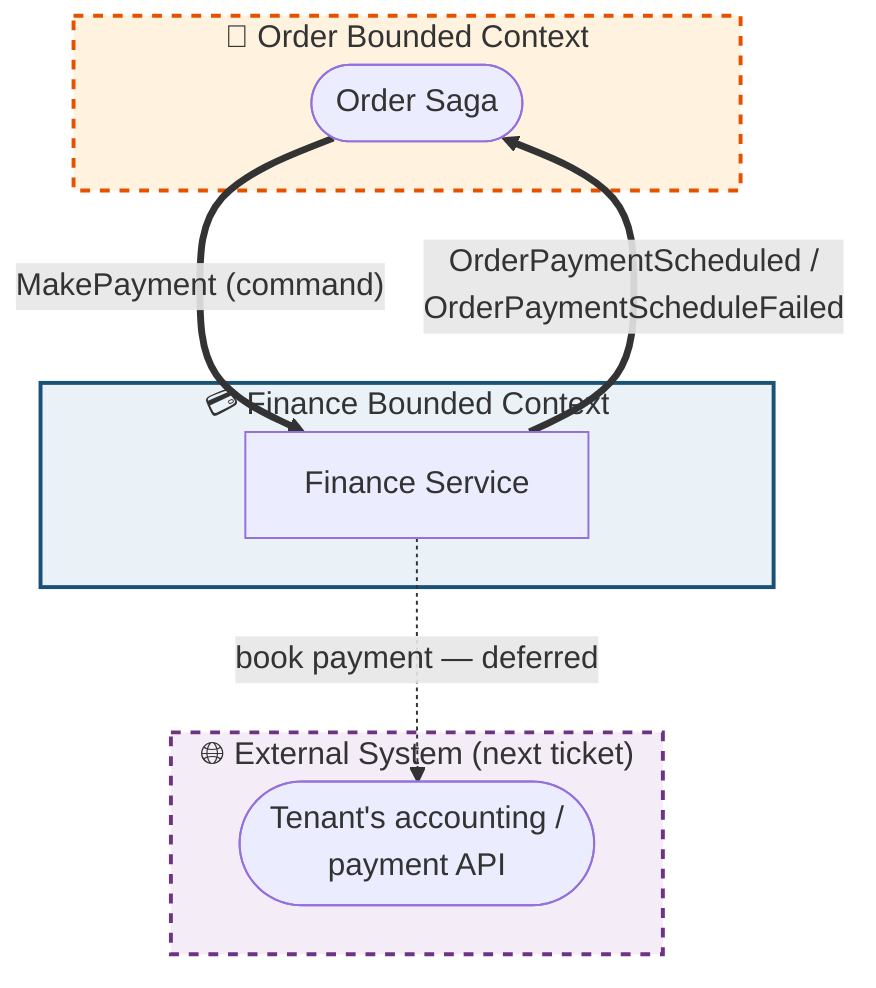
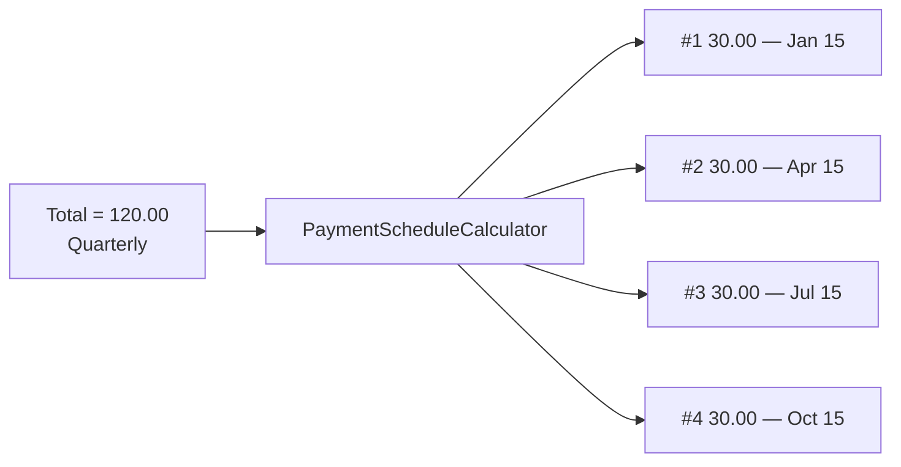
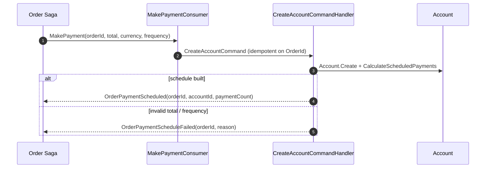
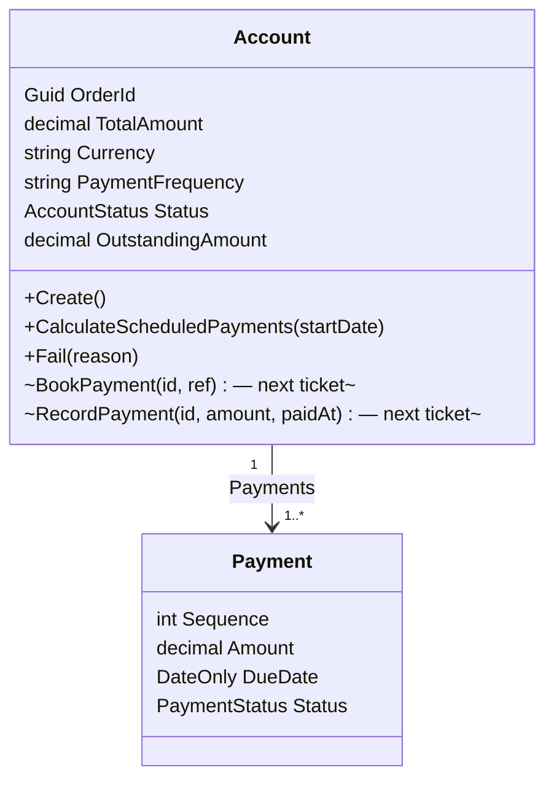

# Finance Service

> Owns the **payment lifecycle of an order**. On a `MakePayment` command from the Order saga it opens a
> finance **account**, turns the order total into a **payment schedule** (pay up front or spread over
> monthly / quarterly / annual payments), and **replies to the saga** so the order can advance.
>
> **Scope of this ticket:** create account → calculate & schedule payments → reply to the Order saga.
> **Deferred (next ticket):** *booking* — pushing each payment to the tenant's external accounting
> provider and recording collected payments.

---

## What This Service Does



---

## Core Concept — Payment Schedule (monthly / quarterly / annual)

The order total is split into **payments** by `PaymentFrequency`, using a **Strategy pattern**: one
[`IPaymentScheduleStrategy`](../EShop.Finance.Domain/Services/PaymentSchedule/IPaymentScheduleStrategy.cs)
per frequency (OneOff / Monthly / Quarterly / Annual), selected by
[`PaymentScheduleStrategyFactory`](../EShop.Finance.Domain/Services/PaymentSchedule/PaymentScheduleStrategyFactory.cs)
and orchestrated by the
[`PaymentScheduleCalculator`](../EShop.Finance.Domain/Services/PaymentSchedule/PaymentScheduleCalculator.cs)
domain service. Adding a frequency = adding a strategy (Open/Closed); the shared even-split + rounding rule
lives once in the base strategy. All pure and fully unit-tested.

| Frequency  | Payments | Interval        |
|------------|----------|-----------------|
| `OneOff`   | 1        | —               |
| `Monthly`  | 12       | +1 month        |
| `Quarterly`| 4        | +3 months       |
| `Annually` | 1        | (one-year term) |

Rules (enforced by tests):

- Amounts are split **evenly at the currency minor unit**; any rounding remainder is absorbed by the **final** payment, so payments always sum to the total exactly (e.g. `100.00` monthly → 11 × `8.33` + `8.37`).
- The first payment is due on the schedule start date; each subsequent one advances by the frequency interval.
- A zero/negative total or an unsupported frequency is rejected with a `DomainException`.
- The aggregate re-checks the invariant itself via `AssertScheduleIntegrity()` (payments must sum to the total).



---

## Reply flow to the Order saga

Finance is the payment side of the Order **process manager**, mirroring how Inventory answers
`MakeReservation` with `InventoryReserved` / `InventoryReservationFailed`.



- The handler publishes the reply (success or failure) — the consumer stays thin (just maps the command).
- **Idempotent**: a redelivered `MakePayment` finds the existing account and **re-publishes**
  `OrderPaymentScheduled` (no duplicate account), so a lost reply still reaches the saga.
- The Order saga consumes these replies: `OrderPaymentScheduled` → accept order + confirm reservation
  (`ProcessingPayment → Completed`); `OrderPaymentScheduleFailed` → reject order + release reservation
  (`ProcessingPayment → Failed`). See `OrderPaymentScheduledConsumer` / `OrderPaymentScheduleFailedConsumer`.

---

## Domain Model



| | `Account` | `Payment` |
|-|-----------|-----------|
| One per | order × tenant | scheduled payment |
| Key constraint | `UNIQUE(tenant_id, order_id)` | `UNIQUE(account_id, sequence)` |
| Lifecycle (this ticket) | `AwaitingSchedule → Scheduled` (`→ Failed`) | `Pending` |
| Lifecycle (next ticket) | `→ Completed` | `Pending → Booked → Paid` |

> The `Account` aggregate already carries the booking/payment behaviours (`BookPayment`, `RecordPayment`)
> and is unit-tested, but no application/infrastructure orchestration drives them yet — that is the
> booking ticket.

---

## Integration Events

| Direction | Contract | Meaning |
|-----------|----------|---------|
| In  | `Order.Saga.MakePayment` | Saga command — open a finance account + schedule for the order |
| Out | `Order.Saga.OrderPaymentScheduled` | Account created + schedule calculated; saga may advance |
| Out | `Order.Saga.OrderPaymentScheduleFailed` | Could not schedule (invalid total/frequency); saga compensates |

Contracts live in `Shared/src/EShop.Shared.Contracts/Services/Order/Saga/`.

---

## Tables

| Table | One row per |
|-------|-------------|
| `Accounts` | order × tenant — `UNIQUE(tenant_id, order_id)` |
| `Payments` | scheduled payment — `UNIQUE(account_id, sequence)` |
| `InboxMessages` | processed message (dedup) |

---

## Local Configuration

- `ConnectionStrings:financeDatabase` (Aspire) or `ConnectionStrings:DefaultConnection` — PostgreSQL.
- `MasstransitConfiguration` / `rabbitmq` connection — RabbitMQ (same convention as the other services).

Migrations are applied on startup.

---

## Tests

`Finance/tests/EShop.Finance.Tests` (xUnit + FluentAssertions + Moq) — 29 tests:

- `PaymentScheduleCalculatorTests` — frequency counts, even split, remainder absorption, due-date advance, invalid inputs.
- `PaymentScheduleStrategyTests` — factory resolves the right strategy per frequency, unknown frequency throws, a strategy builds its schedule independently.
- `AccountTests` — schedule generation, state transitions, completion, payment idempotency (domain, ready for the booking ticket).
- `CreateAccountCommandHandlerTests` — replies `OrderPaymentScheduled` on success, `OrderPaymentScheduleFailed` on invalid total, idempotent re-reply for an existing account.

```bash
dotnet test Finance/tests/EShop.Finance.Tests
```
