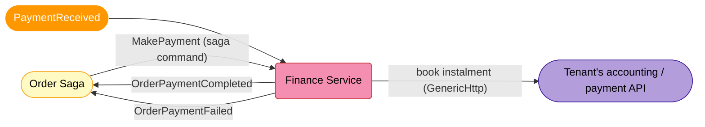
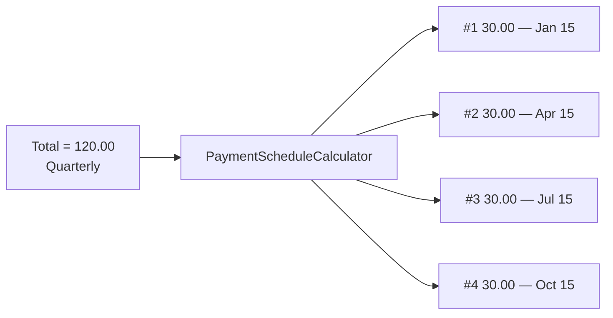
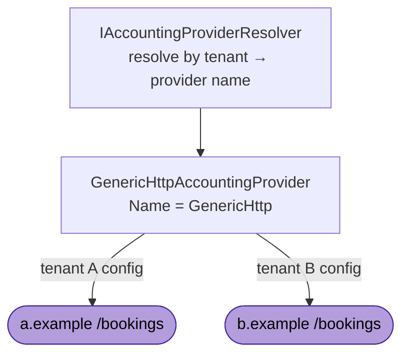
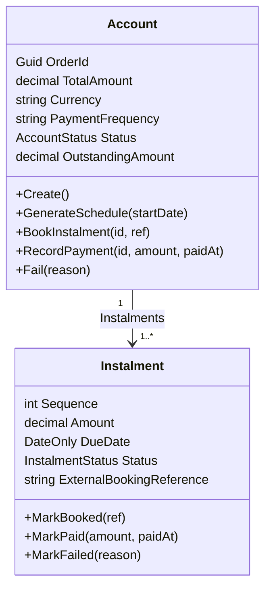

# Finance Service

> Owns the **payment lifecycle of an order**. Turns an order total into a payment schedule (pay up front or spread over monthly / quarterly / annual instalments), books each instalment to the tenant's external accounting provider, records payments, and tells the Order saga when the order is paid or has failed.

---

## What This Service Does



---

## Core Concept 1 — Payment Schedule (monthly / quarterly / annual)

An order total is split into **instalments** by `PaymentFrequency`, using a **Strategy pattern**: one
[`IPaymentScheduleStrategy`](../EShop.Finance.Domain/Services/PaymentSchedule/IPaymentScheduleStrategy.cs)
per frequency (OneOff / Monthly / Quarterly / Annual), selected by
[`PaymentScheduleStrategyFactory`](../EShop.Finance.Domain/Services/PaymentSchedule/PaymentScheduleStrategyFactory.cs)
and orchestrated by the
[`PaymentScheduleCalculator`](../EShop.Finance.Domain/Services/PaymentSchedule/PaymentScheduleCalculator.cs)
domain service. Adding a frequency = adding a strategy (Open/Closed); the shared even-split + rounding rule
lives once in the base strategy. All pure and fully unit-tested.

| Frequency  | Instalments | Interval        |
|------------|-------------|-----------------|
| `OneOff`   | 1           | —               |
| `Monthly`  | 12          | +1 month        |
| `Quarterly`| 4           | +3 months       |
| `Annually` | 1           | (one-year term) |

Rules (enforced by tests):

- Amounts are split **evenly at the currency minor unit**; any rounding remainder is absorbed by the **final** instalment, so instalments always sum to the total exactly (e.g. `100.00` monthly → 11 × `8.33` + `8.37`).
- The first instalment is due on the schedule start date; each subsequent one advances by the frequency interval.
- A zero/negative total or an unsupported frequency is rejected with a `DomainException`.



---

## Core Concept 2 — Generic HTTP accounting provider (per-tenant third-party integration)

Each tenant books instalments against a **different** third-party accounting/payment API. Rather than
writing code per provider, the service ships a single configurable
[`GenericHttpAccountingProvider`](../EShop.Finance.Infrastructure/IntegrationProvider/GenericHttp/GenericHttpAccountingProvider.cs)
behind the [`IAccountingIntegrationProvider`](../EShop.Finance.Application/Services/IntegrationProvider/IAccountingIntegrationProvider.cs)
abstraction. New third-parties are onboarded by **configuration only**.



Per-tenant configuration (section `GenericHttpProvider`):

```jsonc
{
  "GenericHttpProvider": {
    "DefaultProviderName": "GenericHttp",
    "Tenants": {
      "tenant-a": {
        "ProviderName": "GenericHttp",
        "BaseUrl": "https://a.example",
        "BookingPath": "/bookings",
        "AuthenticationType": "BearerToken",      // None | BasicAuthentication | BearerToken
        "BearerToken": "<from-secret>",
        "RequestTemplate": "{\"reference\":\"{{idempotencyKey}}\",\"orderId\":\"{{orderId}}\",\"amount\":{{amount}},\"currency\":\"{{currency}}\",\"dueDate\":\"{{dueDate}}\"}",
        "ResponseReferenceField": "bookingReference"
      }
    }
  }
}
```

Guarantees (enforced by tests):

- **Retry-safe**: every booking sends a deterministic `Idempotency-Key` header derived from `(TenantId, AccountId, InstalmentId)`, so retries/redeliveries never double-book.
- **Per-tenant routing**: tenant A's instalment hits A's endpoint, tenant B's hits B's.
- **Fail fast**: a tenant with no configuration (or a provider name with no implementation) fails with a clear error instead of calling an undefined endpoint.
- **Templated request/response**: a fixed placeholder allow-list (`amount`, `currency`, `dueDate`, `idempotencyKey`, `orderId`, `accountId`, `instalmentId`, `sequence`); the external reference is read from a configured response field.

> Onboard a new provider with bespoke logic by registering another `IAccountingIntegrationProvider`
> implementation and pointing the tenant's `ProviderName` at it — no caller changes.

---

## Domain Model



| | `Account` | `Instalment` |
|-|-----------|--------------|
| One per | order × tenant | scheduled payment |
| Key constraint | `UNIQUE(tenant_id, order_id)` | `UNIQUE(account_id, sequence)` |
| Lifecycle | `AwaitingSchedule → Scheduled → Completed / Failed` | `Pending → Booked → Paid / Failed` |

---

## End-to-End Flow

```mermaid
sequenceDiagram
    autonumber
    participant ORD as Order Saga
    participant C1 as MakePaymentConsumer
    participant ACC as Account
    participant PROV as GenericHttp Provider
    participant C2 as PaymentReceivedConsumer

    ORD->>C1: MakePayment(total, currency, frequency)
    C1->>ACC: CreateFinanceAccountCommand (idempotent on OrderId)
    ACC->>ACC: GenerateSchedule → instalments
    C1->>PROV: BookInstalmentsCommand → book each (Idempotency-Key)
    PROV-->>ACC: external reference → Instalment Booked

    C2->>ACC: PaymentReceived → RecordInstalmentPaymentCommand
    ACC->>ACC: Instalment Paid; outstanding -= amount
    alt all instalments paid
        ACC-->>ORD: OrderPaymentCompleted
    else terminal failure
        ACC-->>ORD: OrderPaymentFailed
    end
```

Idempotency:

- **Inbound** — `CreateFinanceAccountCommand` no-ops when an account already exists for the order (`UNIQUE(tenant_id, order_id)`); redelivered payments for an already-paid instalment are no-ops.
- **Outbound** — deterministic `Idempotency-Key` per instalment (see Concept 2).

---

## Integration Events

| Direction | Contract | Meaning |
|-----------|----------|---------|
| In  | `Order.Saga.MakePayment` | Saga command — open a finance account + schedule for the order |
| In  | `Finance.PaymentReceived` | A specific instalment was paid |
| Out | `Finance.OrderPaymentCompleted` | All instalments paid — Order saga may confirm the reservation |
| Out | `Finance.OrderPaymentFailed` | Payment failed terminally — Order saga should release the reservation |

Contracts live in `Shared/src/EShop.Shared.Contracts/Services/{Order,Finance}/`.

---

## Tables

| Table | One row per |
|-------|-------------|
| `Accounts` | order × tenant — `UNIQUE(tenant_id, order_id)` |
| `Instalments` | instalment — `UNIQUE(account_id, sequence)` |
| `InboxMessages` | processed message (dedup) |

---

## Local Configuration

- `ConnectionStrings:financeDatabase` (Aspire) or `ConnectionStrings:DefaultConnection` — PostgreSQL.
- `MasstransitConfiguration` / `rabbitmq` connection — RabbitMQ (same convention as the other services).
- `GenericHttpProvider` — per-tenant provider config (above). Secrets injected via environment, never committed.

Migrations are applied on startup (`Database.MigrateAsync`).

---

## Tests

`Finance/tests/EShop.Finance.Tests` (xUnit + FluentAssertions) — 32 tests:

- `PaymentScheduleCalculatorTests` — frequency counts, even split, remainder absorption, due-date advance, invalid inputs.
- `PaymentScheduleStrategyTests` — factory resolves the right strategy per frequency, unknown frequency throws, a strategy builds its schedule independently.
- `AccountTests` — schedule generation, state transitions, completion, booking/payment idempotency.
- `GenericHttpAccountingProviderTests` — deterministic idempotency key, per-tenant endpoints, auth header, missing-config fail-fast, provider-error handling.

```bash
dotnet test Finance/tests/EShop.Finance.Tests
```
