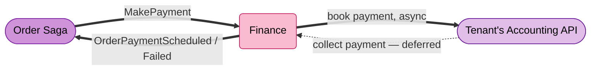
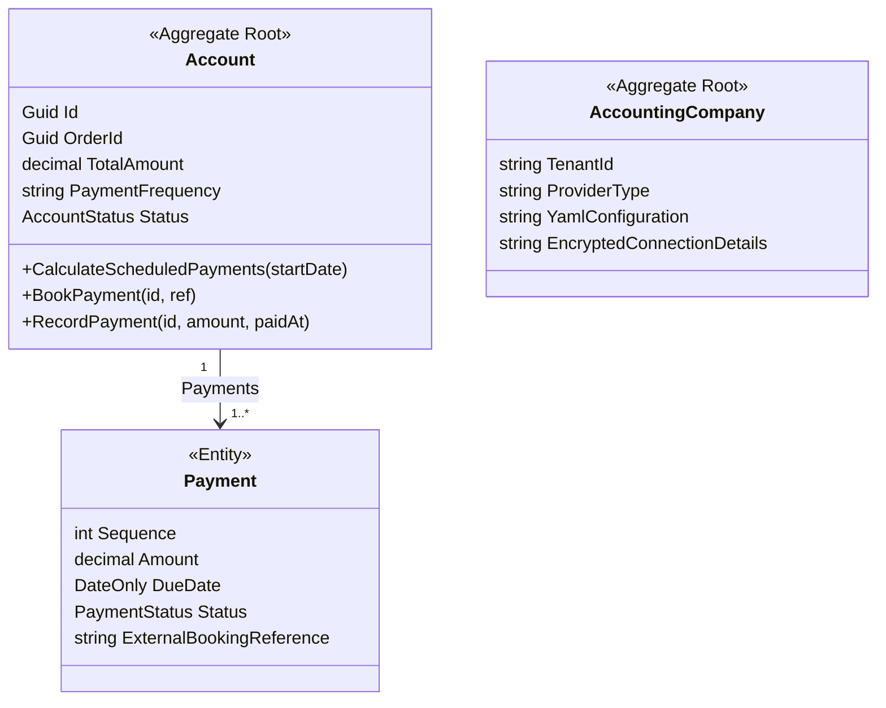
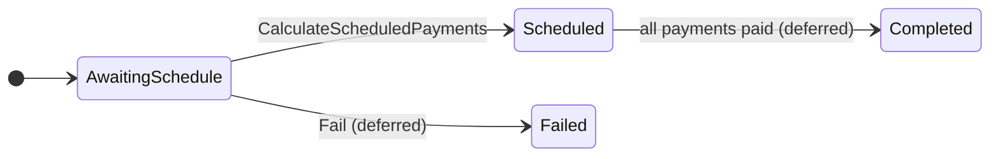
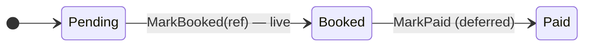
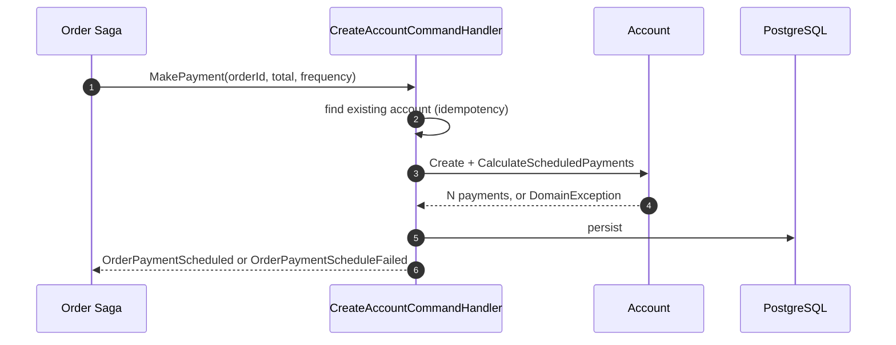
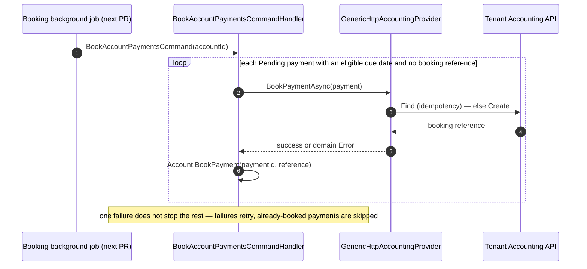
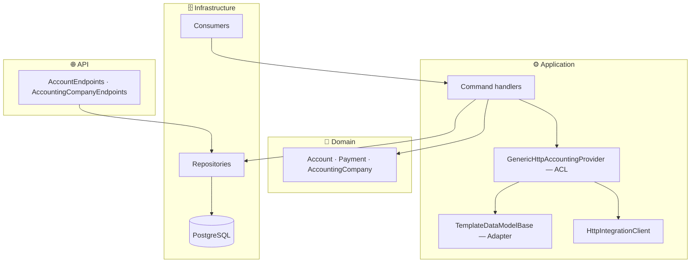

# Finance

Owns the **payment lifecycle of an order**: schedules payments, replies to the Order saga, and books each payment into the tenant's own external accounting system.



| | |
|---|---|
| **Done today** | schedule payments → reply to saga → book each payment to the tenant's provider (idempotent) |
| **Deferred** | *collection* — recording a customer's payment against a booked instalment |
| **Order side of this contract** | [Order Service README](../../../Order/src/EShop.Order.API/README.md) |

---

## Domain Model



| Type | What it owns |
|---|---|
| `Account` | One order's payments. One per `(TenantId, OrderId)`. |
| `Payment` | One instalment: amount, due date, status, external booking reference. |
| `AccountingCompany` | One tenant's provider registration: type, YAML behaviour, encrypted credentials. One per tenant, created on `TenantCreated`. |

### Lifecycles





Only `AwaitingSchedule → Scheduled` and `Pending → Booked` are wired up today; the rest are domain-ready but not yet orchestrated.

---

## Two Flows

### 1. Schedule a payment (reply to the Order saga)



Payments are split by `PaymentFrequency` (`OneOff` / `Monthly` / `Quarterly` / `Annually`) — one **Strategy** per frequency (`IPaymentScheduleStrategy`), so adding a frequency means adding a strategy, not touching the calculator. Rounding remainder lands on the final payment; the aggregate re-checks the sum itself (`AssertScheduleIntegrity`) rather than trusting the calculator.

### 2. Book each payment to the tenant's provider



> **Trigger is not wired up yet.** `BookAccountPaymentsCommandHandler` exists and is tested, but nothing currently dispatches `BookAccountPaymentsCommand` — a background job that selects pending payments by eligible due date is planned for a follow-up PR (see Roadmap G9).

Booking is where each tenant's own accounting system gets involved — see below.

---

## Accounting Provider Integration

Each tenant books into its **own** accounting system, with no code shipped per tenant: a provider type + a YAML behaviour script + connection details (encrypted, in Postgres — never Redis, never in the YAML) is all that's needed.

**The adapter makes the integration work. The ACL keeps the domain clean.**

- **Anti-Corruption Layer** — `IAccountingIntegrationProvider` (`GenericHttpAccountingProvider`). A domain payment goes in, a domain result comes out. No provider status codes or field names ever reach the rest of Finance.
- **Adapter** — `TemplateDataModelBase`. Reshapes one domain object into the flat key/value map a YAML template expects. Mark a property `[TemplateData]` and it appears in the template; `[SensitiveData]` flags it for redaction. Nested objects, dictionaries, and dates are handled automatically — see `TemplateDataModelBaseTests`.

Only one bookable model exists today (a payment). Adding a second means one new class with a few `[TemplateData]` properties — the HTTP client, auth stack, and provider transport code don't change.

**YAML shape** — `triggers → actions → requests`, each request a Handlebars template:

```yaml
triggers:
  - name: BookPayment
    actions:
      - { name: Find,   request: FindInvoice }
      - { name: Create, request: CreateInvoice }
requests:
  - name: CreateInvoice
    urlTemplate: "{{{baseUrl}}}/invoices"
    method: POST
    requestTemplate: '{ "amount": {{{amount}}}, "currency": "{{{currency}}}" }'
    responseTemplate: '{ "bookingId": "{{{id}}}" }'
```

Authentication is chosen by the connection details' `Scheme`: `OAuth` (token cached per tenant, encrypted, reused until ~3 min before expiry), `Basic`, or `NoAuth`. `HttpIntegrationClient` injects `baseUrl` centrally — no template needs to know it.

---

## Architecture



---

## Reference

### Integration Events

| Direction | Contract | Meaning |
|---|---|---|
| In | `Order.Saga.MakePayment` | Schedule payment for an order. |
| In | `Tenancy.Tenants.TenantCreated` | Provision the tenant's default `AccountingCompany`. |
| Out | `Order.Saga.OrderPaymentScheduled` / `Failed` | Saga reply. |
| Out | `Finance.PaymentBookingFailed` | One payment failed to book; retry-eligible. |

### Data Model

| Table | Notes |
|---|---|
| `Accounts` | `UNIQUE(tenant_id, order_id)` |
| `Payments` | FK `AccountId`; `UNIQUE(account_id, sequence)` |
| `AccountingCompanies` | `UNIQUE(tenant_id)`; connection details encrypted |
| `IntegrationProviderSessions` | Cached OAuth token per tenant, encrypted |

> `AccountingCompanies` / `IntegrationProviderSessions` migration is **manual** — not yet generated (see Roadmap).

### API

| Method | Path | Note |
|---|---|---|
| `POST` | `/api/v1/accounts/{orderId}` | Read an account + its payments. |
| `GET` | `/api/v1/accounting-company/tenantId` | ⚠️ route is a literal segment, not `{tenantId}` — Roadmap G6. |
| `PUT` | `/api/v1/accounting-company` | Configure provider type + YAML. |
| `PUT` | `/api/v1/accounting-company/credentials` | Save encrypted connection details. |
| `POST` | `/api/v1/accounting-company/test-connection` | Validate credentials without booking. |

### Configuration

| Key | Purpose |
|---|---|
| `ConnectionStrings:financeDatabase` | PostgreSQL |
| `MasstransitConfiguration` / `rabbitmq` | RabbitMQ |
| `Encryption:Key` | Base64 AES-256 key — encrypts connection details + OAuth tokens at rest. Never Redis. |

### Tests

`Finance/tests/EShop.Finance.Tests` (xUnit + FluentAssertions + Moq) — 49 tests:

```bash
dotnet test Finance/tests/EShop.Finance.Tests
```

| Folder | Covers |
|---|---|
| `Domain/` | Payment schedule calculation, account/payment state transitions. |
| `Integrations/Authentication/` | Auth scheme selection, OAuth token reuse/refresh, AES round-trip. |
| `Integrations/YamlConfigurations/` | YAML parsing, Handlebars rendering. |
| `Integrations/` (root) | `HttpIntegrationClient` response shaping, `GenericHttpAccountingProvider` find-then-create. |
| `Integrations/TemplateData/` | The `TemplateDataModelBase` reflection engine itself. |

---

## Roadmap

- **G1** Collection side deferred — `PaymentReceived` → `RecordPayment` → `Completed`.
- **G2** `Account.Fail` is never orchestrated by any consumer.
- **G4** `InboxMessages` scaffolded but unused; idempotency currently via unique constraints.
- **G6** `GET /api/v1/accounting-company` route bug — literal `tenantId` segment, not `{tenantId}`.
- **G7** `AccountingCompanies` / `IntegrationProviderSessions` migration not yet generated.
- **G8** No end-to-end BDD coverage for booking (unit-level only; no Reqnroll/TestServer host).
- **G9** Booking has no trigger — `BookAccountPaymentsCommandHandler` is implemented and tested, but nothing dispatches it yet. A background job selecting pending payments by eligible due date is planned for the next PR.

---

## References

| Resource | Description |
|---|---|
| [Order Service README](../../../Order/src/EShop.Order.API/README.md) | Issues `MakePayment`, consumes the reply |
| [Inventory Service README](../../../Inventory/src/EShop.Inventory.API/README.md) | The saga's other downstream |
| OpenSpec change `finance-generic-http-accounting-provider` | Design rationale for the provider integration |
