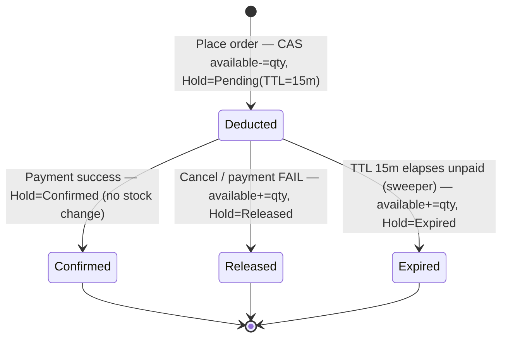
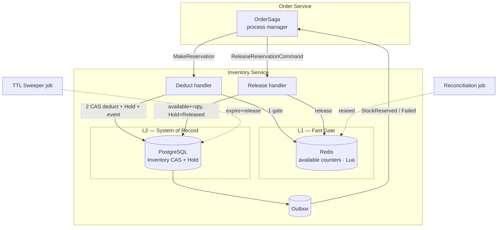
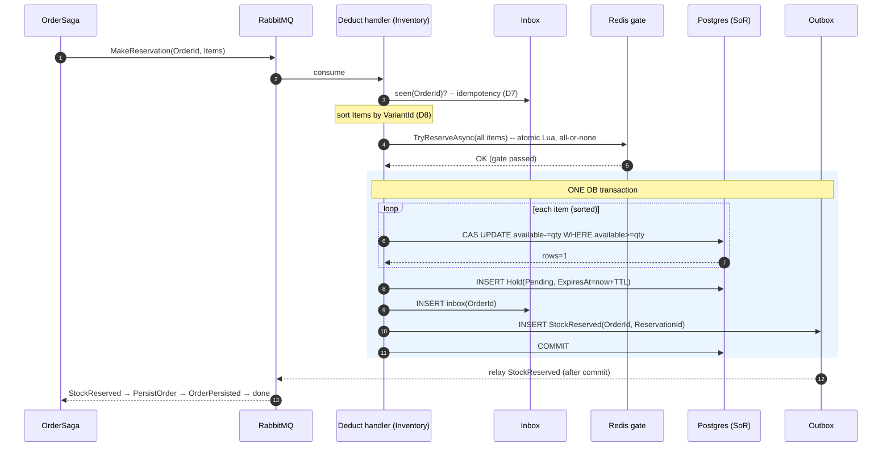
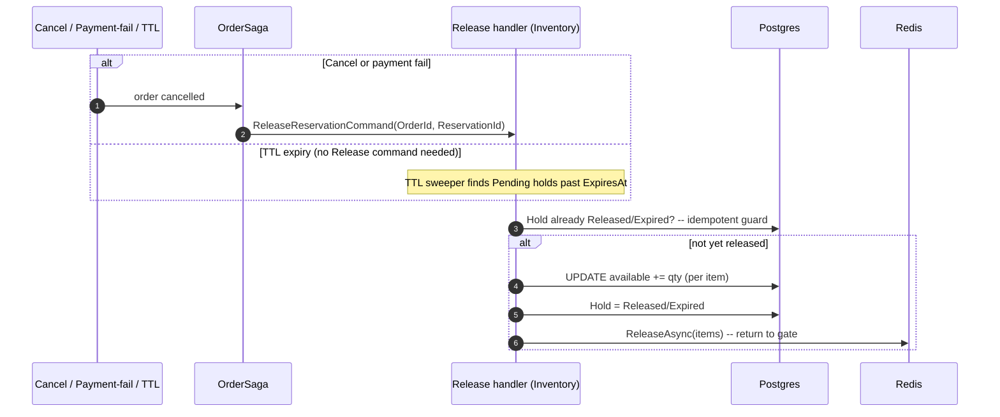

# Stock Deduction — Solution Architecture (Deduct-on-Order)

> Audience: Inventory & Order squad.
> Status: **Design locked for implementation.** Timing model confirmed = **Deduct-on-Order**.
> **Source of truth:** [`stock-deduction-solution-specification.md`](./stock-deduction-solution-specification.md) — final decisions, data model, contracts, readiness gate. This document is the architecture *rationale* behind it.
> Companions: [`stock-deduction-industry-research.md`](./stock-deduction-industry-research.md) (research behind the choice) · [`stock-deduction-architecture.md`](./stock-deduction-architecture.md) (earlier reserve-then-confirm exploration, retained for reference).
> Branch: `technical/eshop-2006-improve-stock-deduction`.

---

## 1. Decision Log (locked)

| # | Decision | Choice | Rationale |
|---|----------|--------|-----------|
| D1 | **When to deduct** | **Deduct-on-order** — `StockAvailable` decremented at order placement | No oversell even with a slow payment step; fair "first-to-order-wins"; fits flash-sale traffic. |
| D2 | DB concurrency primitive | **Atomic conditional UPDATE (CAS)** `… WHERE stock_available >= qty` | Prevents oversell across **different** concurrent orders. **Does NOT provide idempotency** for the *same* order — that is D7's job. See [§14](#14-deep-dive-cas-≠-idempotency). |
| D3 | Front gate | **Redis atomic Lua — in scope from Phase 1** (rebuildable cache, not source of truth) | Sheds stampede in <1ms; protects Postgres. **Confirmed: gate + CAS together from the start.** |
| D4 | Source of truth | **PostgreSQL** | Durable; CAS binds the decision. |
| D5 | Releasability (mandatory for D1) | **Hold record + TTL sweeper + `ReleaseReservationCommand`** | Deduct-on-order locks real stock; unpaid/abandoned/cancelled orders MUST return it or inventory bleeds. |
| D6 | Messaging durability | **Transactional Outbox** | "DB deducted but event lost" must be impossible. |
| D7 | Consumer idempotency | **Inbox** dedupe keyed by OrderId **+ unique constraint on Hold(OrderId)** | At-least-once delivery must not double-deduct. Orthogonal to D2 (CAS). See [§14](#14-deep-dive-cas-≠-idempotency). |
| D8 | Multi-item order | **All-or-nothing + deterministic lock order (sort by VariantId)** | Atomic order semantics; deadlock-free. |
| D9 | **Payment finality** | **Payment step exists** — order is *provisional* until paid | Hold stays `Pending` until payment; `Confirmed` on success; release on cancel / payment-fail / TTL. |
| D10 | **Release TTL** | **15 minutes** | Standard e-commerce grace window; frees hot stock promptly. |

> **Consequence of D1 (read twice):** in deduct-on-order, the act we call "reserve" **is the real deduction** of `StockAvailable`. There is no second payment-time deduction. Stock only comes back via an explicit **release** (cancel / payment-fail / TTL expiry). The **release path is therefore not optional** — it is a first-class part of the design.

---

## 2. Stock Model (Deduct-on-Order)

```
StockAvailable  = units still sellable
Committed (opt) = units deducted for placed-but-unfulfilled orders   (reporting/audit)
OnHand (physical) decremented at fulfilment/ship time, outside this flow
```

- At **order placement**: `StockAvailable -= qty` via CAS. Units are now **gone from the sellable pool**.
- A **Hold record** (the existing `Reservation` aggregate) tracks the deduction so it can be released/audited: `Pending → Confirmed | Released | Expired`, with `ExpiresAt`.
- Optional `Committed` counter (or derived from holds) for "sold but not yet shipped" visibility.

### Lifecycle



> **Payment-gated (D9):** the order is **provisional** while the hold is `Pending`. Stock is already deducted at placement, but the hold is only **`Confirmed` when payment succeeds** — at which point the TTL sweeper stops watching it. If payment fails, is cancelled, or the **15-minute TTL** elapses with no payment, stock is **released** back to `available`.
>
> **Confirmed does NOT re-touch `StockAvailable`** (already deducted at placement) — it only flips the hold to terminal-success. This is the defining difference from reserve-then-confirm.

---

## 3. Layered Architecture



| Layer | Role | Authority |
|-------|------|-----------|
| Redis gate | absorb spike, fast-reject sold-out | ❌ derived cache |
| PostgreSQL | CAS deduction + durable hold | ✅ source of truth |
| Outbox | durable event publish post-commit | — |
| TTL sweeper / Reconciliation | release expired holds; heal cache drift | — |

**Principle:** *Redis decides fast, Postgres decides correctly.*

---

## 4. Concurrency Mechanism — Atomic Conditional Update (CAS)

Core of D2; replaces any optimistic-lock-with-retry on the order path.

```sql
-- Deduct-on-order: single atomic, race-free statement
UPDATE inventory
SET    stock_available      = stock_available - @qty,
       last_modified_at_utc = now()
WHERE  variant_id = @variantId
  AND  tenant_id  = @tenantId
  AND  stock_available >= @qty;     -- the guard = the no-oversell invariant
```

- **rows affected = 1** → deducted for this item.
- **rows affected = 0** → insufficient stock → fail the whole order (all-or-nothing).

Why CAS over optimistic-retry:
- The predicate *is* the invariant; the DB applies it atomically, so two concurrent transactions can never both pass it for the last unit.
- No application read → **no lost-update window, no version, no retry loop**.
- Row lock held for microseconds → a hot SKU **queues briefly** instead of entering retry collapse.

> Aligns with the already-declared `IInventoryRepository.DecreaseStockLevel3CAS(...)`. The order path should call **CAS**, not the plain `DecreaseStockLevel1`.

**Deadlock avoidance (D8):** sort items by `VariantId` before issuing per-item CAS updates so all orders acquire row latches in the same order — no circular wait.

---

## 5. Happy Path — Place Order → Deduct



Three correctness guarantees:
1. **Gate → truth**: Redis sheds the stampede; Postgres CAS makes the binding decision.
2. **Single transaction**: CAS deductions + Hold + inbox + outbox commit atomically — no dual-write gap, idempotent, durable.
3. **Outbox relay**: event published from committed state — the saga can never get stuck on a lost event.

---

## 6. Release Paths (mandatory under D1)

Any of three triggers returns stock; all converge on the same compensation.



- **Idempotent release**: check the hold's status first; releasing an already-released hold is a no-op (cancel + TTL can race).
- **`ReleaseReservationCommand`** already exists in contracts — wire it to saga compensation and a new `ReleaseReservationConsumer`.
- **TTL sweeper**: background job (`Pending` holds where `now > ExpiresAt`) → `Expire()` + add-back. Belt-and-braces Redis key TTL so the gate self-releases if the sweeper lags.

---

## 7. Consistency, Idempotency, Durability

### Redis ↔ Postgres (eventual, Postgres authoritative)
1. **Order of ops**: gate (Redis) first, then CAS (Postgres). If CAS returns 0 after the gate passed → **compensate Redis** (`ReleaseAsync`).
2. **Self-healing**: reconciliation job periodically reseeds Redis `available` from Postgres, erasing drift from any crash mid-compensation.
3. **Cold start / miss**: warm Redis from Postgres on demand (`SeedStockAsync`).

> Worst transient case: Redis briefly under-reports → a short *lost sale*. **Never an oversell** — Postgres CAS binds.

### Idempotency (Inbox, D7)
- Dedupe on producer-supplied key (`OrderId`); unique `(consumer, OrderId)` insert **inside the deduction transaction** is the guard.
- Duplicate → **ACK & skip** (never NACK → avoids redelivery loop).

### Durability (Outbox, D6)
- `StockReserved` / `StockReservationFailed` written in the same transaction as the deduction, relayed after commit.

---

## 8. Edge-Case Matrix

| # | Scenario | Mechanism | Outcome |
|---|----------|-----------|---------|
| E1 | Two orders, last unit | CAS `WHERE available >= qty` | Exactly one wins; **no oversell** |
| E2 | Multi-item, one item short | All-or-nothing; whole TX rolls back; Redis compensated | Order fails atomically |
| E3 | Deadlock `[A,B]` vs `[B,A]` | Sort by VariantId | No circular wait |
| E4 | `MakeReservation` redelivered | Inbox unique guard | Single deduction |
| E5 | Crash after commit, before event | Outbox relay | Event still published; saga not stuck |
| E6 | Redis deducted, CAS rejects | Compensating `ReleaseAsync` | Cache returns to truth |
| E7 | Crash after Redis deduct, before compensation | Reconciliation reseed | Drift healed |
| E8 | Order cancelled / payment fails | `ReleaseReservationCommand` → add-back | Stock returned |
| E9 | Abandoned order (never finalised) | TTL sweeper → Expire + add-back | Stock auto-returned |
| E10 | Cancel races TTL expiry | Idempotent release (status check) | Add-back applied once |
| E11 | Release redelivered | Hold already Released → no-op | No double add-back |
| E12 | Redis down | Gate bypassed; CAS still binds | Slower, still correct |
| E13 | Hot SKU spike | Gate + brief row-latch queue | Graceful; no retry collapse |
| E14 | Negative/garbage stock from manual edit | CAS predicate | Deduction simply fails |

---

## 9. Saga Integration Map

| Saga step | Trigger | Inventory action | Stock effect |
|-----------|---------|------------------|--------------|
| Start | `OrderCreated` | publish `MakeReservation` | — |
| Deduct | `MakeReservation` consumed | CAS deduct + Hold(Pending, TTL=15m) | `available -= qty` |
| Advance | `StockReserved(OrderId, **ReservationId**)` | saga → `PersistOrderCommand` | — |
| Persist | `OrderPersisted` | saga → awaiting payment | — |
| **Confirm** | **payment success** | `ConfirmReservationCommand` → Hold→Confirmed | none (already deducted) |
| **Compensate** | stock fail / order rejected / cancel / **payment FAIL** | `ReleaseReservationCommand` | `available += qty` |
| **Timeout** | TTL sweeper (15m unpaid) | Hold→Expired + add-back | `available += qty` |

> **Contract gaps to close:**
> 1. `StockReserved` carries only `OrderId`; `PersistOrderCommand` needs `ReservationId` → **add `ReservationId` to `StockReserved`**.
> 2. **Payment exists (D9)** but the current saga (`OrderCreated → StockReserved → OrderPersisted → done`) has **no payment-awaiting state**. A `ConfirmReservationCommand` and a payment-result signal into the saga are **new** and needed for the confirm path. If payment integration is out of scope for this branch, the Hold still defaults to release-on-TTL, so correctness holds — but the explicit confirm/payment-fail wiring should be tracked as follow-up.

---

## 10. Gap Analysis vs Current Implementation

| Aspect | Today | Target (this design) | Action |
|--------|-------|----------------------|--------|
| Deduction primitive | `DecreaseStockLevel1` (read-modify-write) | **CAS** (`DecreaseStockLevel3CAS`) | Switch order path to CAS; return rows-affected |
| Concurrency | optimistic-retry loop (3×) | CAS (no retry) | Remove retry loop on order path |
| Hold record | not created | `Reservation(Pending, ExpiresAt)` per order | Persist in same TX |
| Release path | missing | `ReleaseReservationCommand` + consumer | **New** consumer + saga compensation |
| TTL expiry | missing | sweeper job | **New** background job |
| Outbox | direct publish after SaveChanges | transactional outbox | Move publish into TX |
| Inbox | none | dedupe on OrderId | Wrap consumer |
| `StockReserved` payload | `OrderId` only | `+ ReservationId` | Extend contract |
| Multi-item ordering | unordered | sort by VariantId | Add sort |

---

## 11. Implementation Plan (phased, verifiable)

```text
Phase 1 — Deduction core (correctness, Redis gate IN per D3)
  1. CAS UPDATE in IInventoryRepository (returns rows-affected)
     → verify: unit test; concurrent last-unit test asserts no oversell
  2. Redis Lua gate (TryReserveAsync all-or-none) in front of CAS
     → verify: gate rejects sold-out; CAS-reject path compensates Redis
  3. Order path: gate → CAS → remove optimistic-retry loop
     → verify: handler test; rows=0 → StockReservationFailed + Redis released
  4. Persist Hold(Pending, ExpiresAt=now+15m) in same transaction
     → verify: hold row exists after success

Phase 2 — Reliability (idempotency + durability)
  5. Inbox dedupe on MakeReservation (keyed by OrderId)
     → verify: redeliver message twice → single deduction
  6. Transactional Outbox for StockReserved / StockReservationFailed
     → verify: crash-after-commit test still publishes
  7. Add ReservationId to StockReserved; thread through saga → PersistOrder
     → verify: saga persists with ReservationId

Phase 3 — Releasability + payment finality (D5, D9)
  8. ReleaseReservationConsumer (idempotent add-back; status-guarded)
     → verify: cancel → available restored; double release → no-op
  9. Wire saga compensation to ReleaseReservationCommand on stock-fail / reject / cancel / PAYMENT-FAIL
 10. ConfirmReservationCommand + consumer (Hold→Confirmed on payment success)
     → verify: paid order → Hold Confirmed; sweeper ignores it
 11. TTL sweeper job (expire Pending > 15m + add-back)
     → verify: unpaid order past 15m → stock restored
        (NOTE: payment-awaiting saga state is new — see §9 gap; may be follow-up)

Phase 4 — Consistency at scale
 12. Redis reconciliation job (reseed available from Postgres)
 13. Load test: 1 hot SKU, 5k concurrent orders
     → verify: sold == initial_stock, zero oversell, p99 latency bounded
```

---

## 12. Decisions (resolved)

| # | Question | **Resolution** |
|---|----------|----------------|
| O1 | Payment step, or final at placement? | ✅ **Payment step exists (D9)** — order provisional until paid; release on cancel / payment-fail / TTL; `Confirmed` on payment success. |
| O2 | TTL window for an unconfirmed order | ✅ **15 minutes (D10).** |
| O4 | Redis gate now, or CAS-only first? | ✅ **Redis gate + CAS from Phase 1 (D3).** |
| O3 | Materialised `Committed`/`ReservedStock` counter, or derive from holds? | ⏳ **Open** — derive from holds initially; add a counter only if reporting needs it. (Non-blocking.) |

---

## 13. One-Paragraph Summary for the Team

> We deduct stock **at order placement** (deduct-on-order). The binding mechanism is a **single atomic conditional `UPDATE … WHERE stock_available >= qty`** in Postgres — not optimistic-retry, which collapses on hot SKUs — wrapped in **one transaction** with a **Hold record**, an **inbox + unique key** (idempotent) and an **outbox** (durable event). Because deduct-on-order locks real stock, the **release path is mandatory**: cancellations and payment failures send `ReleaseReservationCommand`, and a **TTL sweeper** auto-returns stock from abandoned orders. **Redis** is a Phase-1 fast gate; **Postgres is always the source of truth**, so the worst transient failure is a brief lost sale — never an oversell.

---

## 14. Deep-Dive: CAS ≠ Idempotency

CAS (D2) and idempotency (D7) solve **two different failure modes**. Conflating them is a common and dangerous mistake.

| | Concurrency (CAS / D2) | Idempotency (Inbox + unique key / D7) |
|---|---|---|
| Failure mode | **Different** orders race for the same stock | The **same** order's message is applied twice |
| Trigger | two buyers, one last unit | redelivery after consumer crash / MassTransit retry / at-least-once |
| CAS result | one rows=1, other rows=0 ✅ | `9 >= 1` still true → deducts **again** ❌ double-deduct |

**Why CAS cannot be idempotent on its own:** the predicate `stock_available >= qty` is **stateless about the caller** — it asks "is there enough?", never "did I already serve *this* order?". Idempotency requires *memory* of applied requests; CAS has none. CAS is **necessary but not sufficient**.

**Mechanisms (must share ONE transaction with the deduction):**
1. **Inbox** dedupe on `MessageId`/`OrderId` (generic; `IdempotentConsumer<T>` already implements it).
2. **Unique constraint on `Hold(OrderId)`** — the reservation row *is* the guard; a duplicate `INSERT` raises a unique violation → treat as already-processed → skip the CAS. A read-first check is only an *optimization*, never the guard (two concurrent redeliveries both read "not found").

**Rule:** dedupe guard + CAS deduction commit **atomically**. CAS handles cross-order concurrency; the unique key handles same-order idempotency.

---

## 15. Deep-Dive: Outbox Relay — Polling Publisher vs CDC

After the business row + `OutboxMessage` row commit together (`ProcessedOnUtc IS NULL` = pending), a relay must publish pending rows and mark them processed.

### Polling Publisher (recommended now)
```sql
SELECT * FROM outbox_messages
WHERE processed_on_utc IS NULL
ORDER BY occurred_on_utc
LIMIT @batch
FOR UPDATE SKIP LOCKED;     -- many workers, no double-publish
-- publish each → RabbitMQ, then set processed_on_utc = now()
```
| | Pros | Cons |
|---|------|------|
| Polling | No extra infra (app+DB); consistent with the business write; testable in-process; `SKIP LOCKED` scales out; retry via `Error` column | Latency = poll interval (100ms–1s); polling load; table goes hot → needs index on `processed_on_utc` + archival; at-least-once → consumers must be idempotent |
| CDC (Debezium/WAL) | Near-real-time; no table polling; very high throughput; LSN-ordered | Operate Debezium+Connect+replication slots; lagging slot bloats WAL; usually needs Kafka; overkill at current scale |

**Recommendation:** Polling publisher — prefer **MassTransit's built-in EF Core Outbox** (a polling publisher with inbox baked in) over hand-rolling. Keep the custom `OutboxMessage` table only if we want explicit control (then add a retry-count column + `processed_on_utc` index). Move to **CDC only** when latency/throughput outgrows polling or Kafka/Debezium is already operated.

---

## 16. Deep-Dive: Multi-Item Deadlock & Deterministic Lock Ordering

**Why it happens:** a deadlock needs a wait-for **cycle**. T1 (items `[A,B]`) locks **A** then waits on **B**; T2 (items `[B,A]`) locks **B** then waits on **A** → `T1→T2→T1`; Postgres kills one after `deadlock_timeout`. Preconditions: (1) multiple rows locked per TX, (2) locks held to commit, (3) **different acquisition order** — only #3 is cheaply removable.

**Principle:** resource-ordering deadlock-*prevention* — if every transaction locks rows in the **same total order**, a cycle is impossible (breaks "circular wait").

| Option | Pros | Cons |
|--------|------|------|
| **1. Sort items by VariantId** (primary) | Trivial, app-side, zero infra; removes precondition #3; pairs with single-statement CAS | Protects only this path — all multi-row inventory writes must honour the convention |
| **2. Catch deadlock + retry** (safety net) | Simple; deadlocks are transient; order-independent | Recovers not prevents; wastes rolled-back work; latency spikes |
| 3. Single batched `… IN (...)` | Fewer round-trips | Lock order not guaranteed across statements → can still deadlock; loses per-item rows=1 check |
| 4. `SELECT … FOR UPDATE ORDER BY variant_id` | Explicit order + pre-check | Extra round-trip; longer locks; reintroduces read-then-write |
| 5. Serialize per-SKU (queue) | No row contention; great for extreme hot SKU | Heavy; per-SKU bottleneck; overkill now |

**Recommendation:** Option 1 (sort by `VariantId asc`) as prevention **+** Option 2 (bounded deadlock-retry) as safety net. **Convention:** *any transaction locking multiple inventory rows acquires them ordered by `VariantId` ascending.*

---

## 17. Cross-Document Consistency

This document is the **authority for stock-deduction mechanics**. The Order service README (`Order/src/EShop.Order.API/README.md`) is the authority for the **saga/process-manager** view. Aligned facts:

| Fact | Value (both docs) |
|------|-------------------|
| Reservation/Hold statuses | `Pending → Confirmed | Released | Expired` (matches `ReservationStatus` enum) |
| TTL | 15 minutes; sweeper every 1 minute |
| Redis role | fast gate, rebuildable cache — **not** source of truth |
| Source of truth | PostgreSQL |
| Idempotency key | `OrderId` |
| Deduction primitive | CAS (`stock_available >= qty`) — **not** the saga's optimistic `RowVersion` |

**Known drift to resolve (tracked, not silently rewritten):**
1. Contract names — README uses illustrative `OrderSubmitted`/`ReserveStockCommand`; live contracts are `OrderCreated`/`MakeReservation` (+ internal `ReserveStocksCommand`).
2. Saga implementation — README describes a `PlaceOrderSagaOrchestrator` POCO + `RowVersion`; the code is an **event-sourced `OrderSaga : AggregateSaga`**.
3. **Reservation granularity (open):** code's `Reservation` is **per-order** (`OrderId`, no line items); release needs **per-variant quantities**. Decide: store reservation **line items** (per-variant) or re-derive from the order. Blocks the release path's add-back. *(Links to open decision O3.)*
