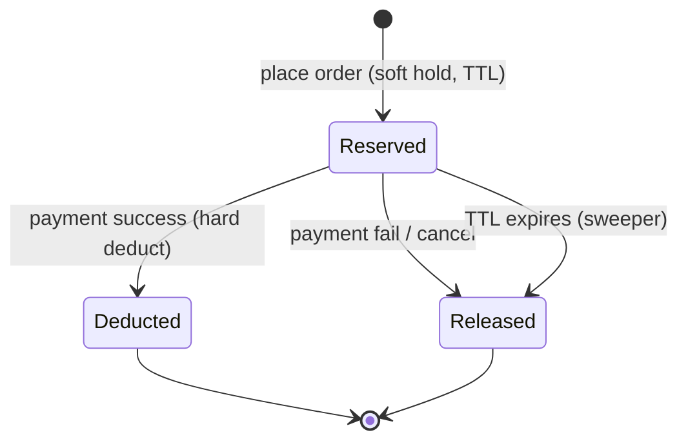
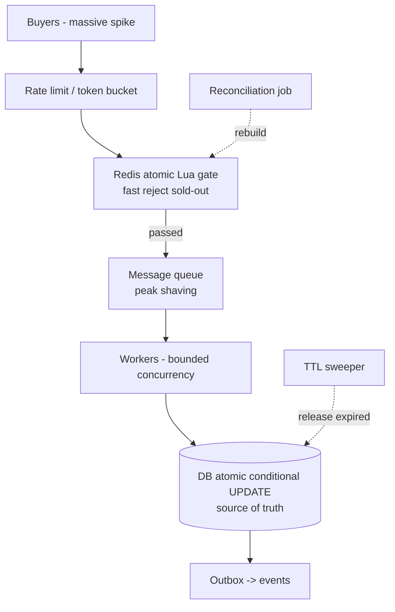
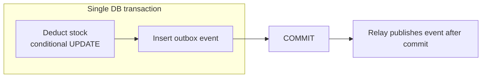

# How E-Commerce Platforms Deduct Stock — Industry Research & Applied Design

> Purpose: Research how production e-commerce platforms (general retail, flash sales, ticketing) solve stock deduction, distil the proven patterns and their trade-offs, and recommend an approach for our **Place Order** feature.
> This is a **research & decision document**, not a description of any existing code.

---

## 1. The Fundamental Question: *When* Do You Deduct Stock?

Every platform must first answer **timing**, before concurrency. There are three industry-standard models. The choice drives everything else.

| Model | When stock leaves the pool | Used by | Pro | Con |
|-------|----------------------------|---------|-----|-----|
| **Deduct-on-order** (下单减库存) | At order creation / checkout | Flash sales, ticketing (12306), limited drops | No oversell even if payment is slow; fair "first to order wins" | Malicious/abandoned orders lock real stock → needs timeout release |
| **Deduct-on-payment** (付款减库存) | When payment succeeds | Low-contention catalogue retail | No stock locked by window-shoppers | **Oversell risk**: 100 people pay for the last 1 unit |
| **Reserve-then-confirm** (预扣库存 / hybrid) | *Soft-hold* at order, *hard-deduct* at payment, *auto-release* on timeout | Amazon, Alibaba, Shopify-scale | Combines safety + no permanent locking; industry default | More moving parts (TTL, release, reconciliation) |

### Verdict
**Reserve-then-confirm is the production standard** for any platform that has a payment step and meaningful contention. It is the only model that satisfies both "never oversell" and "never permanently lock stock for an abandoned cart."



---

## 2. Concurrency Control — The Menu of Techniques

Once timing is fixed, the hard part is **N buyers racing for the same SKU**. Here is the full industry menu, from simplest to most scalable, with the honest trade-offs.

### 2.1 Database Pessimistic Lock — `SELECT … FOR UPDATE`
```sql
BEGIN;
SELECT stock FROM inventory WHERE sku = ? FOR UPDATE;  -- locks the row
-- app checks stock >= qty
UPDATE inventory SET stock = stock - ? WHERE sku = ?;
COMMIT;
```
- **Correct**, simple to reason about.
- **Throughput-limited**: the row lock is held across application round-trips. Hot SKU → requests serialize and queue; connection pool can exhaust.
- **Deadlock risk** with multi-item orders if lock order isn't deterministic.
- *Used by*: smaller systems, or non-hot SKUs.

### 2.2 Database Optimistic Lock — version column
```sql
UPDATE inventory SET stock = stock - ?, version = version + 1
WHERE sku = ? AND version = ?;   -- retry if 0 rows
```
- No long-held locks.
- **Fails badly under high contention**: conflict rate approaches 100% on a hot SKU → retry storms, latency spikes, and ironically some buyers fail *while stock still exists*.
- *Good for*: low-to-moderate contention, read-modify-write of multiple fields.

### 2.3 Atomic Conditional Update — the workhorse ⭐
```sql
UPDATE inventory SET stock = stock - ?
WHERE sku = ? AND stock >= ?;    -- rows=1 → success, rows=0 → sold out
```
- The `WHERE stock >= ?` **is** the no-oversell invariant; the DB evaluates and applies it in **one atomic statement**.
- **No application read, no version, no retry loop** — eliminates both the lost-update race and the retry storm.
- Row lock held for microseconds; hot SKUs *queue briefly* instead of collapsing.
- *Used by*: the relational tier of nearly every serious platform. This is the single most important pattern.

### 2.4 Redis Atomic Deduction — the front gate ⭐
```lua
-- Lua runs atomically inside Redis (single-threaded)
if tonumber(redis.call('GET', KEYS[1])) >= tonumber(ARGV[1]) then
    return redis.call('DECRBY', KEYS[1], ARGV[1])
else
    return -1
end
```
- In-memory, single-threaded → **atomic by nature**, sub-millisecond.
- Absorbs flash-sale stampede *in front of* the database, so the DB never sees the full firehose.
- **Not durable enough to be the source of truth** — a failover can lose recent writes. Treated as a *rebuildable cache/gate*.
- *Used by*: every flash-sale system (Alibaba, JD, ticketing).

### 2.5 Message-Queue Serialization (peak shaving / 削峰)
- Requests are enqueued; a small number of consumers drain the queue and apply deductions sequentially.
- Converts a 50,000-spike into a steady 2,000/s the DB can handle.
- Adds latency and async UX ("your order is being processed"), but **protects the system from collapse**.
- *Used by*: extreme flash sales, ticketing on-sale moments.

### 2.6 Inventory Bucketing / Segmentation (库存分桶) — extreme scale
- Split one SKU's stock of 1,000 into N buckets of, e.g., 100 each, keyed by hash.
- A request is routed to one bucket, so contention on any single row drops by N×.
- "Borrow" from neighbouring buckets when one empties.
- *Used by*: the very largest flash-sale events. Complex; only when a single row genuinely becomes the bottleneck.

### Decision summary
| Contention level | Recommended primary mechanism |
|------------------|-------------------------------|
| Normal catalogue | **Atomic conditional UPDATE** (2.3) |
| High / flash sale | **Redis gate (2.4) + conditional UPDATE (2.3)** + queue (2.5) |
| Extreme single-SKU | add **bucketing (2.6)** |

---

## 3. How Real Platforms Combine These (Reference Architectures)

### 3.1 Flash-sale tiered model (Alibaba/JD-style)

Layers, in order of who absorbs load:
1. **Rate limiting** sheds the impossible excess at the edge.
2. **Redis Lua gate** rejects sold-out requests in <1ms — most traffic dies here.
3. **Queue** smooths the survivors into a DB-safe rate.
4. **DB conditional UPDATE** makes the *binding, durable* decision.
5. **Outbox / reconciliation / TTL** keep everything consistent and self-healing.

### 3.2 Standard retail (Amazon-style catalogue)
Most SKUs are *not* hot. The pragmatic model:
- **Reserve-then-confirm** lifecycle with a checkout TTL (commonly 15–60 min).
- **DB atomic conditional UPDATE** for the reservation; no Redis gate needed for cold SKUs.
- Redis used as a **read cache** for "in stock?" display, not for the deduction decision.
- Background jobs release expired reservations.

### 3.3 Ticketing / seat inventory (12306, Ticketmaster)
- **Deduct-on-order** (the seat is gone the moment you select it) + **aggressive short TTL** (e.g. 10 min to pay).
- Heavy **queue / virtual waiting room** to serialize the on-sale moment.
- Often **bucketed** by train/section/zone to spread contention.

---

## 4. The Consistency Problem (Cache ↔ DB)

Using Redis as a gate **and** a DB as truth is a **dual-write** — inherently non-atomic. Industry handles this with:

1. **One authority**: the DB is the source of truth; Redis is *derived* and rebuildable. Redis may be briefly stale; it must never be the final arbiter of a money-affecting decision.
2. **Compensation**: if Redis deducted but the DB rejected, *add back* to Redis.
3. **Reconciliation job**: periodically reseed Redis from the DB to erase any drift left by a crash mid-compensation.
4. **Idempotency everywhere** (next section), because retries are guaranteed.

> **Accepted trade-off:** transient drift can cause a *brief lost sale* (Redis under-reports), but the DB conditional update guarantees there is **never an oversell**. Correctness beats raw availability for inventory.

### Durable messaging: Outbox + Inbox
- **Outbox**: write the "stock reserved" event into the *same DB transaction* as the deduction, then relay it. Prevents "DB updated but event lost → order stuck."
- **Inbox**: dedupe incoming messages by producer-supplied id so at-least-once delivery doesn't double-deduct.



---

## 5. Idempotency — Mandatory, Not Optional

At-least-once delivery + client retries + payment webhooks all mean **the same deduction request will arrive more than once**. Without protection you double-deduct real money/stock.

Industry techniques:
- **Idempotency key** carried by the request (order id / payment id), checked before applying.
- **Inbox table** with a unique constraint on `(consumer, message_id)` — the unique-violation *is* the dedupe guard; on duplicate → acknowledge and skip.
- The dedupe check and the business write share **one transaction** so a crash can't split them.

---

## 6. Edge Cases Every Implementation Must Handle

| # | Edge case | Industry handling |
|---|-----------|-------------------|
| 1 | Last unit, many buyers | Atomic conditional UPDATE → exactly one wins |
| 2 | Abandoned cart / unpaid order | TTL + sweeper releases the soft hold |
| 3 | Payment fails after reserve | Compensating release; stock returns |
| 4 | Duplicate request (retry, redelivery) | Idempotency key / inbox |
| 5 | Multi-item order, one item short | All-or-nothing: reserve all or fail whole order |
| 6 | Multi-item deadlock | Lock rows in deterministic (sorted) order |
| 7 | Crash between DB commit and event | Outbox relay |
| 8 | Cache ↔ DB drift | Reconciliation reseed; DB authoritative |
| 9 | Restock / cancellation | Compensating add-back; event-driven |
| 10 | Oversell from manual edit / bug | `WHERE stock >= qty` predicate still blocks it |
| 11 | Hot SKU stampede | Redis gate + queue + (optional) bucketing |
| 12 | Returns / partial refunds | Inventory ledger / movement records, not just a counter |

> **Advanced:** large platforms model stock as an **append-only ledger of movements** (reserve +/–, confirm, release, restock), and the current count is the sum (often snapshotted). This gives a full audit trail and makes reconciliation and returns exact — worth considering once the basics are solid.

---

## 7. Applying This to Our *Place Order* Feature

### Recommended target design
1. **Timing → reserve-then-confirm.** Place Order creates a *soft reservation* with a TTL; payment confirms (hard deduct); timeout/cancel releases.
2. **Concurrency → atomic conditional UPDATE** as the binding DB mechanism (`WHERE available >= qty`). This replaces any optimistic-lock-with-retry, which degrades under hot SKUs.
3. **Front gate → Redis atomic Lua** to shield the DB during spikes; Redis is a rebuildable cache, **DB is source of truth**.
4. **Durability → Outbox** for the `StockReserved` / `StockReservationFailed` events.
5. **Idempotency → Inbox** dedupe on the reservation message (keyed by order id).
6. **Self-healing → two background jobs**: a TTL sweeper (release expired reservations) and a reconciliation job (reseed Redis from DB).
7. **Multi-item safety → sort items by id** before deduction (deadlock-free) and reserve **all-or-nothing**.

### Future scale levers (only if needed)
- Message-queue peak shaving for true flash-sale moments.
- Inventory bucketing for a single ultra-hot SKU.
- Inventory ledger for full auditability and clean returns.

### One-line decision
> **Reserve-then-confirm + Redis atomic gate + DB atomic conditional update + outbox/inbox + TTL release** — the same recipe used by large-scale flash-sale platforms, scaled down sensibly to our contention level.

---

## 8. Glossary
- **Oversell**: confirming more units than exist. The cardinal sin.
- **Soft hold / reservation**: stock removed from "available" but not yet physically deducted, pending payment.
- **Peak shaving (削峰)**: using a queue to flatten a traffic spike into a sustainable rate.
- **Bucketing (分桶)**: splitting one SKU's stock across many rows to reduce per-row contention.
- **Outbox / Inbox**: transactional patterns for reliable, idempotent messaging.
- **Reconciliation**: periodic job that makes the cache match the source of truth.
