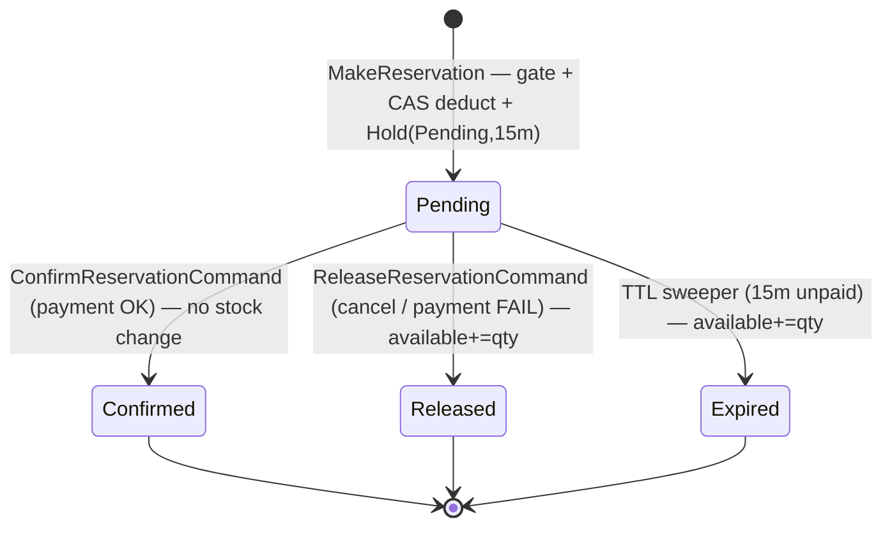

# Stock Deduction — Solution Specification (Source of Truth)

> **Status: FINAL — Definition of Ready gate. No code starts until this is signed off.**
> Branch: `technical/eshop-2006-improve-stock-deduction`.
> This document is the **single source of truth (SSOT)**. Where any other document disagrees, **this wins**.

---

## 0. Document Map (who owns what)

| Document | Role | Authority for |
|----------|------|---------------|
| **THIS — solution-specification.md** | **SSOT / Definition of Ready** | Final decisions, data model, contracts, naming, readiness gate |
| `stock-deduction-deduct-on-order-design.md` | Architecture rationale | The *why/how* (CAS, outbox, deadlock, idempotency deep-dives §14–17) |
| `stock-deduction-industry-research.md` | Background research | Industry justification of choices |
| `stock-deduction-architecture.md` | Superseded exploration | Historical (reserve-then-confirm) — **not authoritative** |
| `Order/src/EShop.Order.API/README.md` | Saga / process-manager view | Order saga flow (event-sourced `OrderSaga`) |

---

## 1. Final Decision Register (all closed)

| # | Decision | **Final value** | Status |
|---|----------|-----------------|--------|
| D1 | When to deduct | **Deduct-on-order** (`StockAvailable -= qty` at placement) | ✅ Locked |
| D2 | DB concurrency | **Atomic conditional UPDATE (CAS)** `WHERE stock_available >= qty` | ✅ Locked |
| D3 | Front gate | **Redis atomic Lua**, Phase 1, rebuildable cache | ✅ Locked |
| D4 | Source of truth | **PostgreSQL** | ✅ Locked |
| D5 | Releasability | **Hold + TTL sweeper + `ReleaseReservationCommand`** | ✅ Locked |
| D6 | Durability | **Transactional Outbox, polling publisher** (prefer MassTransit EF Outbox) | ✅ Locked |
| D7 | Idempotency | **Inbox (consumer,MessageId) + UNIQUE(Hold.OrderId)**, same TX as deduction | ✅ Locked |
| D8 | Multi-item | **All-or-nothing + sort by VariantId asc** + bounded deadlock-retry | ✅ Locked |
| D9 | Payment finality | **Payment step exists** — order provisional; `Confirmed` on pay; release on cancel/fail/TTL | ✅ Locked |
| D10 | Release TTL | **15 minutes** (sweeper every 1 min) | ✅ Locked |
| **O3** | **Reservation granularity** | **Per-order `Reservation` + per-variant `ReservationItem` rows** | ✅ **CONFIRMED** |

### O3 resolution (confirmed)
**Decision: store reservation line items** (`ReservationItem`, one row per variant).
**Why:** the release/expiry add-back needs per-variant quantities; storing them on the reservation makes release **self-contained** (no cross-aggregate read into the Order service at release time), preserves an **audit trail**, and keeps the Inventory bounded context autonomous.
**Alternative rejected:** re-derive quantities from the persisted order at release — couples Inventory to Order's data, fails if the order row isn't persisted yet (release can fire before/independently of persistence), and complicates the TTL sweeper.

---

## 2. Canonical Ubiquitous Language & Naming

**These are the authoritative names. The Order README's older names are illustrative only.**

| Concept | **Canonical name** | Direction | Notes |
|---------|--------------------|-----------|-------|
| Saga trigger | `OrderCreated` | — | (README's `OrderSubmitted` = old) |
| Reserve request | `MakeReservation` (IntegrationCommand) | Order → Inventory | (README's `ReserveStockCommand` = old) |
| Internal deduct command | `ReserveStocksCommand` (mediator) | Inventory-internal | Mapped from `MakeReservation` by `MakeReservationConsumer` |
| Reserve success | `StockReserved` **+ `ReservationId`** | Inventory → Order | **Contract change required** |
| Reserve failure | `StockReservationFailed` | Inventory → Order | carries `FailureReason` |
| Persist order | `PersistOrderCommand` | saga → Order write-side | needs `ReservationId` |
| Persisted | `OrderPersisted` | Order write-side → saga | |
| Confirm (on payment) | `ConfirmReservationCommand` | saga → Inventory | **New** |
| Compensate | `ReleaseReservationCommand` | saga → Inventory | exists in contracts |
| Reservation statuses | `Pending → Confirmed | Released | Expired` | — | matches `ReservationStatus` enum |

---

## 3. Data Model (concrete, pre-implementation)

> Illustrative Postgres DDL aligned to the existing EF entities (`TableNames.Inventories`, `Reservations`). New: `ReservationItems`. Inbox/Outbox already exist.

```sql
-- Inventory (system of record). CAS is the order-path mechanism.
-- RowVersion is NOT required for the order path (CAS supersedes optimistic-retry);
-- retain only if needed for admin/manual multi-field edits.
-- columns: stock_available, reserved_stock, minimum_stock, variant_id, tenant_id, ...

-- Hold (per ORDER). UNIQUE(tenant_id, order_id) = same-order idempotency guard (D7).
CREATE TABLE reservations (
    id                  uuid PRIMARY KEY,
    order_id            uuid NOT NULL,
    status              varchar(32) NOT NULL,         -- Pending|Confirmed|Released|Expired
    expires_at          timestamptz NOT NULL,         -- now() + 15 min
    created_at_utc      timestamptz NOT NULL,
    released_at_utc     timestamptz NULL,
    last_modified_at_utc timestamptz NULL,
    tenant_id           varchar(64) NOT NULL,
    scope               varchar NOT NULL,
    CONSTRAINT uq_reservation_order UNIQUE (tenant_id, order_id)   -- idempotency
);
CREATE INDEX ix_reservations_sweeper ON reservations (status, expires_at);  -- TTL sweeper

-- Reservation line items (per VARIANT) — O3 decision. Needed for release add-back.
CREATE TABLE reservation_items (
    id              uuid PRIMARY KEY,
    reservation_id  uuid NOT NULL REFERENCES reservations(id),
    variant_id      uuid NOT NULL,
    quantity        int  NOT NULL,
    tenant_id       varchar(64) NOT NULL,
    CONSTRAINT uq_reservation_item UNIQUE (reservation_id, variant_id)
);

-- Inbox (exists). Composite unique = dedupe guard (D7).
-- UNIQUE (consumer_name, message_id)

-- Outbox (exists: OutboxMessage). For polling publisher add:
CREATE INDEX ix_outbox_pending ON outbox_messages (processed_on_utc) WHERE processed_on_utc IS NULL;
-- optional: retry_count int NOT NULL DEFAULT 0
```

---

## 4. Correctness Contract (the one-transaction boundary)

The **deduction transaction** must contain ALL of the following, committed atomically:

```
BEGIN
  1. Inbox INSERT (consumer, OrderId)         -- idempotency guard (D7); unique-violation → skip
  2. For each item ORDERED BY VariantId asc:  -- deadlock prevention (D8)
        CAS UPDATE inventory
            SET stock_available -= qty
            WHERE variant_id=@v AND tenant_id=@t AND stock_available >= qty   -- (D2)
        rows=0 → whole order fails (all-or-nothing, D8)
  3. INSERT reservation (Pending, ExpiresAt=now+15m)   -- UNIQUE(tenant,order) (D7)
  4. INSERT reservation_items (per variant)            -- O3
  5. INSERT outbox StockReserved(OrderId, ReservationId)  -- durability (D6)
COMMIT
-- relay (polling publisher) publishes StockReserved AFTER commit
```

- **Redis gate** runs **before** the transaction (fast reject); on CAS `rows=0` after the gate passed → **compensate Redis** (`ReleaseAsync`).
- **CAS ≠ idempotency** (design §14): step 1 guards same-order duplicates; step 2 guards cross-order concurrency. Both required.

---

## 5. End-to-End Lifecycle (canonical)



| Trigger | Handler | Stock effect | Idempotency guard |
|---------|---------|--------------|-------------------|
| `MakeReservation` | deduct handler | `available -= qty` | Inbox + UNIQUE(order) |
| `ConfirmReservationCommand` | confirm handler | none | status: only `Pending → Confirmed` |
| `ReleaseReservationCommand` | release handler | `available += qty` | status: skip if already Released/Expired |
| TTL sweep | sweeper job | `available += qty` | status: only `Pending`→`Expired` |

---

## 6. Required Contract Changes (exact)

1. **`StockReserved`** — add `Guid ReservationId` (saga threads it to `PersistOrderCommand` and later release).
2. **`ReserveStocksCommand`** — already extended with `TenantId/ActionUserId/ActionUserType` (done).
3. **New `ConfirmReservationCommand`** — `{ OrderId, ReservationId, TenantId, ActionUserId, ActionUserType }` (payment-success path, D9).
4. **`ReleaseReservationCommand`** — exists; wire to a new `ReleaseReservationConsumer`.

---

## 7. Saga Integration (reconciled to ACTUAL code)

The live saga is **event-sourced `OrderSaga : AggregateSaga`** (deterministic `OrderSagaId` from `OrderId`, domain events, `IAggregateSagaStore`) — **not** the README's `PlaceOrderSagaOrchestrator` POCO. Canonical flow:

```
OrderCreated → OrderSaga.Create → publish MakeReservation
MakeReservation → (Inventory deduct) → StockReserved(OrderId, ReservationId)
StockReserved → OrderSaga.HandleAsync → PersistOrderCommand
OrderPersisted → OrderSaga.HandleAsync → awaiting payment
payment OK   → ConfirmReservationCommand → Hold=Confirmed → OrderAccepted
payment FAIL / cancel / stock-fail → ReleaseReservationCommand → Hold=Released → OrderRejected
TTL 15m unpaid → sweeper → Hold=Expired (+ add-back)
```

> **Note:** the payment-awaiting saga state + `ConfirmReservationCommand` are **new**. If payment integration is out of this branch's scope, the Hold still auto-releases on TTL, so correctness holds — track the explicit confirm wiring as follow-up.

---

## 8. Consistency Matrix (docs ↔ code)

| Item | SSOT (this) | Design doc | Order README | Code | Status |
|------|-------------|-----------|--------------|------|--------|
| Statuses | Pending/Confirmed/Released/Expired | ✅ | ✅ (fixed) | ✅ enum | **Consistent** |
| TTL | 15m / 1m sweep | ✅ | ✅ | — | **Consistent** |
| Deduction | CAS | ✅ | banner-noted | `DecreaseStockLevel3CAS` decl | **Consistent (impl pending)** |
| Idempotency | Inbox + UNIQUE(order) | ✅ §14 | banner | Inbox infra exists | **Consistent (impl pending)** |
| Outbox relay | polling | ✅ §15 | — | `OutboxMessage` shape | **Consistent (impl pending)** |
| Deadlock | sort VariantId | ✅ §16 | — | — | **Consistent (impl pending)** |
| Reservation granularity | per-order + items (O3) | flagged §17 | flagged note | per-order only | **Schema change needed** |
| Trigger/command names | OrderCreated/MakeReservation | ✅ | banner maps old→new | ✅ contracts | **Consistent (README diagrams old, mapped)** |
| Saga impl | event-sourced OrderSaga | — | banner flags POCO drift | ✅ OrderSaga | **Reconciled in §7; README body still old** |

**Remaining drift accepted for now (non-blocking):** the README's lower-section mermaid diagrams still use old names/POCO saga; the top banner maps them and §7 here is authoritative. Full README diagram rewrite = separate cleanup task.

---

## 9. Definition of Ready — Go/No-Go Checklist

Before writing Phase 1 code, ALL must be ✅:

- [x] Timing model decided (D1 deduct-on-order)
- [x] Concurrency primitive decided (D2 CAS)
- [x] Idempotency mechanism decided (D7 inbox + unique key) and **distinguished from CAS**
- [x] Outbox relay strategy decided (D6 polling)
- [x] Deadlock strategy decided (D8 sort + retry)
- [x] Payment finality & TTL decided (D9, D10)
- [x] **O3 reservation granularity confirmed** — per-order `Reservation` + per-variant `ReservationItem` rows
- [x] Contract changes enumerated (§6)
- [x] Data model drafted (§3)
- [x] Correctness transaction boundary specified (§4)
- [x] Docs reconciled / drift dispositioned (§8)

**→ ✅ ALL items green. Definition of Ready met — Phase 1 is cleared to start.**

---

## 10. Implementation Phases (from design §11, unchanged)

1. **Deduction core** — CAS + Redis gate + Hold(Pending, items, 15m) + inbox, one TX.
2. **Reliability** — outbox relay + `StockReserved += ReservationId` threaded through saga.
3. **Releasability + payment** — `ReleaseReservationConsumer` (idempotent add-back via `reservation_items`), saga compensation, `ConfirmReservationCommand`, TTL sweeper.
4. **Scale** — Redis reconciliation job + load test (5k concurrent, zero oversell).

---

## 11. Out of Scope / Follow-ups

- Full rewrite of the Order README's lower diagrams to the event-sourced saga (cleanup task).
- Inventory bucketing / queue peak-shaving (only if a single SKU becomes a proven bottleneck).
- Inventory movement **ledger** (append-only) for full auditability & returns.
- `Committed`/`ReservedStock` materialised counter (derive from holds until reporting needs it).

---

## 12. Open Risks

| Risk | Mitigation |
|------|------------|
| Redis ↔ Postgres drift after crash mid-compensation | Reconciliation job (Phase 4); Postgres authoritative |
| Payment integration not ready this branch | TTL release keeps correctness; confirm wiring = follow-up |
| README diagram drift confuses readers | Top banner + §7/§8 here are authoritative; cleanup tracked |
| Hot-SKU latency under extreme spike | Gate + brief row-latch queue; bucketing/queue reserved as future levers |
