# Inventory Service

> Single source of truth for **stock levels**. Deducts stock atomically at order placement. Releases stock on cancel, payment fail, or TTL expiry.

---

## What This Service Does

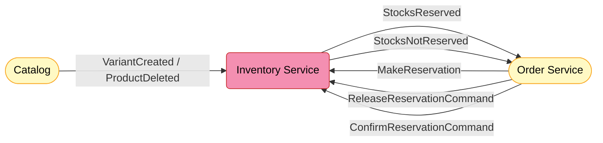

---

## Core Concept — Deduct on Order

> Stock is **permanently removed** from `StockAvailable` the moment an order is placed — not at payment, not at shipping.

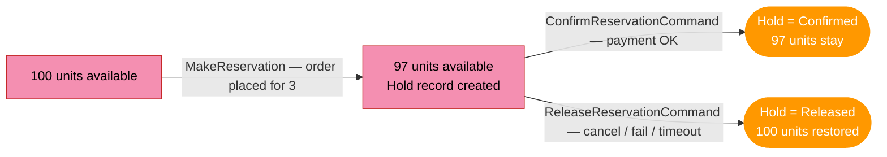

The **release path is mandatory** — every failed order must add stock back.

---

## Domain Model

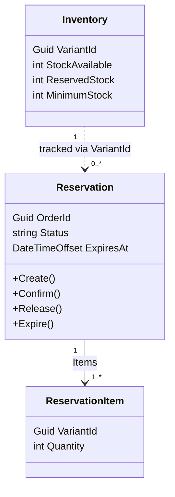

| | `Inventory` | `Reservation` | `ReservationItem` |
|-|------------|--------------|------------------|
| One per | SKU x tenant | Order | Variant x order |
| Key constraint | — | `UNIQUE(tenant_id, order_id)` | `UNIQUE(reservation_id, variant_id)` |
| Purpose | Holds stock counts | Tracks the hold status + TTL | Stores qty per variant for add-back |

---

## Stock Lifecycle

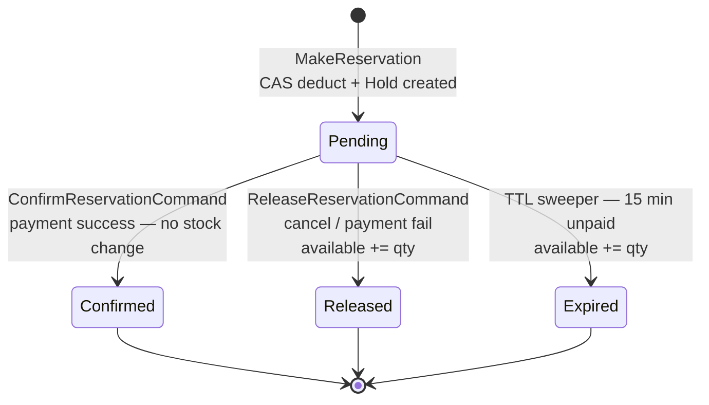

---

## Architecture — Three Layers

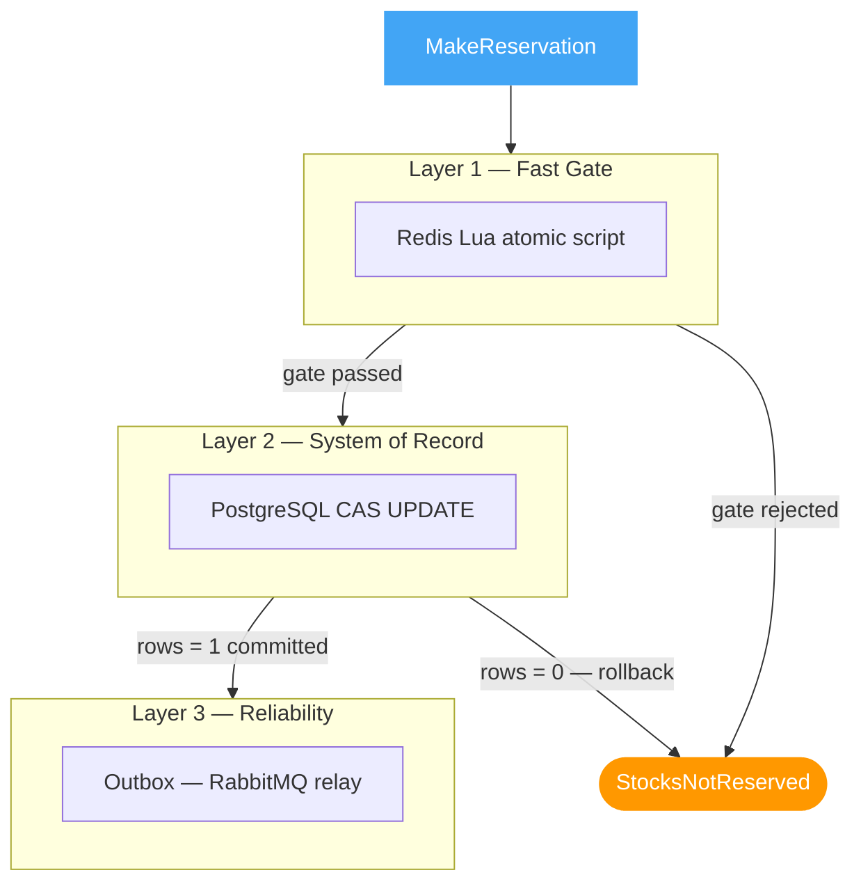

| Layer | Role | Source of Truth? |
|-------|------|-----------------|
| Redis | Reject sold-out in under 1 ms | No — cache only |
| PostgreSQL CAS | Final no-oversell decision | Yes |
| Outbox | Publish event after commit | — |

---

## Happy Path — Step by Step

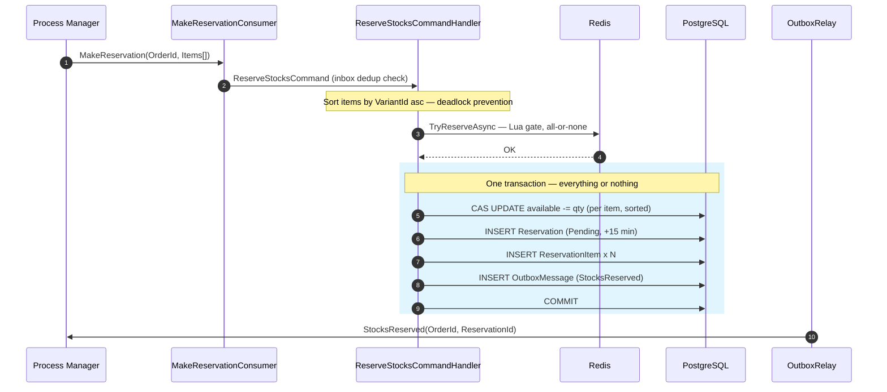

**Why one transaction?** If the app crashes after deducting stock but before writing the outbox, the whole transaction rolls back. No orphaned deductions, no lost events.

---

## Release Paths

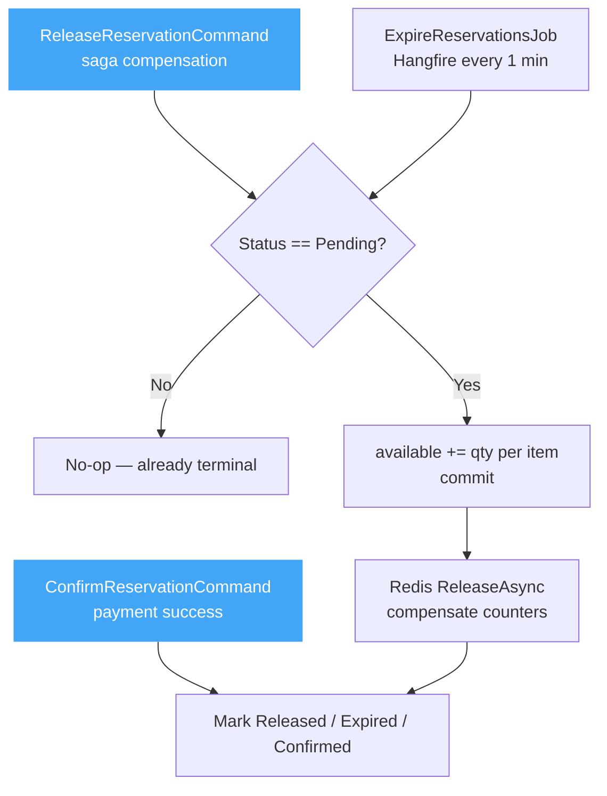

The **status guard** means whichever trigger fires first wins — the others are no-ops.

---

## Concurrency Rules

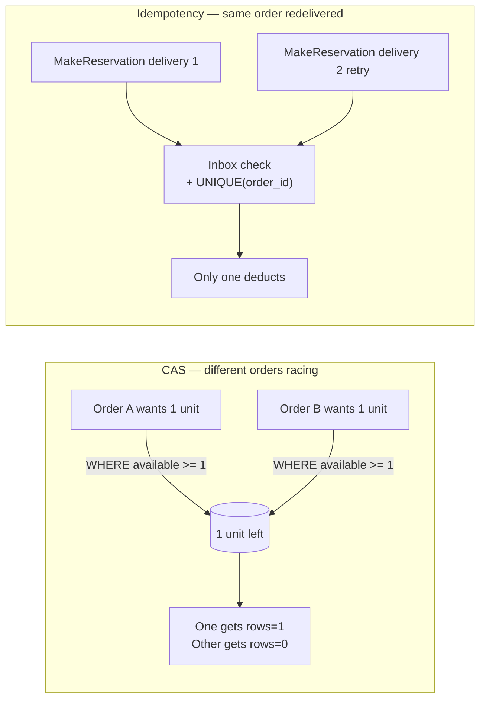

| Problem | Mechanism | Guard |
|---------|-----------|-------|
| Two buyers, last unit | CAS `WHERE available >= qty` | Database |
| Redelivered message | Inbox + `UNIQUE(tenant_id, order_id)` | Same transaction as CAS |
| Deadlock [A,B] vs [B,A] | Sort by `VariantId` asc | Application |

---

## Background Jobs

```mermaid
gantt
    title Background Jobs Schedule
    dateFormat s
    axisFormat %S s

    section Startup
    RedisStockInitializer (once)  : 0, 1s

    section Recurring
    RelayOutboxJob every 5 s      : 0, 5s
    ExpireReservationsJob 1 min   : 0, 60s
    SyncRedisStockJob 5 min       : 0, 300s
```

| Job | What it does |
|-----|-------------|
| `RedisStockInitializer` | Seeds Redis counters from Postgres on startup |
| `RelayOutboxJob` | Publishes pending outbox rows to RabbitMQ (batch 50, SKIP LOCKED) |
| `ExpireReservationsJob` | Finds `Pending` reservations past `ExpiresAt` — add-back + `Expired` |
| `SyncRedisStockJob` | Re-seeds all Redis counters from Postgres — heals any drift |

---

## Integration Events

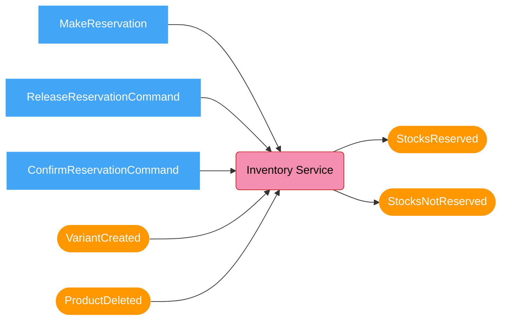

---

## Order Process Manager Integration

> Inventory is the **receiving side** of the Order service's Process Manager (`OrderSaga`). The saga drives this service with commands; Inventory replies with events. See the [Order Service README](../../../Order/src/EShop.Order.API/README.md) for the saga's own state machine and roadmap.

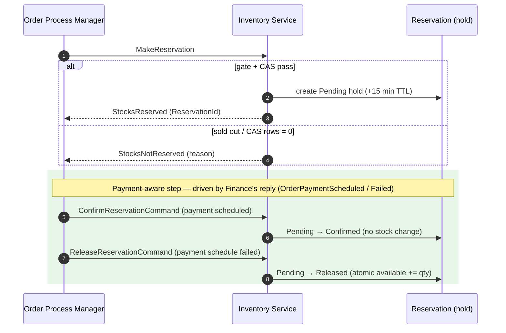

| Saga sends | Inventory does | Reply | Status today |
|------------|----------------|-------|--------------|
| `MakeReservation` | Redis gate + CAS deduct + create `Pending` hold | `StocksReserved` / `StocksNotReserved` | ✅ Live |
| `ConfirmReservationCommand` | `Pending → Confirmed` (no stock change) | — | ✅ Live — issued when Finance replies `OrderPaymentScheduled` |
| `ReleaseReservationCommand` | `Pending → Released`, **atomic** stock add-back (`AddBackStockAsync`) + Redis compensation | — | ✅ Live — issued when Finance replies `OrderPaymentScheduleFailed` |

> Both commands are **idempotent** (guarded by `Status == Pending`) and **fire-and-forget** — the saga has already completed, so Inventory sends no reply. The release path adds stock back with an atomic SQL `UPDATE` (no lost updates under concurrent releases), inside a transaction with the `Pending → Released` status change, then compensates Redis after commit.

---

## Key Tables

| Table | One row per |
|-------|------------|
| `Inventories` | SKU x tenant |
| `Reservations` | Order x tenant — `UNIQUE(tenant_id, order_id)` |
| `ReservationItems` | Variant x reservation — `UNIQUE(reservation_id, variant_id)` |
| `OutboxMessages` | Pending event to publish |
| `inbox_messages` | Processed message (dedup) |
