# Inventory

> Single source of truth for **stock levels**. Deducts stock atomically the moment an order is placed (deduct-on-order), then **confirms** the hold on payment success or **releases** it (adding stock back) on payment failure.

> Order side of this contract: [Order Service README](../../../Order/src/EShop.Order.API/README.md)

---

## What This Service Does

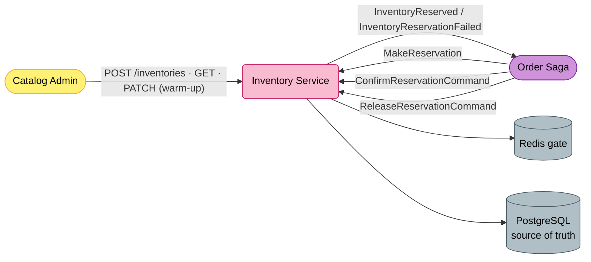

---

## Strategic Design

### Context Classification

| Aspect | Value |
|--------|-------|
| **Bounded Context** | Inventory |
| **Domain Type** | Core Domain |
| **Aggregate Roots** | `Inventory`, `Reservation` (with `ReservationItem` child) |
| **Multi-tenancy** | `IScoped` — `Inventory`, `Reservation`, `ReservationItem` carry `TenantId`/`Scope` (EF Core global query filters) |
| **Persistence** | EF Core (PostgreSQL) + Redis fast-path gate |
| **Read Model** | None |
| **Architecture Style** | Clean Architecture + two-layer concurrency control (Redis gate → PostgreSQL CAS) |

### Bounded Context Map

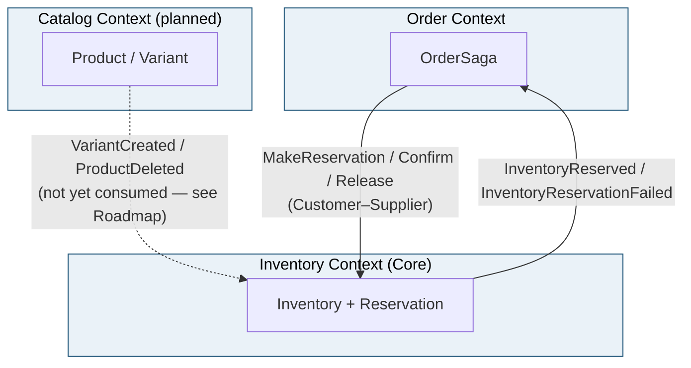

### Ubiquitous Language

| Term | Definition |
|------|------------|
| **Inventory** | Stock record for one SKU/variant per tenant: `StockAvailable`, `ReservedStock`, `MinimumStock`. |
| **Deduct-on-order** | Stock is permanently removed from `StockAvailable` when the order is placed — not at payment, not at shipping. |
| **Reservation (hold)** | The record tracking an order's deduction: `Pending → Confirmed / Released / Expired`. |
| **Redis gate** | A fast, in-memory Lua check-and-reserve that rejects sold-out requests in well under a millisecond before any DB work. |
| **CAS** | Compare-and-swap — the authoritative `UPDATE … WHERE stock_available >= qty` in PostgreSQL that makes the no-oversell decision. |
| **Confirm** | On payment success, move the hold `Pending → Confirmed` (no stock change — it was already deducted). |
| **Release** | On payment failure/cancel, add stock back atomically and move the hold `Pending → Released`. |
| **Warm-up** | Re-seed the Redis counter for a variant from PostgreSQL (`PATCH /inventories`). |

---

## Event Storming

### Participants & Roles

| Role | Contribution | Artifact Ownership |
|------|--------------|--------------------|
| **Product Owner** | Confirms the no-oversell rule and the deduct-on-order timing | Ubiquitous Language, Policies |
| **Business Analyst** | Maps race conditions (last unit, redelivery, deadlock) into concrete rules | Hotspots, Concurrency rules |
| **Solution Architect** | Validates the Redis-gate / PostgreSQL-CAS split and the saga contract | Aggregate boundaries, Context Map |
| **Developer** | Implements the Lua gate, CAS SQL, and reservation lifecycle | Commands, Events, Specifications |

### Legend

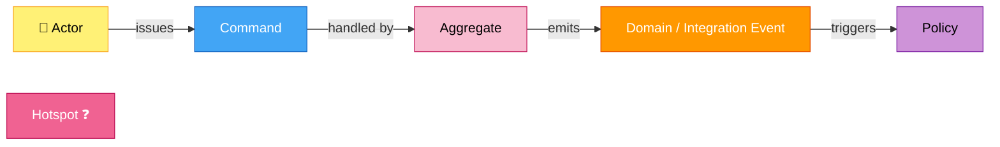

### Actors

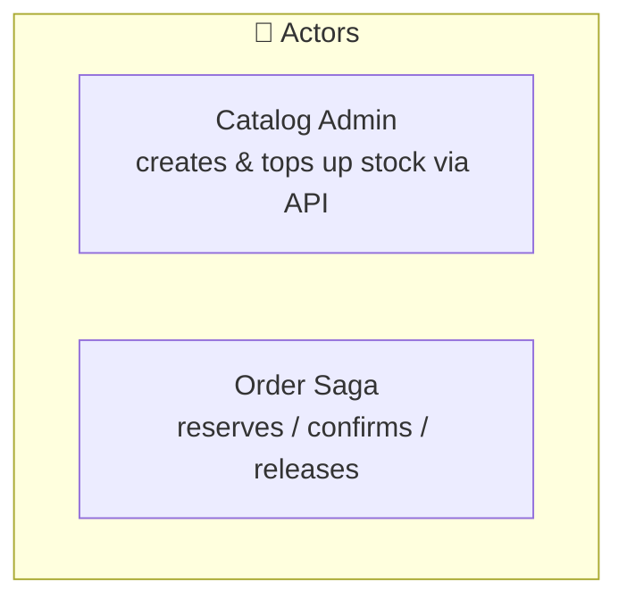

| Actor | Interacts With | Example Scenario |
|-------|----------------|------------------|
| **Catalog Admin** | `Inventory` aggregate | *As an admin, I want to set stock for a variant, so it can be sold.* |
| **Order Saga** | `Reservation` aggregate | *As the saga, I reserve stock on order, then confirm on payment or release on failure.* |

### Inventory — Event Flow

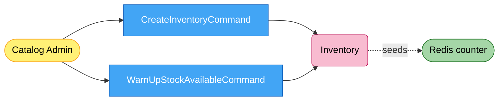

### Reservation — Event Flow

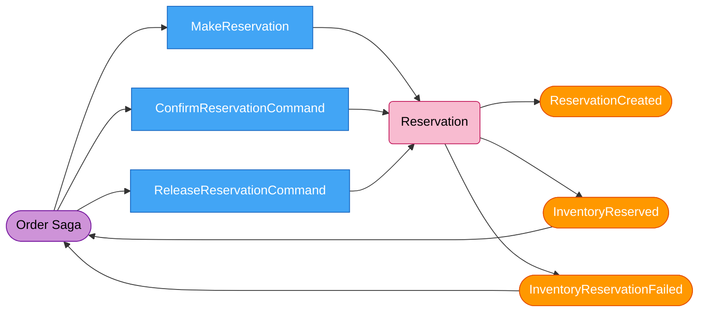

### Policies — When / Then Rules

| When this command/event | Then | Rail / Transport |
|-------------------------|------|------------------|
| `MakeReservation` | Redis gate → PostgreSQL CAS deduct → create `Pending` hold → emit `InventoryReserved` (or `InventoryReservationFailed`) | MassTransit consumer |
| `ConfirmReservationCommand` | `Pending → Confirmed` (no stock change) | MassTransit consumer |
| `ReleaseReservationCommand` | atomic stock add-back + `Pending → Released` + Redis compensation | MassTransit consumer |

---

## Domain Model

### Aggregate Structure

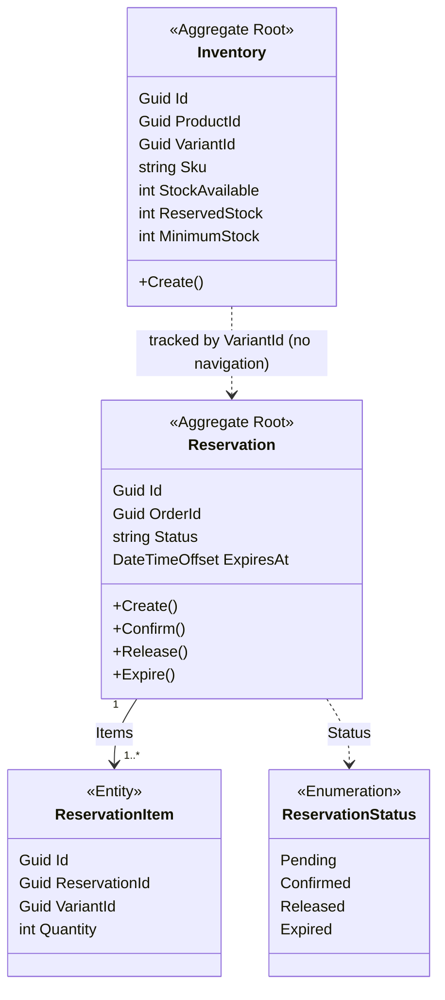

### Building Blocks

| Building Block | Type | Identity | Rationale |
|----------------|------|----------|-----------|
| `Inventory` | **Aggregate Root** | `Guid Id` | Stock counters for one variant × tenant; the consistency boundary for deduction. |
| `Reservation` | **Aggregate Root** | `Guid Id` | The hold for one order; loaded and saved with its items as a unit. |
| `ReservationItem` | **Entity** | `Guid Id` (child of `Reservation`) | Per-variant quantity inside a hold, used for add-back on release. |
| `ReservationStatus` | **Enumeration** | Enum value | `Pending / Confirmed / Released / Expired` — stored as the enum name string. |
| `ReservationCreated` | **Domain Event** | By attributes | Raised when a hold is created (`ReservationDomainEvent` base). |

> `Inventory` references `Reservation` only **by `VariantId`** — no navigation property between the two aggregates (aggregates reference each other by id).

---

## State Machines

`Reservation` is a status-driven lifecycle (not a Stateless machine). Each transition method (`Confirm`/`Release`/`Expire`) sets the `Status` string; the **consumer enforces the guard** `Status == Pending` so every transition is idempotent and whichever trigger fires first wins.

### Reservation Lifecycle

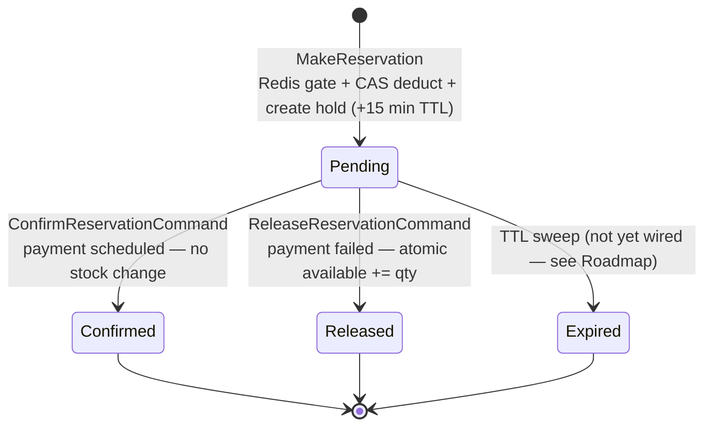

---

## Specifications & Invariants

The Inventory context enforces its invariants with **database-level atomic operations**, not `Specification` classes — the no-oversell rule must hold under concurrency.

| Invariant | Mechanism | Guard |
|-----------|-----------|-------|
| No oversell on the last unit | PostgreSQL CAS: `UPDATE … SET stock_available = stock_available - qty WHERE stock_available >= qty` (rows affected = 0 ⇒ reject) | Database |
| Fast rejection of sold-out items | Redis Lua: dry-run all items, then `DECRBY`/`INCRBY` all-or-nothing | Redis (single-threaded) |
| One reservation per order | `UNIQUE(tenant_id, order_id)` on `Reservations` | Database |
| Idempotent confirm/release | `Status == Pending` guard in the consumer | Application |
| No double stock add-back | atomic `UPDATE … SET stock_available = stock_available + qty` (`AddBackStockAsync`) | Database |

### Invariant Enforcement Flow

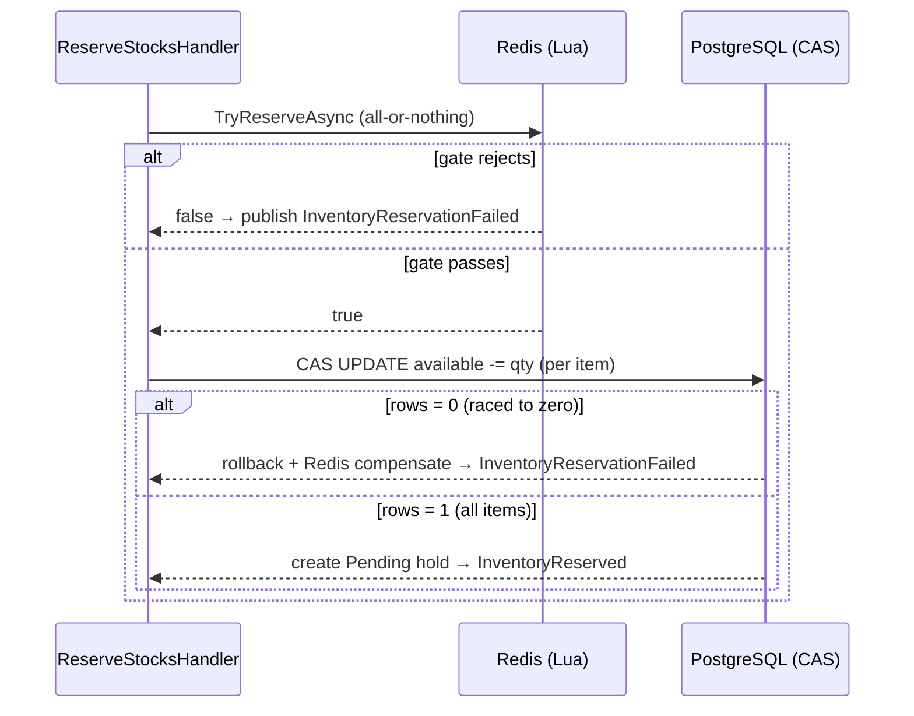

---

## Architecture

### Layer Overview

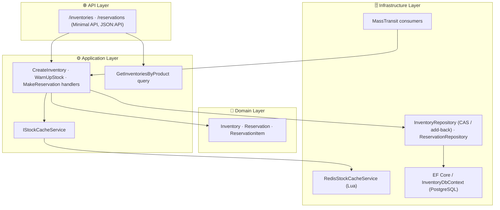

### Three Layers of the Reservation

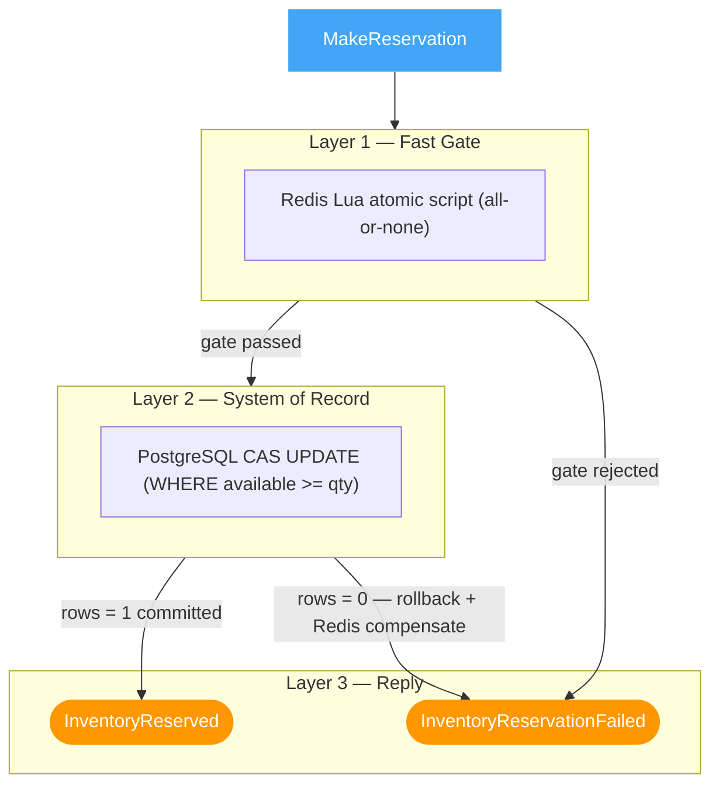

| Layer | Role | Source of truth? |
|-------|------|------------------|
| Redis | Reject sold-out in <1 ms | No — cache only |
| PostgreSQL CAS | Final no-oversell decision | **Yes** |

### Happy Path — Make Reservation

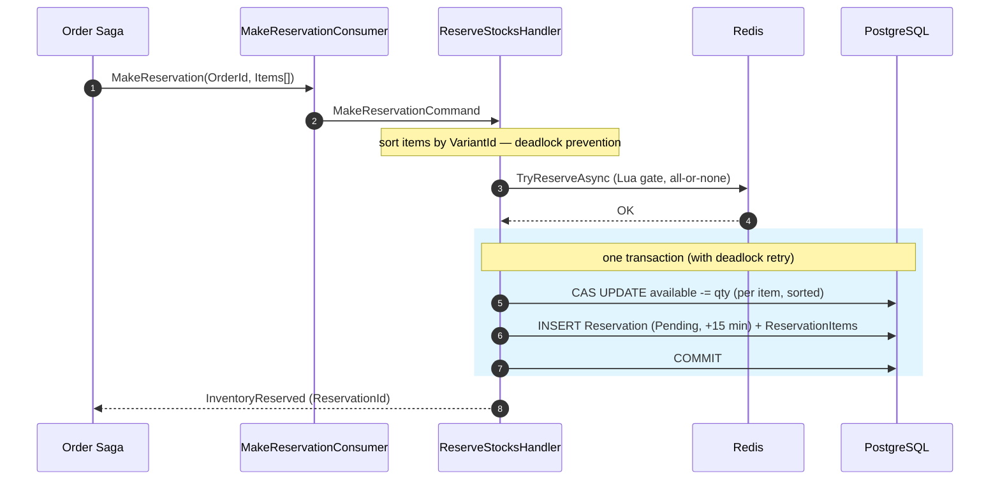

### Compensation — Confirm / Release

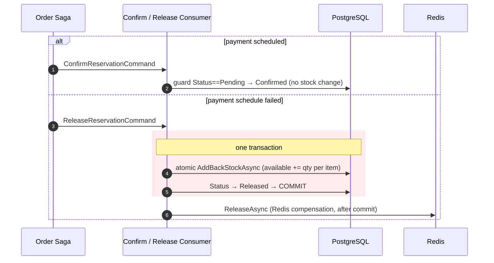

---

## Integration Events

| Direction | Contract | Meaning |
|-----------|----------|---------|
| **In** | `Order.Saga.MakeReservation` | Reserve stock for an order (Redis gate + CAS deduct). |
| **In** | `Inventory.ConfirmReservationCommand` | Payment scheduled — confirm the hold. |
| **In** | `Order.Saga.ReleaseReservationCommand` | Payment failed — release the hold and add stock back. |
| **Out** | `Order.Saga.InventoryReserved` | Stock held — carries `ReservationId`. |
| **Out** | `Order.Saga.InventoryReservationFailed` | Could not hold stock — carries the reason. |

Contracts live in `Shared/src/EShop.Shared.Contracts/Services/Inventory/` and `Services/Order/Saga/`.

---

## Data Model

| Table | One row per | Key constraint |
|-------|------------|----------------|
| `Inventories` | variant × tenant | PK `Id`; index on `VariantId` |
| `Reservations` | order × tenant | PK `Id`; `UNIQUE(tenant_id, order_id)`; index `(Status, ExpiresAt)` |
| `ReservationItems` | variant × reservation | PK `Id`; FK `ReservationId` |
| `InboxMessages` | processed message | Scaffolded — not used in the live path (idempotency is via `UNIQUE(tenant_id, order_id)` + status guards) |
| `OutboxMessages` | pending event | Scaffolded — reply events are currently published directly via `IEventBus` |

---

## API

All routes require the `InventoryManagement` feature and the noted permission.

| Method | Path | Response | Note |
|--------|------|----------|------|
| `POST` | `/api/v1/inventories` | `201 Created` | Create stock for a variant (`ManageInventory`). |
| `GET` | `/api/v1/inventories?productId=&pageIndex=&pageSize=` | `200 OK` paginated | List inventories for a product (`ViewInventory`/`ManageInventory`). |
| `PATCH` | `/api/v1/inventories` | `202 Accepted` | Warm-up: re-seed the Redis counter for a variant from PostgreSQL. |
| `POST` | `/api/v1/reservations` | `201 Created` | Manual reservation (generates a random `OrderId`) — primarily for testing the gate/CAS path. |

---

## Configuration

| Key | Source | Purpose |
|-----|--------|---------|
| `ConnectionStrings:inventoryDatabase` / `DefaultConnection` | Aspire / appsettings | PostgreSQL connection |
| `MasstransitConfiguration` / `rabbitmq` | appsettings | RabbitMQ connection |
| Redis connection | Aspire / appsettings | Redis fast-path gate cache |

`SystemUserContextConsumeFilter<T>` sets the tenant/user scope from each message; `CorrelationIdLogEnrichFilter<T>` stamps `OrderId` (the envelope `CorrelationId`) into logs.

---

## Tests

There is **no dedicated `EShop.Inventory.Tests` project yet**. The core paths (Redis Lua gate, PostgreSQL CAS, atomic add-back) are database/cache-bound and need integration tests against real PostgreSQL + Redis (e.g. Testcontainers) rather than mocks — tracked under Roadmap.

---

## Roadmap

### Gap Analysis

| # | Gap | Status |
|---|-----|--------|
| G1 | **Background jobs not wired.** Hangfire is commented out — there is no `RedisStockInitializer` (cold-start seed), `SyncRedisStockJob` (heal Redis↔Postgres drift), or `ExpireReservationsJob` (auto-release `Pending` holds past TTL). Redis self-seeds lazily on cache miss; holds are only released via the saga. | Open |
| G2 | **Outbox scaffolded but unused.** `OutboxMessages` exists and `OutboxWriter` is wired, but reply events are published directly via `IEventBus` (dual-write risk if the broker publish fails after commit). | Open |
| G3 | **No Catalog integration.** `Inventory` rows are created only via the API; `VariantCreated` / `ProductDeleted` from Catalog are not consumed. | Open |
| G4 | **Release transition not concurrency-guarded.** The `Pending → Released` check is read-then-act with no concurrency token; concurrent/redelivered releases of the same reservation could both add stock back. | Open |
| G5 | **No Inventory test project.** Gate/CAS/add-back paths are integration-level and currently untested. | Open |
| G6 | Atomic stock add-back on release (`AddBackStockAsync`). | **Resolved** |

### Suggested Implementation Order

1. Add `RedisStockInitializer` (startup seed) + `SyncRedisStockJob` (periodic heal) — closes G1's drift risk.
2. Add `ExpireReservationsJob` (TTL sweep) so unpaid holds auto-release — closes the rest of G1.
3. Add an `xmin`/`RowVersion` concurrency token to `Reservation` so the `Pending → Released/Confirmed` transition is atomic — closes G4.
4. Stand up `EShop.Inventory.Tests` with Testcontainers (PostgreSQL + Redis) — closes G5.
5. Relay reply events through the transactional outbox — closes G2.

---

## References

| Resource | Description |
|----------|-------------|
| [Order Service README](../../../Order/src/EShop.Order.API/README.md) | The Process Manager that drives `MakeReservation` / `Confirm` / `Release` |
| [Finance Service README](../../../Finance/src/EShop.Finance.API/README.md) | Schedules payment; its reply drives the saga's confirm/release decision |
| [Domain-Driven Design](https://www.domainlanguage.com/ddd/) | Eric Evans — Original DDD book |
| [Event Storming](https://www.eventstorming.com/) | Alberto Brandolini — Discovery technique |
