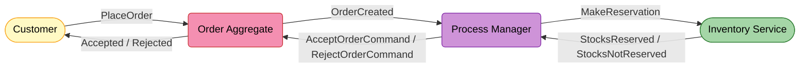
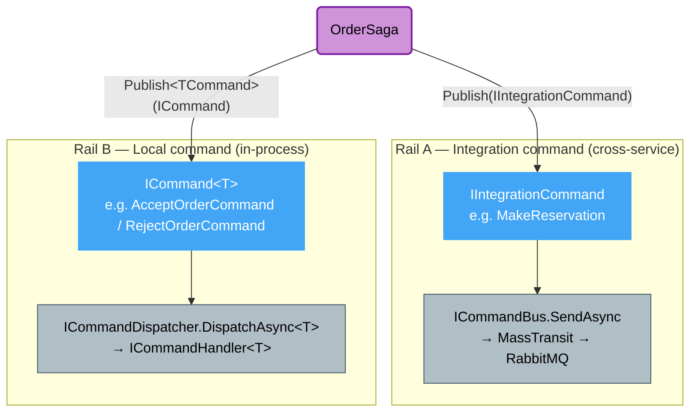
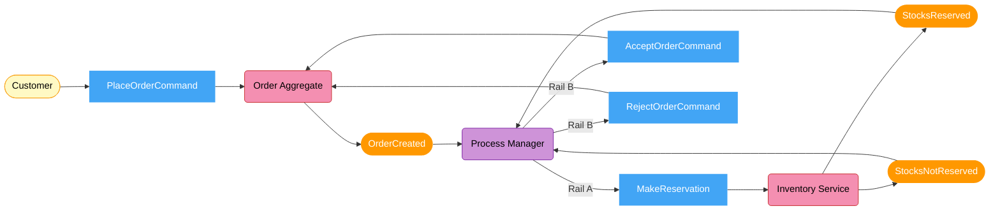
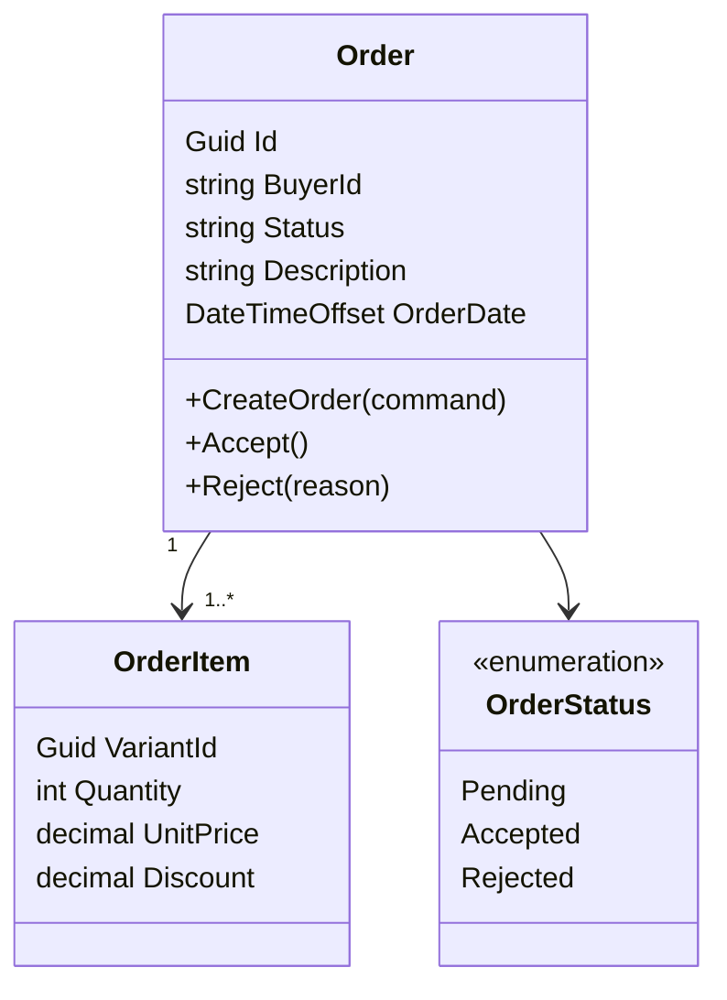
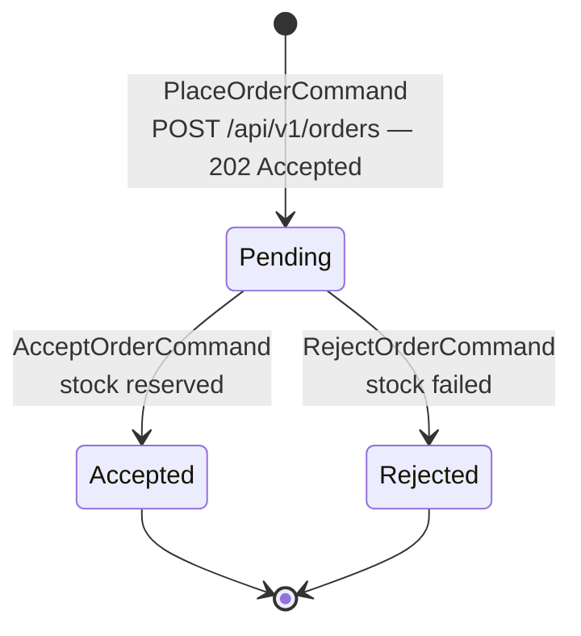
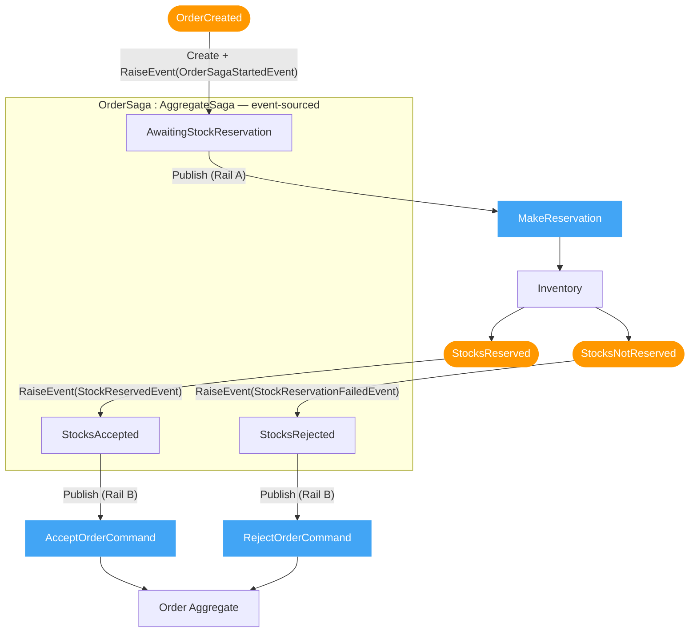
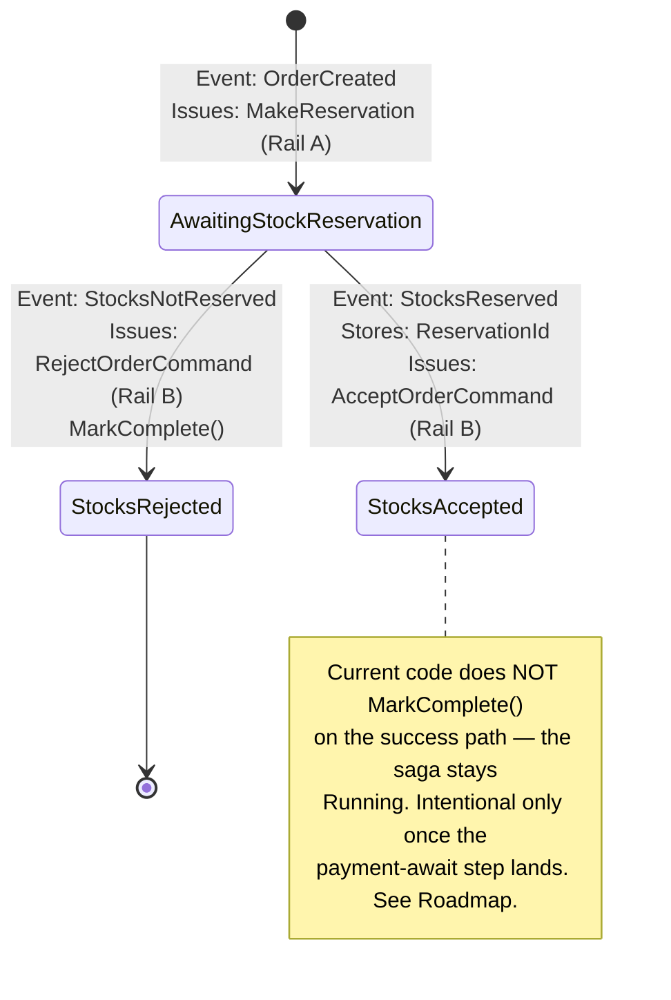
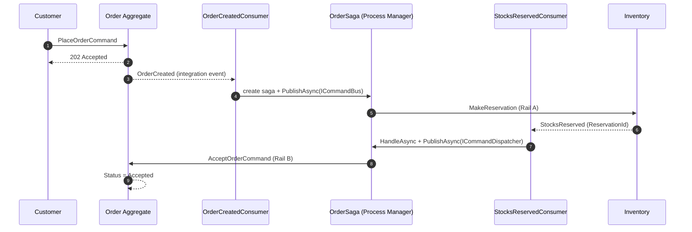
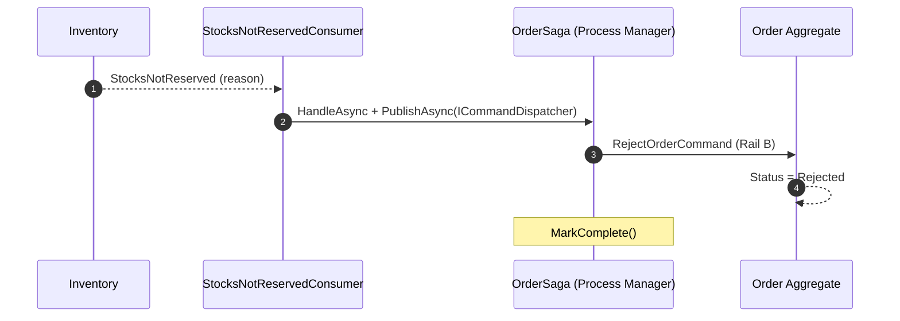
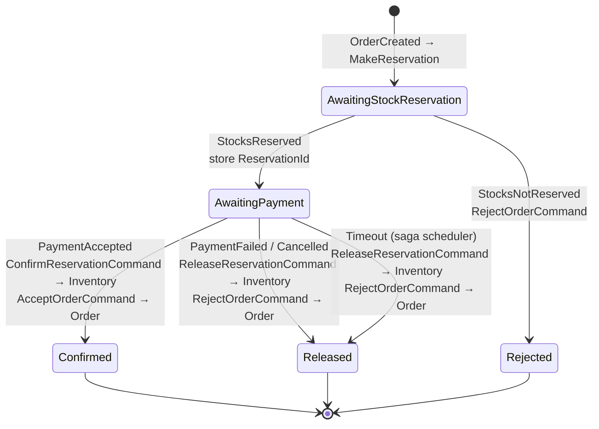

# Order Service

> Accepts orders from buyers and coordinates stock reservation with the Inventory service via a **Process Manager** before resolving the order.

> Reference: [CQRS Journey — Chapter 6: Sagas and Process Managers](https://learn.microsoft.com/en-us/previous-versions/msp-n-p/jj591569(v=pandp.10))
>
> Inventory side of this contract: [Inventory Service README](../../../Inventory/src/EShop.Inventory.API/README.md)

---

## What This Service Does

**Two things this service owns:**

| | What it is |
|--|-----------|
| **Order aggregate** | The canonical purchase record — `Pending → Accepted / Rejected` |
| **Process Manager** (`OrderSaga`) | Listens to events, issues commands — pure routing, no business logic |

---

## Two Command Rails

> The single most important implementation detail. The Process Manager issues **two different kinds of command**, dispatched over **two different transports**.

| | Rail A — Integration command | Rail B — Local command |
|--|------------------------------|------------------------|
| Marker | `IIntegrationCommand` | `ICommand` / `ICommand<T>` |
| Buffer in saga | `_unpublishedIntegrationCommands` | `_unpublishedCommands` |
| Flushed by | `saga.PublishAsync(ICommandBus)` | `saga.PublishAsync(ICommandDispatcher)` |
| Transport | MassTransit → RabbitMQ → another service | In-process `ICommandHandler<T>` resolved from DI |
| Examples | `MakeReservation`, *(planned)* `ConfirmReservationCommand`, `ReleaseReservationCommand` | `AcceptOrderCommand`, `RejectOrderCommand` |

---

## Event Storming — Place Order Flow (current)

### Policies — When / Then Rules (current)

| When this event | Then issue this command | Rail |
|----------------|------------------------|------|
| `OrderCreated` | `MakeReservation` → Inventory | A |
| `StocksReserved` | `AcceptOrderCommand` → Order | B |
| `StocksNotReserved` | `RejectOrderCommand` → Order | B |

> **No release on `StocksNotReserved`.** In the deduct-on-order model, a failed reservation deducted **nothing**, so there is nothing to compensate. Release becomes relevant only **after a successful reservation** (payment-fail / cancel / timeout) — see [Roadmap](#roadmap--next-steps).

---

## Domain Model

`Order` is `IExcludedFromScoping` + `IDateTracking`; status is stored as the enum **name** string (`Pending` / `Accepted` / `Rejected`).

---

## Order Lifecycle

> Buyer gets `202 Accepted` immediately. `Accepted` / `Rejected` resolves asynchronously once the saga runs.

---

## Process Manager — How It Works

| Question | Answer |
|----------|--------|
| What does a Process Manager do? | Listens to events, issues commands — no business logic, pure routing |
| Where is its state? | Event-sourced — rebuilt from `OrderSagaStartedEvent`, `StockReservedEvent`, `StockReservationFailedEvent` via `Apply(...)` |
| How is it identified? | `OrderSagaId.FromOrderId(orderId)` — deterministic `EventFlow.Identity` (namespace GUID + orderId), no extra lookup |
| Duplicate event delivered twice? | `IsNew` guard on load; on create, the handler checks `!existingSaga.IsNew` and no-ops |

---

## Saga Lifecycle

---

## End-to-End Sequence

### Happy Path (current)

### Compensation — Stock Failed (current)

---

## Code Map

| Concern | Type | File |
|---------|------|------|
| Saga (Process Manager) | `OrderSaga : AggregateSaga, IScoped` | `Order.Domain/Sagas/OrderSaga.cs` |
| Saga identity | `OrderSagaId : Identity<OrderSagaId>` | `Order.Domain/Sagas/OrderSagaId.cs` |
| Saga domain events | `OrderSagaStartedEvent`, `StockReservedEvent`, `StockReservationFailedEvent` | `Order.Domain/Sagas/DomainEvents/` |
| Saga states | `OrderSagaStates` enum | `Order.Domain/StateMachines/OrderSagaStateMachine.cs` |
| Start trigger | `OrderCreatedConsumer` → `OrderCreatedEventHandler` | `Order.Infrastructure/Consumers/`, `Order.Application/UseCases/V1/Events/` |
| Success trigger | `StocksReservedConsumer` | `Order.Infrastructure/Consumers/StocksReservedConsumer.cs` |
| Failure trigger | `StocksNotReservedConsumer` | `Order.Infrastructure/Consumers/StocksNotReservedConsumer.cs` |
| Local command handlers | `AcceptOrderCommandHandler`, `RejectOrderCommandHandler` | `Order.Application/UseCases/V1/Commands/` |
| Two command rails | `AggregateSaga.Publish` / `PublishAsync` overloads | `Shared/EShop.Shared.DomainTools/Sagas/AggregateSagas/AggregateSaga.cs` |

---

## Message Contracts (current)

| Message | Kind | Sender | Receiver |
|---------|------|--------|----------|
| `OrderCreated` | Event | Order Aggregate | Process Manager |
| `MakeReservation` | Integration command | Process Manager | Inventory |
| `StocksReserved` | Event | Inventory | Process Manager |
| `StocksNotReserved` | Event | Inventory | Process Manager |
| `AcceptOrderCommand` | Local command | Process Manager | Order Aggregate |
| `RejectOrderCommand` | Local command | Process Manager | Order Aggregate |

Defined but **not yet issued** (see Roadmap): `ConfirmReservationCommand`, `ReleaseReservationCommand`.

---

## Roadmap — Next Steps

> Target design from the locked stock-deduction decisions (D9: a real payment step exists). **Not implemented yet** — this section is design intent, not current behavior.

### Gap analysis

| # | Gap | Impact |
|---|-----|--------|
| G1 | **No payment-awaiting state.** Happy path goes straight to `Accepted`. | Order is confirmed before money is taken. |
| G2 | `ConfirmReservationCommand` contract exists but is never issued. | Reservation `Pending` is never moved to `Confirmed`. |
| G3 | `ReleaseReservationCommand` contract exists but is never issued. | A reserved-then-failed order never returns stock. |
| G4 | **Success-path saga never `MarkComplete()`s.** | Saga sits `Running` forever; no clean terminal state. |
| G5 | **No saga timeout.** If Inventory never replies, the order hangs `Pending` indefinitely. | Stuck orders, leaked Inventory holds until TTL sweep. |

### Target saga (payment-aware)

### Target policies

| When this event | Then issue | Rail |
|-----------------|-----------|------|
| `OrderCreated` | `MakeReservation` → Inventory | A |
| `StocksReserved` | *(no command — transition to `AwaitingPayment`)* | — |
| `StocksNotReserved` | `RejectOrderCommand` → Order | B |
| `PaymentAccepted` | `ConfirmReservationCommand` → Inventory **+** `AcceptOrderCommand` → Order | A + B |
| `PaymentFailed` / `OrderCancelled` | `ReleaseReservationCommand` → Inventory **+** `RejectOrderCommand` → Order | A + B |
| Saga timeout (no payment in TTL) | `ReleaseReservationCommand` → Inventory **+** `RejectOrderCommand` → Order | A + B |

### Suggested implementation order

1. **Complete the success path** — `MarkComplete()` once the order reaches its terminal state (close G4); keep current no-payment behavior until payment lands.
2. **Add `AwaitingPayment` state** + `PaymentAccepted` / `PaymentFailed` saga events and consumers (G1, G2).
3. **Wire compensation** — issue `ReleaseReservationCommand` (Rail A) on payment-fail / cancel after a successful reservation (G3).
4. **Add a saga timeout** — schedule a TTL check (e.g. MassTransit scheduler / Hangfire) that fires the same release+reject path if no payment arrives (G5). Align the TTL with Inventory's 15-min hold expiry.

> Inventory already implements the receiving side of `ConfirmReservationCommand` / `ReleaseReservationCommand` (Confirm/Release/Expire on the `Reservation` hold). See the [Inventory Service README](../../../Inventory/src/EShop.Inventory.API/README.md#order-process-manager-integration).

---

## API

| Method | Path | Response | Note |
|--------|------|----------|------|
| `POST` | `/api/v1/orders` | `202 Accepted { orderId }` | Async — saga resolves after the response |
