# Order Service

> Accepts orders from buyers and coordinates inventory reservation with the Inventory service via a **Process Manager** before resolving the order.

> Reference: [CQRS Journey — Chapter 6: Sagas and Process Managers](https://learn.microsoft.com/en-us/previous-versions/msp-n-p/jj591569(v=pandp.10))
>
> Inventory side of this contract: [Inventory Service README](../../../Inventory/src/EShop.Inventory.API/README.md)

---

## What This Service Does

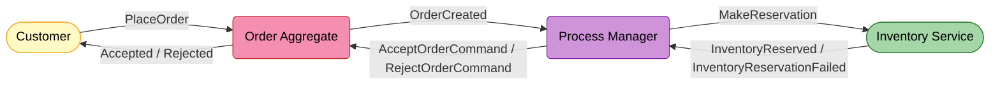

**Two things this service owns:**

| | What it is |
|--|-----------|
| **Order aggregate** | The canonical purchase record — `ReservingInventory → ProcessingPayment → Accepted / Rejected` |
| **Process Manager** (`OrderSaga`) | Listens to events, issues commands — pure routing, no business logic |

---

## Two Command Rails

> The single most important implementation detail. The Process Manager issues **two different kinds of command**, dispatched over **two different transports**.

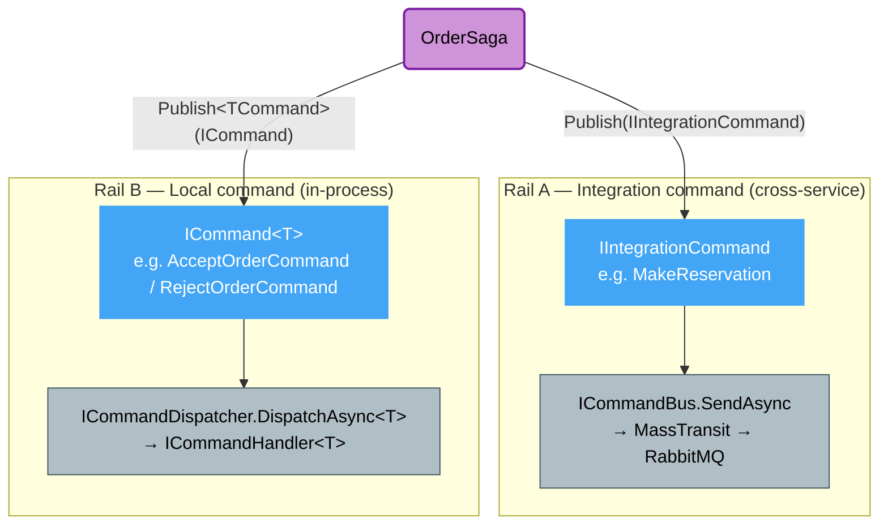

| | Rail A — Integration command | Rail B — Local command |
|--|------------------------------|------------------------|
| Marker | `IIntegrationCommand` | `ICommand` / `ICommand<T>` |
| Buffer in saga | `_unpublishedIntegrationCommands` | `_unpublishedCommands` |
| Flushed by | `saga.PublishAsync(ICommandBus)` | `saga.PublishAsync(ICommandDispatcher)` |
| Transport | MassTransit → RabbitMQ → another service | In-process `ICommandHandler<T>` resolved from DI |
| Examples | `MakeReservation`, *(planned)* `ConfirmReservationCommand`, `ReleaseReservationCommand` | `AcceptOrderCommand`, `RejectOrderCommand` |

---

## Event Storming — Place Order Flow (current)

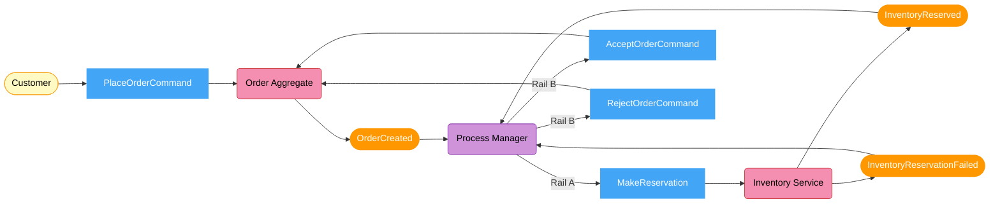

### Policies — When / Then Rules (current)

| When this event | Then issue this command | Rail |
|----------------|------------------------|------|
| `OrderCreated` | `MakeReservation` → Inventory | A |
| `InventoryReserved` | `StartOrderPaymentCommand` → Order (Order → `ProcessingPayment`) | B |
| `InventoryReservationFailed` | `RejectOrderCommand` → Order | B |
| Saga expiry (15 min, no reply) | `RejectOrderCommand` → Order | B |

> **No release on `InventoryReservationFailed`.** In the deduct-on-order model, a failed reservation deducted **nothing**, so there is nothing to compensate. Release becomes relevant only **after a successful reservation** (payment-fail / cancel) — see [Roadmap](#roadmap--next-steps).

---

## Domain Model

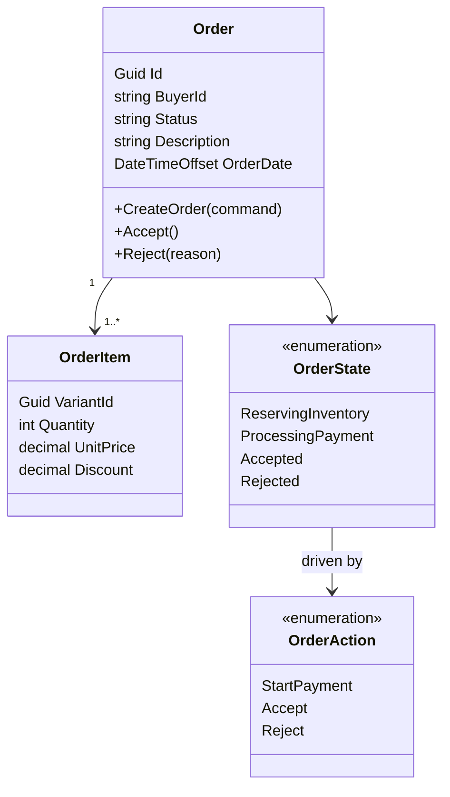

`Order` is `IExcludedFromScoping` + `IDateTracking`; status is stored as the enum **name** string (`ReservingInventory` / `ProcessingPayment` / `Accepted` / `Rejected`).

State transitions are guarded by `OrderStateMachine` (Stateless) — `OnUnhandledTrigger` throws `DomainException` if the transition is invalid (e.g. accepting a rejected order).

---

## Order Lifecycle

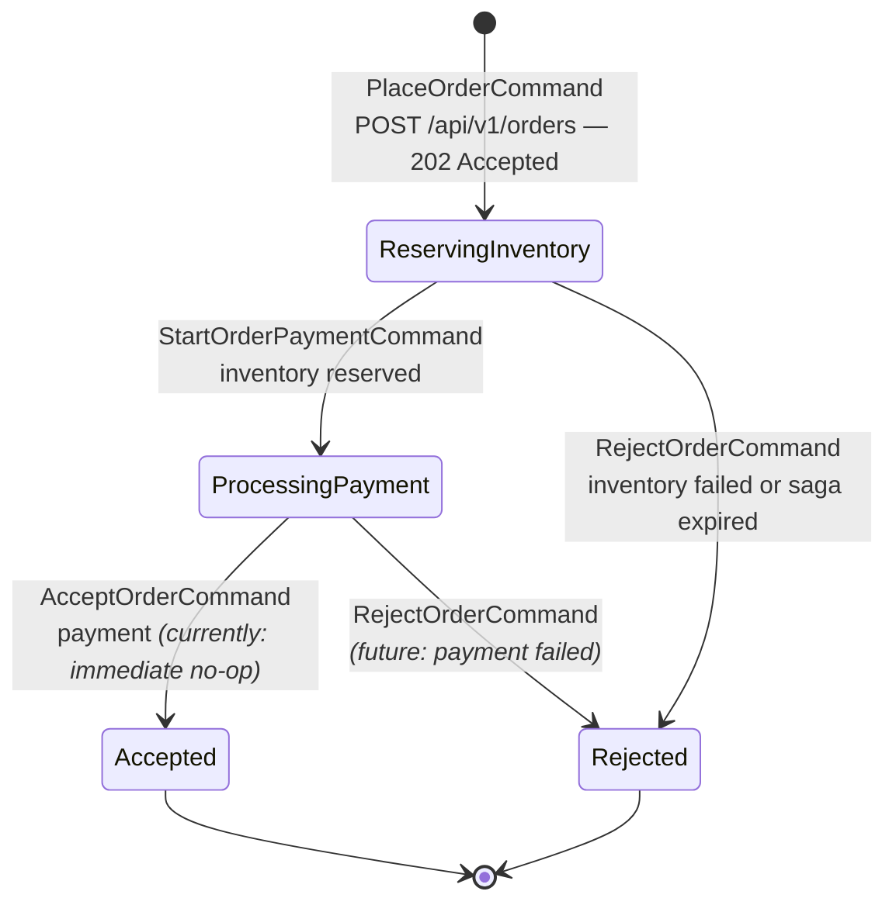

> Buyer gets `202 Accepted` immediately. `Accepted` / `Rejected` resolves asynchronously once the saga runs.

---

## Process Manager — How It Works

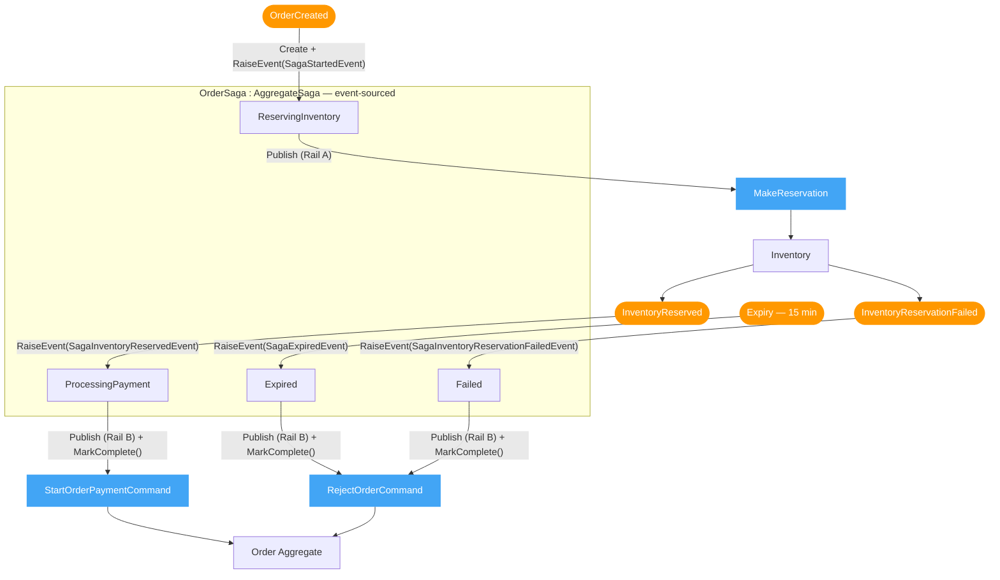

| Question | Answer |
|----------|--------|
| What does a Process Manager do? | Listens to events, issues commands — no business logic, pure routing |
| Where is its state? | Event-sourced — rebuilt from `SagaStartedEvent`, `SagaInventoryReservedEvent`, `SagaInventoryReservationFailedEvent`, `SagaExpiredEvent` via `Apply(...)` |
| How is it identified? | `OrderSagaId.FromOrderId(orderId)` — deterministic `EventFlow.Identity` (namespace GUID + orderId), no extra lookup |
| Duplicate event delivered twice? | `IsNew` guard on load; on create, the handler checks `!existingSaga.IsNew` and no-ops |

---

## Saga Lifecycle

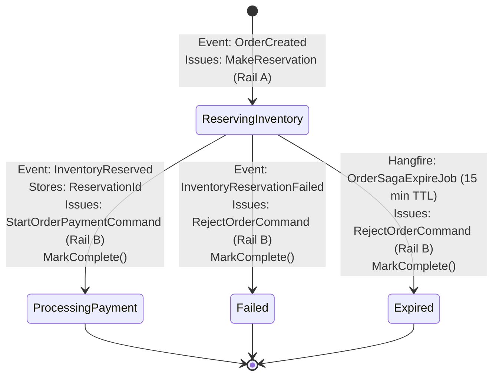

> `ProcessingPayment` is the terminal state for the current (no-payment) happy path. When the payment step lands, the saga will **wait** in `ProcessingPayment` instead of immediately completing — see [Roadmap](#roadmap--next-steps).

---

## Saga Expiry (Timeout)

The `OrderSagaExpireJob` (Hangfire delayed job) is scheduled 15 minutes after `OrderCreated`. It is idempotent:

1. Load the saga. If already completed or not found → no-op.
2. If the saga is **not** in `ReservingInventory` (already advanced) → no-op.
3. Otherwise fire `HandleExpire()` → `SagaExpiredEvent` → `RejectOrderCommand` → `MarkComplete()`.

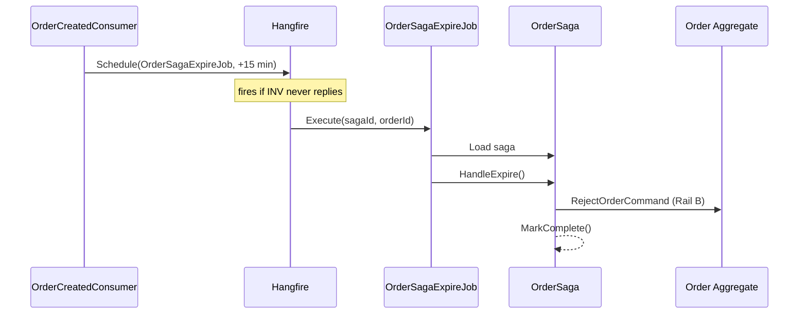

---

## CorrelationId / Tracing

Every message in the Order flow carries `OrderId` as the MassTransit envelope `CorrelationId`. This is wired via `bus.SendTopology.UseCorrelationId<T>(x => x.OrderId)` in each service's bus configuration — no domain interface needed.

| Service | Messages stamped | Filter |
|---------|-----------------|--------|
| **Order** | `OrderCreated`, `MakeReservation`, `ReleaseReservationCommand` | `CorrelationIdLogEnrichFilter<T>` |
| **Inventory** | `InventoryReserved`, `InventoryReservationFailed`, `ReservationExpired` | `CorrelationIdLogEnrichFilter<T>` |

`CorrelationIdLogEnrichFilter<T>` (in `EShop.Shared.EventBus`) pushes `context.CorrelationId` into Serilog's `LogContext` for every consumer, so all log entries within a handler automatically carry `CorrelationId`.

OpenTelemetry spans from MassTransit are collected via `.AddSource("MassTransit")` in `EShop.ServiceDefaults`.

---

## End-to-End Sequence

### Happy Path (current)

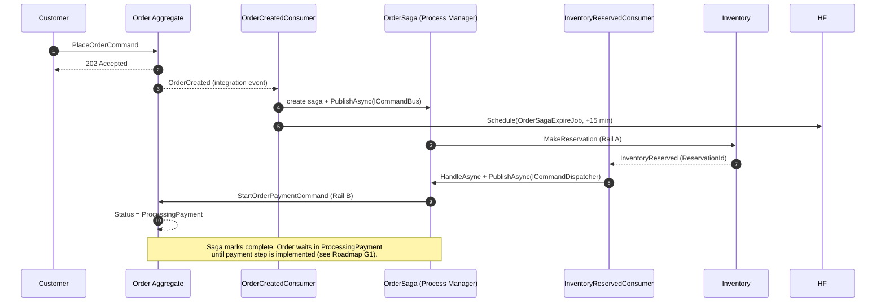

### Compensation — Inventory Failed (current)

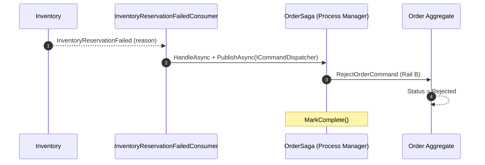

### Compensation — Saga Expiry (current)

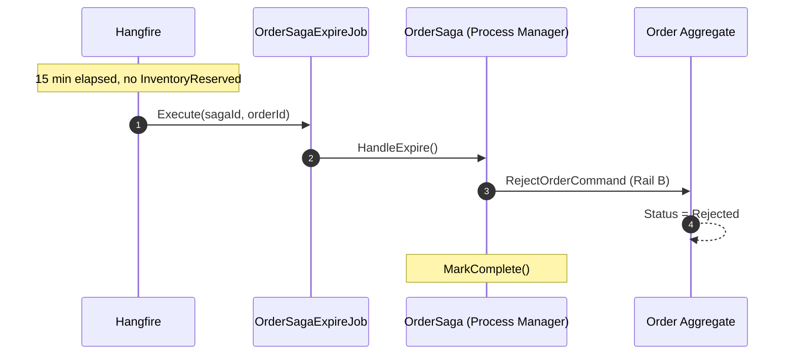

---

## State Machines

Both aggregates use the **Stateless** library with an accessor/mutator constructor so the machine always reads from (and writes back to) the persisted `Status` string.

### `OrderStateMachine` (Order aggregate)

```
ReservingInventory --[StartPayment]--> ProcessingPayment
ReservingInventory --[Reject]-----------> Rejected
ProcessingPayment  --[Accept]-----------> Accepted
ProcessingPayment  --[Reject]-----------> Rejected
```

`OnUnhandledTrigger` throws `DomainException` — invalid transitions are caught at the domain layer.

### `OrderSagaStateMachine` (OrderSaga)

```
ReservingInventory --[InventoryReserved]-----------> ProcessingPayment
ReservingInventory --[InventoryReservationFailed]--> Failed
ReservingInventory --[Expire]---------------------> Expired
```

State is rebuilt during event replay: each `Apply(*)` method calls `State.Fire(trigger)` to advance the machine. `CanFire(trigger)` is checked in every `Handle*` method before raising domain events.

---

## Code Map

| Concern | Type | File |
|---------|------|------|
| Order aggregate | `Order : AggregateRoot<Guid>` | `Order.Domain/Aggregates/Order.cs` |
| Order state machine | `OrderStateMachine : StateMachine<OrderState, OrderAction>` | `Order.Domain/StateMachines/OrderStateMachine.cs` |
| Saga (Process Manager) | `OrderSaga : AggregateSaga, IScoped` | `Order.Domain/Sagas/OrderSaga.cs` |
| Saga identity | `OrderSagaId : Identity<OrderSagaId>` | `Order.Domain/Sagas/OrderSagaId.cs` |
| Saga state machine | `OrderSagaStateMachine : StateMachine<OrderSagaState, OrderSagaTrigger>` | `Order.Domain/StateMachines/OrderSagaStateMachine.cs` |
| Saga domain events | `SagaStartedEvent`, `SagaInventoryReservedEvent`, `SagaInventoryReservationFailedEvent`, `SagaExpiredEvent` | `Order.Domain/Sagas/DomainEvents/` |
| Saga expiry job | `OrderSagaExpireJob` | `Order.Infrastructure/BackgroundJobs/OrderSagaExpireJob.cs` |
| Correlation filter | `CorrelationIdLogEnrichFilter<T>` | `Shared/EShop.Shared.EventBus/Filters/` |
| Start trigger | `OrderCreatedConsumer` → `OrderCreatedEventHandler` | `Order.Infrastructure/Consumers/`, `Order.Application/UseCases/V1/Events/` |
| Success trigger | `InventoryReservedConsumer` | `Order.Infrastructure/Consumers/InventoryReservedConsumer.cs` |
| Failure trigger | `InventoryReservationFailedConsumer` | `Order.Infrastructure/Consumers/InventoryReservationFailedConsumer.cs` |
| Local command handlers | `StartOrderPaymentCommandHandler`, `AcceptOrderCommandHandler`, `RejectOrderCommandHandler` | `Order.Application/UseCases/V1/Commands/` |
| Two command rails | `AggregateSaga.Publish` / `PublishAsync` overloads | `Shared/EShop.Shared.DomainTools/Sagas/AggregateSagas/AggregateSaga.cs` |

---

## Message Contracts (current)

| Message | Kind | Sender | Receiver |
|---------|------|--------|----------|
| `OrderCreated` | Integration event | Order Aggregate | Process Manager |
| `MakeReservation` | Integration command | Process Manager | Inventory |
| `InventoryReserved` | Integration event | Inventory | Process Manager |
| `InventoryReservationFailed` | Integration event | Inventory | Process Manager |
| `StartOrderPaymentCommand` | Local command | Process Manager | Order Aggregate |
| `AcceptOrderCommand` | Local command | Process Manager | Order Aggregate |
| `RejectOrderCommand` | Local command | Process Manager | Order Aggregate |
| `ReleaseReservationCommand` | Integration command | *(saga — planned)* | Inventory |
| `ConfirmReservationCommand` | Integration command | *(saga — planned)* | Inventory |

All contracts live in `Shared/src/EShop.Shared.Contracts/Services/Order/` and `/Saga/`.

---

## Roadmap — Next Steps

> Target design: a real payment step exists between inventory reservation and order confirmation.

### Gap analysis

| # | Gap | Status |
|---|-----|--------|
| G1 | **No payment-awaiting step.** Happy path goes straight to `Accepted`. Saga completes in `ProcessingPayment`. | Open |
| G2 | `ConfirmReservationCommand` contract exists but is never issued. Reservation stays `Pending`. | Open |
| G3 | `ReleaseReservationCommand` is never issued on payment-fail / cancel. Reserved stock is only released by the Inventory TTL expiry job. | Open |
| G4 | ~~Success-path saga never `MarkComplete()`s.~~ | **Resolved** |
| G5 | ~~No saga expiry. If Inventory never replies, the order hangs indefinitely.~~ | **Resolved** — `OrderSagaExpireJob` (Hangfire, 15 min) |

### Target saga (payment-aware)

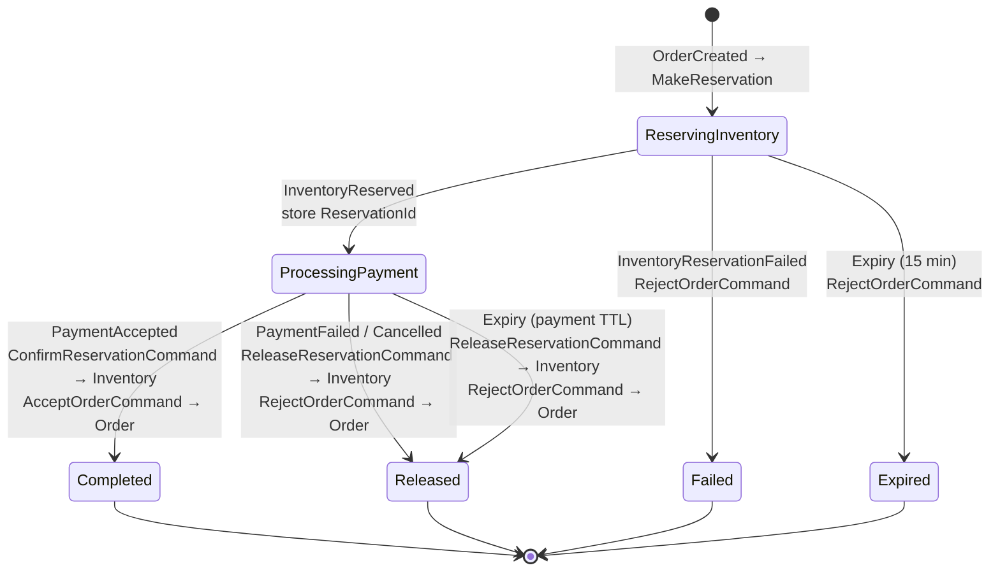

### Target policies (payment-aware)

| When this event | Then issue | Rail |
|-----------------|-----------|------|
| `OrderCreated` | `MakeReservation` → Inventory | A |
| `InventoryReserved` | `StartOrderPaymentCommand` → Order *(transition to `ProcessingPayment`, then wait for payment)* | B |
| `InventoryReservationFailed` | `RejectOrderCommand` → Order | B |
| `PaymentAccepted` | `ConfirmReservationCommand` → Inventory **+** `AcceptOrderCommand` → Order | A + B |
| `PaymentFailed` / `OrderCancelled` | `ReleaseReservationCommand` → Inventory **+** `RejectOrderCommand` → Order | A + B |
| Saga expiry (payment TTL) | `ReleaseReservationCommand` → Inventory **+** `RejectOrderCommand` → Order | A + B |

### Suggested implementation order

1. **Add `PaymentAccepted` / `PaymentFailed` events and saga consumers** — wire `ProcessingPayment` as a true waiting state (G1, G2).
2. **Issue `ReleaseReservationCommand`** on payment-fail / cancel (G3).
3. **Add a second saga expiry** scoped to `ProcessingPayment` — fires if no payment arrives within TTL.

> Inventory already implements the receiving side of `ConfirmReservationCommand` / `ReleaseReservationCommand`. See the [Inventory Service README](../../../Inventory/src/EShop.Inventory.API/README.md#order-process-manager-integration).

---

## API

| Method | Path | Response | Note |
|--------|------|----------|------|
| `POST` | `/api/v1/orders` | `202 Accepted { orderId }` | Async — saga resolves after the response |
