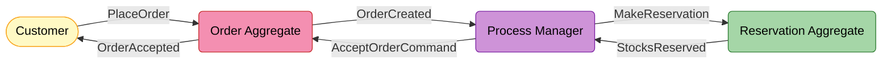
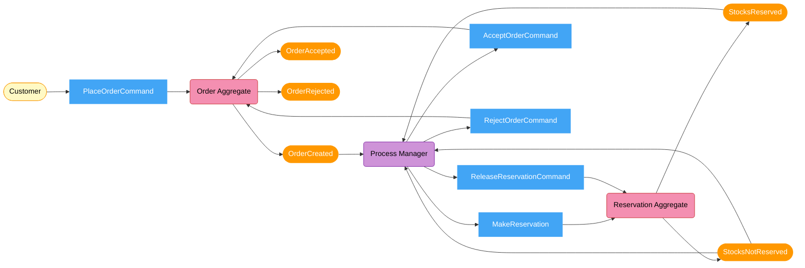
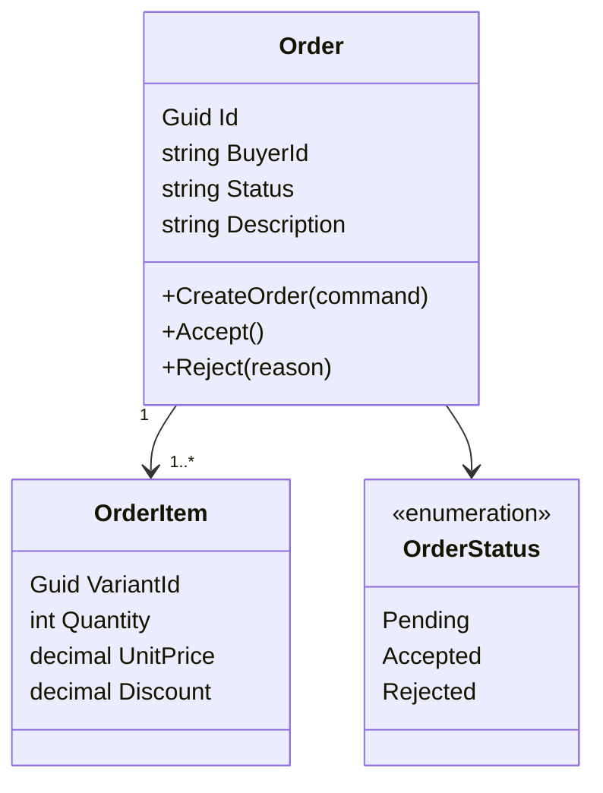
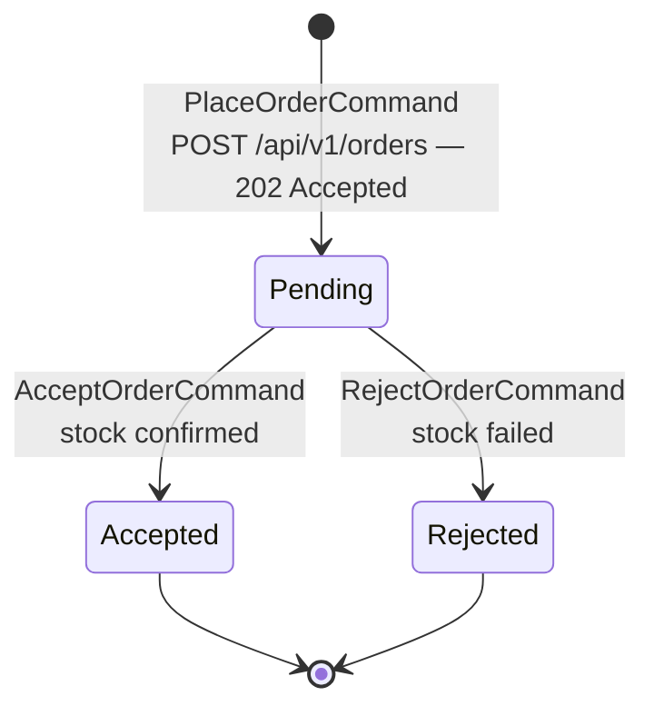
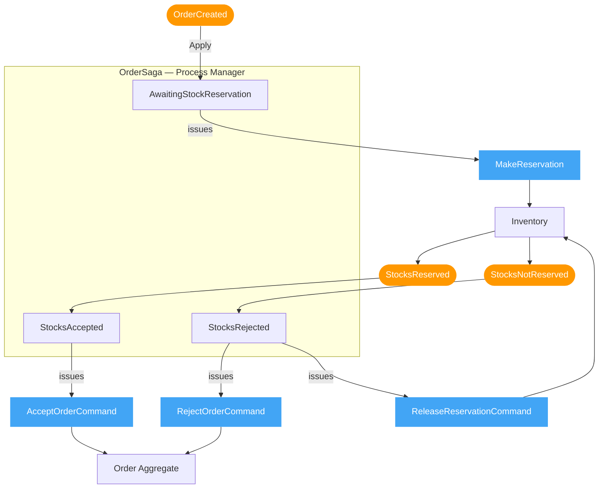
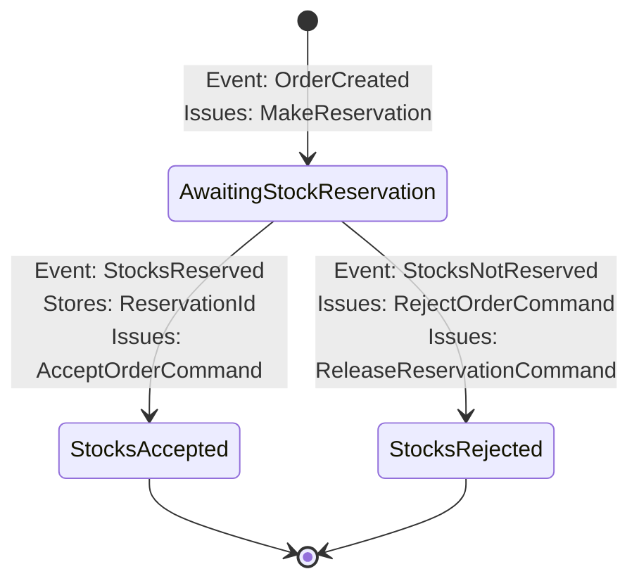
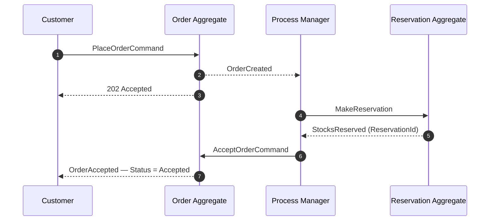
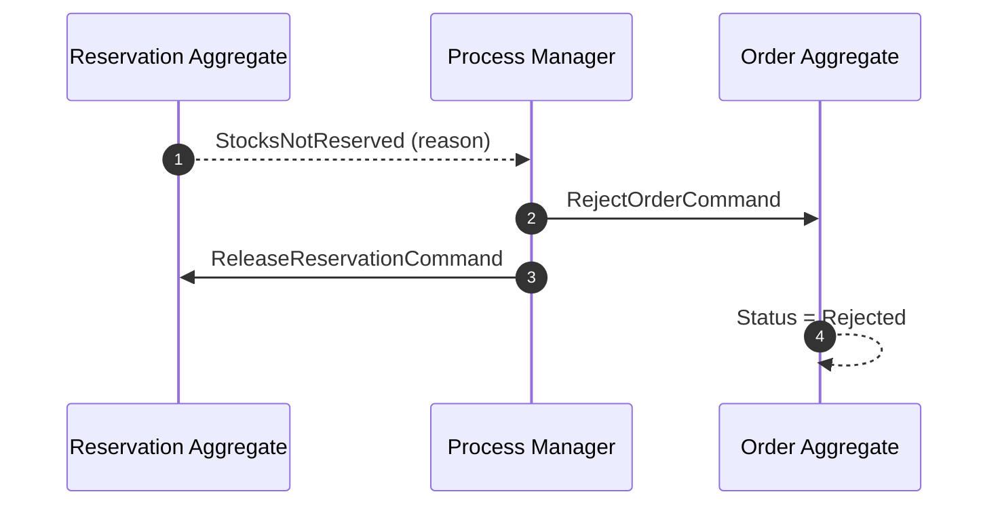

# Order Service

> Accepts orders from buyers and coordinates stock reservation with the Inventory service via a **Process Manager** before confirming the order.

> Reference: [CQRS Journey — Chapter 6: Sagas and Process Managers](https://learn.microsoft.com/en-us/previous-versions/msp-n-p/jj591569(v=pandp.10))

---

## What This Service Does

**Two things this service owns:**

| | What it is |
|--|-----------|
| **Order aggregate** | The canonical purchase record — `Pending → Accepted / Rejected` |
| **Process Manager** (`OrderSaga`) | Listens to events, issues commands — no business logic |

---

## Event Storming — Place Order Flow

### Policies — When / Then Rules

| When this event | Then issue this command |
|----------------|------------------------|
| `OrderCreated` | `MakeReservation` to Inventory |
| `StocksReserved` | `AcceptOrderCommand` to Order |
| `StocksNotReserved` | `RejectOrderCommand` to Order |
| `StocksNotReserved` | `ReleaseReservationCommand` to Inventory (compensation) |
| `PaymentAccepted` *(follow-up)* | `ConfirmReservationCommand` to Inventory |
| `PaymentFailed` *(follow-up)* | `ReleaseReservationCommand` to Inventory |

---

## Domain Model

---

## Order Lifecycle

> Buyer gets `202 Accepted` immediately. `Accepted` / `Rejected` resolves asynchronously.

---

## Process Manager — How It Works

| Question | Answer |
|----------|--------|
| What does a Process Manager do? | Listens to events, issues commands — no business logic, pure routing |
| Where is its state? | Event-sourced — rebuilt from `OrderSagaStartedEvent`, `StockReservedEvent`, `StockReservationFailedEvent` |
| How is it identified? | `OrderSagaId.FromOrderId(orderId)` — deterministic, no extra lookup |
| Duplicate `OrderCreated` delivered twice? | `IsNew` guard — second delivery is a no-op |

---

## Saga Lifecycle

---

## End-to-End Sequence

### Happy Path

### Compensation — Stock Failed

---

## Message Contracts

| Message | Kind | Sender | Receiver |
|---------|------|--------|----------|
| `OrderCreated` | Event | Order Aggregate | Process Manager |
| `MakeReservation` | Command | Process Manager | Inventory |
| `StocksReserved` | Event | Inventory | Process Manager |
| `StocksNotReserved` | Event | Inventory | Process Manager |
| `AcceptOrderCommand` | Command | Process Manager | Order Aggregate |
| `RejectOrderCommand` | Command | Process Manager | Order Aggregate |
| `ReleaseReservationCommand` | Command | Process Manager | Inventory |

---

## API

| Method | Path | Response | Note |
|--------|------|----------|------|
| `POST` | `/api/v1/orders` | `202 Accepted { orderId }` | Async — saga resolves after response |
