# Order

> Owns the **purchase order** and orchestrates its end-to-end fulfilment — reserving stock with Inventory and scheduling payment with Finance — via an event-sourced **Process Manager**, before resolving the order to `Accepted` or `Rejected`.

> Reference: [CQRS Journey — Chapter 6: Sagas and Process Managers](https://learn.microsoft.com/en-us/previous-versions/msp-n-p/jj591569(v=pandp.10))

---

## What This Service Does

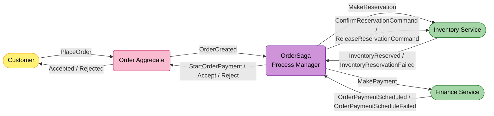

---

## Strategic Design

### Context Classification

| Aspect | Value |
|--------|-------|
| **Bounded Context** | Order |
| **Domain Type** | Core Domain |
| **Aggregate Roots** | `Order`, `OrderSaga` (Process Manager) |
| **Multi-tenancy** | `Order` is `IExcludedFromScoping`; `OrderSaga` is `IScoped` |
| **Persistence** | EF Core (PostgreSQL) for `Order`; Event Sourcing (PostgreSQL `EventStores`) for `OrderSaga` |
| **Read Model** | None |
| **Architecture Style** | Clean Architecture + Process Manager (event-sourced saga) |

### Bounded Context Map

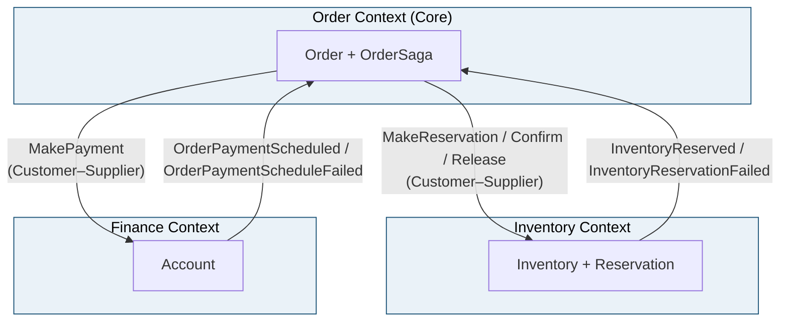

> The Order saga is **upstream** (the customer) of both Inventory and Finance — it issues commands and reacts to their reply events. Neither downstream service knows about the saga; they answer the message types they're given.

### Ubiquitous Language

| Term | Definition |
|------|------------|
| **Order** | The canonical purchase record for a buyer. Lifecycle `ReservingInventory → ProcessingPayment → Accepted / Rejected`. |
| **OrderSaga** | The Process Manager. Listens to events and issues commands — pure routing, no business rules. Event-sourced and identified deterministically from the order id. |
| **Process Manager** | A stateful coordinator that turns events into the next command(s); distinct from a stateless routing slip. |
| **Reservation** | The stock hold Inventory creates for an order. Confirmed on payment success, released on failure. |
| **Payment schedule** | The instalment plan Finance builds for the order total; "scheduled" is the success signal for this milestone (collection is a later Finance ticket). |
| **Compensation** | The undo path: on failure the saga rejects the order and releases the reservation. |
| **Command rail** | The transport a command travels on — **integration** (cross-service, RabbitMQ) or **local** (in-process handler). |

---

## Event Storming

### Participants & Roles

| Role | Contribution | Artifact Ownership |
|------|--------------|--------------------|
| **Product Owner** | Validates that events and policies match real-world checkout behaviour | Ubiquitous Language, Policies |
| **Business Analyst** | Clarifies edge cases (payment fails, stock gone, timeouts), maps the buyer journey | Actor mapping, Hotspots |
| **Solution Architect** | Ensures Order/Inventory/Finance boundaries and the two command rails are sound | Aggregate boundaries, Context Map |
| **Developer** | Translates sticky notes into the saga, state machines, and consumers | Commands, Events, State Machines |

### Legend

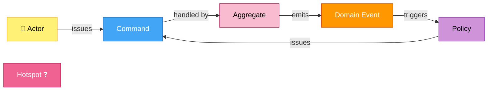

### Actors

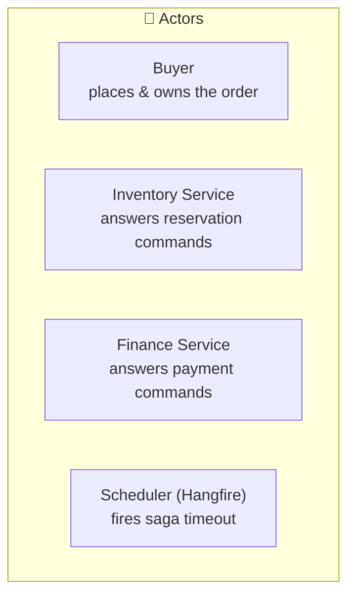

| Actor | Interacts With | Example Scenario |
|-------|----------------|------------------|
| **Buyer** | `Order` aggregate | *As a buyer, I want to place an order, so that my items are reserved and paid for.* |
| **Inventory Service** | `OrderSaga` | *As Inventory, I reply `InventoryReserved`/`InventoryReservationFailed` so the saga knows if stock is held.* |
| **Finance Service** | `OrderSaga` | *As Finance, I reply `OrderPaymentScheduled`/`OrderPaymentScheduleFailed` so the saga can confirm or compensate.* |
| **Scheduler (Hangfire)** | `OrderSaga` | *As the scheduler, I fire a 15-minute timeout so a never-answered reservation can't hang forever.* |

### Order Aggregate — Event Flow

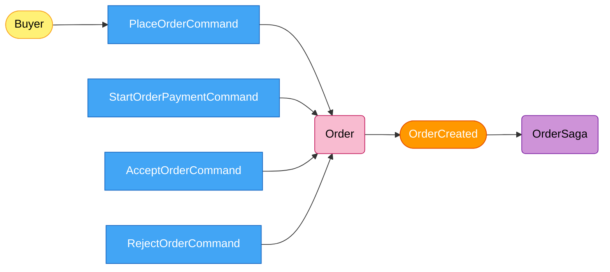

> `Order` is **not** event-sourced — `OrderCreated` is published as an integration event by `PlaceOrderCommandHandler` after the aggregate is saved via EF Core. State changes (`StartPayment`/`Accept`/`Reject`) are driven by local commands from the saga.

### OrderSaga (Process Manager) — Event Flow

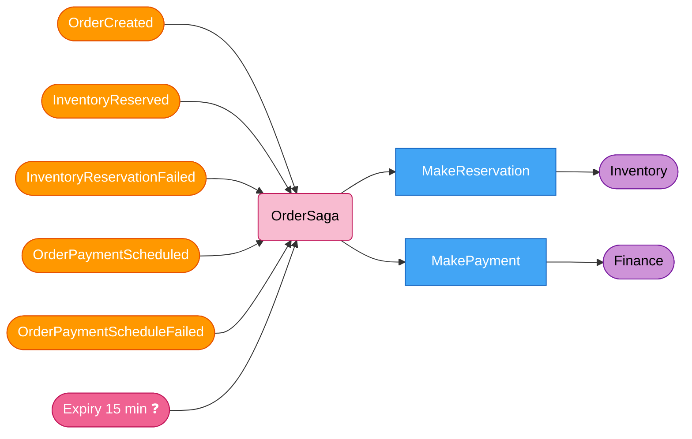

### Two Command Rails

> The single most important implementation detail. The Process Manager issues **two kinds of command** over **two transports**, buffered separately and flushed by two `PublishAsync` overloads.

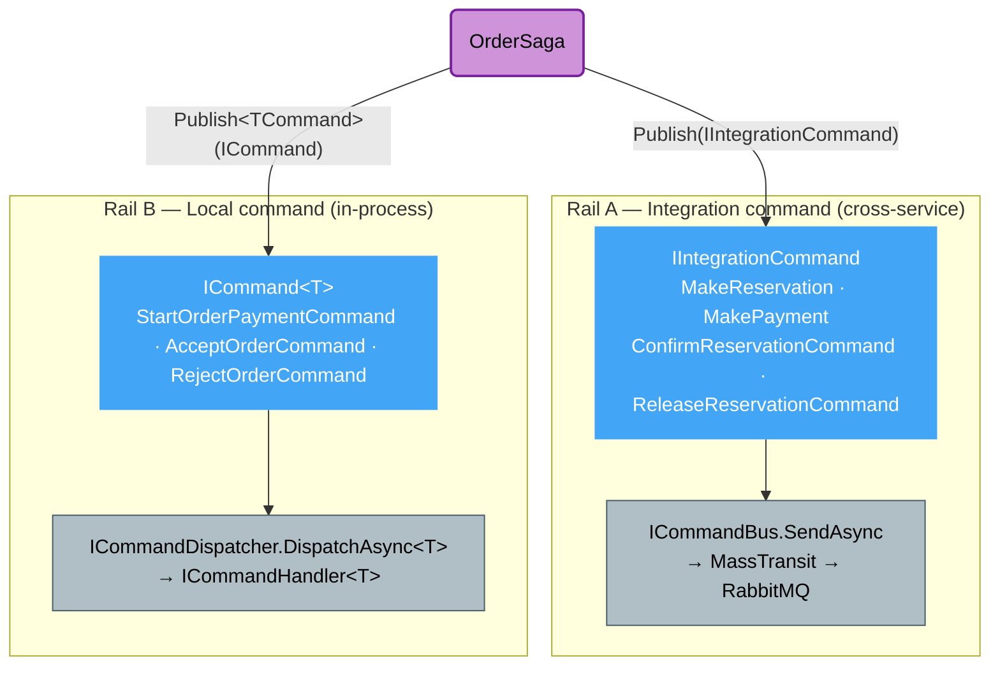

| | Rail A — Integration command | Rail B — Local command |
|--|------------------------------|------------------------|
| Marker | `IIntegrationCommand` | `ICommand` / `ICommand<T>` |
| Buffer in saga | `_unpublishedIntegrationCommands` | `_unpublishedCommands` |
| Flushed by | `saga.PublishAsync(ICommandBus)` | `saga.PublishAsync(ICommandDispatcher)` |
| Transport | MassTransit → RabbitMQ → another service | In-process `ICommandHandler<T>` from DI |
| Examples | `MakeReservation`, `MakePayment`, `ConfirmReservationCommand`, `ReleaseReservationCommand` | `StartOrderPaymentCommand`, `AcceptOrderCommand`, `RejectOrderCommand` |

Each reply consumer flushes **both** rails: `await saga.PublishAsync(commandDispatcher, ct); await saga.PublishAsync(commandBus, ct);`

### Policies — When / Then Rules

| When this event | Then issue this command | Rail / Transport |
|-----------------|-------------------------|------------------|
| `OrderCreated` | `MakeReservation` → Inventory | A — MassTransit |
| `InventoryReserved` | `StartOrderPaymentCommand` → Order **+** `MakePayment` → Finance | B + A |
| `InventoryReservationFailed` | `RejectOrderCommand` → Order | B |
| `OrderPaymentScheduled` | `AcceptOrderCommand` → Order **+** `ConfirmReservationCommand` → Inventory | B + A |
| `OrderPaymentScheduleFailed` | `RejectOrderCommand` → Order **+** `ReleaseReservationCommand` → Inventory | B + A |
| Saga expiry (15 min, no reservation reply) | `RejectOrderCommand` → Order | B — Hangfire |

> **No release on `InventoryReservationFailed`.** In the deduct-on-order model a failed reservation deducted nothing, so there is nothing to compensate. Release applies only **after** a successful reservation — i.e. on `OrderPaymentScheduleFailed`.

---

## Domain Model

### Aggregate Structure

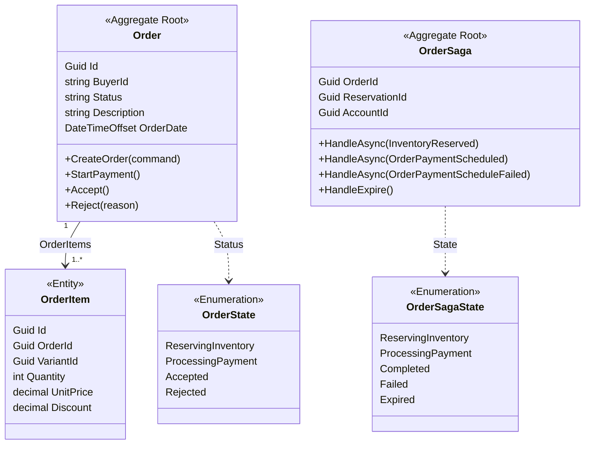

### Building Blocks

| Building Block | Type | Identity | Rationale |
|----------------|------|----------|-----------|
| `Order` | **Aggregate Root** | `Guid Id` | Consistency boundary for a purchase; owns its items and lifecycle. |
| `OrderItem` | **Entity** | `Guid Id` (child of `Order`) | A line within an order; only meaningful inside its `Order`. |
| `OrderSaga` | **Aggregate Root** (Process Manager) | `OrderSagaId` (deterministic from `OrderId`) | Event-sourced coordinator; rebuilt from its saga events. |
| `OrderState` / `OrderAction` | **Enumeration** | Enum value | Order lifecycle states and the triggers that move them. |
| `OrderSagaState` / `OrderSagaTrigger` | **Enumeration** | Enum value | Saga lifecycle states and triggers. |
| `SagaStartedEvent`, `SagaInventoryReservedEvent`, `SagaInventoryReservationFailedEvent`, `SagaPaymentScheduledEvent`, `SagaPaymentScheduleFailedEvent`, `SagaExpiredEvent` | **Domain Event** | By attributes | The event-sourced facts the saga replays to rebuild its state. |

---

## State Machines

Both aggregates use the **Stateless** library. `Order` uses an accessor/mutator constructor so the machine always reads from and writes back to the persisted `Status` string; `OrderSaga` advances its machine during event replay (`Apply(*)` → `State.Fire(trigger)`). Every `Handle*` method checks `CanFire(trigger)` first and throws `DomainException` on an illegal transition.

### Order State Machine

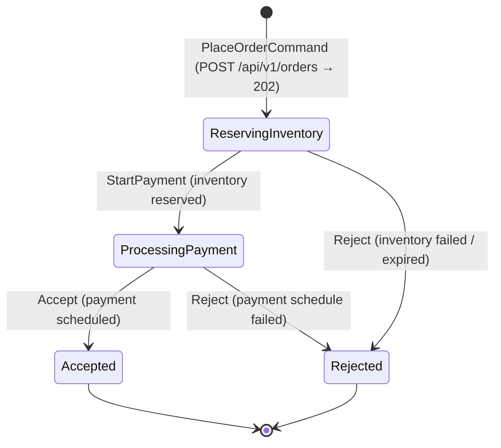

### OrderSaga State Machine

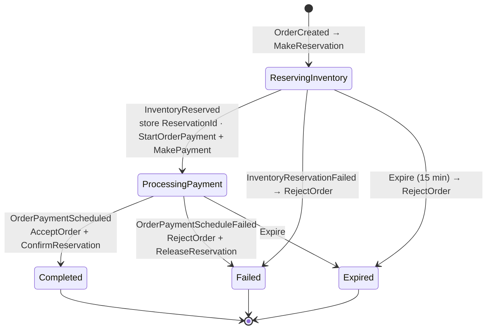

> The saga now **waits** in `ProcessingPayment` for Finance's reply (it no longer completes on `InventoryReserved`). It completes on `OrderPaymentScheduled` (`Completed`) or compensates on `OrderPaymentScheduleFailed` (`Failed`).

---

## Specifications & Invariants

The Order context enforces its invariants through **state machines**, not separate `Specification` classes: an illegal transition is rejected at the domain boundary.

- `Order.State` (`OrderStateMachine`) — `OnUnhandledTrigger` throws `DomainException` (e.g. accepting a `Rejected` order).
- `OrderSaga.State` (`OrderSagaStateMachine`) — each `Handle*` guards with `CanFire(trigger)` and throws `DomainException` if the reply arrives in the wrong state (e.g. `OrderPaymentScheduled` before `InventoryReserved`).

### Invariant Enforcement Flow

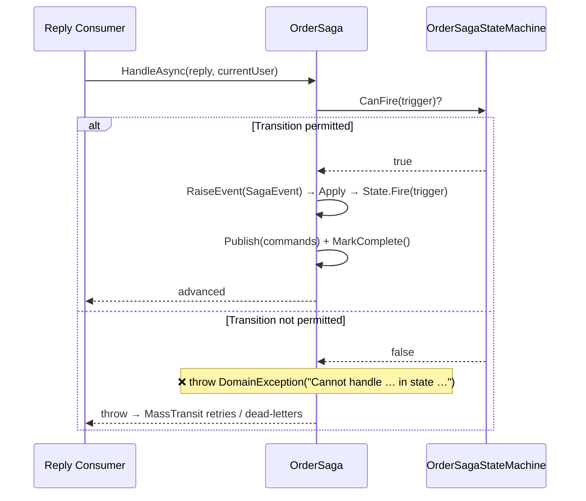

---

## Architecture

### Layer Overview

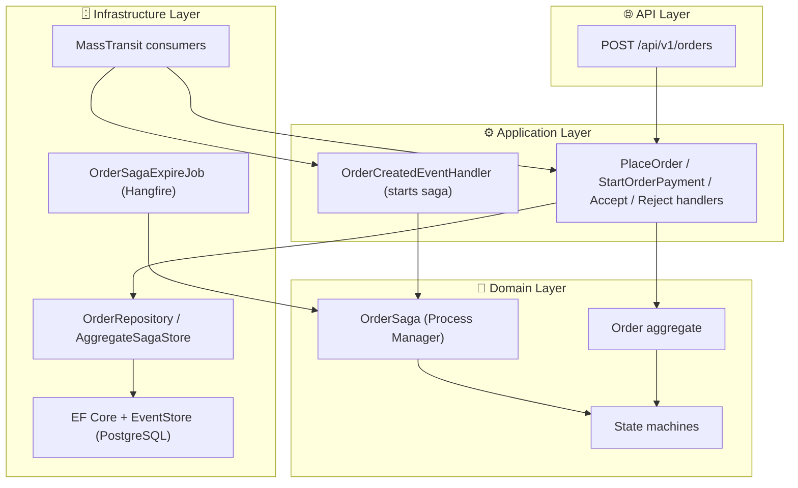

### Happy Path

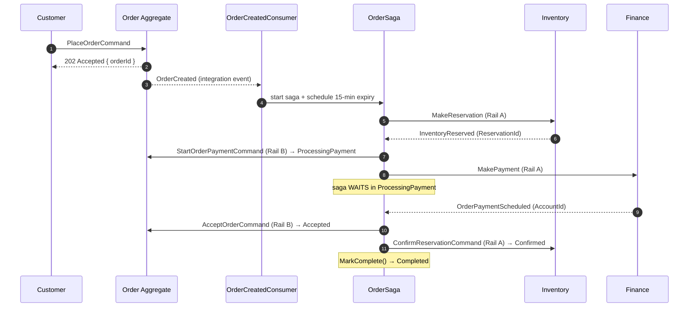

### Compensation — Payment Schedule Failed

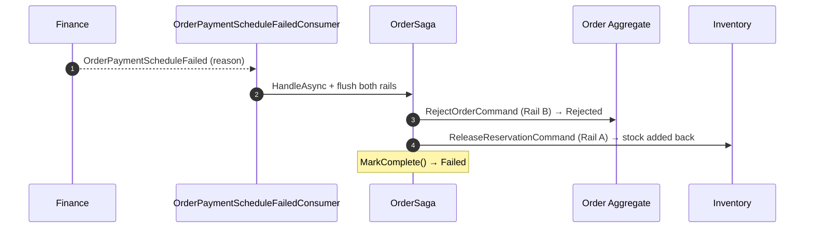

### Compensation — Inventory Failed

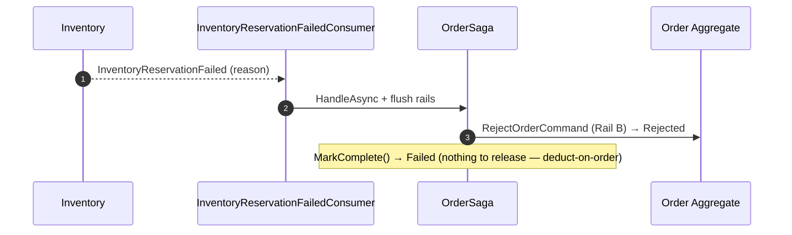

### Compensation — Saga Expiry

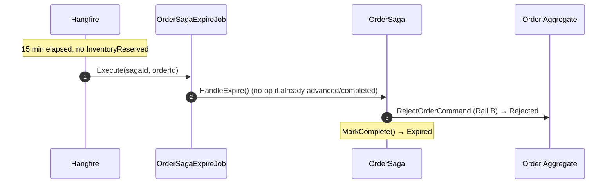

---

## Integration Events

| Direction | Contract | Meaning |
|-----------|----------|---------|
| **Out** | `OrderCreated` | An order was placed — consumed in-process to start the saga, which issues `MakeReservation`. |
| **Out** | `MakeReservation` | Ask Inventory to hold stock for the order. |
| **In** | `InventoryReserved` | Stock is held (carries `ReservationId`) — saga moves to `ProcessingPayment` and asks Finance to schedule payment. |
| **In** | `InventoryReservationFailed` | Stock could not be held — saga rejects the order. |
| **Out** | `MakePayment` | Ask Finance to open an account and schedule payment for the order total. |
| **In** | `OrderPaymentScheduled` | Finance built the schedule — saga accepts the order and confirms the reservation. |
| **In** | `OrderPaymentScheduleFailed` | Finance could not schedule — saga rejects the order and releases the reservation. |
| **Out** | `ConfirmReservationCommand` | Tell Inventory to confirm the hold (`Pending → Confirmed`). |
| **Out** | `ReleaseReservationCommand` | Tell Inventory to release the hold and add stock back (compensation). |

Contracts live in `Shared/src/EShop.Shared.Contracts/Services/Order/` and `Services/Order/Saga/`.

---

## Data Model

| Table | One row per | Key constraint |
|-------|------------|----------------|
| `Orders` | order | PK `Id`; `Status` stored as enum name |
| `OrderItems` | line within an order | PK `Id`; FK `OrderId` |
| `EventStores` | saga domain event | Append-only event stream keyed by `OrderSagaId` (saga is event-sourced) |

> `Order` is `IExcludedFromScoping` (not tenant-filtered); `OrderSaga` is `IScoped` and carries `TenantId`/`Scope`.

---

## Background Jobs

| Job | Schedule | What it does |
|-----|----------|-------------|
| `OrderSagaExpireJob` | Delayed +15 min after `OrderCreated` (Hangfire) | Loads the saga; if still in `ReservingInventory`, fires `HandleExpire()` → `RejectOrderCommand` → `Expired`. No-op if the saga has advanced or completed. |

---

## API

| Method | Path | Response | Note |
|--------|------|----------|------|
| `POST` | `/api/v1/orders` | `202 Accepted { orderId }` | Async — the saga resolves `Accepted`/`Rejected` after the response. |

---

## Configuration

| Key | Source | Purpose |
|-----|--------|---------|
| `ConnectionStrings:orderDatabase` / `DefaultConnection` | Aspire / appsettings | PostgreSQL connection (orders + event store + Hangfire). |
| `MasstransitConfiguration` / `rabbitmq` | appsettings | RabbitMQ connection. |
| `MessageBusOptions` | appsettings | Consumer retry policy (incremental). |

Send-topology stamps `OrderId` as the MassTransit `CorrelationId` for `OrderCreated`, `MakeReservation`, `ReleaseReservationCommand`, `ConfirmReservationCommand`, and `MakePayment`; `CorrelationIdLogEnrichFilter<T>` pushes it into Serilog's `LogContext` for every consumer.

---

## Tests

`Order/tests/EShop.Order.Tests` (xUnit + FluentAssertions + Moq) — 4 tests:

- `OrderSagaTests` — `InventoryReserved` moves to `ProcessingPayment` and stays running (publishes `StartOrderPayment` + `MakePayment`); `OrderPaymentScheduled` completes the saga and publishes `AcceptOrderCommand` + `ConfirmReservationCommand`; `OrderPaymentScheduleFailed` fails the saga and publishes `RejectOrderCommand` + `ReleaseReservationCommand`; a reply that arrives before `InventoryReserved` is rejected (`DomainException`).

```bash
dotnet test Order/tests/EShop.Order.Tests
```

---

## Roadmap

### Gap Analysis

| # | Gap | Status |
|---|-----|--------|
| G1 | **No payment-awaiting step.** | **Resolved** — saga waits in `ProcessingPayment` and consumes Finance's replies. |
| G2 | `ConfirmReservationCommand` never issued. | **Resolved** — issued on `OrderPaymentScheduled`. |
| G3 | `ReleaseReservationCommand` never issued on payment failure. | **Resolved** — issued on `OrderPaymentScheduleFailed`. |
| G4 | Success-path saga never `MarkComplete()`s. | **Resolved**. |
| G5 | No reservation-phase expiry. | **Resolved** — `OrderSagaExpireJob` (15 min). |
| G6 | **Hardcoded payment total.** The saga sends `MakePayment` with `TotalAmount = 1200, Currency = "VND"` instead of the real order total. | Open |
| G7 | **No payment-phase timeout.** If Finance never replies, the saga hangs in `ProcessingPayment` — the 15-min job only covers `ReservingInventory`. | Open |
| G8 | **Reply consumers rely on the `IsCompleted` guard** rather than an inbox; the `Pending`-status guard on Inventory makes confirm/release idempotent, but there is no inbox dedup on the saga side. | Open |

### Target Design

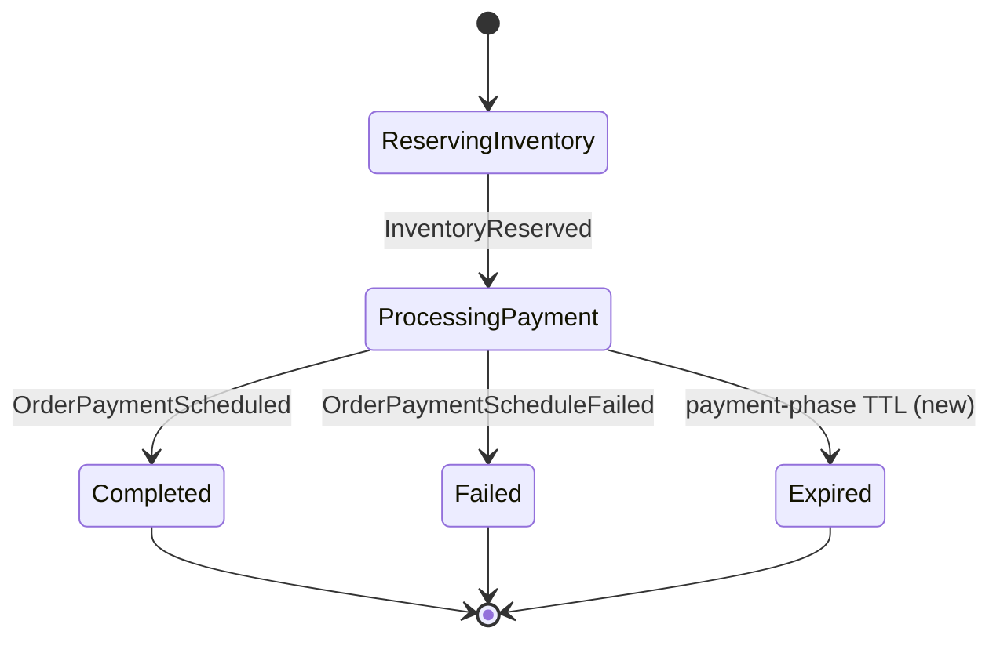

### Suggested Implementation Order

1. Carry the real order total on the saga (sum of `OrderCreated.Items`) and send it in `MakePayment` — closes G6.
2. Schedule a second `OrderSagaExpireJob` on entering `ProcessingPayment`, issuing `ReleaseReservationCommand` + `RejectOrderCommand` on timeout — closes G7.
3. Add inbox-based dedup to the reply consumers if at-least-once redelivery becomes a concern — closes G8.

---

## References

| Resource | Description |
|----------|-------------|
| [CQRS Journey — Sagas & Process Managers](https://learn.microsoft.com/en-us/previous-versions/msp-n-p/jj591569(v=pandp.10)) | Microsoft pattern guidance this saga follows |
| [Inventory Service README](../../../Inventory/src/EShop.Inventory.API/README.md) | The receiving side of `MakeReservation` / `Confirm` / `Release` |
| [Finance Service README](../../../Finance/src/EShop.Finance.API/README.md) | The receiving side of `MakePayment` and source of the reply events |
| [Domain-Driven Design](https://www.domainlanguage.com/ddd/) | Eric Evans — Original DDD book |
| [Event Storming](https://www.eventstorming.com/) | Alberto Brandolini — Discovery technique |
