# 🛒 Order Bounded Context

> **Order Aggregate** is the core aggregate root in the Order bounded context. It is created at the end of a **Place-Order Saga** — an orchestration process manager that coordinates stock reservation in the Inventory service before persisting the order.

---

## 📋 Table of Contents

- [Strategic Design](#-strategic-design)
- [Event Storming](#-event-storming)
- [Saga State Machine](#-saga-state-machine)
- [End-to-End Flow](#-end-to-end-flow)
- [Architecture — Process Manager Pattern](#-architecture--process-manager-pattern)
- [Message Contracts](#-message-contracts)
- [Tactical Design](#-tactical-design)
- [Key Design Decisions](#-key-design-decisions)

---

## 🗺 Strategic Design

### Bounded Context Map

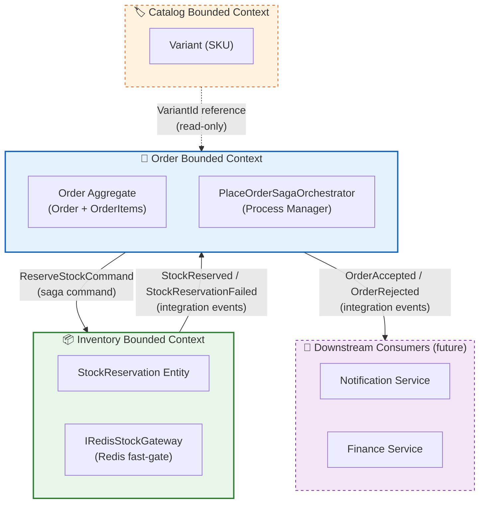

### Context Classification

| Aspect | Description |
|:-------|:------------|
| **Bounded Context** | Order |
| **Aggregate Root** | `Order` |
| **Domain Type** | Core Domain |
| **Persistence** | EF Core + PostgreSQL (write side) |
| **Saga Persistence** | `SagaStates` table — `PlaceOrderSagaState` (EF Core) |
| **Multi-tenancy** | `IExcludedFromScoping` — tenant propagated through saga context |
| **Saga Pattern** | Orchestration — Process Manager (no MassTransit native state machine) |

### Ubiquitous Language

| Term | Definition |
|:-----|:-----------|
| **Order** | A confirmed purchase intent, containing one or more OrderItems |
| **OrderItem** | A line item referencing a Catalog Variant (SKU), with quantity and price snapshot |
| **Saga** | Long-running process manager coordinating Order + Inventory across a distributed transaction |
| **Stock Reservation** | A temporary hold on inventory units pending order confirmation (TTL: 15 min) |
| **ReservationId** | A handle returned by Inventory identifying the reservation row — stored in saga state |
| **IdempotencyKey** | Equals `OrderId`; used by Inventory to detect duplicate `ReserveStockCommand` retries |
| **OrderSubmitted** | Trigger event that starts the saga — published by `PlaceOrderCommandHandler` |
| **OrderAccepted** | Terminal success event — stock reserved + order row persisted |
| **OrderRejected** | Terminal failure event — insufficient stock or saga timed out |

---

## 🔶 Event Storming

> **Phase 1 — Collaborative Discovery.** Event Storming maps the entire Place-Order flow across service boundaries. Notation follows [Alberto Brandolini's](https://www.eventstorming.com/) sticky-note convention.

### Legend

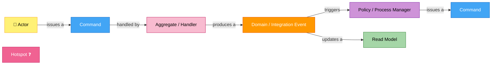

### Actors

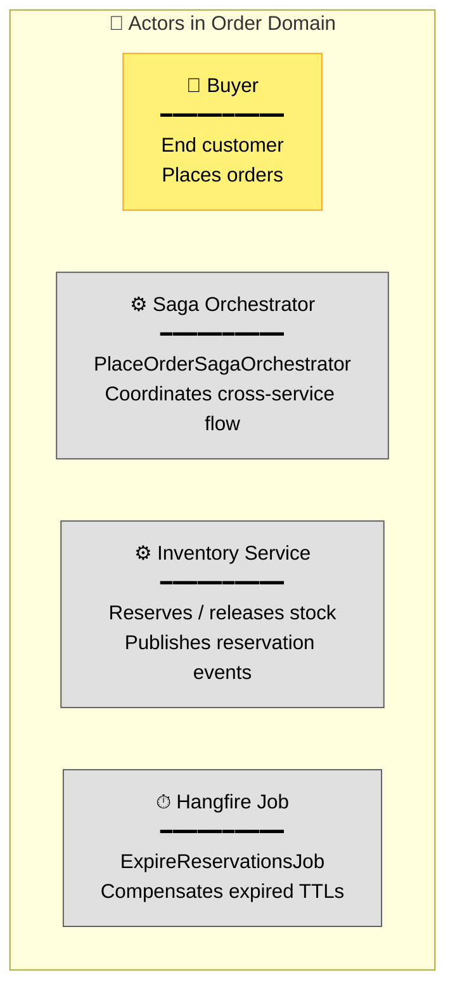

### Place-Order — Full Event Storm

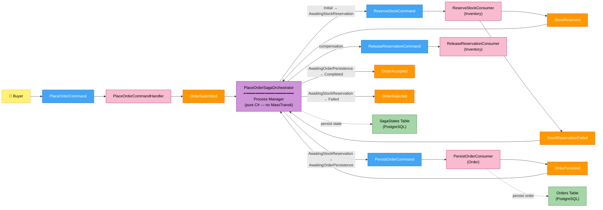

### Expiry Compensation — Event Storm

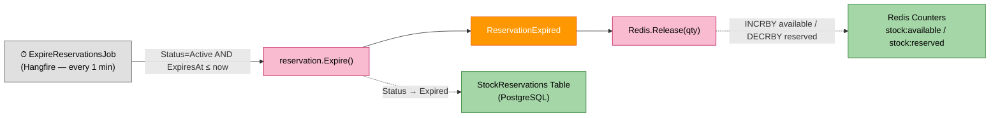

---

## 🔄 Saga State Machine

### State Diagram

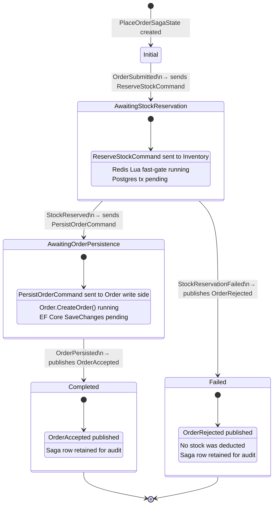

### State Reference

| State | Entry trigger | Exit triggers | Side effects on entry |
|:------|:-------------|:-------------|:----------------------|
| `Initial` | Row created | `OrderSubmitted` | — |
| `AwaitingStockReservation` | `OrderSubmitted` | `StockReserved`, `StockReservationFailed` | `ReserveStockCommand` sent |
| `AwaitingOrderPersistence` | `StockReserved` | `OrderPersisted` | `PersistOrderCommand` sent |
| `Completed` | `OrderPersisted` | — (terminal) | `OrderAccepted` published |
| `Failed` | `StockReservationFailed` | — (terminal) | `OrderRejected` published |

---

## ⚡ End-to-End Flow

### Happy Path — Sequence

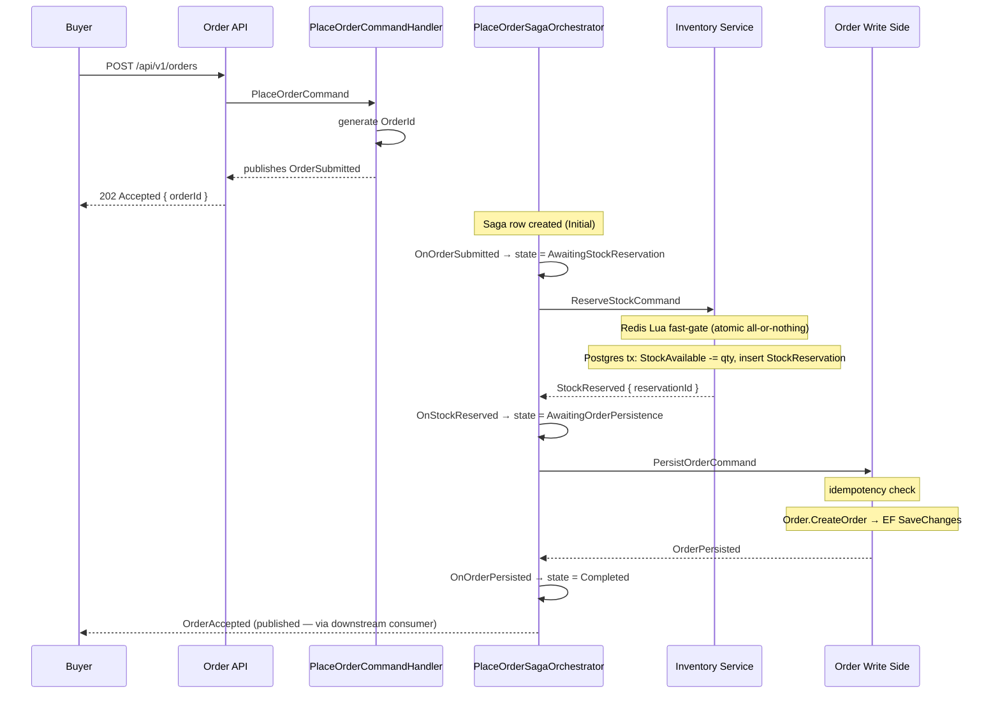

### Failure Path — Insufficient Stock

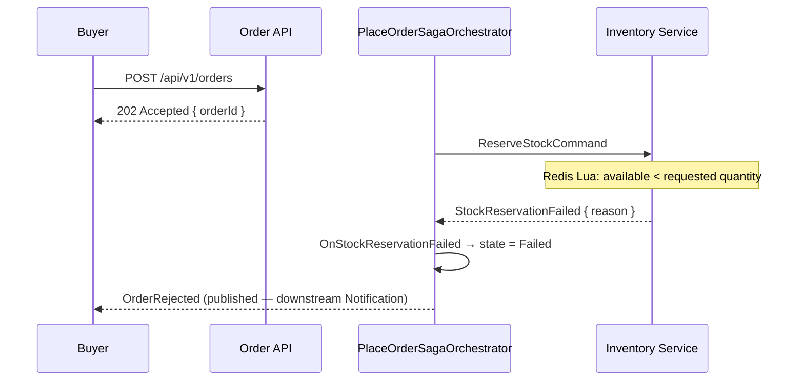

### Compensation — Reservation Expiry

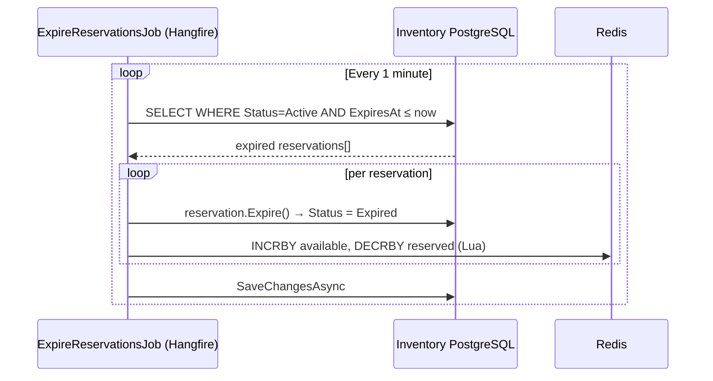

---

## 🏗 Architecture — Process Manager Pattern

### Layer Diagram

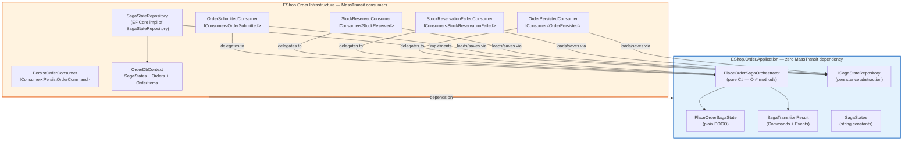

### Write Model — Command → Event Flow

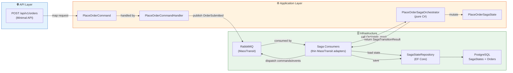

---

## 📨 Message Contracts

All contracts live in `EShop.Shared.Contracts` — shared between Order and Inventory services.

### Contract Flow Map

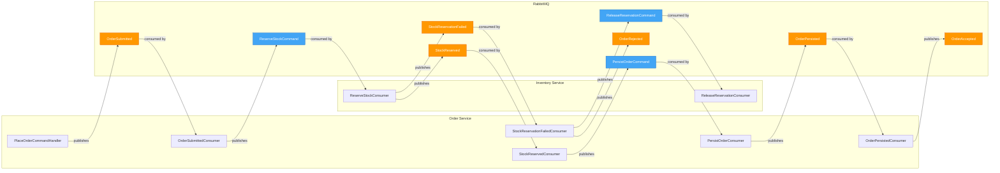

### Contract Reference

| Message | Type | Publisher | Consumer |
|:--------|:-----|:----------|:---------|
| `OrderSubmitted` | Trigger event | `PlaceOrderCommandHandler` | `OrderSubmittedConsumer` |
| `ReserveStockCommand` | Saga command | `OrderSubmittedConsumer` | `ReserveStockConsumer` |
| `StockReserved` | Integration event | `ReserveStockConsumer` | `StockReservedConsumer` |
| `StockReservationFailed` | Integration event | `ReserveStockConsumer` | `StockReservationFailedConsumer` |
| `PersistOrderCommand` | Saga command | `StockReservedConsumer` | `PersistOrderConsumer` |
| `OrderPersisted` | Internal event | `PersistOrderConsumer` | `OrderPersistedConsumer` |
| `OrderAccepted` | Integration event | `OrderPersistedConsumer` | downstream |
| `OrderRejected` | Integration event | `StockReservationFailedConsumer` | downstream |
| `ReleaseReservationCommand` | Compensation command | `StockReservationFailedConsumer` | `ReleaseReservationConsumer` |
| `ReservationExpired` | Integration event | `ExpireReservationsJob` | (future) |

---

## 🧱 Tactical Design

### Aggregate Structure

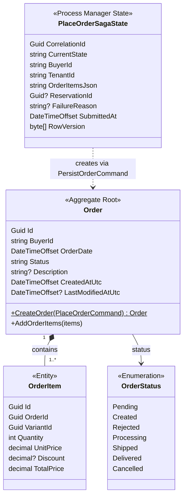

### Inventory — Supporting Entities

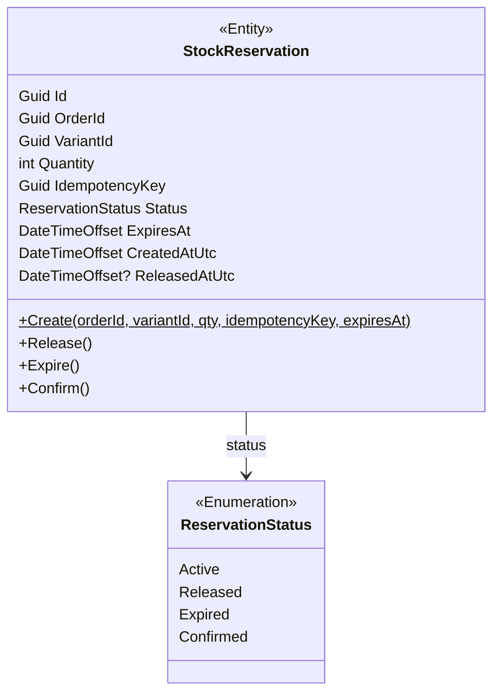

---

## 🛡 Key Design Decisions

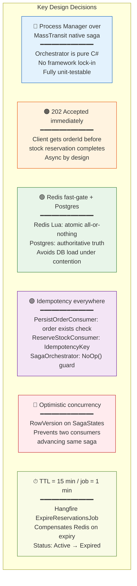

| Decision | Rationale |
|:---------|:----------|
| **Process Manager over MassTransit native saga** | `PlaceOrderSagaOrchestrator` has zero dependency on MassTransit. It is a plain, unit-testable class. MassTransit is confined to the Infrastructure boundary. |
| **202 Accepted immediately** | Client receives `orderId` before reservation completes. Async by design — subscribe to `OrderAccepted` / `OrderRejected` downstream. |
| **Redis fast-gate before Postgres** | Lua script performs atomic all-or-nothing check. Only on Redis pass does a Postgres transaction run — avoids unnecessary DB load under contention. |
| **Idempotency in every consumer** | `PersistOrderConsumer` checks for existing order row. `ReserveStockConsumer` checks `IdempotencyKey`. `OnXxx` returns `NoOp()` when saga is not in expected state. Safe to replay on MassTransit retry. |
| **Optimistic concurrency on saga state** | `PlaceOrderSagaState.RowVersion` prevents two concurrent consumers advancing the same saga simultaneously. |
| **Reservation TTL = 15 minutes** | `ExpireReservationsJob` (Hangfire, every 1 min) scans `Status=Active AND ExpiresAt ≤ now`, calls `Expire()`, compensates Redis counters. |
