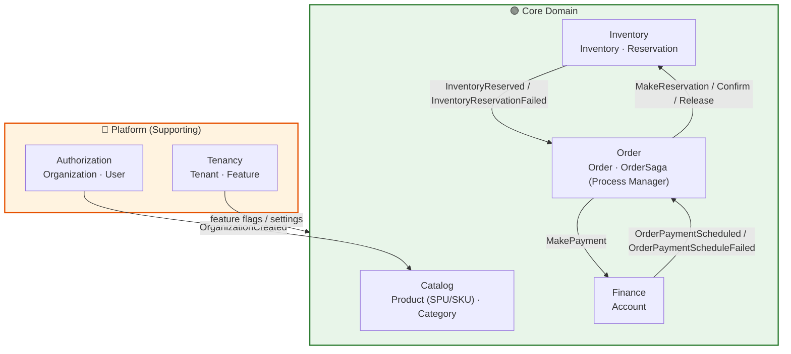

# 🛒 EShop SaaS Platform

[](https://dotnet.microsoft.com/)
[](/)
[](/)
[](/)
[](/)
[](https://opentelemetry.io/)

> **A production-ready multi-tenant e-commerce platform** demonstrating enterprise-grade microservices architecture, domain-driven design, and cloud-native observability practices.

---

## 📋 Table of Contents

- [Executive Summary](#-executive-summary)
- [Architecture Overview](#-architecture-overview)
- [Bounded Contexts](#-bounded-contexts)
- [Technology Stack](#-technology-stack)
- [Design Patterns & Principles](#-design-patterns--principles)
- [Project Structure](#-project-structure)
- [Observability](#-observability)
- [Getting Started](#-getting-started)
- [Technical Decisions](#-technical-decisions)

---

## 🎯 Executive Summary

| Aspect | Description |
|--------|-------------|
| **What** | Multi-tenant SaaS e-commerce platform |
| **Architecture** | Microservices with CQRS + Event Sourcing |
| **Key Patterns** | Clean Architecture, DDD, Event-Driven, Event Storming |
| **Infrastructure** | .NET Aspire, Docker, PostgreSQL, MongoDB, Redis, RabbitMQ |
| **Observability** | OpenTelemetry → Prometheus → Grafana |

### 💡 Skills Demonstrated

```
✅ Microservices Design          ✅ Domain-Driven Design         ✅ Event Sourcing & CQRS
✅ Distributed Systems           ✅ Multi-tenancy                ✅ Cloud-Native Patterns
✅ Observability (Metrics/Traces/Logs)                           ✅ Clean Architecture
✅ Event Storming (Discovery)    ✅ BDD Testing (Reqnroll)       ✅ SPU/SKU Product Modeling
```

---

## 🏗 Architecture Overview

### High-Level System Design

```
                                 ┌───────────────────────┐
                                 │        CLIENTS        │
                                 │  Web │ Mobile │ API   │
                                 └───────────┬───────────┘
                                             │
                              ┌──────────────▼──────────────┐
                              │     API GATEWAY / PROXY     │
                              └──────────────┬──────────────┘
                                             │
┌───────────────────────────────────────────────────────────────────────────────────────────┐
│                                    MICROSERVICES                                          │
│                                                                                           │
│  Platform (Supporting)                                                                    │
│    ┌─────────────┐  ┌─────────────┐                                                       │
│    │   TENANCY   │  │    AUTH     │                                                       │
│    │  • Tenants  │  │  • Users    │                                                       │
│    │  • Features │  │  • Perms    │                                                       │
│    └─────────────┘  └─────────────┘                                                       │
│                                                                                           │
│  Core Domain                                                                              │
│    ┌─────────────┐  ┌─────────────┐  ┌──────────────┐  ┌─────────────┐                    │
│    │   CATALOG   │  │  INVENTORY  │  │    ORDER     │  │   FINANCE   │                    │
│    │  • Products │  │  • Stock    │  │  • Order     │  │  • Account  │                    │
│    │  • Variants │  │  • Reserve  │  │  • OrderSaga │  │  • Payment  │                    │
│    │  • Category │  │ (Redis+CAS) │  │ (Process Mgr)│  │   Schedule  │                    │
│    └─────────────┘  └─────────────┘  └─────────────┘  └─────────────┘                     │
│                                                                                           │
└─────────────────────────────────────────────┬─────────────────────────────────────────────┘
                                              │
┌─────────────────────────────────────────────┼─────────────────────────────────────────────┐
│    ┌─────────────┐    ┌─────────────┐    ┌─────────────┐    ┌─────────────┐               │
│    │ PostgreSQL  │    │    Redis    │    │   MongoDB   │    │  RabbitMQ   │               │
│    │ Events+Data │    │  Cache/Gate │    │ Read Models │    │  Messaging  │               │
│    └─────────────┘    └─────────────┘    └─────────────┘    └─────────────┘               │
│                                     INFRASTRUCTURE                                        │
└───────────────────────────────────────────────────────────────────────────────────────────┘
```

### Data Flow (CQRS + Event Sourcing)

```
┌─────────┐      ┌─────────┐      ┌───────────┐      ┌─────────────┐
│ REQUEST │ ───► │   API   │ ───► │  COMMAND  │ ───► │  AGGREGATE  │
└─────────┘      └─────────┘      │    BUS    │      │    ROOT     │
                                  └───────────┘      └──────┬──────┘
                                                            │
                                                    Domain Events
                                                            │
                 ┌──────────────────────────────────────────┤
                 │                                          │
                 ▼                                          ▼
          ┌─────────────┐                           ┌─────────────┐
          │ EVENT STORE │                           │ SUBSCRIBERS │
          │ (PostgreSQL)│                           └──────┬──────┘
          └─────────────┘                                  │
                                          ┌────────────────┼────────────────┐
                                          ▼                                 ▼
                                   ┌─────────────┐                   ┌─────────────┐
                                   │ READ MODEL  │                   │ INTEGRATION │
                                   │  (MongoDB)  │                   │   EVENTS    │
                                   └──────┬──────┘                   └──────┬──────┘
                                          │                                 │
                                          ▼                                 ▼
                                   ┌─────────────┐                   ┌─────────────┐
                                   │   QUERIES   │                   │   OTHER     │
                                   │  Response   │                   │  SERVICES   │
                                   └─────────────┘                   └─────────────┘
```

---

## 🧩 Bounded Contexts



| Bounded Context | Domain Type | Aggregate Roots | Persistence | README |
|:----------------|:------------|:----------------|:------------|:-------|
| **Tenancy** | Supporting | Tenant, Feature | Event Sourcing (PostgreSQL) | — |
| **Authorization** | Supporting | Organization, User | Event Sourcing (PostgreSQL) | [README](Authorization/src/EShop.Authorization.API/README.md) |
| **Catalog** | Core | Product (SPU/SKU), Category | Event Sourcing (PostgreSQL) → Read Model (MongoDB) | [README](Catalog/src/EShop.Catalog.Application/README.md) |
| **Inventory** | Core | Inventory, Reservation | EF Core (PostgreSQL) + Redis gate | [README](Inventory/src/EShop.Inventory.API/README.md) |
| **Order** | Core | Order, OrderSaga | EF Core + event-sourced saga (PostgreSQL) | [README](Order/src/EShop.Order.API/README.md) |
| **Finance** | Core | Account | EF Core (PostgreSQL) | [README](Finance/src/EShop.Finance.API/README.md) |

> **Place-Order saga** — the flagship cross-context flow. `Order`'s Process Manager reserves stock with `Inventory`, schedules payment with `Finance`, then confirms or compensates based on the replies. See the [Order README](Order/src/EShop.Order.API/README.md) for the full state machine and the two command rails.

---

## 🛠 Technology Stack

### Core Technologies

| Category | Technology | Version | Purpose |
|:---------|:-----------|:--------|:--------|
| **Platform** | .NET | 8.0 | Runtime framework |
| **Orchestration** | .NET Aspire | 9.x | Service orchestration & local dev |
| **API** | ASP.NET Core | 8.0 | Web API framework |
| **Specification** | JSON:API | - | RESTful API standard |

### Architecture & Patterns

| Category | Technology | Purpose |
|:---------|:-----------|:--------|
| **CQRS/ES** | EventFlow | Command/Query separation, Event Sourcing |
| **Messaging** | MassTransit + RabbitMQ | Async communication, Integration events |
| **Background Jobs** | Hangfire | Scheduled & background processing |

### Data & Cache

| Category | Technology | Purpose |
|:---------|:-----------|:--------|
| **Event Store** | PostgreSQL | ACID-compliant event persistence |
| **Read Models** | MongoDB | Optimized query storage |
| **Cache** | Redis | Distributed caching |

### Observability

| Category | Technology | Purpose |
|:---------|:-----------|:--------|
| **Instrumentation** | OpenTelemetry | Vendor-neutral telemetry |
| **Metrics** | Prometheus | Time-series metrics storage |
| **Visualization** | Grafana | Dashboards & alerting |
| **Traces/Logs** | Aspire Dashboard | Distributed tracing & logs |

### Testing

| Category | Technology | Purpose |
|:---------|:-----------|:--------|
| **Unit Testing** | xUnit | Test framework |
| **Mocking** | Moq | Test doubles |
| **Assertions** | FluentAssertions | Fluent assertion library |
| **BDD** | Reqnroll.xUnit | Behavior-driven development (Cucumber expressions) |
| **Fixtures** | AutoFixture.Xunit2 | Test data generation |

---

## 📐 Design Patterns & Principles

### Architecture Patterns

| Pattern | Implementation | Benefit |
|:--------|:---------------|:--------|
| **Clean Architecture** | Domain → Application → Infrastructure → API | Testability, maintainability |
| **CQRS** | Separate Command/Query models | Optimized read/write paths |
| **Event Sourcing** | Immutable event stream | Full audit trail, temporal queries |
| **Microservices** | Bounded context per service | Independent deployment |
| **Saga / Process Manager** | Event-sourced `OrderSaga` (`AggregateSaga`) coordinating Inventory + Finance | Distributed transaction with compensation |
| **Two Command Rails** | Integration commands (`ICommandBus` → RabbitMQ) vs local commands (`ICommandDispatcher`) | Clear cross-service vs in-process boundaries |
| **Outbox / Inbox** | Transactional outbox + `inbox_messages` dedup | At-least-once delivery, idempotent consumers |
| **Deduct-on-Order + CAS** | Redis Lua gate → PostgreSQL compare-and-swap | No oversell under concurrency |

### Domain-Driven Design

| Concept | Description |
|:--------|:------------|
| **Aggregates** | Consistency boundaries (Tenant, User, Product) |
| **Domain Events** | Immutable facts representing state changes |
| **Specifications** | Encapsulated, reusable business rules (e.g., `ProductCanPublishSpec`, `CanAddVariantSpec`) |
| **Value Objects** | Immutable domain primitives (VariationDimension, VariantDimensionValue) |
| **State Machines** | Product lifecycle (Draft → Published → Unpublished → Deleted) via Stateless library |
| **Event Storming** | Collaborative discovery technique for domain modeling |

### Cross-Cutting Concerns

| Concern | Implementation |
|:--------|:---------------|
| **🔐 Multi-tenancy** | Request-scoped tenant isolation |
| **🔑 Authentication** | JWT tokens, policy-based authorization |
| **📝 Logging** | Structured logs with correlation IDs |
| **🔍 Tracing** | Distributed tracing across services |
| **⚠️ Exception Handling** | Global middleware, domain exceptions |
| **✅ Validation** | FluentValidation, domain specifications |
| **💾 Caching** | Redis distributed cache |

---

## 📁 Project Structure

```
EShop/
│
├── 🚀 EShop.AppHost/                  # .NET Aspire orchestration
├── 📦 EShop.ServiceDefaults/          # Shared OpenTelemetry & health checks
│
├── 📂 Tenancy/                        # ── Tenant Management Context ──
│   ├── src/
│   │   ├── EShop.Tenancy.API/         #    API Layer
│   │   ├── EShop.Tenancy.Application/ #    Application Layer (CQRS)
│   │   ├── EShop.Tenancy.Domain/      #    Domain Layer (Aggregates)
│   │   └── EShop.Tenancy.Infrastructure/ # Infrastructure Layer
│   └── tests/
│       └── EShop.Tenancy.Tests/       #    Unit & BDD Tests
│
├── 📂 Authorization/                  # ── User & Permission Context ──
│   ├── src/
│   │   ├── EShop.Authorization.API/
│   │   ├── EShop.Authorization.Application/
│   │   ├── EShop.Authorization.Domain/
│   │   └── EShop.Authorization.Infrastructure/
│   └── tests/
│       └── EShop.Authorization.Tests/
│
├── 📂 Catalog/                        # ── Product Catalog Context ──
│   ├── src/
│   │   ├── EShop.Catalog.Application/       # Domain + CQRS (Event Sourced, self-hosted)
│   │   └── EShop.Catalog.ReadModels.MongoDb/ # Read model projections (MongoDB via EF Core)
│   └── tests/
│       └── EShop.Catalog.Tests/             # Unit + BDD Tests (Reqnroll)
│
├── 📂 Inventory/                      # ── Stock Management Context (Core) ──
│   ├── src/ (API · Application · Domain · Infrastructure)  # Deduct-on-order, Redis gate + CAS
│   └── tests/
│
├── 📂 Order/                          # ── Order & Process Manager Context (Core) ──
│   ├── src/ (API · Application · Domain · Infrastructure)  # OrderSaga (event-sourced) + two command rails
│   └── tests/EShop.Order.Tests/
│
├── 📂 Finance/                        # ── Payment Schedule Context (Core) ──
│   ├── src/ (API · Application · Domain · Infrastructure)  # Strategy-based payment schedule
│   └── tests/EShop.Finance.Tests/
│
├── 📂 Configuration/                  # ── Configuration Context ──
│   ├── src/
│   │   ├── EShop.Configuration.Application/
│   │   └── EShop.Configuration.IntegrationEvent/
│   └── test/
│       └── EShop.Configuration.Tests/
│
├── 📂 ReverseProxy/                   # ── API Gateway ──
│   └── src/
│       └── EShop.ApiGateway/
│
├── 📂 Shared/                         # ── Cross-Cutting Libraries ──
│   ├── src/
│   │   ├── EShop.Shared.Authentication/     # JWT, multi-tenant user context
│   │   ├── EShop.Shared.Cache/              # Redis distributed caching
│   │   ├── EShop.Shared.Contracts/          # Shared abstractions & DTOs
│   │   ├── EShop.Shared.CQRS/               # CQRS infrastructure
│   │   ├── EShop.Shared.Diagnostics/        # OpenTelemetry instrumentation
│   │   ├── EShop.Shared.DomainTools/        # Base entities, specifications, value objects
│   │   ├── EShop.Shared.EventBus/           # MassTransit integration events
│   │   ├── EShop.Shared.JsonApi/            # JSON:API controllers & resource access
│   │   ├── EShop.Shared.ReadModel/          # Read model abstractions
│   │   ├── EShop.Shared.ReadModel.EfCore/   # EF Core read model store
│   │   ├── EShop.Shared.Scoping/            # Multi-tenant scoping & permissions
│   │   └── EShop.Shared.Sequences/          # Sequence/counter infrastructure
│   └── test/
│
├── 📂 Testing/                        # ── Shared Test Utilities ──
│   └── src/
│       ├── EShop.Testing.IntegrationTest/   # Base integration test infrastructure
│       └── EShop.Testing.JsonApiApplication/ # TestServer, JSON:API query helpers
│
└── 📂 Deployment/
    └── config/
        ├── otelcollector/             #    OpenTelemetry Collector
        ├── prometheus/                #    Prometheus configuration
        └── grafana/                   #    Grafana dashboards
```

---

## 📊 Observability

### Telemetry Pipeline

```
┌─────────────────────────────────────────────────────────────────────────────┐
│                            OBSERVABILITY STACK                              │
│                                                                             │
│    ┌───────────┐    ┌───────────┐    ┌───────────┐                          │
│    │  Tenancy  │    │   Auth    │    │  Catalog  │       Services           │
│    └─────┬─────┘    └─────┬─────┘    └─────┬─────┘                          │
│          │                │                │                                │
│          └────────────────┼────────────────┘                                │
│                           │ OTLP                                            │
│                           ▼                                                 │
│               ┌───────────────────────┐                                     │
│               │    OTEL COLLECTOR     │          Telemetry Gateway          │
│               └───────────┬───────────┘                                     │
│                           │                                                 │
│          ┌────────────────┼────────────────┐                                │
│          ▼                ▼                ▼                                │
│    ┌───────────┐    ┌───────────┐    ┌───────────┐                          │
│    │  ASPIRE   │    │PROMETHEUS │    │  GRAFANA  │       Backends           │
│    │ DASHBOARD │    │           │    │           │                          │
│    └───────────┘    └───────────┘    └───────────┘                          │
│     Traces/Logs        Metrics        Dashboards                            │
└─────────────────────────────────────────────────────────────────────────────┘
```

### Signals & Backends

| Signal | Backend | Metrics Captured |
|:-------|:--------|:-----------------|
| **📈 Metrics** | Prometheus → Grafana | Request latency, error rates, throughput, connections |
| **🔗 Traces** | Aspire Dashboard | Distributed request flow, span timing |
| **📝 Logs** | Aspire Dashboard | Structured logs with correlation |

---

## 🚀 Getting Started

For a complete step-by-step guide — prerequisites, secret files, migrations, running with Docker Compose, and troubleshooting — see:

👉 **[deploy/README.md](deploy/README.md)**

### Quick overview

```
1. Clone the repo
2. docker compose -f deploy/docker/docker-compose.infra.dev.yml up -d
3. Run EF migrations per service (dotnet ef database update)
4. dotnet run  (or bring up all services via docker-compose.dev.yml)
```

---

## 🧠 Technical Decisions

| Decision | Rationale |
|:---------|:----------|
| **Event Sourcing** | Complete audit trail, temporal queries, event replay capability |
| **CQRS** | Independent optimization of read/write models |
| **PostgreSQL (Events)** | ACID compliance critical for event store integrity |
| **MongoDB (Read Models)** | Flexible schema for query-optimized projections |
| **SPU/SKU Modeling** | Industry-standard product variation pattern — separates abstract product from purchasable variants |
| **EF Core + MongoDB** | Query filters for multi-tenant isolation on read models |
| **.NET Aspire** | Simplified orchestration, built-in observability, developer productivity |
| **OpenTelemetry** | Vendor-neutral observability, industry standard |
| **RabbitMQ + MassTransit** | Reliable messaging with saga support |
| **JSON:API** | Standardized REST API with filtering, sorting, pagination out of the box |
| **Reqnroll BDD** | Executable specifications bridging domain experts and developers |
| **Saga as AggregateSaga** | The Process Manager is event-sourced — its routing decisions are auditable and replayable |
| **Deduct-on-Order** | Stock is removed at reservation, not payment — prevents overselling under concurrency |
| **CAS + Redis Gate** | Redis rejects sold-out requests early; PostgreSQL CAS is the authoritative no-oversell decision |
| **Strategy-based Payment Schedule** | One strategy per frequency (OneOff/Monthly/Quarterly/Annually) — Open/Closed extension |

---

## 📚 Service READMEs

| Service | Domain Type | README |
|---------|-------------|--------|
| Catalog | Core | [Catalog/src/EShop.Catalog.Application/README.md](Catalog/src/EShop.Catalog.Application/README.md) |
| Inventory | Core | [Inventory/src/EShop.Inventory.API/README.md](Inventory/src/EShop.Inventory.API/README.md) |
| Order | Core | [Order/src/EShop.Order.API/README.md](Order/src/EShop.Order.API/README.md) |
| Finance | Core | [Finance/src/EShop.Finance.API/README.md](Finance/src/EShop.Finance.API/README.md) |
| Authorization | Supporting | [Authorization/src/EShop.Authorization.API/README.md](Authorization/src/EShop.Authorization.API/README.md) |

---

## 📄 License

Practice project demonstrating production-grade distributed system patterns and cloud-native architecture.

---

<div align="center">

**Built with ❤️ using .NET**

[](https://github.com/mnnam1302)

</div>


