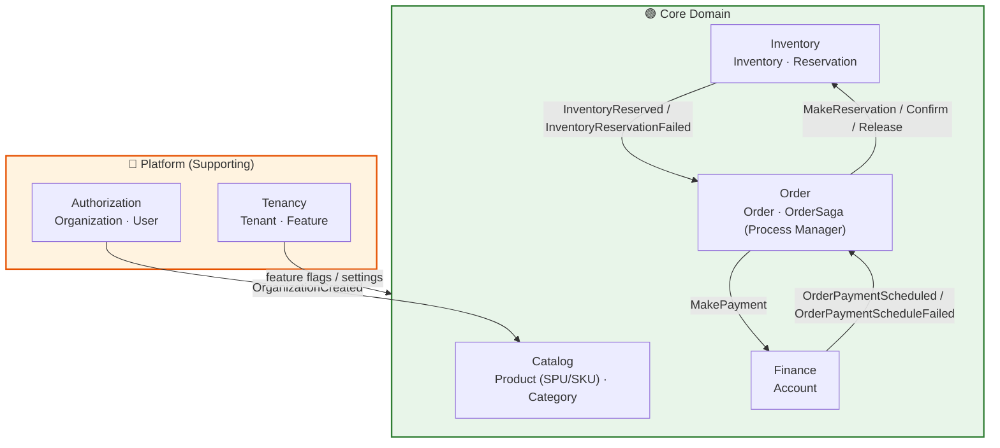
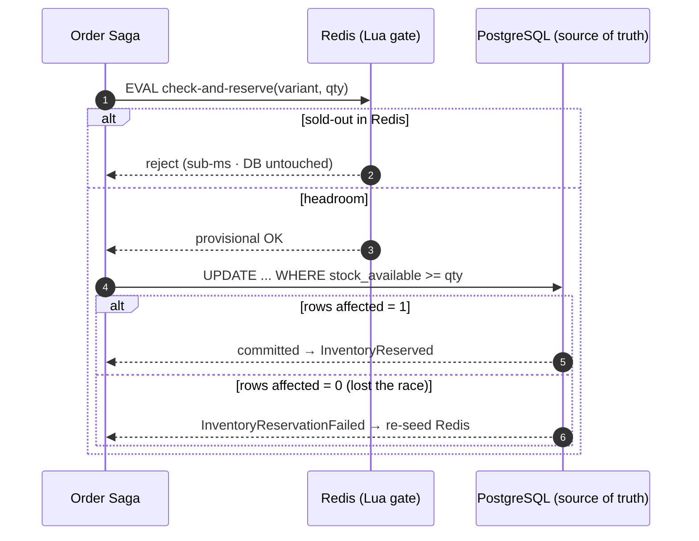
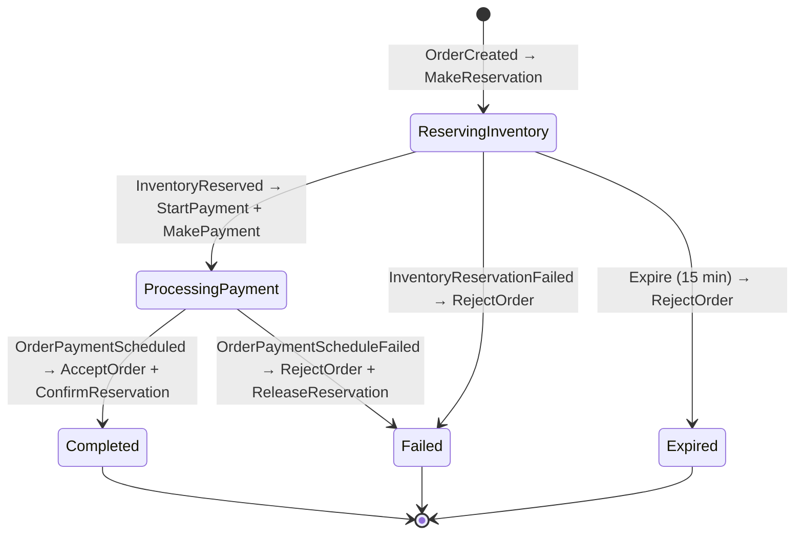
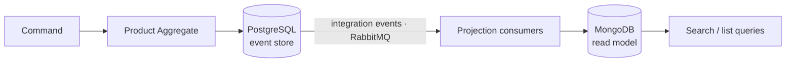
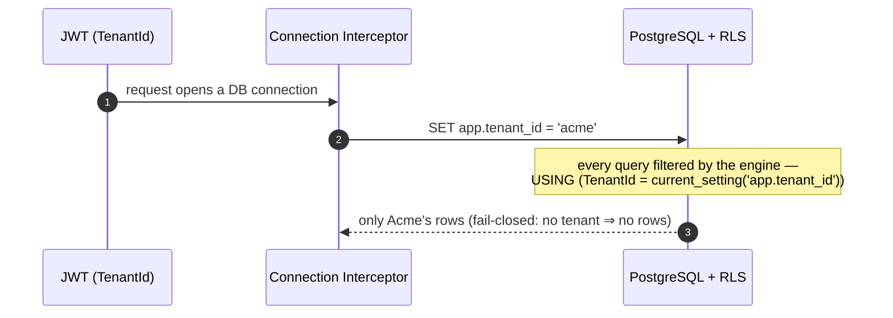
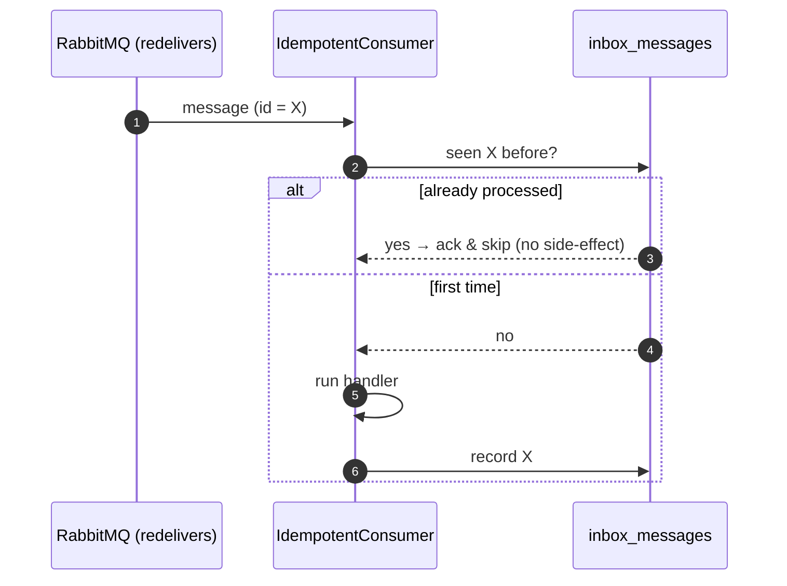

# 🛒 EShop SaaS Platform

[](https://dotnet.microsoft.com/)
[](/)
[](/)
[](/)
[](/)
[](/)
[](https://opentelemetry.io/)

---

## 📋 Table of Contents

- [Summary](#-summary)
- [The Solution Architecture](#-the-solution-architecture)
- [Bounded Contexts](#-bounded-contexts)
- [Technology Stack](#-technology-stack)
- [Key Design Decisions](#-key-design-decisions)
- [Project Structure](#-project-structure)
- [Observability](#-observability)
- [Getting Started](#-getting-started)
- [Service Deep-Dives](#-service-deep-dives)

---

## 🎯 Summary

The main objective of this muti-tenant **cloud-native** SaaS e-commerce project is to represent the state-of-the-art of a **distributed**, **reliable**, and **highly scalable** system by interpreting the most relevant principles of [**Reactive Domain Driven Design**](https://www.infoq.com/articles/modeling-uncertainty-reactive-ddd/).

> Domain-Driven Design can aid with managing uncertainty through the use of good modeling.  
> -- Vaughn Vernon

**Scalability** and **Resilience** require **low coupling** and **high cohesion**, principles strongly linked to the proper understanding of the business through **well-defined boundaries**, combined with a healthy and efficient integration strategy such as **Event-driven Architecture** (EDA).

The [**Event Storming**](https://www.eventstorming.com/) workshop provides a practical approach to **subdomain decomposition**, using **Pivotal Events** to correlate business capabilities across **Bounded Contexts** while promoting **reactive integration** between Aggregates.

The reactive integration between Bounded Contexts configures an Event-driven Architecture (EDA) where Commands are acknowledged and sent to the Bus by Saga (Process Manager) while Events are broadcasted to the Query side and/or other Aggregates.

**Independence**, as the main characteristic of a **Microservice**, can only be found in a **Bounded Context**.

The [**Event Sourcing**](https://www.eventstore.com/event-sourcing) is a proprietary implementation that, in addition to being **naturally auditable** and **data-driven**, represents the most efficient persistence mechanism ever. An **eventual state transition** Aggregate design is essential at this point. The **Event Store** comprises EF Core (ORM) + PostgreSQL (Database).

> State transitions are an important part of our problem space and should be modeled within our domain.  
> -- Greg Young

[**Projections**](https://www.eventstore.com/event-sourcing#Projections) are **asynchronously denormalized** and stored on a NoSQL Database(MongoDB); Nested documents should be avoided here; Each projection has its index and **fits perfectly into a view or component**, mitigating unnecessary data traffic and making the reading side as efficient as possible.

The splitting between **Command** and **Query** stacks occurs logically through the [**CQRS**](https://cqrs.files.wordpress.com/2010/11/cqrs_documents.pdf) pattern and fiscally via a **Microservices** architecture. Each stack is an individual deployable unit with its database, and the data flows from Command to Query stack via **Domain** and/or **Summary** events.

As a **domain-centric** approach, [**Clean Architecture**](https://blog.cleancoder.com/uncle-bob/2012/08/13/the-clean-architecture.html) provides the appropriate isolation between the **Core** (Application + Domain) and "times many" **Infrastructure** concerns.

### 💡 Skills Demonstrated

```
✅ Microservices Design          ✅ Domain-Driven Design         ✅ Event Storming (Discovery)
✅ Distributed Systems           ✅ Event-Driven Architecture    ✅ Event Sourcing & CQRS
✅ SPU/SKU Product Modeling      ✅ Cloud-Native Patterns        ✅ Observability (Metrics/Traces/Logs)
✅ Multi-tenancy                 ✅ BDD Testing (Reqnroll)
```

---

## 🏗 The Solution Architecture

### High-Level System Design

```
                                 ┌───────────────────────┐
                                 │        CLIENTS        │
                                 │  Web │ Mobile │ API   │
                                 └───────────┬───────────┘
                                             │
                              ┌──────────────▼──────────────┐
                              │     API GATEWAY / PROXY     │
                              └──────────────┬──────────────┘
                                             │
┌───────────────────────────────────────────────────────────────────────────────────────────┐
│                                    MICROSERVICES                                          │
│                                                                                           │
│  Platform (Supporting)                                                                    │
│    ┌─────────────┐  ┌─────────────┐                                                       │
│    │   TENANCY   │  │    AUTH     │                                                       │
│    │  • Tenants  │  │  • Users    │                                                       │
│    │  • Features │  │  • Perms    │                                                       │
│    └─────────────┘  └─────────────┘                                                       │
│                                                                                           │
│  Core Domain                                                                              │
│    ┌─────────────┐  ┌─────────────┐  ┌──────────────┐  ┌─────────────┐                    │
│    │   CATALOG   │  │  INVENTORY  │  │    ORDER     │  │   FINANCE   │                    │
│    │  • Products │  │  • Stock    │  │  • Order     │  │  • Account  │                    │
│    │  • Variants │  │  • Reserve  │  │  • OrderSaga │  │  • Payment  │                    │
│    │  • Category │  │ (Redis+CAS) │  │ (Process Mgr)│  │   Schedule  │                    │
│    └─────────────┘  └─────────────┘  └──────────────┘  └─────────────┘                    │
│                                                                                           │
└─────────────────────────────────────────────┬─────────────────────────────────────────────┘
                                              │
┌─────────────────────────────────────────────┼─────────────────────────────────────────────┐
│    ┌─────────────┐    ┌─────────────┐    ┌─────────────┐    ┌─────────────┐               │
│    │ PostgreSQL  │    │    Redis    │    │   MongoDB   │    │  RabbitMQ   │               │
│    │ Events+Data │    │  Cache/Gate │    │ Read Models │    │  Messaging  │               │
│    └─────────────┘    └─────────────┘    └─────────────┘    └─────────────┘               │
│                                     INFRASTRUCTURE                                        │
└───────────────────────────────────────────────────────────────────────────────────────────┘
```

### Data Flow (CQRS + Event Sourcing + Domain-Driven Design)

```
┌─────────┐      ┌─────────┐      ┌───────────┐      ┌─────────────┐
│ REQUEST │ ───► │   API   │ ───► │  COMMAND  │ ───► │  AGGREGATE  │
└─────────┘      └─────────┘      │    BUS    │      │    ROOT     │
                                  └───────────┘      └──────┬──────┘
                                                            │
                                                    Domain Events
                                                            │
                 ┌──────────────────────────────────────────┤
                 │                                          │
                 ▼                                          ▼
          ┌─────────────┐                           ┌─────────────┐
          │ EVENT STORE │                           │ SUBSCRIBERS │
          │ (PostgreSQL)│                           └──────┬──────┘
          └─────────────┘                                  │
                                          ┌────────────────┼────────────────┐
                                          ▼                                 ▼
                                   ┌─────────────┐                   ┌─────────────┐
                                   │ READ MODEL  │                   │ INTEGRATION │
                                   │  (MongoDB)  │                   │   EVENTS    │
                                   └──────┬──────┘                   └──────┬──────┘
                                          │                                 │
                                          ▼                                 ▼
                                   ┌─────────────┐                   ┌─────────────┐
                                   │   QUERIES   │                   │   OTHER     │
                                   │  Response   │                   │  SERVICES   │
                                   └─────────────┘                   └─────────────┘
```
---

## 🧩 Bounded Contexts

### Strategic Decomposition via Event Storming

The service boundaries were **not** guessed from database tables. They were discovered with **Event Storming** - walking the business timeline as a sequence of domain events written in the past tense, then locating the **Pivotal Events**: the moments where responsibility, consistency needs, and rate of change visibly shift. A pivotal event is a natural seam - a Bounded Context boundary.


Each pivotal event became the anchor of a context, and each context became a service with its own datastore and lifecycle:

| Pivotal Event | Bounded Context → Service | Domain Type | Why it is its own context |
|---------------|---------------------------|-------------|---------------------------|
| *Tenant Provisioned* | **Tenancy** | Supporting | Onboarding, feature flags, and rate-limit policy change on a different clock than commerce. |
| *(Identity established)* | **Authorization** | Supporting | Hierarchical org RBAC is a cross-cutting capability, not a commerce concern. |
| *Product Published* | **Catalog** | Core | Rich authoring model (SPU/SKU/variants); read-heavy, search-heavy - deserves its own read store. |
| *Stock Reserved / Deducted* | **Inventory** | Core | The concurrency hotspot. Its consistency guarantees (no oversell) are unlike anything else. |
| *Order Placed → Accepted* | **Order** | Core | Owns the long-running distributed transaction and its compensation. |
| *Payment Scheduled* | **Finance** | Core | Money and third-party accounting integration - a compliance and integration boundary. |

---



| Bounded Context | Domain Type | Aggregate Roots | Persistence | README |
|:----------------|:------------|:----------------|:------------|:-------|
| **Tenancy** | Supporting | Tenant, Feature | EF Core (PostgreSQL) | [README](Tenancy/src/EShop.Tenancy.API/README.md) |
| **Authorization** | Supporting | Organization, User | EF Core (PostgreSQL) | [README](Authorization/src/EShop.Authorization.API/README.md) |
| **Catalog** | Core | Product (SPU/SKU), Category | Event Sourcing (PostgreSQL) → Read Model (MongoDB) | [README](Catalog/src/EShop.Catalog.Application/README.md) |
| **Inventory** | Core | Inventory, Reservation | EF Core (PostgreSQL) + Redis gate | [README](Inventory/src/EShop.Inventory.API/README.md) |
| **Order** | Core | Order, OrderSaga | EF Core + event-sourced saga (PostgreSQL) | [README](Order/src/EShop.Order.API/README.md) |
| **Finance** | Core | Account | EF Core (PostgreSQL) | [README](Finance/src/EShop.Finance.API/README.md) |

> **Place-Order saga** — the flagship cross-context flow. `Order`'s Process Manager reserves stock with `Inventory`, schedules payment with `Finance`, then confirms or compensates based on the replies. See the [Order README](Order/src/EShop.Order.API/README.md) for the full state machine and the two command rails.

---

## 🛠 Technology Stack

One table — each choice with the reason it earned its place, not a badge wall.

| Concern | Choice | Why this, specifically |
|:--------|:-------|:-----------------------|
| **Runtime / API** | .NET 8 · ASP.NET Core Minimal APIs | LTS; minimal APIs keep the transport layer a thin shell over CQRS handlers |
| **Local orchestration** | .NET Aspire | One command wires every service + PostgreSQL/MongoDB/Redis/RabbitMQ with health checks and a telemetry dashboard |
| **Event Sourcing & CQRS** | **In-house seedwork** — `EShop.Shared.DomainTools` + `EShop.Shared.CQRS` | `AggregateStore` + Postgres event/snapshot repositories: a lightweight, *owned* ES core — **no EventFlow in the write path**. Owning it is the point: I can defend every line |
| **State machines** | Stateless | Aggregate & saga lifecycles are explicit guarded transitions — an illegal move throws at the domain boundary, not deep in a handler |
| **Messaging** | MassTransit + RabbitMQ | Integration events, retry/redelivery, saga transport, correlation-id propagation |
| **State & event store** | PostgreSQL | A single ACID source of truth — relational state *and* append-only event streams; also the RLS enforcement point for tenant isolation |
| **Read models** | MongoDB | Denormalized projections shaped per query — search/list without replaying event streams |
| **Cache · concurrency gate · rate limiter** | Redis (+ Lua) | Atomic in-memory ops: the stock-reservation gate and the per-tenant rate limiter are both Lua scripts |
| **Background jobs** | Hangfire | Saga timeouts and delayed work (e.g. the 15-minute reservation expiry) |
| **API standard** | JSON:API | Filtering/sorting/pagination as a contract, not per-endpoint plumbing |
| **Observability** | OpenTelemetry → Prometheus/Grafana + Aspire Dashboard | Vendor-neutral traces, metrics, and logs, correlated across services |
| **Testing** | xUnit · FluentAssertions · Moq/AutoFixture · **Testcontainers** · Reqnroll (BDD) | Unit for domain rules; Testcontainers spins **real** PostgreSQL/MongoDB/Redis/RabbitMQ; BDD for critical flows |

---

## 🧠 Key Design Decisions

> These are the decisions I would defend in a design review. Each is framed as *Problem → the real rules & edge cases that shaped it → Decision → what it trades away*. This is the system-level view; the full mechanics live in each service's README, linked at the end of every decision.

### 1. Zero oversell under high concurrency — *Inventory*

**Problem.** During a flash sale, thousands of requests race for the last unit. Two outcomes must be **impossible**: selling stock that isn't there, and a redelivered message deducting the same order twice.

**The real rules (the edge cases that shaped the design):**
- *Last-unit race* — two concurrent requests must never both win the final item.
- *At-least-once redelivery* — the same `ConfirmReservation` / `ReleaseReservation` can arrive twice.
- *Cache drift* — after a restart, the Redis counter and the DB can disagree.

**Decision — deduct-on-order, two layers:**
1. **Redis Lua** check-and-reserve — an atomic in-memory gate that rejects sold-out requests in sub-millisecond time, *before the database is touched*. A load shield.
2. **PostgreSQL compare-and-swap** — `UPDATE inventories SET stock_available = stock_available - qty WHERE variant = @v AND stock_available >= qty`. If it affects **0 rows**, this request lost the race → `InventoryReservationFailed`. The database, not the cache, is the arbiter.

Reservation lifecycle is `Pending → Confirmed / Released / Expired`; confirm/release guard on `Pending`, so a duplicate is a no-op — **idempotent by state, not by luck**.



**Trade-off.** Redis is a *hint*, never the truth — it can reject early but can **never cause** an oversell (it is re-seeded from Postgres via warm-up). Deduct-on-order means a *successful* reservation must be compensated on payment failure (Release), while a *failed* one has nothing to undo — which is precisely why the saga does **not** release on `InventoryReservationFailed`.

→ [Inventory README](Inventory/src/EShop.Inventory.API/README.md)

### 2. Distributed transaction with compensation — *Order*

**Problem.** Placing an order spans three services (Order, Inventory, Finance) with **no shared transaction**. It must always reach exactly one terminal state — fully accepted or fully unwound — even when a step fails or never answers.

**The real rules (edge cases):**
- Inventory can't hold stock → reject the order.
- Finance can't schedule payment → reject **and** release the stock already taken.
- A downstream never replies → the order must not hang forever.
- A reply arrives in the wrong state → reject it, don't misapply it.

**Decision.** An **orchestrated, event-sourced Process Manager** (`OrderSaga`), chosen over choreography so the business process is **one auditable artifact**, not an emergent event-web smeared across services. It issues commands over **two rails** — integration (→ RabbitMQ → other services) and local (→ in-process Order aggregate) — and schedules a **15-minute Hangfire expiry** as the liveness escape hatch. Every reply is guarded by `CanFire(trigger)`; an out-of-state reply throws `DomainException`.



**Trade-off.** An orchestrator is a central coordinator — the choreography purist's objection. But for multi-step compensation, centralizing the process is worth it: state is replayable and every routing decision lives in one place. The cost is one more aggregate to persist and reason about.

→ [Order README](Order/src/EShop.Order.API/README.md) — full saga, two command rails, all compensation paths

### 3. CQRS write/read split + eventual consistency — *Catalog*

**Problem.** An event store is an append-only ledger: excellent for "the full history of product X", useless for "find every product named *linen*" without replaying whole streams. Catalog is search- and read-heavy.

**The real rules (edge cases):**
- Public search must stay cheap at catalog scale.
- The read projection lags the write by ~200 ms (asynchronous).
- An admin who *just* published must see their own change immediately, or they lose trust in the system.

**Decision.** Split the write side (PostgreSQL event store, in-house ES seedwork) from the read side (MongoDB projection shaped per query), synced by integration events. Then choose consistency **per read type** — the actual insight, because not every read deserves the same guarantee:

| Read path | Consistency | Why |
|:----------|:------------|:----|
| Public catalog search | **Eventual** | ~200 ms is invisible to a shopper; forcing strong consistency here would throttle the whole system |
| Admin "did my edit save?" | **Read-your-own-writes** | Read back the authoritative write side, for the acting admin only |
| Client feedback | **Optimistic UI** | Render the intended state now, reconcile when the projection catches up |



**Trade-off.** Accepting eventual consistency on public reads is deliberate — throughput over immediacy exactly where no human would notice. The senior move is not "make everything strongly consistent"; it is *classifying reads by their real tolerance* and spending consistency only where its absence would be felt.

→ [Catalog README](Catalog/src/EShop.Catalog.Application/README.md)

### 4. Tenant isolation at the database engine — Postgres RLS

**Problem.** In a shared-database multi-tenant system, the single highest-severity bug class is a **cross-tenant data leak** — one forgotten `WHERE TenantId = @t`.

**The real rules (edge cases):**
- A developer *will* eventually forget a tenant filter — the design must survive that.
- A pooled connection must never carry a previous request's tenant.
- An unauthenticated / empty-tenant connection must return **nothing**, not everything.

**Decision.** Push isolation *below* the application, into PostgreSQL **Row-Level Security**. A `DbConnectionInterceptor` runs `SET app.tenant_id = '<jwt tenant>'` on every connection open; each scoped table gets `ENABLE` + `FORCE ROW LEVEL SECURITY` and a policy `USING ("TenantId" = current_setting('app.tenant_id'))`. Startup **fails** if a table is neither `IScoped` nor `IExcludedFromScoping` — you cannot accidentally ship an unclassified table.



**Trade-off.** This buys *safety*, not free performance: the per-request `SET` adds connection-pool friction, and a shared table invites **noisy-neighbor** contention. Mitigated by a per-tenant **Redis/Lua rate limiter** (fail-open) and a data-tagging scheme that lets a hyper-growth tenant be extracted to a dedicated database *without code changes*. For multi-tenant SaaS, a missing `WHERE` clause that can't become a breach is almost always the right trade.

→ [`EShop.Shared.DbResourceAccessControl`](Shared/src/EShop.Shared.DbResourceAccessControl) · [Rate Limiter README](Shared/src/EShop.Shared.RateLimiting/README.md)

### 5. Effectively-once messaging — Outbox + Inbox

**Problem.** Two classic distributed failures: the **dual-write** (DB commit succeeds, the event publish crashes → downstream is permanently wrong) and **duplicate delivery** (the broker redelivers → a side-effect runs twice).

**The real rules (edge cases):**
- A crash *between* commit and publish must not lose the event.
- At-least-once brokers **guarantee** eventual duplicates — this is not a maybe.

**Decision.** **Transactional Outbox** — the integration event is written to an `OutboxMessage` table in the *same transaction* as the state change (`OutboxWriter`), then relayed to RabbitMQ; either both commit or neither does (no loss). **Idempotent consumer / Inbox** — `IdempotentConsumer<T>` records each message id in `inbox_messages` and drops a re-seen id (no double side-effect). Outbox + Inbox together = **effectively-once**.



**Trade-off.** At-least-once + dedup is the practical ceiling — true exactly-once across a broker is a myth, so the system is built to *tolerate* duplicates rather than pretend they can't happen. The relay is polling today; **CDC via Debezium is the roadmap** for lower latency (called out honestly — not yet shipped).

→ [`EShop.Shared.EventBus`](Shared/src/EShop.Shared.EventBus)

---

## 📁 Project Structure

```
EShop/
│
├── 🚀 EShop.AppHost/                  # .NET Aspire orchestration
├── 📦 EShop.ServiceDefaults/          # Shared OpenTelemetry & health checks
│
├── 📂 Tenancy/                        # ── Tenant Management Context ──
│   ├── src/
│   │   ├── EShop.Tenancy.API/         #    API Layer
│   │   ├── EShop.Tenancy.Application/ #    Application Layer (CQRS)
│   │   ├── EShop.Tenancy.Domain/      #    Domain Layer (Aggregates)
│   │   └── EShop.Tenancy.Infrastructure/ # Infrastructure Layer
│   └── tests/
│       └── EShop.Tenancy.Tests/       #    Unit & BDD Tests
│
├── 📂 Authorization/                  # ── User & Permission Context ──
│   ├── src/
│   │   ├── EShop.Authorization.API/
│   │   ├── EShop.Authorization.Application/
│   │   ├── EShop.Authorization.Domain/
│   │   └── EShop.Authorization.Infrastructure/
│   └── tests/
│       └── EShop.Authorization.Tests/
│
├── 📂 Catalog/                        # ── Product Catalog Context ──
│   ├── src/
│   │   ├── EShop.Catalog.Application/       # Domain + CQRS (Event Sourced, self-hosted)
│   │   └── EShop.Catalog.ReadModels.MongoDb/ # Read model projections (MongoDB via EF Core)
│   └── tests/
│       └── EShop.Catalog.Tests/             # Unit + BDD Tests (Reqnroll)
│
├── 📂 Inventory/                      # ── Stock Management Context (Core) ──
│   ├── src/ (API · Application · Domain · Infrastructure)  # Deduct-on-order, Redis gate + CAS
│   └── tests/
│
├── 📂 Order/                          # ── Order & Process Manager Context (Core) ──
│   ├── src/ (API · Application · Domain · Infrastructure)  # OrderSaga (event-sourced) + two command rails
│   └── tests/EShop.Order.Tests/
│
├── 📂 Finance/                        # ── Payment Schedule Context (Core) ──
│   ├── src/ (API · Application · Domain · Infrastructure)  # Strategy-based payment schedule
│   └── tests/EShop.Finance.Tests/
│
├── 📂 ReverseProxy/                   # ── API Gateway ──
│   └── src/
│       └── EShop.ApiGateway/
│
├── 📂 Shared/                         # ── Cross-Cutting Libraries ──
│   ├── src/
│   │   ├── EShop.Shared.Authentication/       # JWT, per-tenant RSA key rotation, user context
│   │   ├── EShop.Shared.Cache/                # Redis distributed caching
│   │   ├── EShop.Shared.Contracts/            # Shared integration event contracts & DTOs
│   │   ├── EShop.Shared.CQRS/                 # Command/query abstractions
│   │   ├── EShop.Shared.DbResourceAccessControl/ # Postgres RLS interceptors & policies (tenant isolation)
│   │   ├── EShop.Shared.Diagnostics/          # OpenTelemetry instrumentation
│   │   ├── EShop.Shared.DomainTools/          # Base aggregates, specifications, event-sourcing seedwork
│   │   ├── EShop.Shared.EventBus/             # MassTransit integration events, outbox, idempotent consumer
│   │   ├── EShop.Shared.HealthChecks/         # Liveness/readiness probes
│   │   ├── EShop.Shared.JsonApi/              # JSON:API controllers & resource access
│   │   ├── EShop.Shared.RateLimiting/         # Distributed Redis/Lua per-tenant rate limiter
│   │   ├── EShop.Shared.ReadModel/            # Read model abstractions
│   │   ├── EShop.Shared.ReadModel.EfCore/     # EF Core read model store
│   │   ├── EShop.Shared.Scoping/              # Multi-tenant scoping & permissions
│   │   ├── EShop.Shared.Sequences/            # Sequence/counter infrastructure
│   │   └── EShop.Shared.SystemClock/          # Testable time abstraction
│   └── test/
│
├── 📂 Testing/                        # ── Shared Test Utilities ──
│   └── src/
│       ├── EShop.Testing.IntegrationTest/   # Base integration test infrastructure
│       └── EShop.Testing.JsonApiApplication/ # TestServer, JSON:API query helpers
│
└── 📂 deploy/                         # ── Deployment & Local Orchestration ──
    ├── docker/                        #    docker-compose (infra + services · dev/prod)
    ├── config/                        #    otelcollector · prometheus · grafana · rabbitmq
    ├── env/ · secrets/ · scripts/     #    env files · docker secrets · DB init scripts
    └── README.md                      #    Run guide (prerequisites, URLs, troubleshooting)
```

---

## 📊 Observability

### Telemetry Pipeline

```
┌─────────────────────────────────────────────────────────────────────────────┐
│                            OBSERVABILITY STACK                              │
│                                                                             │
│    ┌───────────┐    ┌───────────┐    ┌───────────┐                          │
│    │  Tenancy  │    │   Auth    │    │  Catalog  │       Services           │
│    └─────┬─────┘    └─────┬─────┘    └─────┬─────┘                          │
│          │                │                │                                │
│          └────────────────┼────────────────┘                                │
│                           │ OTLP                                            │
│                           ▼                                                 │
│               ┌───────────────────────┐                                     │
│               │    OTEL COLLECTOR     │          Telemetry Gateway          │
│               └───────────┬───────────┘                                     │
│                           │                                                 │
│          ┌────────────────┼────────────────┐                                │
│          ▼                ▼                ▼                                │
│    ┌───────────┐    ┌───────────┐    ┌───────────┐                          │
│    │  ASPIRE   │    │PROMETHEUS │    │  GRAFANA  │       Backends           │
│    │ DASHBOARD │    │           │    │           │                          │
│    └───────────┘    └───────────┘    └───────────┘                          │
│     Traces/Logs        Metrics        Dashboards                            │
└─────────────────────────────────────────────────────────────────────────────┘
```

### Signals & Backends

| Signal | Backend | Metrics Captured |
|:-------|:--------|:-----------------|
| **📈 Metrics** | Prometheus → Grafana | Request latency, error rates, throughput, connections |
| **🔗 Traces** | Aspire Dashboard | Distributed request flow, span timing |
| **📝 Logs** | Aspire Dashboard | Structured logs with correlation |

---

## 🚀 Getting Started

Run the whole stack two ways — see the full guide (prerequisites, access URLs, troubleshooting):

👉 **[deploy/README.md](deploy/README.md)**

### Quick start

**Option A — Docker only (no .NET SDK needed):**

```bash
git clone https://github.com/mnnam1302/EShop.git && cd EShop
docker compose \
  -f deploy/docker/docker-compose.infra.dev.yml \
  -f deploy/docker/docker-compose.dev.yml \
  up -d --build
```

**Option B — .NET Aspire:**

```bash
dotnet workload install aspire   # one-time
dotnet run --project EShop.AppHost
```

No secret files and no manual `dotnet ef` migrations are needed for dev — databases are
created and migrated automatically on first run. API Gateway: http://localhost:5000 ·
Aspire dashboard: http://localhost:18888.

---

## 📚 Service Deep-Dives

Each service carries its own README with the same structure — *Strategic Design → Event Storming → Domain Model → State Machines → Specifications → Architecture (with sequence diagrams) → Integration Events → Data Model* — so the mechanics behind each decision above live next to the code that implements them.

| Service | Domain Type | Owns the decision | README |
|:--------|:------------|:------------------|:-------|
| **Catalog** | Core | CQRS + event sourcing, eventual consistency (#3) | [README](Catalog/src/EShop.Catalog.Application/README.md) |
| **Inventory** | Core | Zero oversell — Redis gate + Postgres CAS (#1) | [README](Inventory/src/EShop.Inventory.API/README.md) |
| **Order** | Core | Distributed saga + compensation (#2) | [README](Order/src/EShop.Order.API/README.md) |
| **Finance** | Core | Payment schedule + Generic HTTP accounting provider | [README](Finance/src/EShop.Finance.API/README.md) |
| **Authorization** | Supporting | Hierarchical org RBAC, JWT identity | [README](Authorization/src/EShop.Authorization.API/README.md) |
| **Tenancy** | Supporting | Tenant provisioning, feature flags, rate-limit policy | [README](Tenancy/src/EShop.Tenancy.API/README.md) |

---

## 📄 License

Practice project demonstrating production-grade distributed system patterns and cloud-native architecture.

---

<div align="center">

**Built with ❤️ using .NET**

[](https://github.com/mnnam1302)

</div>


