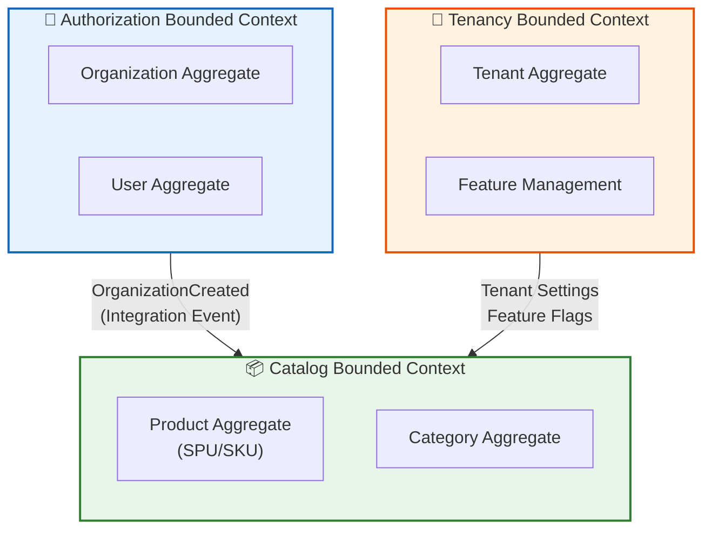

# 🛒 EShop SaaS Platform

[](https://dotnet.microsoft.com/)
[](/)
[](/)
[](/)
[](/)
[](https://opentelemetry.io/)

> **A production-ready multi-tenant e-commerce platform** demonstrating enterprise-grade microservices architecture, domain-driven design, and cloud-native observability practices.

---

## 📋 Table of Contents

- [Executive Summary](#-executive-summary)
- [Architecture Overview](#-architecture-overview)
- [Bounded Contexts](#-bounded-contexts)
- [Technology Stack](#-technology-stack)
- [Design Patterns & Principles](#-design-patterns--principles)
- [Project Structure](#-project-structure)
- [Observability](#-observability)
- [Getting Started](#-getting-started)
- [Technical Decisions](#-technical-decisions)

---

## 🎯 Executive Summary

| Aspect | Description |
|--------|-------------|
| **What** | Multi-tenant SaaS e-commerce platform |
| **Architecture** | Microservices with CQRS + Event Sourcing |
| **Key Patterns** | Clean Architecture, DDD, Event-Driven, Event Storming |
| **Infrastructure** | .NET Aspire, Docker, PostgreSQL, MongoDB, Redis, RabbitMQ |
| **Observability** | OpenTelemetry → Prometheus → Grafana |

### 💡 Skills Demonstrated

```
✅ Microservices Design          ✅ Domain-Driven Design         ✅ Event Sourcing & CQRS
✅ Distributed Systems           ✅ Multi-tenancy                ✅ Cloud-Native Patterns
✅ Observability (Metrics/Traces/Logs)                           ✅ Clean Architecture
✅ Event Storming (Discovery)    ✅ BDD Testing (Reqnroll)       ✅ SPU/SKU Product Modeling
```

---

## 🏗 Architecture Overview

### High-Level System Design

```
                                 ┌───────────────────────┐
                                 │        CLIENTS        │
                                 │  Web │ Mobile │ API   │
                                 └───────────┬───────────┘
                                             │
                              ┌──────────────▼──────────────┐
                              │     API GATEWAY / PROXY     │
                              └──────────────┬──────────────┘
                                             │
┌────────────────────────────────────────────┼────────────────────────────────────────────┐
│                                    MICROSERVICES                                        │
│                                                                                         │
│    ┌─────────────┐    ┌─────────────┐    ┌─────────────┐                               │
│    │   TENANCY   │    │    AUTH     │    │   CATALOG   │                               │
│    │             │    │             │    │             │                               │
│    │  • Tenants  │    │  • Users    │    │  • Products │                               │
│    │  • Settings │    │  • Roles    │    │  • Variants │                               │
│    │  • Features │    │  • Perms    │    │  • Category │                               │
│    └──────┬──────┘    └──────┬──────┘    └──────┬──────┘                               │
│           │                  │                  │                                      │
└───────────┼──────────────────┼──────────────────┼──────────────────────────────────────-┘
            │                  │                  │
┌───────────┼──────────────────┼──────────────────┼──────────────────────────────────────-┐
│           │                  │     INFRASTRUCTURE                                      │
│           ▼                  ▼                  ▼                                      │
│    ┌─────────────┐    ┌─────────────┐    ┌─────────────┐    ┌─────────────┐             │
│    │ PostgreSQL  │    │    Redis    │    │   MongoDB   │    │  RabbitMQ   │             │
│    │   Events    │    │    Cache    │    │ Read Models │    │  Messaging  │             │
│    └─────────────┘    └─────────────┘    └─────────────┘    └─────────────┘             │
└─────────────────────────────────────────────────────────────────────────────────────────┘
```

### Data Flow (CQRS + Event Sourcing)

```
┌─────────┐      ┌─────────┐      ┌───────────┐      ┌─────────────┐
│ REQUEST │ ───► │   API   │ ───► │  COMMAND  │ ───► │  AGGREGATE  │
└─────────┘      └─────────┘      │    BUS    │      │    ROOT     │
                                  └───────────┘      └──────┬──────┘
                                                            │
                                                    Domain Events
                                                            │
                 ┌──────────────────────────────────────────┤
                 │                                          │
                 ▼                                          ▼
          ┌─────────────┐                           ┌─────────────┐
          │ EVENT STORE │                           │ SUBSCRIBERS │
          │ (PostgreSQL)│                           └──────┬──────┘
          └─────────────┘                                  │
                                          ┌────────────────┼────────────────┐
                                          ▼                                 ▼
                                   ┌─────────────┐                   ┌─────────────┐
                                   │ READ MODEL  │                   │ INTEGRATION │
                                   │  (MongoDB)  │                   │   EVENTS    │
                                   └──────┬──────┘                   └──────┬──────┘
                                          │                                 │
                                          ▼                                 ▼
                                   ┌─────────────┐                   ┌─────────────┐
                                   │   QUERIES   │                   │   OTHER     │
                                   │  Response   │                   │  SERVICES   │
                                   └─────────────┘                   └─────────────┘
```

---

## � Bounded Contexts



| Bounded Context | Aggregate Roots | Persistence | Status |
|:----------------|:----------------|:------------|:-------|
| **Tenancy** | Tenant, Feature | Event Sourcing (PostgreSQL) | ✅ Production-ready |
| **Authorization** | Organization, User | Event Sourcing (PostgreSQL) | ✅ Production-ready |
| **Catalog** | Product (SPU/SKU), Category | Event Sourcing (PostgreSQL) → Read Model (MongoDB) | ✅ Implemented |

> For detailed Product Aggregate documentation including Event Storming, State Machines, Specifications, and SPU/SKU modeling, see [Catalog README](Catalog/src/EShop.Catalog.Application/README.md).

---

## �🛠 Technology Stack

### Core Technologies

| Category | Technology | Version | Purpose |
|:---------|:-----------|:--------|:--------|
| **Platform** | .NET | 8.0 | Runtime framework |
| **Orchestration** | .NET Aspire | 9.x | Service orchestration & local dev |
| **API** | ASP.NET Core | 8.0 | Web API framework |
| **Specification** | JSON:API | - | RESTful API standard |

### Architecture & Patterns

| Category | Technology | Purpose |
|:---------|:-----------|:--------|
| **CQRS/ES** | EventFlow | Command/Query separation, Event Sourcing |
| **Messaging** | MassTransit + RabbitMQ | Async communication, Integration events |
| **Background Jobs** | Hangfire | Scheduled & background processing |

### Data & Cache

| Category | Technology | Purpose |
|:---------|:-----------|:--------|
| **Event Store** | PostgreSQL | ACID-compliant event persistence |
| **Read Models** | MongoDB | Optimized query storage |
| **Cache** | Redis | Distributed caching |

### Observability

| Category | Technology | Purpose |
|:---------|:-----------|:--------|
| **Instrumentation** | OpenTelemetry | Vendor-neutral telemetry |
| **Metrics** | Prometheus | Time-series metrics storage |
| **Visualization** | Grafana | Dashboards & alerting |
| **Traces/Logs** | Aspire Dashboard | Distributed tracing & logs |

### Testing

| Category | Technology | Purpose |
|:---------|:-----------|:--------|
| **Unit Testing** | xUnit | Test framework |
| **Mocking** | Moq | Test doubles |
| **Assertions** | FluentAssertions | Fluent assertion library |
| **BDD** | Reqnroll.xUnit | Behavior-driven development (Cucumber expressions) |
| **Fixtures** | AutoFixture.Xunit2 | Test data generation |

---

## 📐 Design Patterns & Principles

### Architecture Patterns

| Pattern | Implementation | Benefit |
|:--------|:---------------|:--------|
| **Clean Architecture** | Domain → Application → Infrastructure → API | Testability, maintainability |
| **CQRS** | Separate Command/Query models | Optimized read/write paths |
| **Event Sourcing** | Immutable event stream | Full audit trail, temporal queries |
| **Microservices** | Bounded context per service | Independent deployment |

### Domain-Driven Design

| Concept | Description |
|:--------|:------------|
| **Aggregates** | Consistency boundaries (Tenant, User, Product) |
| **Domain Events** | Immutable facts representing state changes |
| **Specifications** | Encapsulated, reusable business rules (e.g., `ProductCanPublishSpec`, `CanAddVariantSpec`) |
| **Value Objects** | Immutable domain primitives (VariationDimension, VariantDimensionValue) |
| **State Machines** | Product lifecycle (Draft → Published → Unpublished → Deleted) via Stateless library |
| **Event Storming** | Collaborative discovery technique for domain modeling |

### Cross-Cutting Concerns

| Concern | Implementation |
|:--------|:---------------|
| **🔐 Multi-tenancy** | Request-scoped tenant isolation |
| **🔑 Authentication** | JWT tokens, policy-based authorization |
| **📝 Logging** | Structured logs with correlation IDs |
| **🔍 Tracing** | Distributed tracing across services |
| **⚠️ Exception Handling** | Global middleware, domain exceptions |
| **✅ Validation** | FluentValidation, domain specifications |
| **💾 Caching** | Redis distributed cache |

---

## 📁 Project Structure

```
EShop/
│
├── 🚀 EShop.AppHost/                  # .NET Aspire orchestration
├── 📦 EShop.ServiceDefaults/          # Shared OpenTelemetry & health checks
│
├── 📂 Tenancy/                        # ── Tenant Management Context ──
│   ├── src/
│   │   ├── EShop.Tenancy.API/         #    API Layer
│   │   ├── EShop.Tenancy.Application/ #    Application Layer (CQRS)
│   │   ├── EShop.Tenancy.Domain/      #    Domain Layer (Aggregates)
│   │   └── EShop.Tenancy.Infrastructure/ # Infrastructure Layer
│   └── tests/
│       └── EShop.Tenancy.Tests/       #    Unit & BDD Tests
│
├── 📂 Authorization/                  # ── User & Permission Context ──
│   ├── src/
│   │   ├── EShop.Authorization.API/
│   │   ├── EShop.Authorization.Application/
│   │   ├── EShop.Authorization.Domain/
│   │   └── EShop.Authorization.Infrastructure/
│   └── tests/
│       └── EShop.Authorization.Tests/
│
├── 📂 Catalog/                        # ── Product Catalog Context ──
│   ├── src/
│   │   ├── EShop.Catalog.Application/       # Domain + CQRS (Event Sourced, self-hosted)
│   │   └── EShop.Catalog.ReadModels.MongoDb/ # Read model projections (MongoDB via EF Core)
│   └── tests/
│       └── EShop.Catalog.Tests/             # Unit + BDD Tests (Reqnroll)
│
├── 📂 Configuration/                  # ── Configuration Context ──
│   ├── src/
│   │   ├── EShop.Configuration.Application/
│   │   └── EShop.Configuration.IntegrationEvent/
│   └── test/
│       └── EShop.Configuration.Tests/
│
├── 📂 ReverseProxy/                   # ── API Gateway ──
│   └── src/
│       └── EShop.ApiGateway/
│
├── 📂 Shared/                         # ── Cross-Cutting Libraries ──
│   ├── src/
│   │   ├── EShop.Shared.Authentication/     # JWT, multi-tenant user context
│   │   ├── EShop.Shared.Cache/              # Redis distributed caching
│   │   ├── EShop.Shared.Contracts/          # Shared abstractions & DTOs
│   │   ├── EShop.Shared.CQRS/               # CQRS infrastructure
│   │   ├── EShop.Shared.Diagnostics/        # OpenTelemetry instrumentation
│   │   ├── EShop.Shared.DomainTools/        # Base entities, specifications, value objects
│   │   ├── EShop.Shared.EventBus/           # MassTransit integration events
│   │   ├── EShop.Shared.JsonApi/            # JSON:API controllers & resource access
│   │   ├── EShop.Shared.ReadModel/          # Read model abstractions
│   │   ├── EShop.Shared.ReadModel.EfCore/   # EF Core read model store
│   │   ├── EShop.Shared.Scoping/            # Multi-tenant scoping & permissions
│   │   └── EShop.Shared.Sequences/          # Sequence/counter infrastructure
│   └── test/
│
├── 📂 Testing/                        # ── Shared Test Utilities ──
│   └── src/
│       ├── EShop.Testing.IntegrationTest/   # Base integration test infrastructure
│       └── EShop.Testing.JsonApiApplication/ # TestServer, JSON:API query helpers
│
└── 📂 Deployment/
    └── config/
        ├── otelcollector/             #    OpenTelemetry Collector
        ├── prometheus/                #    Prometheus configuration
        └── grafana/                   #    Grafana dashboards
```

---

## 📊 Observability

### Telemetry Pipeline

```
┌─────────────────────────────────────────────────────────────────────────────┐
│                            OBSERVABILITY STACK                              │
│                                                                             │
│    ┌───────────┐    ┌───────────┐    ┌───────────┐                          │
│    │  Tenancy  │    │   Auth    │    │  Catalog  │       Services           │
│    └─────┬─────┘    └─────┬─────┘    └─────┬─────┘                          │
│          │                │                │                                │
│          └────────────────┼────────────────┘                                │
│                           │ OTLP                                            │
│                           ▼                                                 │
│               ┌───────────────────────┐                                     │
│               │    OTEL COLLECTOR     │          Telemetry Gateway          │
│               └───────────┬───────────┘                                     │
│                           │                                                 │
│          ┌────────────────┼────────────────┐                                │
│          ▼                ▼                ▼                                │
│    ┌───────────┐    ┌───────────┐    ┌───────────┐                          │
│    │  ASPIRE   │    │PROMETHEUS │    │  GRAFANA  │       Backends           │
│    │ DASHBOARD │    │           │    │           │                          │
│    └───────────┘    └───────────┘    └───────────┘                          │
│     Traces/Logs        Metrics        Dashboards                            │
└─────────────────────────────────────────────────────────────────────────────┘
```

### Signals & Backends

| Signal | Backend | Metrics Captured |
|:-------|:--------|:-----------------|
| **📈 Metrics** | Prometheus → Grafana | Request latency, error rates, throughput, connections |
| **🔗 Traces** | Aspire Dashboard | Distributed request flow, span timing |
| **📝 Logs** | Aspire Dashboard | Structured logs with correlation |

---

## 🚀 Getting Started

### Prerequisites

```bash
# Required
✅ .NET 8 SDK
✅ Docker Desktop
```

### Quick Start

```bash
# Clone & Run
git clone https://github.com/mnnam1302/EShop.git
cd EShop/EShop.AppHost
dotnet run
```

### Access Points

| Service | Description |
|:--------|:------------|
| **Aspire Dashboard** | Resource management, traces, logs |
| **Grafana** | Metrics dashboards |
| **API Endpoints** | See Aspire Dashboard for dynamic URLs |

---

## 🧠 Technical Decisions

| Decision | Rationale |
|:---------|:----------|
| **Event Sourcing** | Complete audit trail, temporal queries, event replay capability |
| **CQRS** | Independent optimization of read/write models |
| **PostgreSQL (Events)** | ACID compliance critical for event store integrity |
| **MongoDB (Read Models)** | Flexible schema for query-optimized projections |
| **SPU/SKU Modeling** | Industry-standard product variation pattern — separates abstract product from purchasable variants |
| **EF Core + MongoDB** | Query filters for multi-tenant isolation on read models |
| **.NET Aspire** | Simplified orchestration, built-in observability, developer productivity |
| **OpenTelemetry** | Vendor-neutral observability, industry standard |
| **RabbitMQ + MassTransit** | Reliable messaging with saga support |
| **JSON:API** | Standardized REST API with filtering, sorting, pagination out of the box |
| **Reqnroll BDD** | Executable specifications bridging domain experts and developers |

---

## 📄 License

Practice project demonstrating production-grade distributed system patterns and cloud-native architecture.

---

<div align="center">

**Built with ❤️ using .NET**

[](https://github.com/mnnam1302)

</div>


