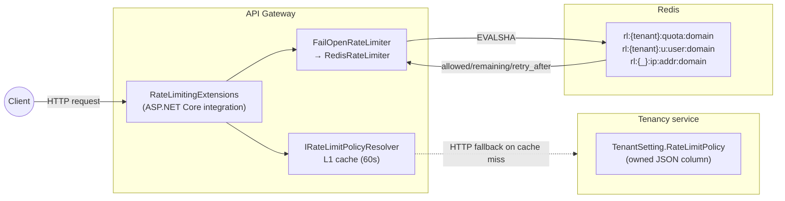
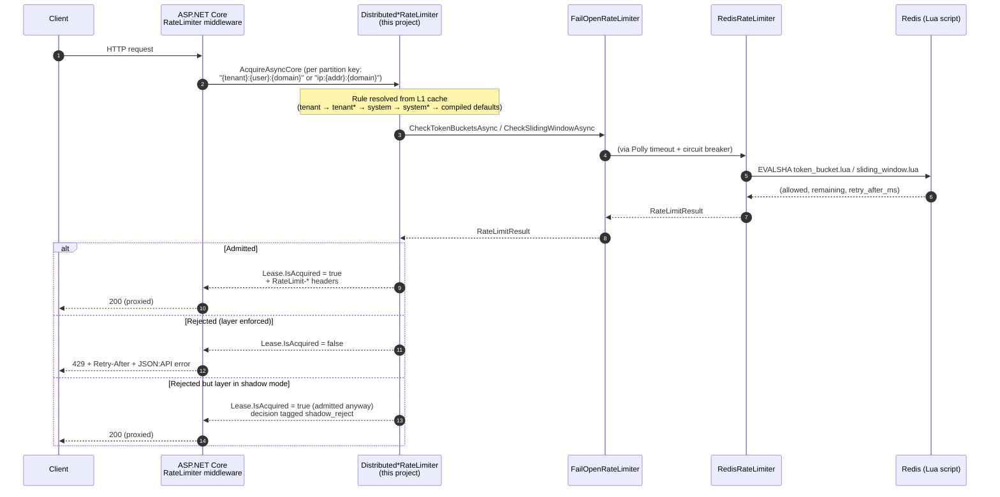
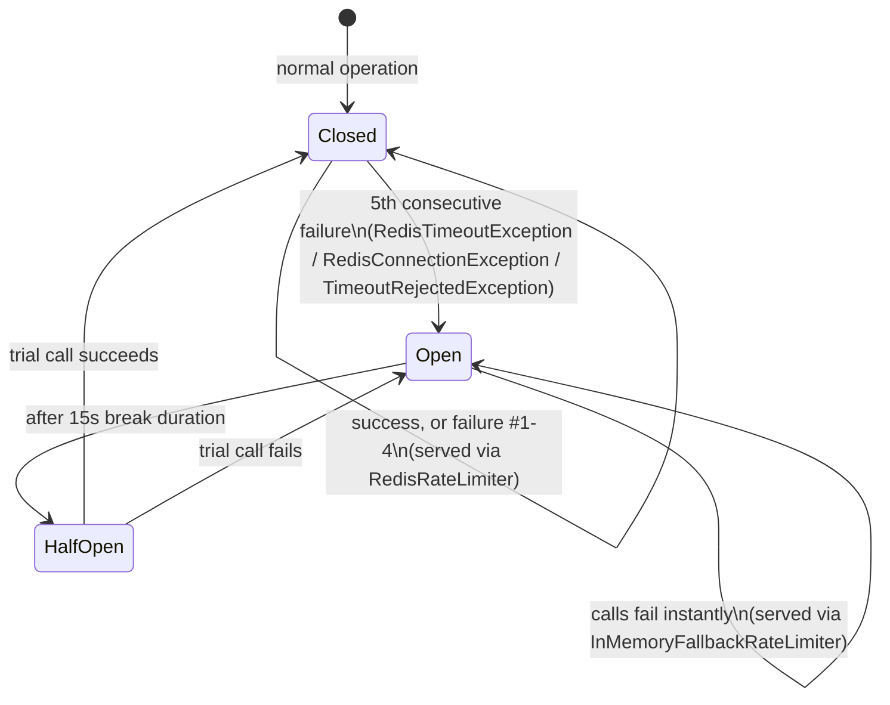

# EShop.Shared.RateLimiting

> Distributed, Redis-backed rate limiting for the API gateway — replaces a per-process in-memory limiter that silently broke under scale-out, with atomic Lua-scripted counters shared across every gateway replica.

---

## Why this exists

The gateway's previous rate limiter (`System.Threading.RateLimiting` with in-memory state) had four defects that only show up once you actually scale out or look closely:

| Defect | Consequence |
|---|---|
| Counters lived in each process's memory | N gateway replicas → effective limit multiplied by N |
| The user-based policy was never attached to the login route | Login was **effectively unlimited** — open to credential stuffing |
| All anonymous traffic shared one partition key | One aggressive anonymous client could exhaust the bucket for everyone |
| The per-tenant concurrency cap was per-node | Protected nothing platform-wide once the gateway scaled to >1 replica |

The fix moves the actual counting into Redis so every replica checks and decrements the *same* counter, atomically, via Lua scripts.

---

## Architecture at a glance

Three systems, three different concerns — worth keeping mentally separate:



- **Tenancy owns the *rules*** — "what's the limit?" Stored as an owned JSON column on `TenantSetting.RateLimitPolicy` (see `rate-limit-policy-management` capability spec). Changeable at runtime by system/support users via an admin endpoint — no redeploy.
- **The Gateway enforces** — on every request it asks "is this allowed?" and admits or rejects, in ~1 Redis round trip.
- **Redis holds the *counters*** — shared across every gateway replica, so the count is correct regardless of which replica handles a given request.

This project (`EShop.Shared.RateLimiting`) is the middle layer: the Redis/Lua limiter core and its ASP.NET Core integration. It does not know about Tenancy or HTTP directly — that wiring lives in `EShop.Shared.JsonApi.RateLimiting.RateLimitingExtensions` and `EShop.Shared.Cache` (policy caching/resolution). The core is intentionally decoupled from ASP.NET Core so it can be reused later by Finance for outbound provider throttling (deferred, same Redis/Lua core).

---

## Request lifecycle



Key point for reviewers: **ASP.NET Core builds the `RateLimiter` object once per partition key and reuses it for every future request with that key.** Two consequences we had to design around:
- Rule values are re-resolved via a `Func<>` on every acquire (not baked into the object), so a Tenancy policy change takes effect on the very next request for that partition.
- Anything request-scoped (`HttpContext`) must be re-resolved fresh via `IHttpContextAccessor` on every call, never captured from the request that happened to create the partition — an earlier version of this code captured `HttpContext` directly and threw `ObjectDisposedException` on the second request through the same partition.

---

## The two algorithms

| Scope | Algorithm | Why |
|---|---|---|
| `Tenant`, `User` | **Token bucket** | Burst-friendly for interactive clients; matches prior in-memory semantics |
| `AnonymousIp` (login route only) | **Weighted sliding window counter** | Smooths the window-boundary burst problem a naive fixed window has |

Both run as a single atomic Redis Lua script (`EVALSHA`) — read, compute, write happens server-side in one round trip, so concurrent requests from different gateway replicas can never over-admit. Both scripts call Redis's own `TIME` command internally, so every gateway replica agrees on "now" — no clock-skew-minted tokens from app-server clocks drifting.

### Token bucket (`token_bucket.lua`)

- State per key: `{tokens, last_refill}` (a Redis hash).
- Refill is computed lazily on each check: `tokens = min(capacity, tokens + elapsed_seconds × refill_rate)`.
- **All-or-nothing across combined checks**: when checking tenant + user together in one call, a token is deducted from *either* only if *both* would currently allow it — no partial consumption if one of the two is exhausted.
- Key TTL = `ceil(capacity / refill_rate × 2)` — self-cleans; an idle client's key expires instead of accumulating forever.

### Weighted sliding window (`sliding_window.lua`)

- State per key: `{window_id, curr_count, prev_count}`.
- `estimated_count = curr_count + prev_count × overlap_ratio`, where `overlap_ratio` is how much of the *previous* window still overlaps the current sliding view. This is the standard weighted-count approximation — smooths the burst you'd get right at a fixed-window boundary without the unbounded memory growth of a sliding log (storing every request timestamp).
- Key TTL = `window × 2`.

Both scripts return a flat `(allowed, remaining, retry_after_ms)` tuple (times two, for the combined tenant+user check) — parsed in `RedisRateLimiter.cs`.

---

## Resilience: fail open, never fail closed, never hang



`FailOpenRateLimiter` wraps `RedisRateLimiter` with:

1. **A hard ~50ms timeout** per Redis call (`PollyPolicies.RateLimiterTimeoutPolicy`). Uses `TimeoutStrategy.Pessimistic` deliberately — `TimeoutStrategy.Optimistic` only *cooperates* with a `CancellationToken`, and StackExchange.Redis's `ScriptEvaluateAsync` doesn't observe one, so Optimistic would let a hung call run to StackExchange.Redis's own ~5s internal timeout instead of the intended 50ms. This was caught during live verification (task 9.1) — a real, confirmed bug, fixed by switching to Pessimistic.
2. **A circuit breaker** (5 consecutive failures → 15s open) so the gateway stops paying the timeout cost on every request once Redis is confirmed down.
3. **A per-node, in-memory fallback** (`InMemoryFallbackRateLimiter`, built on the BCL's own `TokenBucketRateLimiter`/`SlidingWindowRateLimiter`) while the circuit is open — bounded over-admission, never an unbounded flood, never a hard failure surfaced to the client.

Counter state needs no durability: a Redis restart just resets counters (brief over-admission), which is an accepted tradeoff — rate limiting is a best-effort control, not a source of truth.

---

## Client contract

| Situation | Response |
|---|---|
| Admitted | `RateLimit-Limit`, `RateLimit-Remaining`, `RateLimit-Reset` headers (IETF draft names, not the deprecated `X-` prefix) |
| Rejected (layer enforced) | `429 Too Many Requests` + `Retry-After` + JSON:API error body (`code: "rate_limit_exceeded"`, detail distinguishes tenant-quota vs user-limit vs IP) |
| Rejected but layer in shadow mode | Admitted anyway — see [Shadow mode](#shadow-mode-and-per-layer-enforcement) |

No queueing at any distributed layer (`QueueLimit = 0`) — a rejection is decided instantly; `Retry-After` drives client backoff instead.

---

## Observability

Three OTel metrics (`EShop.Shared.Diagnostics.RateLimiterMetrics`, meter name `EShop.RateLimiter`):

| Metric | Type | Tags | Recorded where |
|---|---|---|---|
| `rate_limiter.requests` | Counter | `decision` (`allow`/`reject`/`shadow_reject`), `layer` (`tenant`/`user`/`ip`), `tenant`, `domain` | `Distributed*RateLimiter.AcquireAsyncCore`, once per layer actually evaluated |
| `rate_limiter.redis_latency` | Histogram (ms) | — | `RedisRateLimiter`, around each `ScriptEvaluateAsync` call |
| `rate_limiter.fail_open` | Counter | — | `FailOpenRateLimiter`, whenever the circuit trips or a call times out |

`rate_limiter.fail_open` should normally sit at zero — a non-zero rate is a signal Redis itself has a problem, independent of anything happening in the rollout.

---

## Shadow mode and per-layer enforcement

Each of the three layers (`TenantEnforced`, `UserEnforced`, `AnonymousIpEnforced`) has its own enforce/shadow flag, bound via `IOptionsMonitor<RateLimiterEnforcementOptions>` from the `RateLimiting:Enforcement` config section — **reloadable with no redeploy**, and re-read on every request (not frozen at partition-creation time, same reasoning as the rule values above).

- **Shadow** (the default — every flag starts `false`): a request that *would* be rejected is admitted anyway; the decision is recorded as `shadow_reject` instead of `reject`. Lets you observe what enforcement *would* do to real traffic before it can actually reject anything.
- **Enforce**: actually rejects with 429.

Rollout order (smallest blast radius first): **login-IP → per-user → tenant quota**. Full procedure — what to watch, how long to stay in shadow, how to calibrate the seeded defaults from observed traffic, and how to roll back — is documented in [`openspec/changes/distributed-rate-limiter/rollout-runbook.md`](../../../openspec/changes/distributed-rate-limiter/rollout-runbook.md).

---

## Project structure

```
EShop.Shared.RateLimiting/
├── Abstractions/
│   ├── IRateLimiter.cs               # CheckTokenBucketsAsync / CheckSlidingWindowAsync contract
│   ├── RateLimitChecks.cs            # TokenBucketCheck, SlidingWindowCheck records
│   ├── RateLimitResult.cs            # RateLimitResult, CombinedRateLimitResult
│   └── RateLimiterOptions.cs
│
├── Redis/
│   ├── Scripts/
│   │   ├── token_bucket.lua          # Tenant + User scopes
│   │   └── sliding_window.lua        # AnonymousIp scope
│   ├── RateLimitKeyBuilder.cs        # rl:{tenantId}:... hash-tagged key construction
│   ├── RateLimitScriptLoader.cs      # Loads embedded .lua resources at startup
│   ├── RedisRateLimiter.cs           # IRateLimiter over StackExchange.Redis (EVALSHA)
│   ├── InMemoryFallbackRateLimiter.cs# Per-node fallback used only while the circuit is open
│   └── FailOpenRateLimiter.cs        # Timeout + circuit breaker + fallback decorator
│
├── AspNetCore/
│   ├── DistributedTokenBucketRateLimiter.cs    # System.Threading.RateLimiting.RateLimiter for tenant+user
│   ├── DistributedSlidingWindowRateLimiter.cs  # ...for anonymous IP
│   ├── DistributedRateLimitLease.cs
│   ├── RateLimiterEnforcementOptions.cs        # Per-layer shadow/enforce flags
│   ├── RateLimitDecisionNames.cs               # allow / reject / shadow_reject
│   ├── RateLimitHeaderNames.cs / RateLimitHeaderWriter.cs
│   └── RateLimitMetadataNames.cs
│
└── DependencyInjections/
    └── RateLimitingServiceCollectionExtensions.cs   # AddDistributedRateLimiter(configuration)
```

Related, but living in other projects:
- `EShop.Shared.JsonApi.RateLimiting.RateLimitingExtensions` — the actual ASP.NET Core `AddRateLimiter`/`ConfigureRateLimiters` wiring, partition-key derivation, and the `OnRejected` → 429 JSON:API error body.
- `EShop.Shared.Cache` — `RateLimitPolicyCachingService`, `RateLimitPolicyResolver`, `RateLimitRuleResolver` (the L1 → Redis → Tenancy-HTTP-fallback chain and most-specific-first rule resolution).
- `EShop.Shared.Diagnostics.RateLimiterMetrics` — the OTel meter definitions.
- `EShop.Tenancy.*` — the rule storage/admin endpoints (`rate-limit-policy-management` capability).

---

## Configuration

```json
{
  "RateLimiting": {
    "Enforcement": {
      "AnonymousIpEnforced": false,
      "UserEnforced": false,
      "TenantEnforced": false
    }
  }
}
```

All three flags default to `false` (shadow) if the section is omitted entirely — an unconfigured gateway starts safely.

---

## Testing

`Shared/test/EShop.Shared.RateLimiting.Tests/`:

| Test class | What it covers | Needs Docker? |
|---|---|---|
| `RedisRateLimiterTests` | Exact admission at the limit under concurrent bursts, refill over time, cross-replica correctness (two limiter instances, one Redis), tenant-qualified key isolation, key expiry | Yes (Testcontainers) |
| `FailOpenRateLimiterTests` | Fail-open admission during a Redis outage and recovery without restart — outage simulated via `docker pause`/`unpause` (not stop/start — see the test's own comment for why) | Yes (Testcontainers) |
| `DistributedTokenBucketRateLimiterTests` / `DistributedSlidingWindowRateLimiterTests` | Shadow-mode admission, enforced rejection, and a live config flag flip taking effect on the *same* limiter instance without recreating it | No (stub `IRateLimiter` + a real `IOptionsMonitor` backed by a mutable `ConfigurationManager`) |

```bash
dotnet test Shared/test/EShop.Shared.RateLimiting.Tests
```

This project was also verified end-to-end live via .NET Aspire (multi-replica gateway, real Redis, real Tenancy service) — see task 9.1 in the OpenSpec change for what was exercised and two real bugs that surfaced only under a live run (a stale `TimeoutStrategy.Optimistic` and an unrelated pre-existing `Services:Tenancy` config bug), both fixed.

---

## Design rationale and open-question resolutions

Full design decisions (D1–D11), rejected alternatives, and resolved open questions live in:
- [`openspec/changes/distributed-rate-limiter/design.md`](../../../openspec/changes/distributed-rate-limiter/design.md)
- [`openspec/changes/distributed-rate-limiter/specs/distributed-rate-limiting/spec.md`](../../../openspec/changes/distributed-rate-limiter/specs/distributed-rate-limiting/spec.md)
- [`openspec/changes/distributed-rate-limiter/rollout-runbook.md`](../../../openspec/changes/distributed-rate-limiter/rollout-runbook.md)

Deferred / out of scope for this change: outbound throttling of Finance's calls to tenants' accounting providers (will reuse this same core — the reason `Abstractions`/`Redis` are ASP.NET-agnostic); organization-level limits; multi-region synchronization; endpoint-granular rules (the `Domain` field is extensible to this if needed later).
