# Tenancy

> Owns **who the tenants are** — provisioning a tenant, the system-wide **feature catalog** and per-tenant feature flags, per-tenant **settings**, and the per-tenant **rate-limit policy** that the platform's distributed rate limiter enforces. This is the context every other service trusts to answer "does tenant X exist, and what is it allowed to do?".

---

## What This Service Does

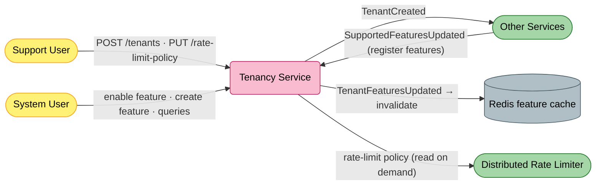

---

## Strategic Design

### Context Classification

| Aspect | Value |
|--------|-------|
| **Bounded Context** | Tenancy |
| **Domain Type** | Supporting Domain |
| **Aggregate Roots** | `Tenant` (owns `TenantFeature`, `TenantSetting`), `Feature` (system feature catalog) |
| **Multi-tenancy** | `Tenant` & `Feature` are `IExcludedFromScoping` (they *define* tenants, so cannot be tenant-scoped); `TenantFeature` & `TenantSetting` are `IScoped`. The service writes scoped rows under an explicit **system-user scope** (`CreateSystemUserScope(tenantId)`). |
| **Persistence** | EF Core (PostgreSQL) |
| **Read Model** | None (Redis cache for the hot per-tenant feature set) |
| **Architecture Style** | Clean Architecture (Domain · Application · Infrastructure · Persistence · Presentation) |

### Bounded Context Map

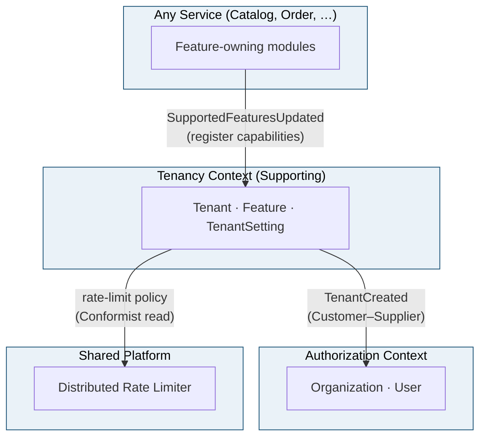

> Tenancy is **upstream** of the whole platform: it is the source of truth for tenant existence and entitlements. It never depends on downstream services — it only announces facts (`TenantCreated`) and absorbs feature registrations.

> **Why this service has no "Participants & Roles" table.** Per the documentation standard, Event-Storming *Participants & Roles* is reserved for **Core Domain** services. Tenancy is a **Supporting** domain, so that subsection is intentionally omitted here while every other section stays consistent with the Core services.

### Ubiquitous Language

| Term | Definition |
|------|------------|
| **Tenant** | An isolated customer of the platform. Identified by a lowercased string id (`acme`); owns its features and settings. |
| **System tenant** | A bootstrap tenant for platform administration, created on startup by `SystemInitializer`. |
| **Feature** | A capability in the *system-wide* catalog (`Id`, `Module`, `State`, `DefaultStateForNewTenant`). Owned by whichever module registers it. |
| **TenantFeature** | The per-tenant enablement of a catalog `Feature` — its `State` is `Enabled` / `Disabled`. |
| **Feature registration** | A service announcing the features it owns via `SupportedFeaturesUpdated`; Tenancy upserts them into the catalog. |
| **TenantSetting** | Per-tenant formatting defaults (date/time/currency/language) plus the tenant's `RateLimitPolicy`. |
| **RateLimitPolicy** | A set of `RateLimitRule`s (`Domain`, `Scope`, `Unit`, `RequestsPerUnit`, `Burst`) — the config the distributed rate limiter reads to throttle a tenant. |
| **Support user / System user** | Elevated principals: only a *support* user may create a tenant or set its policy; only a *system* user may manage features. |

---

## Event Storming

### Legend

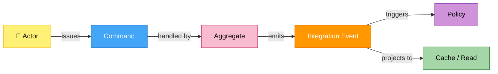

### Actors

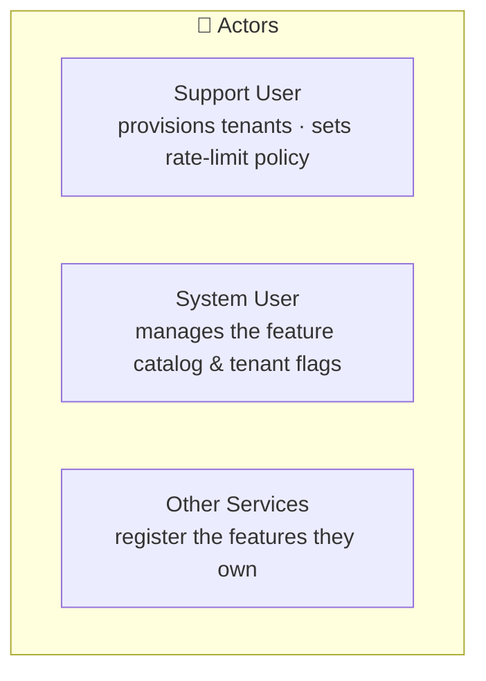

| Actor | Interacts With | Example Scenario |
|-------|----------------|------------------|
| **Support User** | `Tenant` aggregate | *As support, I provision a new tenant so a customer can start using the platform.* |
| **System User** | `Feature` / `TenantFeature` | *As the system, I enable a feature for a tenant so their users gain the capability.* |
| **Other Services** | `Feature` catalog | *As Catalog/Order, I register the features I own so tenants can toggle them.* |

### Tenant Aggregate — Event Flow

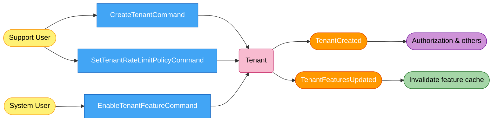

> On `CreateTenant`, the aggregate seeds a default `TenantSetting` and one `TenantFeature` per catalog `Feature` (using each feature's `DefaultStateForNewTenant`), then publishes `TenantCreated`.

### Feature Catalog — Event Flow

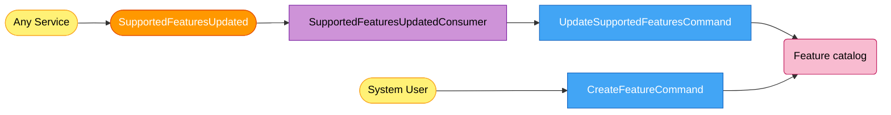

### Policies — When / Then Rules

| When this event | Then issue this command | Rail / Transport |
|-----------------|-------------------------|------------------|
| `SupportedFeaturesUpdated` (any service registers features) | `UpdateSupportedFeaturesCommand` → upsert/delete `Feature` catalog | MassTransit · idempotent consumer (inbox) |
| `TenantFeaturesUpdated` (a tenant flag changed) | `ClearTenantFeaturesCommand` → invalidate the tenant's Redis feature cache | MassTransit · idempotent consumer (inbox) |
| `TenantCreated` | *(downstream)* Authorization creates the root organization & owner user | MassTransit |

---

## Domain Model

### Aggregate Structure

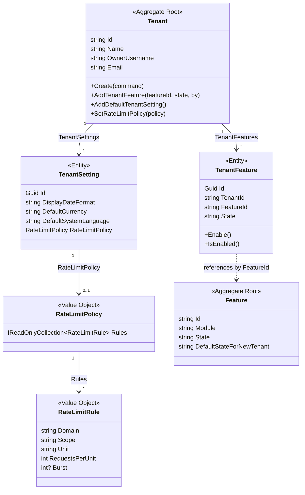

### Building Blocks

| Building Block | Type | Identity | Rationale |
|----------------|------|----------|-----------|
| `Tenant` | **Aggregate Root** | `string Id` (lowercased) | Consistency boundary for a customer; owns its features and settings. `IExcludedFromScoping` — it defines a tenant, so it can't be tenant-filtered. |
| `TenantFeature` | **Entity** (child of `Tenant`) | `Guid Id` | Per-tenant enablement of a catalog feature; `IScoped`. |
| `TenantSetting` | **Entity** (child of `Tenant`) | `Guid Id` | Per-tenant formats + rate-limit policy; `IScoped`. |
| `RateLimitPolicy` / `RateLimitRule` | **Value Object** | By value (no id) | Immutable throttling rules; replaced wholesale via `SetRateLimitPolicy`. |
| `Feature` | **Aggregate Root** (reference catalog) | `string Id` | The system-wide feature registry; `IExcludedFromScoping`. |
| `StateFeature` / `RateLimitScope` / `RateLimitUnit` | **Enumeration** | Enum value | Feature toggle state; rate-limit rule scope (`Tenant`/`User`/`AnonymousIp`) and unit (`Second`/`Minute`/`Hour`/`Day`). |

---

## State Machines

Tenancy has **no Stateless state machine** — its only lifecycle is the feature flag's `Enabled` / `Disabled` toggle, enforced by explicit guards in `TenantFeature` rather than a transition table.

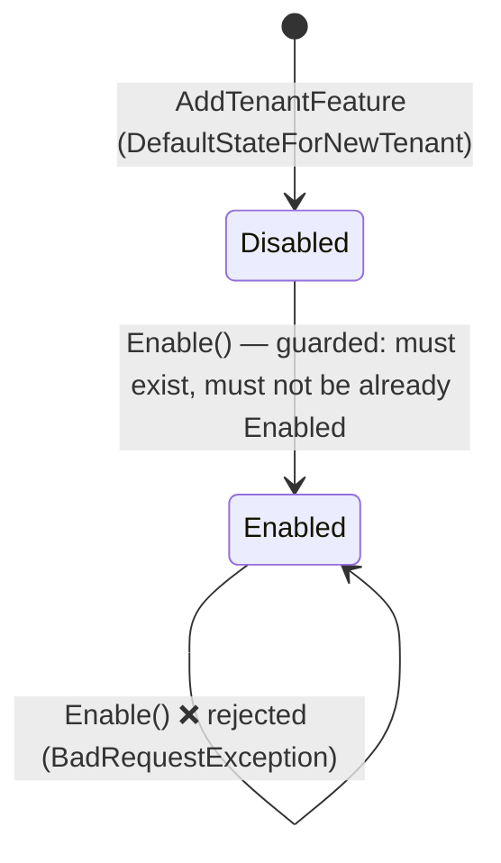

> `EnableTenantFeatureCommandHandler` guards the transition: it throws `BadRequestException` if the feature is not found for the tenant, or is already enabled — then publishes `TenantFeaturesUpdated`.

---

## Specifications & Invariants

### Specification Map

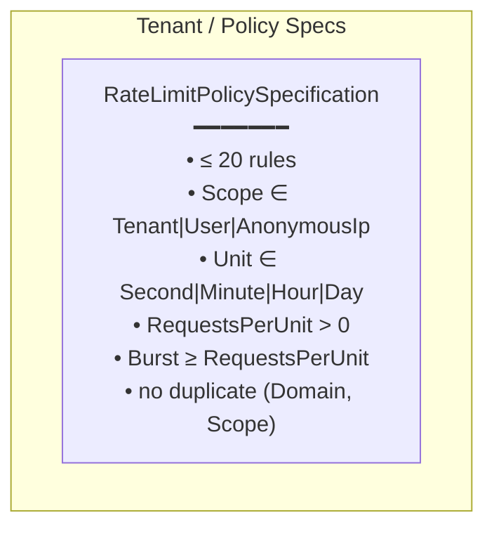

Tenant creation additionally enforces id/username rules inline (`AssertTenant`): tenant id is lowercased and limited to `a–z 0–9 - _`, reserved ids (support group) are rejected, and the owner username is normalised to `user@tenantId` and stripped of special characters.

### Invariant Enforcement Flow

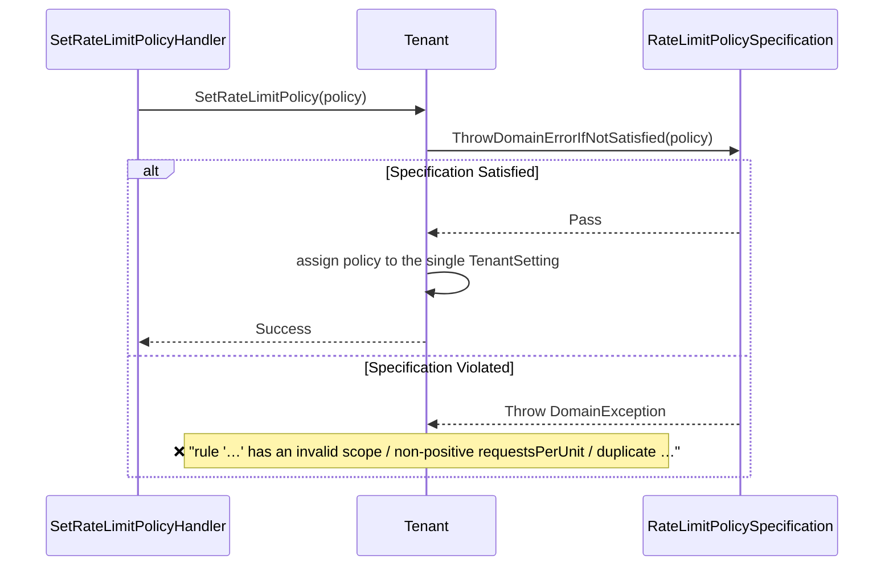

---

## Architecture

### Layer Overview

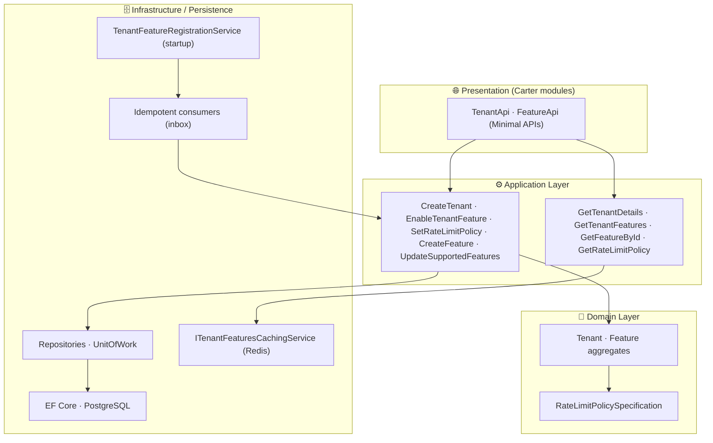

### Happy Path — Provision a Tenant

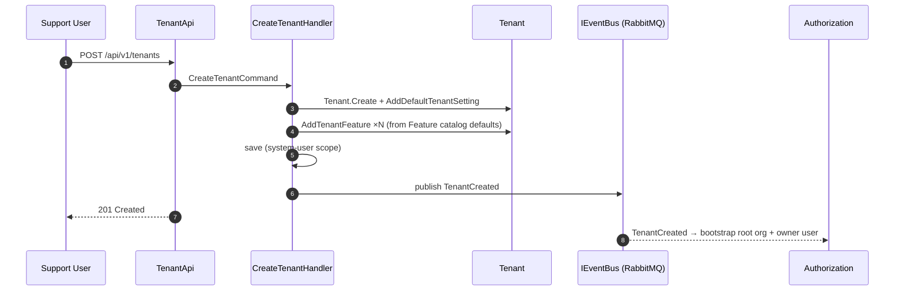

### Feature Flag — Cache-Aside + Event Invalidation

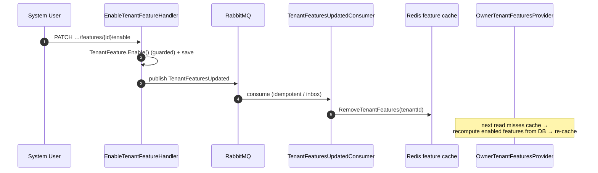

---

## Integration Events

| Direction | Contract | Meaning |
|-----------|----------|---------|
| **Out** | `TenantCreated` | A tenant (or the system tenant) was provisioned — consumed by Authorization to create the root organization & owner user. |
| **Out** | `TenantFeaturesUpdated` | A tenant's feature set changed — consumed in-service to invalidate the Redis feature cache. |
| **Out** | `SupportedFeaturesUpdated` | Tenancy registers the features it owns at startup (`TenantFeatureRegistrationService`). |
| **In** | `SupportedFeaturesUpdated` | Any service announces the features it owns → upsert/delete rows in the `Feature` catalog. |
| **In** | `TenantFeaturesUpdated` | Its own event → clear the tenant's cached feature set. |

Contracts live in `Shared/src/EShop.Shared.Contracts/Services/Tenancy/`. All Tenancy events derive from `TenancyEvent` (`[ExcludeFromTopology]`).

---

## Data Model

| Table | One row per | Key constraint |
|-------|------------|----------------|
| `Tenants` | tenant | PK `Id` (string, lowercased); UNIQUE `Name` |
| `TenantFeatures` | feature enablement × tenant | PK `Id` (Guid); FK `TenantId`; carries `FeatureId`, `State`; `IScoped` |
| `TenantSettings` | settings × tenant | PK `Id` (Guid); FK `TenantId` (cascade); `RateLimitPolicy` persisted with the setting; `IScoped` |
| `Features` | catalog feature | PK `Id` (string); `IExcludedFromScoping` |
| `InboxMessages` | processed message id | Deduplication for idempotent consumers (inbox pattern) |

---

## API

| Method | Path | Response | Note |
|--------|------|----------|------|
| `POST` | `/api/v1/tenants` | `201 Created` | Provision a tenant. **Support user** only. |
| `GET` | `/api/v1/tenants/{tenantId}` | `200 OK` | Tenant details. **System user** only. |
| `PATCH` | `/api/v1/tenants/{tenantId}/features/{featureId}/enable` | `204 No Content` | Enable a feature for a tenant. **System user** only. |
| `PUT` | `/api/v1/tenants/{tenantId}/rate-limit-policy` | `204 No Content` | Replace the tenant's rate-limit policy. **Support user** only. |
| `GET` | `/api/v1/tenants/{tenantId}/rate-limit-policy` | `200 OK` | Read the tenant's rate-limit policy. **System user** only. |
| `GET` | `/api/v1/features?tenantId=` | `200 OK` | A tenant's enabled features. **System user** only. |
| `GET` | `/api/v1/features/{featureId}` | `200 OK` | A catalog feature. **System user** only. |
| `POST` | `/api/v1/features` | `201 Created` | Create a system feature. **System user** only. |

---

## Configuration

| Key | Source | Purpose |
|-----|--------|---------|
| `ConnectionStrings:tenancyDatabase` / `DefaultConnection` | Aspire / appsettings | PostgreSQL connection |
| `MasstransitConfiguration` / `rabbitmq` | appsettings | RabbitMQ connection |
| `SystemUser:Email` | appsettings | Email for the bootstrap system tenant owner |

On startup, `SystemInitializer` provisions the system tenant (with a default rate-limit policy — `authorization` domain, `AnonymousIp`, 5/minute) and `TenantFeatureRegistrationService` registers Tenancy's own features.

---

## Tests

`Tenancy/tests/EShop.Tenancy.Tests` (xUnit + Reqnroll BDD + Testcontainers) — feature-file scenarios:

- **Tenant provisioning** — `TenantCreation.feature`
- **Feature catalog** — `CreateSystemFeature.feature`
- **Tenant feature flags** — `EnableTenantFeature.feature`, `GetFeatures`
- **Authorization filters** — support/system-user access rules
- **Architecture** — layer dependency-rule compliance (`ArchitectureTests`)

```bash
dotnet test Tenancy/tests/EShop.Tenancy.Tests
```

---

## Roadmap

### Gap Analysis

| # | Gap | Status |
|---|-----|--------|
| G1 | **No event on rate-limit policy change.** `SetRateLimitPolicy` persists the new policy but emits no integration event; the distributed rate limiter picks it up on its next read / cache expiry rather than being actively notified. | Open |
| G2 | **Feature flag is a one-way toggle in the API.** `TenantFeature.Enable()` exists but there is no `Disable` endpoint — disabling currently only happens via the default state / catalog delete path. | Open |

---

## References

| Resource | Description |
|----------|-------------|
| [Distributed Rate Limiter README](../../../Shared/src/EShop.Shared.RateLimiting/README.md) | Consumer of the per-tenant `RateLimitPolicy` this service owns |
| [Authorization Service README](../../../Authorization/src/EShop.Authorization.API/README.md) | Downstream consumer of `TenantCreated` |
| [Domain-Driven Design](https://www.domainlanguage.com/ddd/) | Eric Evans — Original DDD book |
| [Event Storming](https://www.eventstorming.com/) | Alberto Brandolini — Discovery technique |
