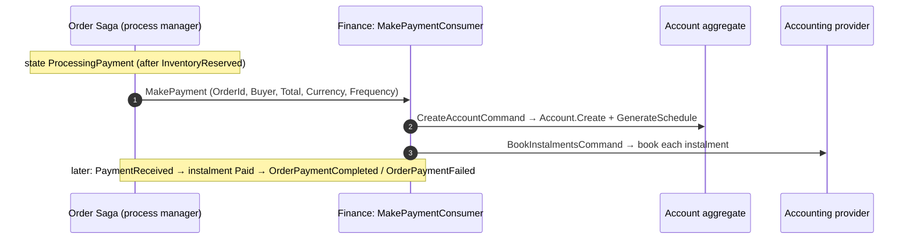
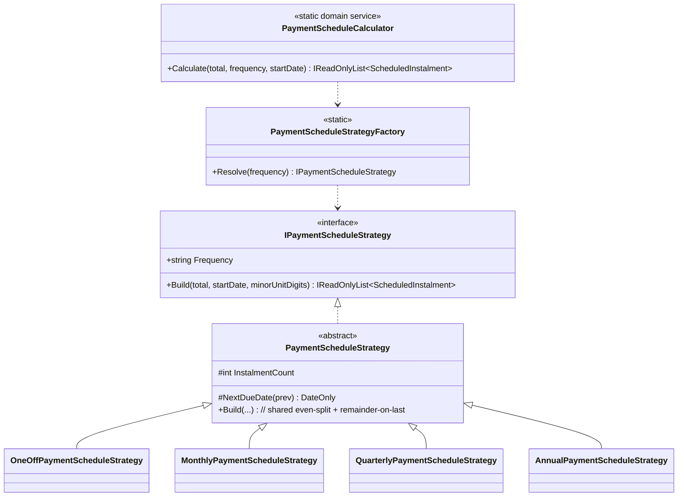

# Design addendum — `MakePayment` flow + Strategy-based payment calculation

Supplements [design.md](design.md). Covers two refinements requested after the initial build:
1. Finance creates an account from a **`MakePayment` saga command** (not an `OrderAwaitingPayment` event).
2. Payment calculation is refactored to a **Strategy pattern**, following the DDD skill and distilled
   from the reference `seamless-apps-dotnet` Finance service.

---

## 0. Scope update (2026-06-28)

Booking is split to a follow-up ticket (see `tasks.md` §0). This ticket delivers **create account →
calculate & schedule → reply**. The saga reply is published by `CreateAccountCommandHandler`:

- **`Order.Saga.OrderPaymentScheduled`** `{ OrderId, AccountId, PaymentCount }` — account created + schedule
  calculated (success). Re-published on a redelivered `MakePayment` for an existing account (idempotent).
- **`Order.Saga.OrderPaymentScheduleFailed`** `{ OrderId, Reason }` — schedule could not be built (invalid
  total/frequency); the saga compensates.

The `GenericHttp` provider, `BookInstalments`/`RecordInstalmentPayment`, and the
`OrderPaymentCompleted`/`OrderPaymentFailed`/`PaymentReceived` contracts described below were **removed**
from this ticket and return with booking. The named-strategy calculation (§3) and the `MakePayment` command
(§2) remain as shipped.

---

## 1. Distilling the reference (`Komodo.Finance` `AccountAggregate`)

The reference `AccountAggregate` is a ~1,500-line **EventFlow event-sourced** aggregate covering value
periods, handling fees, reconciliation, migration, provider collection cut-offs, checkout, etc. We take
only the **minimal** transferable patterns and leave the rest out (non-goals).

| Reference pattern | What we keep (minimal) | What we drop |
|-------------------|------------------------|--------------|
| `updateStrategyFactory.CreateAccountUpdateStrategy(paymentStrategyName).CalculatePayments(...)` — payment calc selected by a **named strategy** | ✅ `IPaymentScheduleStrategy` chosen by `PaymentFrequency` via `PaymentScheduleStrategyFactory` | Value periods, proration, handling fees, MTA deltas |
| `AssertScheduleChangesIntegrity(totalScheduled, finalPrice)` — aggregate verifies the schedule sums correctly | ✅ `Account.AssertScheduleIntegrity()` (instalments sum to total) | Tolerance/price-difference tracking |
| Dates passed in (`ISystemClock`, `DateTimeOffset updatedDate`) | ◻️ Recommended (see §4) | — |
| `Emit(...)` event sourcing | ❌ EShop Finance stays **state-based** (EF Core) | EventFlow, snapshots, read models |
| Injected strategy factory in the aggregate ctor | ❌ Our strategies are **DI-free** static domain services (the EShop aggregate is an EF entity) | Constructor injection into the aggregate |

> Net: same *shape* (named strategy + integrity assertion), a fraction of the surface.

---

## 2. `MakePayment` saga command flow

The Order saga drives downstream services with **commands** (`MakeReservation` → Inventory). Payment
follows the same convention rather than a generic event.

- **Contract**: `Shared.Contracts/Services/Order/Saga/MakePayment.cs` — `IntegrationCommand` (async command,
  carries `TenantId`/`ActionUser*`), siblings with `MakeReservation`.
- **Consumer**: `MakePaymentConsumer` → `CreateAccountCommand` then `BookInstalmentsCommand` (idempotent:
  create no-ops if the account exists; booking uses a deterministic idempotency key).
- **Replaces** the earlier `OrderAwaitingPayment` integration event (removed).
- **Saga publish side remains the open item** (tasks 6.x): the event-sourced `OrderSaga` must emit
  `MakePayment` on entering `ProcessingPayment` and later consume `OrderPaymentCompleted`/`OrderPaymentFailed`.

---

## 3. Payment calculation — Strategy pattern

Replaces the single `switch` in the old calculator with one strategy per frequency (replace-conditional-
with-polymorphism). All live in `Domain/Services/PaymentSchedule/` as pure, stateless **domain services**.

- **Shared rule** lives once in `PaymentScheduleStrategy` base: split evenly at the currency minor unit, the
  **final instalment absorbs the rounding remainder** (instalments always sum to the total).
- **Per-frequency** subclasses supply only `InstalmentCount` + `NextDueDate` (the interval).
- **Open/Closed**: a new frequency = a new strategy class + one line in the factory; existing strategies
  untouched.
- **DI-free**: strategies are stateless singletons held by a static factory — aligns with the DDD skill
  ("domain services have no DI") and keeps the EF-materialized aggregate free of injected services.
- **Public API unchanged**: `PaymentScheduleCalculator.Calculate(total, frequency, startDate)` keeps its
  signature, so `Account.GenerateSchedule` and all existing tests are unaffected.
- **Aggregate enforces the invariant**: `Account.GenerateSchedule` calls `AssertScheduleIntegrity()` after
  materialising instalments, so the aggregate verifies the sum itself rather than trusting the calculator.

---

## 4. DDD review of the `Account` aggregate (findings & recommendations)

Status legend: ✅ done in this change · ◻️ recommended follow-up.

1. ✅ **Replace conditional with Strategy** for payment calculation (§3).
2. ✅ **Aggregate-owned schedule invariant** (`AssertScheduleIntegrity`).
3. ✅ **Consolidated domain events** under `Aggregates/Account/DomainEvents/` (the reorg had left an orphan
   `AccountDomainEvent` base + duplicate; now a single base in the aggregate folder).
4. ◻️ **`Money` value object** — `TotalAmount` (decimal) + `Currency` (string) should become a `Money` VO
   (the DDD skill's canonical example: validation + currency-safe arithmetic). Currently split across two
   primitives on both `Account` and `Instalment`. Deferred to keep this change surgical (touches EF
   mapping + migration).
5. ◻️ **Time control** — `Account.Create`/`GenerateSchedule`/`RecordPayment` use `DateTimeOffset.UtcNow`
   inline. The DDD skill flags this as an anti-pattern. Recommend passing `DateTimeOffset now` (or `IClock`)
   into these methods — the reference does exactly this (`ISystemClock`, `DateTimeOffset updatedDate`).
   `GenerateSchedule(DateOnly startDate)` already takes the date — extend the same discipline to audit times.
6. ◻️ **Strongly-typed IDs** — `OrderId`, `AccountId`, `InstalmentId` as `Guid` could become
   `OrderId`/`AccountId` value objects (skill: "always for aggregate root IDs that cross boundaries").
   Optional; weigh against EF + contract serialization overhead.
7. ◻️ **Encapsulation** — public setters on `Status`/`OutstandingAmount`/`TotalAmount` enable anemic misuse.
   Prefer `private set`. Note: existing EShop aggregates (e.g. `Inventory.Reservation`) use public setters,
   so this is a repo-wide style tension, not Finance-specific.
8. ✅ **Aggregate boundary** is correct — `Account` owns `Instalment` children (≤12), references the order
   only by `OrderId` (no cross-aggregate navigation), loaded/saved as one unit.

These are advisory; items 4–7 are intentionally **not** implemented here to keep the change focused on the
two requested concerns (MakePayment + strategy).
